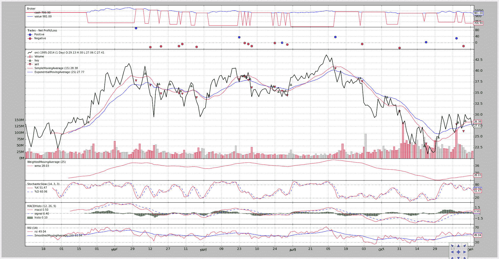

# 快速开始

> 原文：[`www.backtrader.com/docu/quickstart/quickstart/`](https://www.backtrader.com/docu/quickstart/quickstart/)

注意

快速入门指南中使用的数据文件会不时更新，这意味着`调整后的收盘价`会变化，以及`收盘价`（以及其他组件）。这意味着实际输出可能与撰写文档时的情况不同。

## 使用平台

让我们通过一系列的例子运行一遍（从几乎空白到完全成熟的策略），但在粗略解释**backtrader**的两个基本概念之前。

1.  线

    数据源、指标和策略都有*线*。

    一条线是一系列的点，当它们连接在一起时形成这条线。当谈到市场时，一个数据源通常每天有以下一组点：

    +   开盘价、最高价、最低价、收盘价、成交量、持仓量

    一系列“开盘价”随时间的变化是一条线。因此，一个数据源通常有 6 条线。

    如果我们还考虑“DateTime”（这是单个点的实际参考），我们可以计算出 7 条线。

1.  第 0 个指数方法

    当访问线中的值时，当前值通过索引访问：*0*

    通过*-1*访问“最后”输出值。这符合 Python 对可迭代对象的惯例（一条线可以被迭代，因此是可迭代的），其中索引*-1*用于访问可迭代/数组的“最后”项。

    在我们的情况下，访问的是最后的**输出**值。

    因此，作为* -1 *之后的索引* 0 *，它用于访问当前行。

考虑到这一点，如果我们想象一个在初始化过程中创建的简单移动平均策略：

```py
self.sma = SimpleMovingAverage(.....)
```

访问当前移动平均线的最简单和最简单的方法：

```py
av = self.sma[0]
```

无需知道已处理了多少个条/分钟/天/月，因为“0”唯一标识当前时刻。

按照 Python 的传统，通过*-1*来访问“最后”输出值：

```py
previous_value = self.sma[-1]
```

当然，早期的输出值可以用-2、-3 等来访问

## 从 0 到 100：样本

### 基本设置

让我们开始吧。

```py
from __future__ import (absolute_import, division, print_function,
                        unicode_literals)

import backtrader as bt

if __name__ == '__main__':
    cerebro = bt.Cerebro()

    print('Starting Portfolio Value: %.2f' % cerebro.broker.getvalue())

    cerebro.run()

    print('Final Portfolio Value: %.2f' % cerebro.broker.getvalue())
```

执行后输出为：

```py
Starting Portfolio Value: 10000.00
Final Portfolio Value: 10000.00
```

在这个例子中：

+   backtrader 被导入

+   Cerebro 引擎被实例化

+   创建的*cerebro*实例被告知*运行*（循环遍历数据）

+   结果输出并打印出来

虽然看起来不起眼，但让我们明确指出一些事情：

+   Cerebro 引擎在后台创建了一个*broker*实例

+   实例已经有一些现金可以开始了

在幕后经纪人实例化是该平台的一个固定特征，以简化用户的生活。如果用户未设置经纪人，则会放置一个默认的经纪人。

10000 个货币单位是一些经纪人开始使用的常见值。

### 设置现金

在金融世界中，确实只有“失败者”才从 10k 开始。让我们改变现金并再次运行示例。

```py
from __future__ import (absolute_import, division, print_function,
                        unicode_literals)

import backtrader as bt

if __name__ == '__main__':
    cerebro = bt.Cerebro()
    cerebro.broker.setcash(100000.0)

    print('Starting Portfolio Value: %.2f' % cerebro.broker.getvalue())

    cerebro.run()

    print('Final Portfolio Value: %.2f' % cerebro.broker.getvalue())
```

执行后输出为：

```py
Starting Portfolio Value: 1000000.00
Final Portfolio Value: 1000000.00
```

任务完成。让我们转向风云变幻的水域。

### 添加一个 Data Feed

拥有现金很有趣，但所有这一切背后的目的是让一个自动化策略通过对我们视为 *Data Feed* 的资产进行操作而无需动手指就能增加现金。

因此... 没有 *Data Feed* -> **没趣**。让我们给这个不断增长的示例添加一个。

```py
from __future__ import (absolute_import, division, print_function,
                        unicode_literals)

import datetime  # For datetime objects
import os.path  # To manage paths
import sys  # To find out the script name (in argv[0])

# Import the backtrader platform
import backtrader as bt

if __name__ == '__main__':
    # Create a cerebro entity
    cerebro = bt.Cerebro()

    # Datas are in a subfolder of the samples. Need to find where the script is
    # because it could have been called from anywhere
    modpath = os.path.dirname(os.path.abspath(sys.argv[0]))
    datapath = os.path.join(modpath, '../../datas/orcl-1995-2014.txt')

    # Create a Data Feed
    data = bt.feeds.YahooFinanceCSVData(
        dataname=datapath,
        # Do not pass values before this date
        fromdate=datetime.datetime(2000, 1, 1),
        # Do not pass values after this date
        todate=datetime.datetime(2000, 12, 31),
        reverse=False)

    # Add the Data Feed to Cerebro
    cerebro.adddata(data)

    # Set our desired cash start
    cerebro.broker.setcash(100000.0)

    # Print out the starting conditions
    print('Starting Portfolio Value: %.2f' % cerebro.broker.getvalue())

    # Run over everything
    cerebro.run()

    # Print out the final result
    print('Final Portfolio Value: %.2f' % cerebro.broker.getvalue())
```

执行后的输出为：

```py
Starting Portfolio Value: 1000000.00
Final Portfolio Value: 1000000.00
```

模板代码的数量略有增加，因为我们添加了：

+   找出我们示例脚本所在的位置，以便能够定位示例 *Data Feed* 文件

+   有 *datetime* 对象用于过滤我们将要操作的 *Data Feed* 中的数据。

除此之外，*Data Feed* 被创建并添加到 **cerebro** 中。

输出没有变化，如果有变化将是个奇迹。

注意

Yahoo Online 以日期降序发送 CSV 数据，这不是标准约定。*reversed=True* 参数考虑到 CSV 文件中的数据已经被 **反转**，并具有标准预期的日期升序。

### 我们的第一个策略

现金在 *broker* 中，而 *Data Feed* 在那里。看起来，危险的生意就在拐角处。

让我们将一个策略引入到等式中，并打印每天（每个 bar）的“Close”价格。

**DataSeries**（*Data Feeds* 中的基础类）对象具有访问已知 OHLC（开盘价 最高价 最低价 收盘价）日常值的别名。这应该能够简化我们的打印逻辑的创建。

```py
from __future__ import (absolute_import, division, print_function,
                        unicode_literals)

import datetime  # For datetime objects
import os.path  # To manage paths
import sys  # To find out the script name (in argv[0])

# Import the backtrader platform
import backtrader as bt

# Create a Stratey
class TestStrategy(bt.Strategy):

    def log(self, txt, dt=None):
  ''' Logging function for this strategy'''
        dt = dt or self.datas[0].datetime.date(0)
        print('%s, %s' % (dt.isoformat(), txt))

    def __init__(self):
        # Keep a reference to the "close" line in the data[0] dataseries
        self.dataclose = self.datas[0].close

    def next(self):
        # Simply log the closing price of the series from the reference
        self.log('Close, %.2f' % self.dataclose[0])

if __name__ == '__main__':
    # Create a cerebro entity
    cerebro = bt.Cerebro()

    # Add a strategy
    cerebro.addstrategy(TestStrategy)

    # Datas are in a subfolder of the samples. Need to find where the script is
    # because it could have been called from anywhere
    modpath = os.path.dirname(os.path.abspath(sys.argv[0]))
    datapath = os.path.join(modpath, '../../datas/orcl-1995-2014.txt')

    # Create a Data Feed
    data = bt.feeds.YahooFinanceCSVData(
        dataname=datapath,
        # Do not pass values before this date
        fromdate=datetime.datetime(2000, 1, 1),
        # Do not pass values before this date
        todate=datetime.datetime(2000, 12, 31),
        # Do not pass values after this date
        reverse=False)

    # Add the Data Feed to Cerebro
    cerebro.adddata(data)

    # Set our desired cash start
    cerebro.broker.setcash(100000.0)

    # Print out the starting conditions
    print('Starting Portfolio Value: %.2f' % cerebro.broker.getvalue())

    # Run over everything
    cerebro.run()

    # Print out the final result
    print('Final Portfolio Value: %.2f' % cerebro.broker.getvalue())
```

执行后的输出为：

```py
Starting Portfolio Value: 100000.00
2000-01-03T00:00:00, Close, 27.85
2000-01-04T00:00:00, Close, 25.39
2000-01-05T00:00:00, Close, 24.05
...
...
...
2000-12-26T00:00:00, Close, 29.17
2000-12-27T00:00:00, Close, 28.94
2000-12-28T00:00:00, Close, 29.29
2000-12-29T00:00:00, Close, 27.41
Final Portfolio Value: 100000.00
```

有人说股票市场是危险的生意，但似乎并不是这样。

让我们解释一些魔法：

+   在调用 **init** 后，策略已经拥有了平台上存在的数据列表。

    这是一个标准的 Python *list*，可以按插入顺序访问数据。

    列表中的第一个数据 self.datas[0] 是默认用于交易操作的数据，并且用于保持所有策略元素同步（*它是系统时钟*）。

+   self.dataclose = self.datas[0].close 保持对 *close 线* 的引用。稍后只需要一级间接引用就能访问 close 值。

+   策略的 next 方法将在系统时钟的每个 bar 上调用（self.datas[0]）。直到其他因素开始起作用，如 *指标*，它们需要一些 bar 才能开始产生输出。稍后会详细介绍。

### 在策略中添加一些逻辑

让我们通过查看一些图表来尝试一些疯狂的想法。

+   如果价格连续下跌 3 个交易会话... 买买买！！！

```py
from __future__ import (absolute_import, division, print_function,
                        unicode_literals)

import datetime  # For datetime objects
import os.path  # To manage paths
import sys  # To find out the script name (in argv[0])

# Import the backtrader platform
import backtrader as bt

# Create a Stratey
class TestStrategy(bt.Strategy):

    def log(self, txt, dt=None):
  ''' Logging function fot this strategy'''
        dt = dt or self.datas[0].datetime.date(0)
        print('%s, %s' % (dt.isoformat(), txt))

    def __init__(self):
        # Keep a reference to the "close" line in the data[0] dataseries
        self.dataclose = self.datas[0].close

    def next(self):
        # Simply log the closing price of the series from the reference
        self.log('Close, %.2f' % self.dataclose[0])

        if self.dataclose[0] < self.dataclose[-1]:
            # current close less than previous close

            if self.dataclose[-1] < self.dataclose[-2]:
                # previous close less than the previous close

                # BUY, BUY, BUY!!! (with all possible default parameters)
                self.log('BUY CREATE, %.2f' % self.dataclose[0])
                self.buy()

if __name__ == '__main__':
    # Create a cerebro entity
    cerebro = bt.Cerebro()

    # Add a strategy
    cerebro.addstrategy(TestStrategy)

    # Datas are in a subfolder of the samples. Need to find where the script is
    # because it could have been called from anywhere
    modpath = os.path.dirname(os.path.abspath(sys.argv[0]))
    datapath = os.path.join(modpath, '../../datas/orcl-1995-2014.txt')

    # Create a Data Feed
    data = bt.feeds.YahooFinanceCSVData(
        dataname=datapath,
        # Do not pass values before this date
        fromdate=datetime.datetime(2000, 1, 1),
        # Do not pass values before this date
        todate=datetime.datetime(2000, 12, 31),
        # Do not pass values after this date
        reverse=False)

    # Add the Data Feed to Cerebro
    cerebro.adddata(data)

    # Set our desired cash start
    cerebro.broker.setcash(100000.0)

    # Print out the starting conditions
    print('Starting Portfolio Value: %.2f' % cerebro.broker.getvalue())

    # Run over everything
    cerebro.run()

    # Print out the final result
    print('Final Portfolio Value: %.2f' % cerebro.broker.getvalue())
```

执行后的输出为：

```py
Starting Portfolio Value: 100000.00
2000-01-03, Close, 27.85
2000-01-04, Close, 25.39
2000-01-05, Close, 24.05
2000-01-05, BUY CREATE, 24.05
2000-01-06, Close, 22.63
2000-01-06, BUY CREATE, 22.63
2000-01-07, Close, 24.37
...
...
...
2000-12-20, BUY CREATE, 26.88
2000-12-21, Close, 27.82
2000-12-22, Close, 30.06
2000-12-26, Close, 29.17
2000-12-27, Close, 28.94
2000-12-27, BUY CREATE, 28.94
2000-12-28, Close, 29.29
2000-12-29, Close, 27.41
Final Portfolio Value: 99725.08
```

发出了多个“BUY”创建订单，我们的投资组合价值减少了。显然有几个重要的事情缺失了。

+   订单已创建，但不清楚是否已执行，何时执行以及以什么价格执行。

    下一个示例将在此基础上建立，通过监听订单状态通知。

好奇的读者可能会问买了多少股票，购买了什么资产以及订单是如何执行的。在可能的情况下（在这种情况下是可能的），平台会填补这些空白：

+   self.datas[0]（主数据，也称为系统时钟）是目标资产，如果没有指定其他资产

+   股份是由*position sizer*在后台提供的，它使用固定的股份，“1”是默认值。稍后将进行修改。

+   订单是“市价”执行的。经纪人（在前面的示例中显示）使用下一根 bar 的开盘价执行此操作，因为那是当前检查的 bar 之后的第一个 tick。

+   到目前为止，订单已经执行了，没有任何佣金（稍后会详细介绍）

### 不仅买……还卖

在了解如何进入市场（做多）之后，需要一个“退出概念”，并且还要了解策略是否处于市场中。

+   幸运的是，Strategy 对象为默认的*data feed*提供了对*position*属性的访问权限

+   *buy*和*sell*方法返回**创建的**（尚未执行）订单

+   订单状态的更改将通过*notify*方法通知策略

*“退出概念”*将是一个简单的概念：

+   在过了 5 个 bar（第 6 个 bar）之后退出，无论好坏都要退出

    请注意，没有暗示“时间”或“时间框架”：bar 的数量。bar 可以表示 1 分钟、1 小时、1 天、1 周或任何其他时间段。

    尽管我们知道数据源是每日的，但策略不对此做任何假设。

此外，为了简化：

+   只有在市场中还没有持仓时才允许买入订单

注意

*next*方法没有传递“bar index”，因此似乎不清楚如何理解 5 个 bar 是否已经过去，但这已经以 Pythonic 的方式进行了建模：在对象上调用*len*，它将告诉您它的*lines*长度。只需记录（保存在变量中）操作发生的长度，然后查看当前长度是否相差 5 个 bar。

```py
from __future__ import (absolute_import, division, print_function,
                        unicode_literals)

import datetime  # For datetime objects
import os.path  # To manage paths
import sys  # To find out the script name (in argv[0])

# Import the backtrader platform
import backtrader as bt

# Create a Stratey
class TestStrategy(bt.Strategy):

    def log(self, txt, dt=None):
  ''' Logging function fot this strategy'''
        dt = dt or self.datas[0].datetime.date(0)
        print('%s, %s' % (dt.isoformat(), txt))

    def __init__(self):
        # Keep a reference to the "close" line in the data[0] dataseries
        self.dataclose = self.datas[0].close

        # To keep track of pending orders
        self.order = None

    def notify_order(self, order):
        if order.status in [order.Submitted, order.Accepted]:
            # Buy/Sell order submitted/accepted to/by broker - Nothing to do
            return

        # Check if an order has been completed
        # Attention: broker could reject order if not enough cash
        if order.status in [order.Completed]:
            if order.isbuy():
                self.log('BUY EXECUTED, %.2f' % order.executed.price)
            elif order.issell():
                self.log('SELL EXECUTED, %.2f' % order.executed.price)

            self.bar_executed = len(self)

        elif order.status in [order.Canceled, order.Margin, order.Rejected]:
            self.log('Order Canceled/Margin/Rejected')

        # Write down: no pending order
        self.order = None

    def next(self):
        # Simply log the closing price of the series from the reference
        self.log('Close, %.2f' % self.dataclose[0])

        # Check if an order is pending ... if yes, we cannot send a 2nd one
        if self.order:
            return

        # Check if we are in the market
        if not self.position:

            # Not yet ... we MIGHT BUY if ...
            if self.dataclose[0] < self.dataclose[-1]:
                    # current close less than previous close

                    if self.dataclose[-1] < self.dataclose[-2]:
                        # previous close less than the previous close

                        # BUY, BUY, BUY!!! (with default parameters)
                        self.log('BUY CREATE, %.2f' % self.dataclose[0])

                        # Keep track of the created order to avoid a 2nd order
                        self.order = self.buy()

        else:

            # Already in the market ... we might sell
            if len(self) >= (self.bar_executed + 5):
                # SELL, SELL, SELL!!! (with all possible default parameters)
                self.log('SELL CREATE, %.2f' % self.dataclose[0])

                # Keep track of the created order to avoid a 2nd order
                self.order = self.sell()

if __name__ == '__main__':
    # Create a cerebro entity
    cerebro = bt.Cerebro()

    # Add a strategy
    cerebro.addstrategy(TestStrategy)

    # Datas are in a subfolder of the samples. Need to find where the script is
    # because it could have been called from anywhere
    modpath = os.path.dirname(os.path.abspath(sys.argv[0]))
    datapath = os.path.join(modpath, '../../datas/orcl-1995-2014.txt')

    # Create a Data Feed
    data = bt.feeds.YahooFinanceCSVData(
        dataname=datapath,
        # Do not pass values before this date
        fromdate=datetime.datetime(2000, 1, 1),
        # Do not pass values before this date
        todate=datetime.datetime(2000, 12, 31),
        # Do not pass values after this date
        reverse=False)

    # Add the Data Feed to Cerebro
    cerebro.adddata(data)

    # Set our desired cash start
    cerebro.broker.setcash(100000.0)

    # Print out the starting conditions
    print('Starting Portfolio Value: %.2f' % cerebro.broker.getvalue())

    # Run over everything
    cerebro.run()

    # Print out the final result
    print('Final Portfolio Value: %.2f' % cerebro.broker.getvalue())
```

执行后的输出如下：

```py
Starting Portfolio Value: 100000.00
2000-01-03T00:00:00, Close, 27.85
2000-01-04T00:00:00, Close, 25.39
2000-01-05T00:00:00, Close, 24.05
2000-01-05T00:00:00, BUY CREATE, 24.05
2000-01-06T00:00:00, BUY EXECUTED, 23.61
2000-01-06T00:00:00, Close, 22.63
2000-01-07T00:00:00, Close, 24.37
2000-01-10T00:00:00, Close, 27.29
2000-01-11T00:00:00, Close, 26.49
2000-01-12T00:00:00, Close, 24.90
2000-01-13T00:00:00, Close, 24.77
2000-01-13T00:00:00, SELL CREATE, 24.77
2000-01-14T00:00:00, SELL EXECUTED, 25.70
2000-01-14T00:00:00, Close, 25.18
...
...
...
2000-12-15T00:00:00, SELL CREATE, 26.93
2000-12-18T00:00:00, SELL EXECUTED, 28.29
2000-12-18T00:00:00, Close, 30.18
2000-12-19T00:00:00, Close, 28.88
2000-12-20T00:00:00, Close, 26.88
2000-12-20T00:00:00, BUY CREATE, 26.88
2000-12-21T00:00:00, BUY EXECUTED, 26.23
2000-12-21T00:00:00, Close, 27.82
2000-12-22T00:00:00, Close, 30.06
2000-12-26T00:00:00, Close, 29.17
2000-12-27T00:00:00, Close, 28.94
2000-12-28T00:00:00, Close, 29.29
2000-12-29T00:00:00, Close, 27.41
2000-12-29T00:00:00, SELL CREATE, 27.41
Final Portfolio Value: 100018.53
```

烈焰般的船舱!!! 系统赚了钱……一定有问题。

### 经纪人说：给我看看钱！

钱被称为“佣金”。

让我们为每次操作（买入和卖出……是的，经纪人很贪婪……）添加合理的*0.1%*佣金率。

一条线足矣：

```py
# 0.1% ... divide by 100 to remove the %
cerebro.broker.setcommission(commission=0.001)
```

由于对该平台有经验，我们想要在买入/卖出周期之后看到利润或损失，有无佣金都行。

```py
from __future__ import (absolute_import, division, print_function,
                        unicode_literals)

import datetime  # For datetime objects
import os.path  # To manage paths
import sys  # To find out the script name (in argv[0])

# Import the backtrader platform
import backtrader as bt

# Create a Stratey
class TestStrategy(bt.Strategy):

    def log(self, txt, dt=None):
  ''' Logging function fot this strategy'''
        dt = dt or self.datas[0].datetime.date(0)
        print('%s, %s' % (dt.isoformat(), txt))

    def __init__(self):
        # Keep a reference to the "close" line in the data[0] dataseries
        self.dataclose = self.datas[0].close

        # To keep track of pending orders and buy price/commission
        self.order = None
        self.buyprice = None
        self.buycomm = None

    def notify_order(self, order):
        if order.status in [order.Submitted, order.Accepted]:
            # Buy/Sell order submitted/accepted to/by broker - Nothing to do
            return

        # Check if an order has been completed
        # Attention: broker could reject order if not enough cash
        if order.status in [order.Completed]:
            if order.isbuy():
                self.log(
                    'BUY EXECUTED, Price: %.2f, Cost: %.2f, Comm %.2f' %
                    (order.executed.price,
                     order.executed.value,
                     order.executed.comm))

                self.buyprice = order.executed.price
                self.buycomm = order.executed.comm
            else:  # Sell
                self.log('SELL EXECUTED, Price: %.2f, Cost: %.2f, Comm %.2f' %
                         (order.executed.price,
                          order.executed.value,
                          order.executed.comm))

            self.bar_executed = len(self)

        elif order.status in [order.Canceled, order.Margin, order.Rejected]:
            self.log('Order Canceled/Margin/Rejected')

        self.order = None

    def notify_trade(self, trade):
        if not trade.isclosed:
            return

        self.log('OPERATION PROFIT, GROSS %.2f, NET %.2f' %
                 (trade.pnl, trade.pnlcomm))

    def next(self):
        # Simply log the closing price of the series from the reference
        self.log('Close, %.2f' % self.dataclose[0])

        # Check if an order is pending ... if yes, we cannot send a 2nd one
        if self.order:
            return

        # Check if we are in the market
        if not self.position:

            # Not yet ... we MIGHT BUY if ...
            if self.dataclose[0] < self.dataclose[-1]:
                    # current close less than previous close

                    if self.dataclose[-1] < self.dataclose[-2]:
                        # previous close less than the previous close

                        # BUY, BUY, BUY!!! (with default parameters)
                        self.log('BUY CREATE, %.2f' % self.dataclose[0])

                        # Keep track of the created order to avoid a 2nd order
                        self.order = self.buy()

        else:

            # Already in the market ... we might sell
            if len(self) >= (self.bar_executed + 5):
                # SELL, SELL, SELL!!! (with all possible default parameters)
                self.log('SELL CREATE, %.2f' % self.dataclose[0])

                # Keep track of the created order to avoid a 2nd order
                self.order = self.sell()

if __name__ == '__main__':
    # Create a cerebro entity
    cerebro = bt.Cerebro()

    # Add a strategy
    cerebro.addstrategy(TestStrategy)

    # Datas are in a subfolder of the samples. Need to find where the script is
    # because it could have been called from anywhere
    modpath = os.path.dirname(os.path.abspath(sys.argv[0]))
    datapath = os.path.join(modpath, '../../datas/orcl-1995-2014.txt')

    # Create a Data Feed
    data = bt.feeds.YahooFinanceCSVData(
        dataname=datapath,
        # Do not pass values before this date
        fromdate=datetime.datetime(2000, 1, 1),
        # Do not pass values before this date
        todate=datetime.datetime(2000, 12, 31),
        # Do not pass values after this date
        reverse=False)

    # Add the Data Feed to Cerebro
    cerebro.adddata(data)

    # Set our desired cash start
    cerebro.broker.setcash(100000.0)

    # Set the commission - 0.1% ... divide by 100 to remove the %
    cerebro.broker.setcommission(commission=0.001)

    # Print out the starting conditions
    print('Starting Portfolio Value: %.2f' % cerebro.broker.getvalue())

    # Run over everything
    cerebro.run()

    # Print out the final result
    print('Final Portfolio Value: %.2f' % cerebro.broker.getvalue())
```

执行后的输出如下：

```py
Starting Portfolio Value: 100000.00
2000-01-03T00:00:00, Close, 27.85
2000-01-04T00:00:00, Close, 25.39
2000-01-05T00:00:00, Close, 24.05
2000-01-05T00:00:00, BUY CREATE, 24.05
2000-01-06T00:00:00, BUY EXECUTED, Price: 23.61, Cost: 23.61, Commission 0.02
2000-01-06T00:00:00, Close, 22.63
2000-01-07T00:00:00, Close, 24.37
2000-01-10T00:00:00, Close, 27.29
2000-01-11T00:00:00, Close, 26.49
2000-01-12T00:00:00, Close, 24.90
2000-01-13T00:00:00, Close, 24.77
2000-01-13T00:00:00, SELL CREATE, 24.77
2000-01-14T00:00:00, SELL EXECUTED, Price: 25.70, Cost: 25.70, Commission 0.03
2000-01-14T00:00:00, OPERATION PROFIT, GROSS 2.09, NET 2.04
2000-01-14T00:00:00, Close, 25.18
...
...
...
2000-12-15T00:00:00, SELL CREATE, 26.93
2000-12-18T00:00:00, SELL EXECUTED, Price: 28.29, Cost: 28.29, Commission 0.03
2000-12-18T00:00:00, OPERATION PROFIT, GROSS -0.06, NET -0.12
2000-12-18T00:00:00, Close, 30.18
2000-12-19T00:00:00, Close, 28.88
2000-12-20T00:00:00, Close, 26.88
2000-12-20T00:00:00, BUY CREATE, 26.88
2000-12-21T00:00:00, BUY EXECUTED, Price: 26.23, Cost: 26.23, Commission 0.03
2000-12-21T00:00:00, Close, 27.82
2000-12-22T00:00:00, Close, 30.06
2000-12-26T00:00:00, Close, 29.17
2000-12-27T00:00:00, Close, 28.94
2000-12-28T00:00:00, Close, 29.29
2000-12-29T00:00:00, Close, 27.41
2000-12-29T00:00:00, SELL CREATE, 27.41
Final Portfolio Value: 100016.98
```

上帝保佑女王!!! 系统仍然赚了钱。

在继续之前，让我们通过过滤“OPERATION PROFIT”行来注意一些事情：

```py
2000-01-14T00:00:00, OPERATION PROFIT, GROSS 2.09, NET 2.04
2000-02-07T00:00:00, OPERATION PROFIT, GROSS 3.68, NET 3.63
2000-02-28T00:00:00, OPERATION PROFIT, GROSS 4.48, NET 4.42
2000-03-13T00:00:00, OPERATION PROFIT, GROSS 3.48, NET 3.41
2000-03-22T00:00:00, OPERATION PROFIT, GROSS -0.41, NET -0.49
2000-04-07T00:00:00, OPERATION PROFIT, GROSS 2.45, NET 2.37
2000-04-20T00:00:00, OPERATION PROFIT, GROSS -1.95, NET -2.02
2000-05-02T00:00:00, OPERATION PROFIT, GROSS 5.46, NET 5.39
2000-05-11T00:00:00, OPERATION PROFIT, GROSS -3.74, NET -3.81
2000-05-30T00:00:00, OPERATION PROFIT, GROSS -1.46, NET -1.53
2000-07-05T00:00:00, OPERATION PROFIT, GROSS -1.62, NET -1.69
2000-07-14T00:00:00, OPERATION PROFIT, GROSS 2.08, NET 2.01
2000-07-28T00:00:00, OPERATION PROFIT, GROSS 0.14, NET 0.07
2000-08-08T00:00:00, OPERATION PROFIT, GROSS 4.36, NET 4.29
2000-08-21T00:00:00, OPERATION PROFIT, GROSS 1.03, NET 0.95
2000-09-15T00:00:00, OPERATION PROFIT, GROSS -4.26, NET -4.34
2000-09-27T00:00:00, OPERATION PROFIT, GROSS 1.29, NET 1.22
2000-10-13T00:00:00, OPERATION PROFIT, GROSS -2.98, NET -3.04
2000-10-26T00:00:00, OPERATION PROFIT, GROSS 3.01, NET 2.95
2000-11-06T00:00:00, OPERATION PROFIT, GROSS -3.59, NET -3.65
2000-11-16T00:00:00, OPERATION PROFIT, GROSS 1.28, NET 1.23
2000-12-01T00:00:00, OPERATION PROFIT, GROSS 2.59, NET 2.54
2000-12-18T00:00:00, OPERATION PROFIT, GROSS -0.06, NET -0.12
```

加总“净”利润，最终数字是：

```py
15.83
```

但系统在最后说了以下内容：

```py
2000-12-29T00:00:00, SELL CREATE, 27.41
Final Portfolio Value: 100016.98
```

显然*15.83*不等于*16.98*。没有任何错误。*15.83*的“净”利润已经到手了。

不幸的是（或者幸运的是，为了更好地了解平台），在*Data Feed*的最后一天仍然有一个未平仓的头寸。即使已发送了一个卖出操作……但尚未执行。

经纪人计算的“最终投资组合价值”考虑了 2000-12-29 的“收盘”价格。实际执行价格将在下一个交易日设定，恰好是 2001-01-02。扩展 *数据源*”以考虑这一天的输出为：

```py
2001-01-02T00:00:00, SELL EXECUTED, Price: 27.87, Cost: 27.87, Commission 0.03
2001-01-02T00:00:00, OPERATION PROFIT, GROSS 1.64, NET 1.59
2001-01-02T00:00:00, Close, 24.87
2001-01-02T00:00:00, BUY CREATE, 24.87
Final Portfolio Value: 100017.41
```

现在将之前的净利润添加到已完成操作的净利润中：

```py
15.83 + 1.59 = 17.42
```

这样（忽略“print”语句中的四舍五入误差），策略开始时额外的投资组合超过了初始的 100000 货币单位。

### 自定义策略：参数

在策略中硬编码某些值并且没有机会轻松更改它们会有些不方便。*参数* 可以帮助解决这个问题。

参数的定义很容易，如下所示：

```py
params = (('myparam', 27), ('exitbars', 5),)
```

由于这是一个标准的 Python 元组，其中包含一些元组，下面的代码可能更吸引人：

```py
params = (
    ('myparam', 27),
    ('exitbars', 5),
)
```

在向 Cerebro 引擎添加策略时，允许使用任一格式化参数设置策略：

```py
# Add a strategy
cerebro.addstrategy(TestStrategy, myparam=20, exitbars=7)
```

注

下面的 `setsizing` 方法已被弃用。此内容保留在此处供查看旧源代码的人使用。源代码已更新为使用：

```py
cerebro.addsizer(bt.sizers.FixedSize, stake=10)```

```py

Please read the section about *sizers*

Using the parameters in the strategy is easy, as they are stored in a “params” attribute. If we for example want to set the stake fix, we can pass the stake parameter to the *position sizer* like this durint **init**:

```

`# 从参数设置 sizer stake

self.sizer.setsizing(self.params.stake)`

```py

We could have also called *buy* and *sell* with a *stake* parameter and *self.params.stake* as the value.

The logic to exit gets modified:

```

`# 已经在市场上……我们可能会出售

if len(self) >= (self.bar_executed + self.params.exitbars):`

```py

With all this in mind the example evolves to look like:

```

`from __future__ import (absolute_import, division, print_function,

                        unicode_literals)

导入 datetime  # 用于日期时间对象

导入 os.path  # 用于管理路径

导入 sys  # 用于查找脚本名称（在 argv[0] 中）

# 导入 backtrader 平台

导入 backtrader as bt

# 创建策略

class TestStrategy(bt.Strategy):

    params = (

        ('exitbars', 5),

    )

    def log(self, txt, dt=None):

''' 该策略的日志记录函数'''

        dt = dt or self.datas[0].datetime.date(0)

        print('%s, %s' % (dt.isoformat(), txt))

    def __init__(self):

        # 保持对数据[0] 数据系列中的 “close” 行的引用

        self.dataclose = self.datas[0].close

        # 跟踪未决订单、购买价格/佣金

        self.order = None

        self.buyprice = None

        self.buycomm = None

    def notify_order(self, order):

        if order.status in [order.Submitted, order.Accepted]:

            # 由经纪人提交/接受的购买/卖出订单 - 无需操作

            返回

        # 检查订单是否已完成

        # 注意：如果资金不足，经纪人可能会拒绝订单

        if order.status in [order.Completed]:

            if order.isbuy():

                self.log(

                    '已执行购买，价格：%.2f，成本：%.2f，佣金：%.2f' %

                    (order.executed.price,

                    order.executed.value,

                    order.executed.comm))

                self.buyprice = order.executed.price

                self.buycomm = order.executed.comm

            else:  # 卖出

                self.log('卖出执行，价格：%.2f，成本：%.2f，佣金：%.2f' %

                        (order.executed.price,

                        order.executed.value,

                        order.executed.comm))

            self.bar_executed = len(self)

        elif order.status in [order.Canceled, order.Margin, order.Rejected]:

            self.log('订单已取消/保证金/拒绝')

        self.order = None

    def notify_trade(self, trade):

        if not trade.isclosed:

            返回

        self.log('操作利润，总额：%.2f，净额：%.2f' %

                (trade.pnl, trade.pnlcomm))

    def next(self):

        # 简单记录参考系列的收盘价格

        self.log('关闭, %.2f' % self.dataclose[0])

        # 检查订单是否挂起 ... 如果是，则不能发送第二个订单

        if self.order:

            返回

        # 检查我们是否在市场中

        if not self.position:

            # 还没有...如果...我们可能会购买

            if self.dataclose[0] < self.dataclose[-1]:

                    # 当前收盘价低于上一个收盘价

                    if self.dataclose[-1] < self.dataclose[-2]:

                        # 上一个收盘价低于上一个收盘价

                        # 购买, 购买, 购买!!! (使用默认参数)

                        self.log('购买创建, %.2f' % self.dataclose[0])

                        # 跟踪已创建的订单以避免第二次下单

                        self.order = self.buy()

        else:

            # 已在市场中...我们可能会出售

            if len(self) >= (self.bar_executed + self.params.exitbars):

                # 卖出, 卖出, 卖出!!! (使用所有可能的默认参数)

                self.log('卖出创建, %.2f' % self.dataclose[0])

                # 跟踪已创建的订单以避免第二次下单

                self.order = self.sell()

if __name__ == '__main__':

    # 创建一个 cerebro 实体

    cerebro = bt.Cerebro()

    # 添加一种策略

    cerebro.addstrategy(TestStrategy)

    # 数据位于样本的子文件夹中。需要找到脚本所在的位置

    # 因为它可能被从任何地方调用

    modpath = os.path.dirname(os.path.abspath(sys.argv[0]))

    datapath = os.path.join(modpath, '../../datas/orcl-1995-2014.txt')

    # 创建数据源

    data = bt.feeds.YahooFinanceCSVData(

        dataname=datapath,

        # 不要在此日期之前传递值

        fromdate=datetime.datetime(2000, 1, 1),

        # 不要在此日期之前传递值

        todate=datetime.datetime(2000, 12, 31),

        # 不要在此日期之后传递值

        reverse=False)

    # 将数据源添加到 Cerebro

    cerebro.adddata(data)

    # 设置我们想要的现金起始值

    cerebro.broker.setcash(100000.0)

    # 根据股份添加一个固定大小的 sizer

    cerebro.addsizer(bt.sizers.FixedSize, stake=10)

    # 设置佣金 - 0.1% ... 除以 100 移除 %

    cerebro.broker.setcommission(commission=0.001)

    # 打印出起始条件

    print('起始投资组合价值: %.2f' % cerebro.broker.getvalue())

    # 运行全部内容

    cerebro.run()

    # 打印出最终结果

    print('最终投资组合价值: %.2f' % cerebro.broker.getvalue())`

```py

After the execution the output is:

```

`起始投资组合价值: 100000.00

2000-01-03T00:00:00, 关闭, 27.85

2000-01-04T00:00:00, 关闭, 25.39

2000-01-05T00:00:00, 关闭, 24.05

2000-01-05T00:00:00, 创建购买, 24.05

2000-01-06T00:00:00, 购买已执行, 数量 10, 价格: 23.61, 成本: 236.10, 佣金 0.24

2000-01-06T00:00:00, 关闭, 22.63

...

...

...

2000-12-20T00:00:00, 创建购买, 26.88

2000-12-21T00:00:00, 购买已执行, 数量 10, 价格: 26.23, 成本: 262.30, 佣金 0.26

2000-12-21T00:00:00, 关闭, 27.82

2000-12-22T00:00:00, 关闭, 30.06

2000-12-26T00:00:00, 关闭, 29.17

2000-12-27T00:00:00, 关闭, 28.94

2000-12-28T00:00:00, 关闭, 29.29

2000-12-29T00:00:00, 关闭, 27.41

2000-12-29T00:00:00, 创建卖出, 27.41

最终投资组合价值: 100169.80`

```py

In order to see the difference, the print outputs have also been extended to show the execution size.

Having multiplied the stake by 10, the obvious has happened: the profit and loss has been multiplied by 10\. Instead of *16.98*, the surplus is now *169.80*

### Adding an indicator

Having heard of *indicators*, the next thing anyone would add to the strategy is one of them. For sure they must be much better than a simple *“3 lower closes”* strategy.

Inspired in one of the examples from PyAlgoTrade a strategy using a Simple Moving Average.

*   Buy “AtMarket” if the close is greater than the Average

*   If in the market, sell if the close is smaller than the Average

*   Only 1 active operation is allowed in the market

Most of the existing code can be kept in place. Let’s add the average during **init** and keep a reference to it:

```

`self.sma = bt.indicators.MovingAverageSimple(self.datas[0], period=self.params.maperiod)`

```py

And of course the logic to enter and exit the market will rely on the Average values. Look in the code for the logic.

Note

The starting cash will be 1000 monetary units to be in line with the PyAlgoTrade example and no commission will be applied

```

`from __future__ import (absolute_import, division, print_function,

                        unicode_literals)

import datetime  # 用于日期时间对象

import os.path  # 用于管理路径

import sys  # 用于查找脚本名称（在 argv[0] 中）

# 导入 backtrader 平台

import backtrader as bt

# 创建一个策略

class TestStrategy(bt.Strategy):

    参数 = (

        ('maperiod', 15),

    )

    def log(self, txt, dt=None):

'''此策略的日志记录函数'''

        dt = dt or self.datas[0].datetime.date(0)

        print('%s，%s' % (dt.isoformat(), txt))

    def __init__(self):

        # 保留对数据[0] 数据系列中的“close”线的引用

        self.dataclose = self.datas[0].close

        # 跟踪待定订单以及购买价格/佣金

        self.order = None

        self.buyprice = None

        self.buycomm = None

        # 添加一个 MovingAverageSimple 指标

        self.sma = bt.indicators.SimpleMovingAverage(

            self.datas[0], period=self.params.maperiod)

    def notify_order(self, order):

        if order.status in [order.Submitted, order.Accepted]:

            # 购买/卖出订单提交/接受给/由经纪人-无需操作

            返回

        # 检查订单是否已完成

        # 注意：如果现金不足，经纪人可能会拒绝订单

        if order.status in [order.Completed]:

            if order.isbuy():

                self.log(

                    '购买执行，价格：%.2f，成本：%.2f，佣金%.2f' %

                    (order.executed.price,

                    order.executed.value,

                    order.executed.comm))

                self.buyprice = order.executed.price

                self.buycomm = order.executed.comm

            else:  # 卖出

                self.log('卖出执行，价格：%.2f，成本：%.2f，佣金%.2f' %

                        (order.executed.price,

                        order.executed.value,

                        order.executed.comm))

            self.bar_executed = len(self)

        elif order.status in [order.Canceled, order.Margin, order.Rejected]:

            self.log('订单已取消/保证金/拒绝')

        self.order = None

    def notify_trade(self, trade):

        if not trade.isclosed:

            返回

        self.log('操作利润，总%.2f，净%.2f' %

                (trade.pnl, trade.pnlcomm))

    def next(self):

        # 仅记录来自参考系列的收盘价

        self.log('关闭，%.2f' % self.dataclose[0])

        # 检查订单是否待定... 如果是，我们不能发送第二个订单

        if self.order:

            返回

        # 检查我们是否在市场中

        if not self.position:

            # 还没有...如果...，我们可能会买

            if self.dataclose[0] > self.sma[0]:

                # 买，买，买!!! （具有所有可能的默认参数）

                self.log('购买创建，%.2f' % self.dataclose[0])

                # 跟踪创建的订单，以避免第二个订单

                self.order = self.buy()

        else:

            if self.dataclose[0] < self.sma[0]:

                # 卖，卖，卖!!! （具有所有可能的默认参数）

                self.log('卖出创建，%.2f' % self.dataclose[0])

                # 跟踪创建的订单，以避免第二个订单

                self.order = self.sell()

if __name__ == '__main__':

    # 创建一个 cerebro 实体

    cerebro = bt.Cerebro()

    # 添加一个策略

    cerebro.addstrategy(TestStrategy)

    # 数据位于示例的子文件夹中。 需要找出脚本所在的位置

    # 因为它可能从任何地方调用

    modpath = os.path.dirname(os.path.abspath(sys.argv[0]))

    datapath = os.path.join(modpath, '../../datas/orcl-1995-2014.txt')

    # 创建一个数据源

    data = bt.feeds.YahooFinanceCSVData(

        dataname=datapath,

        # 不要传递此日期之前的值

        fromdate=datetime.datetime(2000, 1, 1),

        # 不要传递此日期之前的值

        todate=datetime.datetime(2000, 12, 31),

        # 不要传递此日期之后的值

        reverse=False)

    # 添加数据源到 Cerebro

    cerebro.adddata(data)

    # 设置我们所需的初始现金

    cerebro.broker.setcash(1000.0)

    # 添加一个固定大小的 Sizer 根据股票份额

    cerebro.addsizer(bt.sizers.FixedSize, stake=10)

    # 设置佣金

    cerebro.broker.setcommission(commission=0.0)

    # 打印初始条件

    print('起始组合价值: %.2f' % cerebro.broker.getvalue())

    # 遍历所有操作

    cerebro.run()

    # 打印最终结果

    print('最终组合价值: %.2f' % cerebro.broker.getvalue())`

```py

Now, before skipping to the next section **LOOK CAREFULLY** to the first date which is shown in the log:

*   It’ no longer *2000-01-03*, the first trading day in the year 2K.

    It’s 2000-01-24 … *Who has stolen my cheese?*

The missing days are not missing. The platform has adapted to the new circumstances:

*   An indicator (SimpleMovingAverage) has been added to the Strategy.

*   This indicator needs X bars to produce an output: in the example: 15

*   2000-01-24 is the day in which the 15^(th) bar occurs

The *backtrader* platform assumes that the Strategy has the indicator in place for a good reason, **to use it in the decision making process**. And it makes no sense to try to make decisions if the indicator is not yet ready and producing values.

*   *next* will be 1^(st) called when all indicators have already reached the minimum needed period to produce a value

*   In the example there is a single indicator, but the strategy could have any number of them.

After the execution the output is:

```

`Starting Portfolio Value: 1000.00

2000-01-24T00:00:00, 收盘价, 25.55

2000-01-25T00:00:00, 收盘价, 26.61

2000-01-25T00:00:00, 买入信号, 26.61

2000-01-26T00:00:00, 买入执行, 数量 10, 价格: 26.76, 成本: 267.60, 手续费 0.00

2000-01-26T00:00:00, 收盘价, 25.96

2000-01-27T00:00:00, 收盘价, 24.43

2000-01-27T00:00:00, 卖出信号, 24.43

2000-01-28T00:00:00, 卖出执行, 数量 10, 价格: 24.28, 成本: 242.80, 手续费 0.00

2000-01-28T00:00:00, 操作盈利, 总额 -24.80, 净额 -24.80

2000-01-28T00:00:00, 收盘价, 22.34

2000-01-31T00:00:00, 收盘价, 23.55

2000-02-01T00:00:00, 收盘价, 25.46

2000-02-02T00:00:00, 收盘价, 25.61

2000-02-02T00:00:00, 买入信号, 25.61

2000-02-03T00:00:00, 买入执行, 数量 10, 价格: 26.11, 成本: 261.10, 手续费 0.00

...

...

...

2000-12-20T00:00:00, 卖出信号, 26.88

2000-12-21T00:00:00, 卖出执行, 数量 10, 价格: 26.23, 成本: 262.30, 手续费 0.00

2000-12-21T00:00:00, 操作盈利, 总额 -20.60, 净额 -20.60

2000-12-21T00:00:00, 收盘价, 27.82

2000-12-21T00:00:00, 买入信号, 27.82

2000-12-22T00:00:00, 买入执行, 数量 10, 价格: 28.65, 成本: 286.50, 手续费 0.00

2000-12-22T00:00:00, 收盘价, 30.06

2000-12-26T00:00:00, 收盘价, 29.17

2000-12-27T00:00:00, 收盘价, 28.94

2000-12-28T00:00:00, 收盘价, 29.29

2000-12-29T00:00:00, 收盘价, 27.41

2000-12-29T00:00:00, 卖出信号, 27.41

最终组合价值: 973.90`

```py

In the name of the King!!! A winning system turned into a losing one … and that with no commission. It may well be that **simply** adding an *indicator* is not the universal panacea.

Note

The same logic and data with PyAlgoTrade yields a slightly different result (slightly off). Looking at the entire printout reveals that some operations are not exactly the same. Being the culprit again the usual suspect: *rounding*.

PyAlgoTrade does not round the datafeed values when applying the divided “adjusted close” to the data feed values.

The Yahoo Data Feed provided by *backtrader* rounds the values down to 2 decimals after applying the adjusted close. Upon printing the values everything seems the same, but it’s obvious that sometimes that 5^(th) place decimal plays a role.

Rounding down to 2 decimals seems more realistic, because Market Exchanges do only allow a number of decimals per asset (being that 2 decimals usually for stocks)

Note

The Yahoo Data Feed (starting with version `1.8.11.99` allows to specify if rounding has to happen and how many decimals)

### Visual Inspection: Plotting

A printout or log of the actual whereabouts of the system at each bar-instant is good but humans tend to be *visual* and therefore it seems right to offer a view of the same whereabouts as chart.

Note

To plot you need to have *matplotlib* installed

Once again defaults for plotting are there to assist the platform user. Plotting is incredibly a 1 line operation:

```

`cerebro.plot()`

```py

Being the location for sure after cerebro.run() has been called.

In order to display the automatic plotting capabilities and a couple of easy customizations, the following will be done:

*   A 2^(nd) MovingAverage (Exponential) will be added. The defaults will plot it (just like the 1^(st)) with the data.

*   A 3^(rd) MovingAverage (Weighted) will be added. Customized to plot in an own plot (even if not sensible)

*   A Stochastic (Slow) will be added. No change to the defaults.

*   A MACD will be added. No change to the defaults.

*   A RSI will be added. No change to the defaults.

*   A MovingAverage (Simple) will be applied to the RSI. No change to the defaults (it will be plotted with the RSI)

*   An AverageTrueRange will be added. Changed defaults to avoid it being plotted.

The entire set of additions to the **init** method of the Strategy:

```

`# 绘图显示的指标

bt.indicators.ExponentialMovingAverage(self.datas[0], period=25)

bt.indicators.WeightedMovingAverage(self.datas[0], period=25).subplot = True

bt.indicators.StochasticSlow(self.datas[0])

bt.indicators.MACDHisto(self.datas[0])

rsi = bt.indicators.RSI(self.datas[0])

bt.indicators.SmoothedMovingAverage(rsi, period=10)

bt.indicators.ATR(self.datas[0]).plot = False`

```py

Note

Even if *indicators* are not explicitly added to a member variable of the strategy (like self.sma = MovingAverageSimple…), they will autoregister with the strategy and will influence the minimum period for *next* and will be part of the plotting.

In the example only *RSI* is added to a temporary variable *rsi* with the only intention to create a MovingAverageSmoothed on it.

The example now:

```

`from __future__ import (absolute_import, division, print_function,

                        unicode_literals)

import datetime  # 用于日期对象

import os.path  # 用于管理路径

import sys  # 用于查找脚本名称（在 argv[0] 中）

# 导入 backtrader 平台

import backtrader as bt

# 创建策略

class TestStrategy(bt.Strategy):

    params = (

        ('maperiod', 15),

    )

    def log(self, txt, dt=None):

''' 此策略的日志函数'''

        dt = dt or self.datas[0].datetime.date(0)

        print('%s, %s' % (dt.isoformat(), txt))

    def __init__(self):

        # 保持对数据[0] 数据系列中的 "close" 线的引用

        self.dataclose = self.datas[0].close

        # 为了跟踪待处理的订单和买入价格/佣金

        self.order = None

        self.buyprice = None

        self.buycomm = None

        # 添加一个 MovingAverageSimple 指标

        self.sma = bt.indicators.SimpleMovingAverage(

            self.datas[0], period=self.params.maperiod)

        # 用于绘图的指标

        bt.indicators.ExponentialMovingAverage(self.datas[0], period=25)

        bt.indicators.WeightedMovingAverage(self.datas[0], period=25,

                                            subplot=True)

        bt.indicators.StochasticSlow(self.datas[0])

        bt.indicators.MACDHisto(self.datas[0])

        rsi = bt.indicators.RSI(self.datas[0])

        bt.indicators.SmoothedMovingAverage(rsi, period=10)

        bt.indicators.ATR(self.datas[0], plot=False)

    def notify_order(self, order):

        if order.status in [order.Submitted, order.Accepted]:

            # 提交/接受到/由经纪人的买入/卖出订单 - 无需操作

            返回

        # 检查订单是否已完成

        # 注意: 如果资金不足，经纪人可能会拒绝订单

        if order.status in [order.Completed]:

            if order.isbuy():

                self.log(

                    '买入执行, 价格: %.2f, 成本: %.2f, 佣金 %.2f' %

                    (order.executed.price,

                    order.executed.value,

                    order.executed.comm))

                self.buyprice = order.executed.price

                self.buycomm = order.executed.comm

            else:  # 卖出

                self.log('卖出执行, 价格: %.2f, 成本: %.2f, 佣金 %.2f' %

                        (order.executed.price,

                        order.executed.value,

                        order.executed.comm))

            self.bar_executed = len(self)

        elif order.status in [order.Canceled, order.Margin, order.Rejected]:

            self.log('订单取消/保证金/拒绝')

        # 写下：没有待处理的订单

        self.order = None

    def notify_trade(self, trade):

        if not trade.isclosed:

            返回

        self.log('操作利润, 总额 %.2f, 净额 %.2f' %

                (trade.pnl, trade.pnlcomm))

    def next(self):

        # 简单记录来自参考系列的收盘价格

        self.log('关闭, %.2f' % self.dataclose[0])

        # 检查订单是否待处理...如果是，我们不能发送第二个订单

        if self.order:

            返回

        # 检查我们是否在市场中

        if not self.position:

            # 还没有...如果...的话，我们可能会买入

            如果 self.dataclose[0] > self.sma[0]:

                # 买, 买, 买!!!（所有可能的默认参数）

                self.log('买入创建, %.2f' % self.dataclose[0])

                # 跟踪创建的订单以避免第二个订单

                self.order = self.buy()

        否则:

            如果 self.dataclose[0] < self.sma[0]:

                # 卖, 卖, 卖!!!（所有可能的默认参数）

                self.log('卖出创建, %.2f' % self.dataclose[0])

                # 跟踪创建的订单以避免第二个订单

                self.order = self.sell()

if __name__ == '__main__':

    # 创建一个 cerebro 实体

    cerebro = bt.Cerebro()

    # 添加一个策略

    cerebro.addstrategy(TestStrategy)

    # 数据位于示例的子文件夹中。需要找到脚本所在的位置

    # 因为它可能从任何地方调用

    modpath = os.path.dirname(os.path.abspath(sys.argv[0]))

    datapath = os.path.join(modpath, '../../datas/orcl-1995-2014.txt')

    # 创建一个数据源

    data = bt.feeds.YahooFinanceCSVData(

        dataname=datapath,

        # 不要在此日期之前传递值

        fromdate=datetime.datetime(2000, 1, 1),

        # 请勿在此日期之前传递值

        todate=datetime.datetime(2000, 12, 31),

        # 请勿在此日期之后传递值

        reverse=False)

    # 添加数据源到 Cerebro

    cerebro.adddata(data)

    # 设置我们期望的起始现金

    cerebro.broker.setcash(1000.0)

    # 根据股份添加一个固定大小的 sizer

    cerebro.addsizer(bt.sizers.FixedSize, stake=10)

    # 设置佣金

    cerebro.broker.setcommission(commission=0.0)

    # 打印出起始条件

    print('Starting Portfolio Value: %.2f' % cerebro.broker.getvalue())

    # 在所有内容上运行

    cerebro.run()

    # 打印出最终结果

    print('Final Portfolio Value: %.2f' % cerebro.broker.getvalue())

    # 绘制结果

    cerebro.plot()`

```py

After the execution the output is:

```

`起始投资组合价值：1000.00`

2000-02-18T00:00:00，收盘价，27.61

2000-02-22T00:00:00，收盘价，27.97

2000-02-22T00:00:00，买入创建，27.97

2000-02-23T00:00:00，买入执行，数量 10，价格：28.38，成本：283.80，佣金 0.00

2000-02-23T00:00:00，收盘价，29.73

...

...

...

2000-12-21T00:00:00，买入创建，27.82

2000-12-22T00:00:00，买入执行，数量 10，价格：28.65，成本：286.50，佣金 0.00

2000-12-22T00:00:00，收盘价，30.06

2000-12-26T00:00:00，收盘价，29.17

2000-12-27T00:00:00，收盘价，28.94

2000-12-28T00:00:00，收盘价，29.29

2000-12-29T00:00:00，收盘价，27.41

2000-12-29T00:00:00，卖出创建，27.41

最终投资组合价值：981.00`

```py

**The final result has changed even if the logic hasn’t**. This is true but the logic has not been applied to the same number of bars.

Note

As explained before, the platform will first call next when all indicators are ready to produce a value. In this plotting example (very clear in the chart) the MACD is the last indicator to be fully ready (all 3 lines producing an output). The 1^(st) BUY order is no longer scheduled during Jan 2000 but close to the end of Feb 2000.

The chart:



### Let’s Optimize

Many trading books say each market and each traded stock (or commodity or ..) have different rythms. That there is no such thing as a one size fits all.

Before the plotting sample, when the strategy started using an indicator the period default value was 15 bars. It’s a strategy parameter and this can be used in an optimization to change the value of the parameter and see which one better fits the market.

Note

There is plenty of literature about Optimization and associated pros and cons. But the advice will always point in the same direction: do not overoptimize. If a trading idea is not sound, optimizing may end producing a positive result which is only valid for the backtested dataset.

The sample is modified to optimize the period of the Simple Moving Average. For the sake of clarity any output with regards to Buy/Sell orders has been removed

The example now:

```

`from __future__ import (absolute_import, division, print_function,`

                        unicode_literals)

import datetime  # 用于日期时间对象

import os.path  # 用于管理路径

import sys  # 用于查找脚本名称（在 argv[0] 中）

# 导入 backtrader 平台

import backtrader as bt

# 创建一个策略

class TestStrategy(bt.Strategy):

    params = (

        ('maperiod', 15),

        ('printlog', False),

    )

    def log(self, txt, dt=None, doprint=False):

''' 用于此策略的日志记录函数'''

        if self.params.printlog or doprint:

            dt = dt or self.datas[0].datetime.date(0)

            `print('%s, %s' % (dt.isoformat(), txt))`

    def __init__(self):

        # 保持对数据[0]数据系列中“close”线的引用

        self.dataclose = self.datas[0].close

        # 跟踪挂单和买入价格/佣金

        self.order = None

        self.buyprice = None

        self.buycomm = None

        # 添加一个 MovingAverageSimple 指标

        self.sma = bt.indicators.SimpleMovingAverage(

            self.datas[0]，周期=self.params.maperiod)

    def notify_order(self, order):

        if order.status in [order.Submitted, order.Accepted]:

            # 提交/接受经纪人的买入/卖出订单 - 没有操作可执行

            返回

        # 检查订单是否已完成

        # 注意：如果现金不足，经纪人可能会拒绝订单

        if order.status in [order.Completed]:

            if order.isbuy():

                self.log(

                    'BUY EXECUTED, Price: %.2f, Cost: %.2f, Comm %.2f' %

                    (order.executed.price,

                    order.executed.value,

                    order.executed.comm))

                self.buyprice = order.executed.price

                self.buycomm = order.executed.comm

            else:  # 卖出

                self.log('SELL EXECUTED, Price: %.2f, Cost: %.2f, Comm %.2f' %

                        (order.executed.price,

                        order.executed.value,

                        order.executed.comm))

            self.bar_executed = len(self)

        elif order.status in [order.Canceled, order.Margin, order.Rejected]:

            self.log('订单取消/保证金/拒绝')

        # 写下：没有挂单

        self.order = None

    def notify_trade(self, trade):

        如果交易未关闭：

            返回

        self.log('操作利润，毛利 %.2f，净利 %.2f' %

                （trade.pnl, trade.pnlcomm))

    def next(self):

        # 简单地记录来自参考系列的收盘价

        self.log('收盘，%.2f' % self.dataclose[0])

        # 检查是否有挂单... 如果有，我们不能发送第二个挂单

        如果存在挂单...

            返回

        # 检查我们是否在市场上

        如果没有持仓...

            # 还没有... 如果...，我们可能会买入

            如果 self.dataclose[0] > self.sma[0]:

                # 买入，买入，买入！！！（带有所有可能的默认参数）

                self.log('买入创建，%.2f' % self.dataclose[0])

                # 跟踪已创建的订单以避免第二个订单

                self.order = self.buy()

        否则：

            如果 self.dataclose[0] < self.sma[0]:

                # 卖出，卖出，卖出！！！（带有所有可能的默认参数）

                self.log('卖出创建，%.2f' % self.dataclose[0])

                # 跟踪已创建的订单以避免第二个订单

                self.order = self.sell()

    def stop(self):

        self.log（'（MA 周期 %2d）结束价值 %.2f' %

                (self.params.maperiod, self.broker.getvalue()), doprint=True)

如果 __name__ == '__main__':

    # 创建一个 cerebro 实体

    cerebro = bt.Cerebro()

    # 添加一种策略

    strats = cerebro.optstrategy(

        TestStrategy,

        maperiod=range(10, 31))

    # 数据位于样本的子文件夹中。需要找到脚本所在的位置

    # 因为它可能是从任何地方调用的

    modpath = os.path.dirname(os.path.abspath(sys.argv[0]))

    datapath = os.path.join(modpath, '../../datas/orcl-1995-2014.txt')

    # 创建一个数据提供

    data = bt.feeds.YahooFinanceCSVData(

        dataname=datapath,

        # 不要传递此日期之前的值

        fromdate=datetime.datetime(2000, 1, 1),

        # 不要传递此日期之前的值

        todate=datetime.datetime(2000, 12, 31),

        # 不要传递此日期之后的值

        reverse=False)

    # 将数据提供添加到 Cerebro

    cerebro.adddata(data)

    # 设置我们期望的初始现金

    cerebro.broker.setcash(1000.0)

    # 根据股份添加一个固定大小的调整器

    cerebro.addsizer(bt.sizers.FixedSize, stake=10)

    # 设置佣金

    cerebro.broker.setcommission(commission=0.0)

    # 对一切进行操作

    cerebro.run(maxcpus=1)`

```py

Instead of calling *addstrategy* to add a stratey class to Cerebro, the call is made to *optstrategy*. And instead of passing a value a range of values is passed.

One of the “Strategy” hooks is added, the *stop* method, which will be called when the data has been exhausted and backtesting is over. It’s used to print the final net value of the portfolio in the broker (it was done in Cerebro previously)

The system will execute the strategy for each value of the range. The following will be output:

```

`2000-12-29，（MA 周期 10）结束价值 880.30

2000-12-29，（MA 周期 11）结束价值 880.00

2000-12-29，（MA 周期 12）结束价值 830.30

2000-12-29，（MA 周期 13）结束价值 893.90

2000-12-29，（MA 周期 14）结束价值 896.90

2000-12-29，（MA 周期 15）结束价值 973.90

2000-12-29，（MA 周期 16）结束价值 959.40

2000-12-29，（MA 周期 17）结束价值 949.80

2000-12-29，（MA 周期 18）结束价值 1011.90

2000-12-29，（MA 周期 19）结束价值 1041.90

2000-12-29，（MA 周期 20）结束价值 1078.00

2000-12-29，（MA 周期 21）结束价值 1058.80

2000-12-29，（MA 周期 22）结束价值 1061.50

2000-12-29，（MA 周期 23）结束价值 1023.00

2000-12-29，（MA 周期 24）结束价值 1020.10

2000-12-29，（MA 周期 25）结束价值 1013.30

2000-12-29，（MA 周期 26）结束价值 998.30

2000-12-29，（MA 周期 27）结束价值 982.20

2000-12-29，（MA 周期 28）结束价值 975.70

2000 年 12 月 29 日，（MA 周期 29）结束价值为 983.30

2000 年 12 月 29 日，（MA 周期 30）结束价值为 979.80`

```

结果：

+   对于低于 18 的周期，该策略（免佣）会亏钱。

+   对于周期在 18 到 26 之间（两者都包括在内），该策略赚钱。

+   超过 26 后又会损失金钱。

而该策略在给定数据集下的获胜周期是：

+   20 根棒子，在 1000 美元/欧元的基础上赢得了 78.00 个单位（7.8％）

注意

绘图示例中的额外指标已被移除，操作的开始只受到正在优化的简单移动平均线的影响。因此，周期为 15 时结果略有不同。

### 结论

增量样本展示了如何从一个基本脚本发展到一个完全工作的交易系统，甚至绘制了结果并且可以优化。

可以做更多事情来尝试提高获胜的机会：

+   自定义指标

    创建一个指标很容易（甚至绘制它们也很容易）

+   大小调整器

    资金管理对于许多人来说是成功的关键

+   订单类型（限价，止损，止损限价）

+   其他一些

为了确保上述所有项目都能得到充分利用，文档提供了对它们（以及其他主题）的深入了解

查看目录并继续阅读……并发展。

祝你好运
