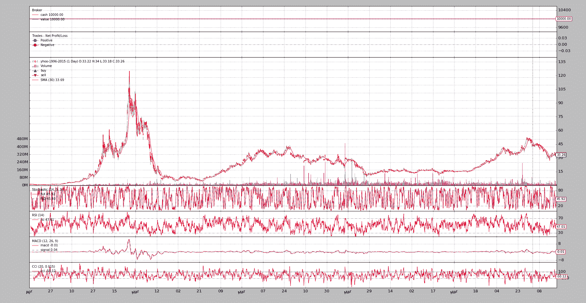

# 节省内存

> [`www.backtrader.com/docu/memory-savings/memory-savings/`](https://www.backtrader.com/docu/memory-savings/memory-savings/)

[发布版本 1.3.1.92](https://github.com/mementum/backtrader/releases/tag/1.3.1.92)已经重新设计并完全实现了先前存在的节省内存方案，尽管没有受到太多宣传并且使用较少。

`backtrader`曾经（并将继续）在内存较大的机器上开发，并且与通过绘图提供的视觉反馈是一个必需的美好事物相结合，使得设计决策变得容易：将所有内容保存在内存中。

这个决定有一些缺点：

+   用于数据存储的`array.array`在超过某些限制时必须分配和移动数据。

+   RAM 较少的机器可能会受到影响。

+   连接到可以在线运行数周/数月、提供数千秒/分钟分辨率 ticks 的实时数据源

后者比第一点更加重要，因为另一个设计决定是为了 `backtrader`：

+   必须是纯 Python，以便在需要时在嵌入式系统中运行。

    将来的一个场景可能是 `backtrader` 连接到第二台机器，该机器提供实时数据源，而 `backtrader` 本身运行在类似 *Raspberry Pi* 或甚至更有限的设备上，如 ADSL 路由器（AVM Frit!Box 7490，带有 *Freetz* 映像）

因此需要 `backtrader` 支持动态内存方案。现在 `Cerebro` 可以使用以下语义进行实例化或`run`：

+   exactbars（默认值：False）

    默认值为`False`，每个存储在一行中的值都会保存在内存中。

    可能的值：

    +   `True`或`1`：所有“lines”对象将内存使用量减少到自动计算的最小周期。

        如果简单移动平均值的周期为 30，底层数据将始终具有 30 个条形图的运行缓冲区，以允许计算简单移动平均值

        +   此设置将停用`preload`和`runonce`。

        +   使用此设置还会停用**plotting**。

    +   `-1`：在策略级别，数据和指标/操作将保留所有数据在内存中。

        例如：`RSI`在内部使用指标`UpDay`进行计算。此子指标将不会将所有数据保存在内存中。

        +   这允许保持`plotting`和`preloading`处于活动状态。

        +   `runonce`将被停用。

    +   `-2`：作为策略属性保留的数据和指标将在内存中保存所有数据。

        例如：`RSI`在内部使用指标`UpDay`进行计算。此子指标将不会将所有数据保存在内存中。

        如果在`__init__`中定义了类似 `a = self.data.close - self.data.high` 这样的内容，则`a`将不会将所有数据保存在内存中。

        +   这允许保持`plotting`和`preloading`处于活动状态。

        +   `runonce`将被停用。

一如既往，一个例子胜过千言万语。一个示例脚本显示了差异。它针对 1996 年至 2015 年的 *Yahoo* 每日数据运行，总共 `4965` 天。

注意

这只是一个小样本。每天交易 14 小时的 EuroStoxx50 期货，在仅 1 个月的交易中将产生大约 18000 个 1 分钟的 K 线。

执行脚本 1^(st)以查看在不请求内存节省时使用了多少内存位置：

```py
$ ./memory-savings.py --save 0
Total memory cells used: 506430
```

对于 1 级（总储蓄）：

```py
$ ./memory-savings.py --save 1
Total memory cells used: 2041
```

天啊！！！从*五十万*跌至`2041`。确实。系统中的每个*lines*对象都使用`collections.deque`作为缓冲区（而不是`array.array`），并且长度被限制在绝对需要的最小值以进行请求的操作。例如：

+   在数据源上使用期间为`30`的`SimpleMovingAverage`策略。

在这种情况下，将进行以下调整：

+   *数据源*将具有`30`个位置的缓冲区，这是`SimpleMovingAverage`产生下一个值所需的数量

+   `SimpleMovingAverage`将有一个`1`位置的缓冲区，因为除非其他*指标*需要（这些指标将依赖于移动平均线），否则不需要保留较大的缓冲区。

注意

这种模式最吸引人且可能最重要的功能是，所使用的内存量在脚本的整个生命周期内保持不变。

无论数据源的大小如何。

如果例如连接到长时间的实时数据源，则这将非常有用。

但请注意：

1.  *绘图*不可用

1.  还有其他的内存消耗来源，随着时间的推移会积累，比如策略生成的`orders`。

1.  此模式只能在`cerebro`中的`runonce=False`时使用。对于实时数据源，这也是强制性的，但在简单回测的情况下，这比`runonce=True`慢。

    肯定有一个权衡点，从而内存管理比逐步执行回测更昂贵，但这只能由平台的最终用户在每个案例中进行判断。

现在是负级别。这些级别旨在在仍然节省相当数量的内存的同时保持*绘图*可用。第一级别`-1`：

```py
$ ./memory-savings.py --save -1
Total memory cells used: 184623
```

在这种情况下，*指标*的第 1 级别（在策略中声明的那些）保持其完整长度的缓冲区。但是如果这些指标依赖于其他指标（这就是情况），则子对象将被长度限制。在这种情况下，我们已经从：

+   `506430`个内存位置到-> `184623`

超过 50%的节省。

注意

当然，`array.array`对象已被`collections.deque`所取代，这在内存方面更昂贵，尽管在操作方面更快。但是`collections.deque`对象相当小，并且节省了大致计算的内存位置的使用。

现在是级别`-2`，这也是为了节省在策略级别上声明的指标的内存，这些指标已被标记为不需要绘制：

```py
$ ./memory-savings.py --save -2
Total memory cells used: 174695
```

现在没有保存太多。这是因为一个单独的指标已被标记为不需要绘制：`TestInd().plotinfo.plot = False`

让我们看看来自最后一个示例的绘图：

```py
$ ./memory-savings.py --save -2 --plot
Total memory cells used: 174695
```



对于感兴趣的读者，示例脚本可以生成对*指标*层次结构中遍历的每个*行*对象的详细分析。运行时启用*绘图*（保存在`-1`）：

```py
$ ./memory-savings.py --save -1 --lendetails
-- Evaluating Datas
---- Data 0 Total Cells 34755 - Cells per Line 4965
-- Evaluating Indicators
---- Indicator 1.0 Average Total Cells 30 - Cells per line 30
---- SubIndicators Total Cells 1
---- Indicator 1.1 _LineDelay Total Cells 1 - Cells per line 1
---- SubIndicators Total Cells 1
...
---- Indicator 0.5 TestInd Total Cells 9930 - Cells per line 4965
---- SubIndicators Total Cells 0
-- Evaluating Observers
---- Observer 0 Total Cells 9930 - Cells per Line 4965
---- Observer 1 Total Cells 9930 - Cells per Line 4965
---- Observer 2 Total Cells 9930 - Cells per Line 4965
Total memory cells used: 184623
```

同样的，但启用了最大节省（`1`）：

```py
$ ./memory-savings.py --save 1 --lendetails
-- Evaluating Datas
---- Data 0 Total Cells 266 - Cells per Line 38
-- Evaluating Indicators
---- Indicator 1.0 Average Total Cells 30 - Cells per line 30
---- SubIndicators Total Cells 1
...
---- Indicator 0.5 TestInd Total Cells 2 - Cells per line 1
---- SubIndicators Total Cells 0
-- Evaluating Observers
---- Observer 0 Total Cells 2 - Cells per Line 1
---- Observer 1 Total Cells 2 - Cells per Line 1
---- Observer 2 Total Cells 2 - Cells per Line 1
```

第二个输出立即显示了*数据源*中的行数被限制为`38`个内存位置，而不是完整数据源长度`4965`。

并且*指标*和*观察者*在可能的情况下被限制为`1`，如输出的最后几行所示。

## 脚本代码和用法

在`backtrader`的源代码中可作为示例使用。用法：

```py
$ ./memory-savings.py --help
usage: memory-savings.py [-h] [--data DATA] [--save SAVE] [--datalines]
                         [--lendetails] [--plot]

Check Memory Savings

optional arguments:
  -h, --help    show this help message and exit
  --data DATA   Data to be read in (default: ../../datas/yhoo-1996-2015.txt)
  --save SAVE   Memory saving level [1, 0, -1, -2] (default: 0)
  --datalines   Print data lines (default: False)
  --lendetails  Print individual items memory usage (default: False)
  --plot        Plot the result (default: False)
```

代码：

```py
from __future__ import (absolute_import, division, print_function,
                        unicode_literals)

import argparse
import sys

import backtrader as bt
import backtrader.feeds as btfeeds
import backtrader.indicators as btind
import backtrader.utils.flushfile

class TestInd(bt.Indicator):
    lines = ('a', 'b')

    def __init__(self):
        self.lines.a = b = self.data.close - self.data.high
        self.lines.b = btind.SMA(b, period=20)

class St(bt.Strategy):
    params = (
        ('datalines', False),
        ('lendetails', False),
    )

    def __init__(self):
        btind.SMA()
        btind.Stochastic()
        btind.RSI()
        btind.MACD()
        btind.CCI()
        TestInd().plotinfo.plot = False

    def next(self):
        if self.p.datalines:
            txt = ','.join(
                ['%04d' % len(self),
                 '%04d' % len(self.data0),
                 self.data.datetime.date(0).isoformat()]
            )

            print(txt)

    def loglendetails(self, msg):
        if self.p.lendetails:
            print(msg)

    def stop(self):
        super(St, self).stop()

        tlen = 0
        self.loglendetails('-- Evaluating Datas')
        for i, data in enumerate(self.datas):
            tdata = 0
            for line in data.lines:
                tdata += len(line.array)
                tline = len(line.array)

            tlen += tdata
            logtxt = '---- Data {} Total Cells {} - Cells per Line {}'
            self.loglendetails(logtxt.format(i, tdata, tline))

        self.loglendetails('-- Evaluating Indicators')
        for i, ind in enumerate(self.getindicators()):
            tlen += self.rindicator(ind, i, 0)

        self.loglendetails('-- Evaluating Observers')
        for i, obs in enumerate(self.getobservers()):
            tobs = 0
            for line in obs.lines:
                tobs += len(line.array)
                tline = len(line.array)

            tlen += tdata
            logtxt = '---- Observer {} Total Cells {} - Cells per Line {}'
            self.loglendetails(logtxt.format(i, tobs, tline))

        print('Total memory cells used: {}'.format(tlen))

    def rindicator(self, ind, i, deep):
        tind = 0
        for line in ind.lines:
            tind += len(line.array)
            tline = len(line.array)

        thisind = tind

        tsub = 0
        for j, sind in enumerate(ind.getindicators()):
            tsub += self.rindicator(sind, j, deep + 1)

        iname = ind.__class__.__name__.split('.')[-1]

        logtxt = '---- Indicator {}.{}  {} Total Cells {} - Cells per line {}'
        self.loglendetails(logtxt.format(deep, i, iname, tind, tline))
        logtxt = '---- SubIndicators Total Cells {}'
        self.loglendetails(logtxt.format(deep, i, iname, tsub))

        return tind + tsub

def runstrat():
    args = parse_args()

    cerebro = bt.Cerebro()
    data = btfeeds.YahooFinanceCSVData(dataname=args.data)
    cerebro.adddata(data)
    cerebro.addstrategy(
        St, datalines=args.datalines, lendetails=args.lendetails)

    cerebro.run(runonce=False, exactbars=args.save)
    if args.plot:
        cerebro.plot(style='bar')

def parse_args():
    parser = argparse.ArgumentParser(
        formatter_class=argparse.ArgumentDefaultsHelpFormatter,
        description='Check Memory Savings')

    parser.add_argument('--data', required=False,
                        default='../../datas/yhoo-1996-2015.txt',
                        help='Data to be read in')

    parser.add_argument('--save', required=False, type=int, default=0,
                        help=('Memory saving level [1, 0, -1, -2]'))

    parser.add_argument('--datalines', required=False, action='store_true',
                        help=('Print data lines'))

    parser.add_argument('--lendetails', required=False, action='store_true',
                        help=('Print individual items memory usage'))

    parser.add_argument('--plot', required=False, action='store_true',
                        help=('Plot the result'))

    return parser.parse_args()

if __name__ == '__main__':
    runstrat()
```
