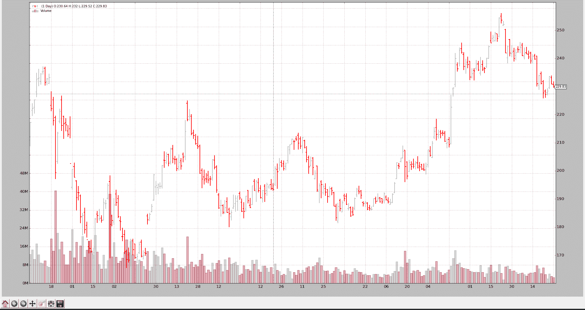

# 二进制数据源开发

> 原文：[`www.backtrader.com/docu/datafeed-develop-general/datafeed-develop-general/`](https://www.backtrader.com/docu/datafeed-develop-general/datafeed-develop-general/)

注意

示例中使用的二进制文件`goog.fd`属于 VisualChart，不能与`backtrader`一起分发。

[VisualChart](http://www.visualchart.com)可以免费下载，供有兴趣直接使用二进制文件的人使用。

CSV 数据源开发展示了如何添加新的基于 CSV 的数据源。现有的基类 CSVDataBase 提供了框架，大多数情况下子类可以简单地执行以下操作：

```py
def _loadline(self, linetokens):

  # parse the linetokens here and put them in self.lines.close,
  # self.lines.high, etc

  return True # if data was parsed, else ... return False
```

基类负责参数、初始化、文件打开、读取行、拆分行为标记和其他额外的事情，比如跳过不符合用户可能已定义的日期范围（`fromdate`、`todate`）的行。

开发非 CSV 数据源遵循相同的模式，而不是下降到已分割的行标记。

要做的事情：

+   派生自`backtrader.feed.DataBase`。

+   添加任何你可能需要的参数

+   如果需要初始化，请覆盖`__init__(self)`和/或`start(self)`。

+   如果需要任何清理代码，覆盖`stop(self)`。

+   工作发生在必须始终被覆盖的方法内：`_load(self)`

让我们使用`backtrader.feed.DataBase`已提供的参数：

```py
from backtrader.utils.py3 import with_metaclass

...
...

class DataBase(with_metaclass(MetaDataBase, dataseries.OHLCDateTime)):

    params = (('dataname', None),
        ('fromdate', datetime.datetime.min),
        ('todate', datetime.datetime.max),
        ('name', ''),
        ('compression', 1),
        ('timeframe', TimeFrame.Days),
        ('sessionend', None))
```

具有以下含义：

+   `dataname`是数据源识别如何获取数据的参数。在`CSVDataBase`的情况下，此参数应为文件路径或已经是类似文件的对象。

+   `fromdate`和`todate`定义将传递给策略的日期范围。提供的任何值超出此范围的数据将被忽略。

+   `name`是为了绘图目的而设计的。

+   `timeframe`指示时间工作参考

    可能的值：`Ticks`、`Seconds`、`Minutes`、`Days`、`Weeks`、`Months`和`Years`。

+   `compression`（默认值：1）

    每个柱子的实际条数。提供信息。仅在数据重采样/重播中有效。

+   `compression`

+   如果传递了`sessionend`（一个 datetime.time 对象），将会添加到数据源`datetime`行中，以便识别会话结束。

## 样本二进制数据源

`backtrader`已经为[VisualChart](http://www.visualchart.com)的导出定义了一个 CSV 数据源(`VChartCSVData`)，但也可以直接读取二进制数据文件。

让我们做吧（完整的数据源代码可以在底部找到）

### 初始化

二进制的 VisualChart 数据文件可以包含每日数据（.fd 扩展名）或分钟数据（.min 扩展名）。在这里，参数`timeframe`将用于区分正在读取的文件类型。

在`__init__`中，为每种类型设置不同的常量。

```py
 `def __init__(self):
        super(VChartData, self).__init__()

        # Use the informative "timeframe" parameter to understand if the
        # code passed as "dataname" refers to an intraday or daily feed
        if self.p.timeframe >= TimeFrame.Days:
            self.barsize = 28
            self.dtsize = 1
            self.barfmt = 'IffffII'
        else:
            self.dtsize = 2
            self.barsize = 32
            self.barfmt = 'IIffffII'
```

### 开始

当回测开始时（在优化过程中实际上可以多次启动），数据源将会*启动*。

在`start`方法中，打开二进制文件，除非已传递了类似文件的对象。

```py
 `def start(self):
        # the feed must start ... get the file open (or see if it was open)
        self.f = None
        if hasattr(self.p.dataname, 'read'):
            # A file has been passed in (ex: from a GUI)
            self.f = self.p.dataname
        else:
            # Let an exception propagate
            self.f = open(self.p.dataname, 'rb')
```

### 停止

在回测完成时调用。

如果文件已打开，则将其关闭

```py
 `def stop(self):
        # Close the file if any
        if self.f is not None:
            self.f.close()
            self.f = None
```

### 实际加载

实际工作是在`_load`中完成的。调用以加载下一组数据，这种情况下的下一个数据是：datetime、open、high、low、close、volume、openinterest。在`backtrader`中，“实际”时刻对应于索引 0。

从打开的文件中读取一定数量的字节（由`__init__`期间设置的常量确定），使用`struct`模块解析，如果需要进一步处理（例如使用 divmod 操作处理日期和时间），然后存储在数据源的`lines`中：datetime、open、high、low、close、volume、openinterest。

如果无法从文件中读取数据，则假定已到达文件结束（EOF）。

+   返回`False`表示没有更多数据可用

或者如果数据已加载并解析：

+   返回`True`表示数据集加载成功

```py
 `def _load(self):
        if self.f is None:
            # if no file ... no parsing
            return False

        # Read the needed amount of binary data
        bardata = self.f.read(self.barsize)
        if not bardata:
            # if no data was read ... game over say "False"
            return False

        # use struct to unpack the data
        bdata = struct.unpack(self.barfmt, bardata)

        # Years are stored as if they had 500 days
        y, md = divmod(bdata[0], 500)
        # Months are stored as if they had 32 days
        m, d = divmod(md, 32)
        # put y, m, d in a datetime
        dt = datetime.datetime(y, m, d)

        if self.dtsize > 1:  # Minute Bars
            # Daily Time is stored in seconds
            hhmm, ss = divmod(bdata[1], 60)
            hh, mm = divmod(hhmm, 60)
            # add the time to the existing atetime
            dt = dt.replace(hour=hh, minute=mm, second=ss)

        self.lines.datetime[0] = date2num(dt)

        # Get the rest of the unpacked data
        o, h, l, c, v, oi = bdata[self.dtsize:]
        self.lines.open[0] = o
        self.lines.high[0] = h
        self.lines.low[0] = l
        self.lines.close[0] = c
        self.lines.volume[0] = v
        self.lines.openinterest[0] = oi

        # Say success
        return True
```

## 其他二进制格式

可以将相同的模型应用于任何其他二进制源：

+   数据库

+   分层数据存储

+   在线来源

再次执行以下步骤：

+   `__init__` -> 实例的任何初始化代码，仅一次

+   `start` -> 开始回测（如果将进行优化，则一次或多次）

    例如，这将打开到数据库的连接或到在线服务的套接字

+   `stop` -> 清理工作，如关闭数据库连接或打开的套接字

+   `_load` -> 查询数据库或在线源以获取下一组数据，并将其加载到对象的`lines`中。标准字段包括：datetime、open、high、low、close、volume、openinterest

## VChartData 测试

`VCharData` 从本地“.fd”文件加载谷歌 2006 年的数据。

这只涉及加载数据，因此甚至不需要`Strategy`的子类。

```py
from __future__ import (absolute_import, division, print_function,
                        unicode_literals)

import datetime

import backtrader as bt
from vchart import VChartData

if __name__ == '__main__':
    # Create a cerebro entity
    cerebro = bt.Cerebro(stdstats=False)

    # Add a strategy
    cerebro.addstrategy(bt.Strategy)

    ###########################################################################
    # Note:
    # The goog.fd file belongs to VisualChart and cannot be distributed with
    # backtrader
    #
    # VisualChart can be downloaded from www.visualchart.com
    ###########################################################################
    # Create a Data Feed
    datapath = '../../datas/goog.fd'
    data = VChartData(
        dataname=datapath,
        fromdate=datetime.datetime(2006, 1, 1),
        todate=datetime.datetime(2006, 12, 31),
        timeframe=bt.TimeFrame.Days
    )

    # Add the Data Feed to Cerebro
    cerebro.adddata(data)

    # Run over everything
    cerebro.run()

    # Plot the result
    cerebro.plot(style='bar')
```



## VChartData 完整代码

```py
from __future__ import (absolute_import, division, print_function,
                        unicode_literals)

import datetime
import struct

from backtrader.feed import DataBase
from backtrader import date2num
from backtrader import TimeFrame

class VChartData(DataBase):
    def __init__(self):
        super(VChartData, self).__init__()

        # Use the informative "timeframe" parameter to understand if the
        # code passed as "dataname" refers to an intraday or daily feed
        if self.p.timeframe >= TimeFrame.Days:
            self.barsize = 28
            self.dtsize = 1
            self.barfmt = 'IffffII'
        else:
            self.dtsize = 2
            self.barsize = 32
            self.barfmt = 'IIffffII'

    def start(self):
        # the feed must start ... get the file open (or see if it was open)
        self.f = None
        if hasattr(self.p.dataname, 'read'):
            # A file has been passed in (ex: from a GUI)
            self.f = self.p.dataname
        else:
            # Let an exception propagate
            self.f = open(self.p.dataname, 'rb')

    def stop(self):
        # Close the file if any
        if self.f is not None:
            self.f.close()
            self.f = None

    def _load(self):
        if self.f is None:
            # if no file ... no parsing
            return False

        # Read the needed amount of binary data
        bardata = self.f.read(self.barsize)
        if not bardata:
            # if no data was read ... game over say "False"
            return False

        # use struct to unpack the data
        bdata = struct.unpack(self.barfmt, bardata)

        # Years are stored as if they had 500 days
        y, md = divmod(bdata[0], 500)
        # Months are stored as if they had 32 days
        m, d = divmod(md, 32)
        # put y, m, d in a datetime
        dt = datetime.datetime(y, m, d)

        if self.dtsize > 1:  # Minute Bars
            # Daily Time is stored in seconds
            hhmm, ss = divmod(bdata[1], 60)
            hh, mm = divmod(hhmm, 60)
            # add the time to the existing atetime
            dt = dt.replace(hour=hh, minute=mm, second=ss)

        self.lines.datetime[0] = date2num(dt)

        # Get the rest of the unpacked data
        o, h, l, c, v, oi = bdata[self.dtsize:]
        self.lines.open[0] = o
        self.lines.high[0] = h
        self.lines.low[0] = l
        self.lines.close[0] = c
        self.lines.volume[0] = v
        self.lines.openinterest[0] = oi

        # Say success
        return True
```
