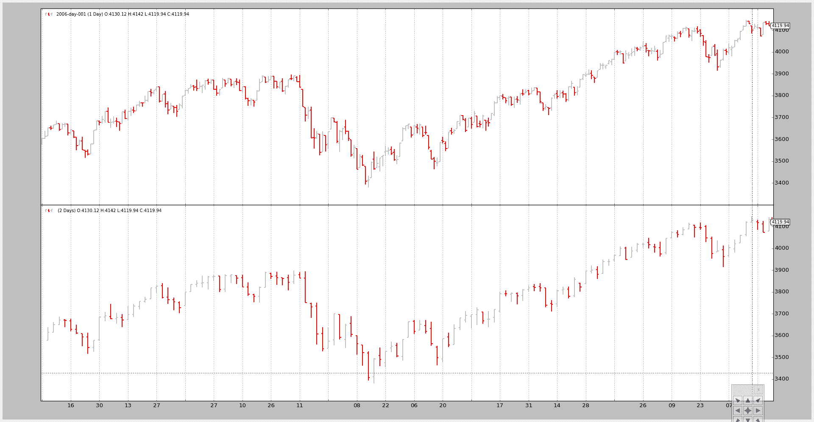
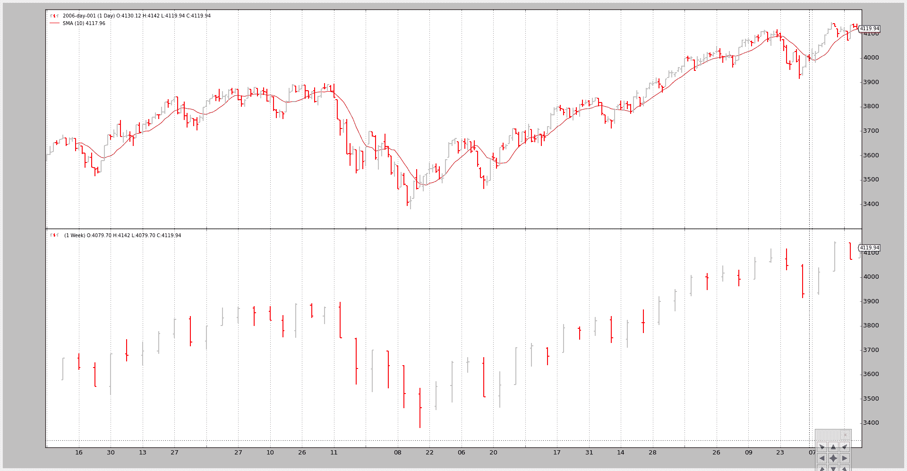
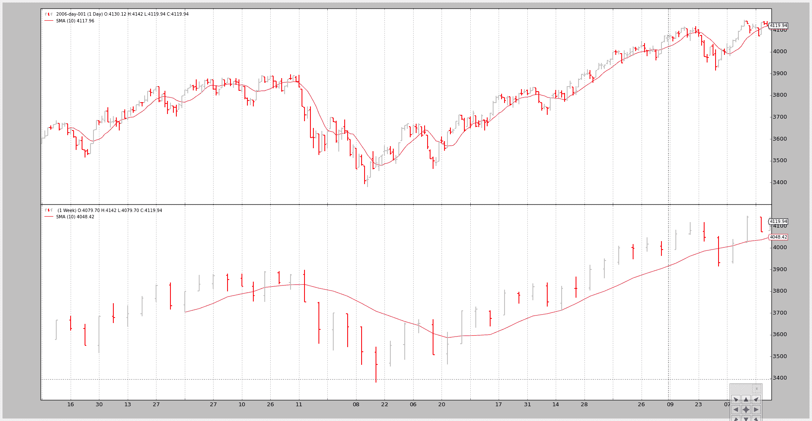

# 数据 - 多时间框架

> 原文：[`www.backtrader.com/docu/data-multitimeframe/data-multitimeframe/`](https://www.backtrader.com/docu/data-multitimeframe/data-multitimeframe/)

有时，投资决策是根据不同的时间框架进行的：

+   每周评估趋势

+   每日执行入场

或者 5 分钟对比 60 分钟。

这意味着需要在`backtrader`中组合多个时间框架的数据以支持这种组合。

平台已经内置了对此的本地支持。最终用户只需遵循这些规则：

+   具有最小时间框架（因此具有更多柱状图）的数据必须是添加到 Cerebro 实例的第一个数据

+   数据必须正确地对齐日期时间，以便平台能够理解它们的含义

此外，最终用户可以自由地在较短/较大的时间框架上应用指标。当然：

+   应用于较大时间框架的指标将产生较少的柱状图

平台还将考虑以下内容

+   较大时间框架的最小周期

可能会有最小周期的副作用，这可能导致在策略添加到 Cerebro 后需要消耗几个数量级的较小时间框架柱状图才能开始执行。

内置的`cerebro.resample`将用于创建较大的时间框架。

以下是一些示例，但首先是测试脚本的来源。

```py
 # Load the Data
    datapath = args.dataname or '../../datas/2006-day-001.txt'
    data = btfeeds.BacktraderCSVData(dataname=datapath)
    cerebro.adddata(data)  # First add the original data - smaller timeframe

    tframes = dict(daily=bt.TimeFrame.Days, weekly=bt.TimeFrame.Weeks,
                   monthly=bt.TimeFrame.Months)

    # Handy dictionary for the argument timeframe conversion
    # Resample the data
    if args.noresample:
        datapath = args.dataname2 or '../../datas/2006-week-001.txt'
        data2 = btfeeds.BacktraderCSVData(dataname=datapath)
        # And then the large timeframe
        cerebro.adddata(data2)
    else:
        cerebro.resampledata(data, timeframe=tframes[args.timeframe],
                             compression=args.compression)

    # Run over everything
    cerebro.run()
```

步骤：

+   加载数据

+   根据用户指定的参数重新采样

    该脚本还允许加载第二个数据

+   将数据添加到 cerebro

+   将重新采样的数据（更大的时间框架）添加到 cerebro

+   运行

## 示例 1 - 每日和每周

脚本的调用：

```py
$ ./multitimeframe-example.py --timeframe weekly --compression 1
```

输出图表：


## 示例 2 - 每日和每日压缩（2 根柱状图合并为 1 根）

脚本的调用：

```py
$ ./multitimeframe-example.py --timeframe daily --compression 2
```

输出图表：



## 示例 3 - 带有 SMA 的策略

尽管绘图很好，但这里的关键问题是展示较大的时间框架如何影响系统，特别是当涉及到起始点时

该脚本可以使用`--indicators`来添加一个策略，该策略在较小和较大时间框架数据上创建**周期为 10**的简单移动平均线。

如果只考虑较小的时间框架：

+   `next`将在第 10 根柱状图之后首先被调用，这是简单移动平均线需要产生数值的时间

    **注意**：请记住，策略监视创建的指标，并且只有当所有指标都产生数值时才调用`next`。其理念是，最终用户已经添加了指标以在逻辑中使用它们，因此如果指标没有产生数值，则不应进行任何逻辑操作。

但在这种情况下，较大的时间框架（每周）会延迟调用`next`，直到每周数据上的简单移动平均线产生数值，这需要... 10 周。

该脚本覆盖了`nextstart`，它只被调用一次，默认调用`next`以显示第一次调用的时间。

### 调用 1：

只有较小的时间框架，每日，获得一个简单移动平均线

命令行和输出

```py
$ ./multitimeframe-example.py --timeframe weekly --compression 1 --indicators --onlydaily
--------------------------------------------------
nextstart called with len 10
--------------------------------------------------
```

以及图表。



### 调用 2：

两个时间框架都有一个简单移动平均线

命令行：

```py
$ ./multitimeframe-example.py --timeframe weekly --compression 1 --indicators
--------------------------------------------------
nextstart called with len 50
--------------------------------------------------
--------------------------------------------------
nextstart called with len 51
--------------------------------------------------
--------------------------------------------------
nextstart called with len 52
--------------------------------------------------
--------------------------------------------------
nextstart called with len 53
--------------------------------------------------
--------------------------------------------------
nextstart called with len 54
--------------------------------------------------
```

这里有两件事需要注意：

+   策略在 50 个周期后而不是 10 个周期后首次调用。

    这是因为应用于较大（每周）时间框架的简单移动平均线在 10 周后产生一个值……那就是 `10 周 * 5 天 / 周 …… 50 天`

+   `nextstart` 被调用了 5 次，而不是只有 1 次。

    这是混合时间框架并且（在这种情况下仅有一个）指标应用于较大时间框架的自然副作用。

    较大时间框架的简单移动平均产生了 5 次相同的值，而同时消耗了 5 个每日的条形图。

    并且因为周期的开始由较大的时间框架控制，`nextstart` 被调用了 5 次。

以及图表。



## 结论

在 `backtrader` 中，可以使用多个时间框架的数据，无需特殊对象或调整：只需先添加较小的时间框架。

测试脚本。

```py
from __future__ import (absolute_import, division, print_function,
                        unicode_literals)

import argparse

import backtrader as bt
import backtrader.feeds as btfeeds
import backtrader.indicators as btind

class SMAStrategy(bt.Strategy):
    params = (
        ('period', 10),
        ('onlydaily', False),
    )

    def __init__(self):
        self.sma_small_tf = btind.SMA(self.data, period=self.p.period)
        if not self.p.onlydaily:
            self.sma_large_tf = btind.SMA(self.data1, period=self.p.period)

    def nextstart(self):
        print('--------------------------------------------------')
        print('nextstart called with len', len(self))
        print('--------------------------------------------------')

        super(SMAStrategy, self).nextstart()

def runstrat():
    args = parse_args()

    # Create a cerebro entity
    cerebro = bt.Cerebro(stdstats=False)

    # Add a strategy
    if not args.indicators:
        cerebro.addstrategy(bt.Strategy)
    else:
        cerebro.addstrategy(
            SMAStrategy,

            # args for the strategy
            period=args.period,
            onlydaily=args.onlydaily,
        )

    # Load the Data
    datapath = args.dataname or '../../datas/2006-day-001.txt'
    data = btfeeds.BacktraderCSVData(dataname=datapath)
    cerebro.adddata(data)  # First add the original data - smaller timeframe

    tframes = dict(daily=bt.TimeFrame.Days, weekly=bt.TimeFrame.Weeks,
                   monthly=bt.TimeFrame.Months)

    # Handy dictionary for the argument timeframe conversion
    # Resample the data
    if args.noresample:
        datapath = args.dataname2 or '../../datas/2006-week-001.txt'
        data2 = btfeeds.BacktraderCSVData(dataname=datapath)
        # And then the large timeframe
        cerebro.adddata(data2)
    else:
        cerebro.resampledata(data, timeframe=tframes[args.timeframe],
                             compression=args.compression)

    # Run over everything
    cerebro.run()

    # Plot the result
    cerebro.plot(style='bar')

def parse_args():
    parser = argparse.ArgumentParser(
        description='Multitimeframe test')

    parser.add_argument('--dataname', default='', required=False,
                        help='File Data to Load')

    parser.add_argument('--dataname2', default='', required=False,
                        help='Larger timeframe file to load')

    parser.add_argument('--noresample', action='store_true',
                        help='Do not resample, rather load larger timeframe')

    parser.add_argument('--timeframe', default='weekly', required=False,
                        choices=['daily', 'weekly', 'monhtly'],
                        help='Timeframe to resample to')

    parser.add_argument('--compression', default=1, required=False, type=int,
                        help='Compress n bars into 1')

    parser.add_argument('--indicators', action='store_true',
                        help='Wether to apply Strategy with indicators')

    parser.add_argument('--onlydaily', action='store_true',
                        help='Indicator only to be applied to daily timeframe')

    parser.add_argument('--period', default=10, required=False, type=int,
                        help='Period to apply to indicator')

    return parser.parse_args()

if __name__ == '__main__':
    runstrat()
```
