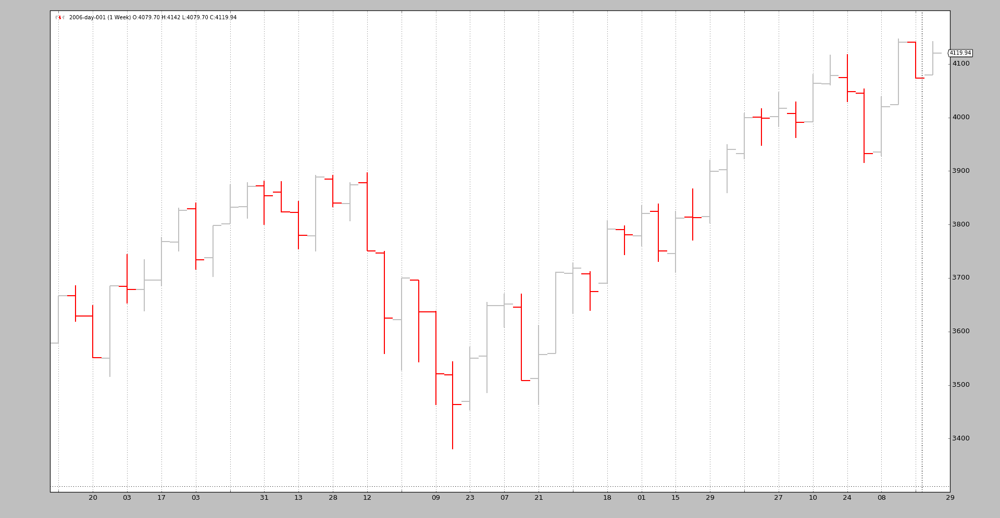
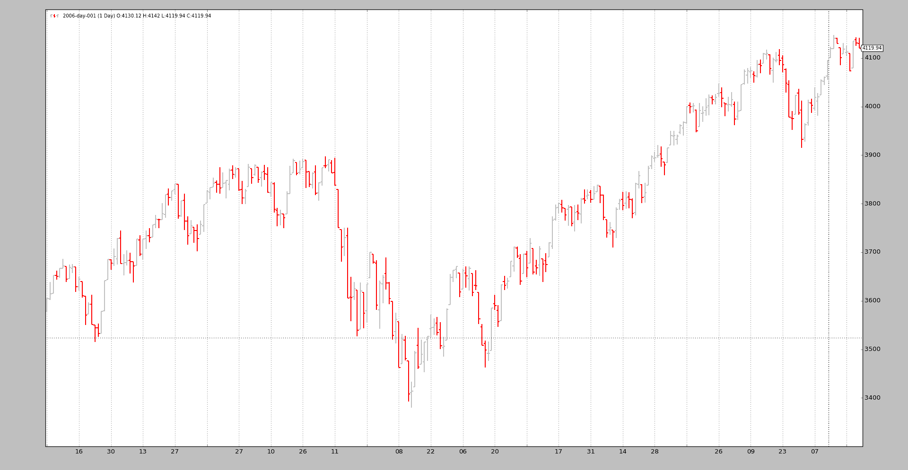
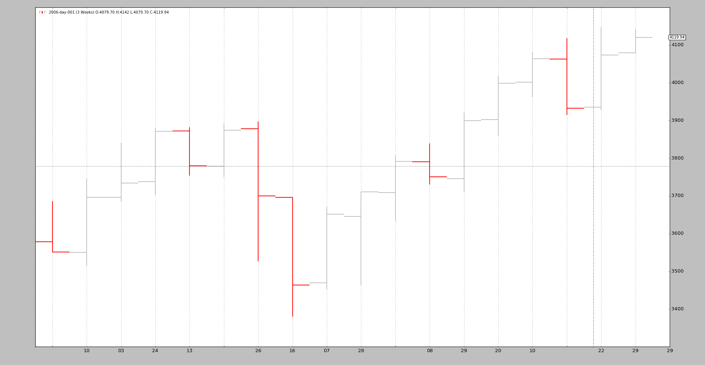

# 数据重新采样

> 原文：[`www.backtrader.com/docu/data-resampling/data-resampling/`](https://www.backtrader.com/docu/data-resampling/data-resampling/)

当数据仅在单个时间框架中可用并且必须为不同时间框架进行分析时，是进行一些重新采样的时候了。

“重新取样”实际上应该称为“上取样”，因为从一个源时间框架到一个更大的时间框架（例如：从天到周）

通过将原始数据通过过滤器对象传递给 backtrader 来支持重新采样。虽然有几种实现方法，但存在一种简单的接口来实现：

+   使用`cerebro.adddata(data)`将`data`放入系统中，而不是

    `cerebro.resampledata(data, **kwargs)`

有两个主要选项可以控制

+   调整时间范围

+   压缩条

要这样做，请在调用`resampledata`时使用以下参数：

+   `timeframe`（默认：bt.TimeFrame.Days）

    目标时间范围，必须等于或大于源时间

+   `compression`（默认：1）

    将选定值“n”压缩为 1 条

让我们看一个从每日到每周的手工脚本示例：

```py
$ ./resampling-example.py --timeframe weekly --compression 1
```

输出：



我们可以将其与原始的每日数据进行比较：

```py
$ ./resampling-example.py --timeframe daily --compression 1
```

输出：



通过执行以下步骤完成魔术：

+   像往常一样加载数据

+   将数据使用`resampledata`与所需参数输入到 cerebro 中：

    +   `timeframe`

    +   `compression`

样本中的代码（整个脚本在底部）。

```py
 # Load the Data
    datapath = args.dataname or '../../datas/2006-day-001.txt'
    data = btfeeds.BacktraderCSVData(dataname=datapath)

    # Handy dictionary for the argument timeframe conversion
    tframes = dict(
        daily=bt.TimeFrame.Days,
        weekly=bt.TimeFrame.Weeks,
        monthly=bt.TimeFrame.Months)

    # Add the resample data instead of the original
    cerebro.resampledata(data,
                         timeframe=tframes[args.timeframe],
                         compression=args.compression)
```

最后一个示例，我们首先将时间框架从每日更改为每周，然后应用 3 比 1 的压缩：

```py
$ ./resampling-example.py --timeframe weekly --compression 3
```

输出：



从原始的 256 个每日条到 18 个 3 周条。拆分：

+   52 周

+   52 / 3 = 17.33，因此 18 个条

也不需要更多。当然，分时数据也可以重新采样。

重新采样过滤器支持附加参数，在大多数情况下不应该触及：

+   `bar2edge`（默认：`True`）

    使用时间边界作为目标的重新采样。例如，使用“ticks -> 5 秒”，结果为 5 秒的条将与 xx:00、xx:05、xx:10 对齐...

+   `adjbartime`（默认：`True`）

    使用边界时间来调整传递的重新采样条的时间，而不是最后一次看到的时间戳。例如，如果重新采样到“5 秒”，则条的时间将被调整为 hh05，即使最后一次看到的时间戳是 hh04.33。

    注意

    如果“bar2edge”为 True，只会调整时间。如果条未对齐到边界，调整时间是没有意义的

+   `rightedge`（默认：`True`）

    使用时间边界的右边来设置时间。

    如果为 False 并且将重采样的间隔压缩到 5 秒，则在 hh00 和 hh04 之间的秒钟的情况下，重采样条的时间将为 hh00（起始边界

    如果为 True，则时间的使用边界将为 hh05（结束边界）

+   `boundoff`（默认值：`0`）

    将重采样/重播的边界推进单位数量。

    例如，如果重采样的时间从 *1 分钟* 到 *15 分钟*，则默认行为是从 *00:01:00* 到 *00:15:00* 取 1 分钟的条来生成一个 15 分钟的重播/重采样条。

    如果 `boundoff` 设置为 `1`，则边界向前推进 `1 个单位`。 在这种情况下，原始的 *单位* 是一个 *1 分钟* 的条。 因此，现在重采样/重播将会：

    +   使用从 *00:00:00* 到 *00:14:00* 的条来生成 15 分钟的条

重采样测试脚本的示例代码。

```py
from __future__ import (absolute_import, division, print_function,
                        unicode_literals)

import argparse

import backtrader as bt
import backtrader.feeds as btfeeds

def runstrat():
    args = parse_args()

    # Create a cerebro entity
    cerebro = bt.Cerebro(stdstats=False)

    # Add a strategy
    cerebro.addstrategy(bt.Strategy)

    # Load the Data
    datapath = args.dataname or '../../datas/2006-day-001.txt'
    data = btfeeds.BacktraderCSVData(dataname=datapath)

    # Handy dictionary for the argument timeframe conversion
    tframes = dict(
        daily=bt.TimeFrame.Days,
        weekly=bt.TimeFrame.Weeks,
        monthly=bt.TimeFrame.Months)

    # Add the resample data instead of the original
    cerebro.resampledata(data,
                         timeframe=tframes[args.timeframe],
                         compression=args.compression)

    # Run over everything
    cerebro.run()

    # Plot the result
    cerebro.plot(style='bar')

def parse_args():
    parser = argparse.ArgumentParser(
        description='Pandas test script')

    parser.add_argument('--dataname', default='', required=False,
                        help='File Data to Load')

    parser.add_argument('--timeframe', default='weekly', required=False,
                        choices=['daily', 'weekly', 'monhtly'],
                        help='Timeframe to resample to')

    parser.add_argument('--compression', default=1, required=False, type=int,
                        help='Compress n bars into 1')

    return parser.parse_args()

if __name__ == '__main__':
    runstrat()
```
