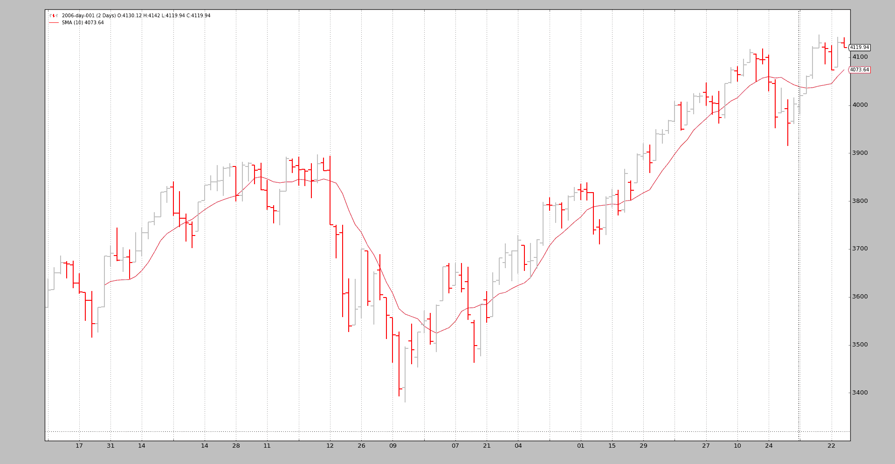

# 数据 - 回放

> 原文：[`www.backtrader.com/docu/data-replay/data-replay/`](https://www.backtrader.com/docu/data-replay/data-replay/)

时间已经过去，针对完全形成和关闭的每日柱进行策略测试是好的，但可以更好。

这就是*数据回放*发挥作用的地方。如果：

+   该策略在时间框架 X 的数据上运行（示例：每日）

且

+   较小时间框架 Y 的数据（示例：1 分钟）可用

数据回放正是其名称所示的：

+   使用 1 分钟数据重放每日柱

当然，这并不完全是市场的发展方式，但比孤立地查看每日完全形成和关闭的柱要好得多：

如果策略在形成日柱时实时运行，则柱的形成近似会给予机会复制策略在实际条件下的实际行为

实施*数据回放*遵循`backtrader`的常规使用模式

+   加载数据源

+   将数据传递给 cerebro，使用`replaydata`

+   添加一个策略

注意

当数据被重新播放时，不支持预加载，因为每个柱实际上是实时构建的。它将自动在任何`Cerebro`实例中禁用。

可以传递给`replaydata`的参数：

+   `timeframe` (默认值：bt.TimeFrame.Days)

    目标时间框架必须与源时间框架相等或更大才能发挥作用

+   `compression` (默认值：1)

    将所选值“n”压缩为 1 根柱

扩展参数（如果不是真正需要，请勿修改）：

+   `bar2edge` (默认值：True)

    使用时间边界作为封闭柱的目标进行回放。例如，“ticks -> 5 seconds”，生成的 5 秒柱将对齐到 xx:00、xx:05、xx:10 等。

+   `adjbartime` (默认值：False)

    使用边界处的时间来调整交付的重新采样柱的时间，而不是上次看到的时间戳。例如，如果重新采样为“5 秒”，则柱的时间将被调整为 hh05，即使上次看到的时间戳是 hh04.33。

    **注意**：仅当“bar2edge”为 True 时才会调整时间。如果柱未对齐到边界，调整时间是没有意义的

+   `rightedge` (默认值：True)

    使用时间边界的右边缘来设置时间。

    如果为 False，并且压缩到 5 秒，则对于 hh00 和 hh04 之间的秒数，重新采样柱的时间将是 hh00（起始边界

    如果为 True，则用于时间的边界将是 hh05（结束边界）

为了与示例一起工作，将标准的 2006 年日常数据按周重放。这意味着：

+   最终将有 52 个柱，每周一个

+   Cerebro 将总共调用`prenext`和`next` 255 次，这是每日 K 线的原始计数

技巧：

+   当周 K 线形成时，策略的长度（`len(self)`）将保持不变。

+   每到新的一周，长度将增加一次

下面是一些示例，但首先是测试脚本的源码，其中数据被加载并通过`replaydata`传递给 cerebro，然后运行。

```py
 `# Load the Data
    datapath = args.dataname or '../../datas/2006-day-001.txt'
    data = btfeeds.BacktraderCSVData(dataname=datapath)

    # Handy dictionary for the argument timeframe conversion
    tframes = dict(
        daily=bt.TimeFrame.Days,
        weekly=bt.TimeFrame.Weeks,
        monthly=bt.TimeFrame.Months)

    # First add the original data - smaller timeframe
    cerebro.replaydata(data,
                       timeframe=tframes[args.timeframe],
                       compression=args.compression)` 
```

## 示例 - 每日重放到周线

脚本的调用：

```py
`$ ./replay-example.py --timeframe weekly --compression 1` 
```

不幸的是，图表无法向我们展示背景中真实发生的事情，所以让我们看看控制台输出：

```py
`prenext len 1 - counter 1
prenext len 1 - counter 2
prenext len 1 - counter 3
prenext len 1 - counter 4
prenext len 1 - counter 5
prenext len 2 - counter 6
...
...
prenext len 9 - counter 44
prenext len 9 - counter 45
---next len 10 - counter 46
---next len 10 - counter 47
---next len 10 - counter 48
---next len 10 - counter 49
---next len 10 - counter 50
---next len 11 - counter 51
---next len 11 - counter 52
---next len 11 - counter 53
...
...
---next len 51 - counter 248
---next len 51 - counter 249
---next len 51 - counter 250
---next len 51 - counter 251
---next len 51 - counter 252
---next len 52 - counter 253
---next len 52 - counter 254
---next len 52 - counter 255` 
```

正如我们所看到的，内部的`self.counter`变量正在跟踪每次调用`prenext`或`next`。前者在应用简单移动平均产生值之前调用。后者在简单移动平均产生值时调用。

关键：

+   策略的长度（len(self)）每 5 根 K 线（一周 5 个交易日）变化一次

策略有效地看到：

+   每周 K 线如何在 5 次迭代中发展。

    再次强调，这并不复制市场的实际逐笔（甚至不是分钟、小时）发展，但比看到一根 K 线要好。

可视化输出是周线图表，这是系统正在进行测试的最终结果。


## 示例 2 - 每日到每日的压缩

当然，“重放”也可以应用于相同的时间框架，但进行压缩。

控制台：

```py
`$ ./replay-example.py --timeframe daily --compression 2
prenext len 1 - counter 1
prenext len 1 - counter 2
prenext len 2 - counter 3
prenext len 2 - counter 4
prenext len 3 - counter 5
prenext len 3 - counter 6
prenext len 4 - counter 7
...
...
---next len 125 - counter 250
---next len 126 - counter 251
---next len 126 - counter 252
---next len 127 - counter 253
---next len 127 - counter 254
---next len 128 - counter 255` 
```

这次我们得到了预期的一半 K 线，因为请求的压缩因子是 2。

图表：



## 结论

可以重建市场发展的过程。通常会有一组较小时间框架的数据可用，并且可以用来离散地重放系统运行的时间框架。

测试脚本。

```py
`from __future__ import (absolute_import, division, print_function,
                        unicode_literals)

import argparse

import backtrader as bt
import backtrader.feeds as btfeeds
import backtrader.indicators as btind

class SMAStrategy(bt.Strategy):
    params = (
        ('period', 10),
        ('onlydaily', False),
    )

    def __init__(self):
        self.sma = btind.SMA(self.data, period=self.p.period)

    def start(self):
        self.counter = 0

    def prenext(self):
        self.counter += 1
        print('prenext len %d - counter %d' % (len(self), self.counter))

    def next(self):
        self.counter += 1
        print('---next len %d - counter %d' % (len(self), self.counter))

def runstrat():
    args = parse_args()

    # Create a cerebro entity
    cerebro = bt.Cerebro(stdstats=False)

    cerebro.addstrategy(
        SMAStrategy,
        # args for the strategy
        period=args.period,
    )

    # Load the Data
    datapath = args.dataname or '../../datas/2006-day-001.txt'
    data = btfeeds.BacktraderCSVData(dataname=datapath)

    # Handy dictionary for the argument timeframe conversion
    tframes = dict(
        daily=bt.TimeFrame.Days,
        weekly=bt.TimeFrame.Weeks,
        monthly=bt.TimeFrame.Months)

    # First add the original data - smaller timeframe
    cerebro.replaydata(data,
                       timeframe=tframes[args.timeframe],
                       compression=args.compression)

    # Run over everything
    cerebro.run()

    # Plot the result
    cerebro.plot(style='bar')

def parse_args():
    parser = argparse.ArgumentParser(
        description='Pandas test script')

    parser.add_argument('--dataname', default='', required=False,
                        help='File Data to Load')

    parser.add_argument('--timeframe', default='weekly', required=False,
                        choices=['daily', 'weekly', 'monhtly'],
                        help='Timeframe to resample to')

    parser.add_argument('--compression', default=1, required=False, type=int,
                        help='Compress n bars into 1')

    parser.add_argument('--period', default=10, required=False, type=int,
                        help='Period to apply to indicator')

    return parser.parse_args()

if __name__ == '__main__':
    runstrat()` 
```
