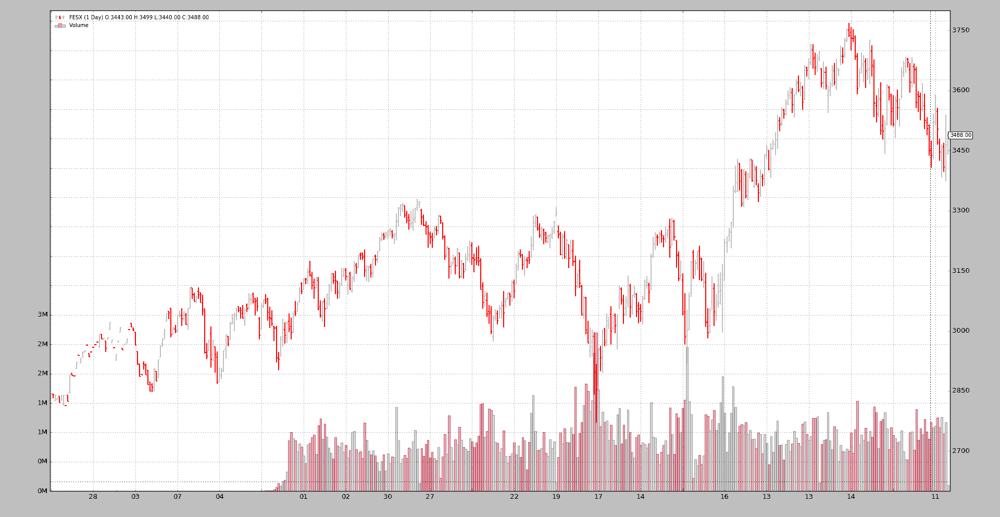
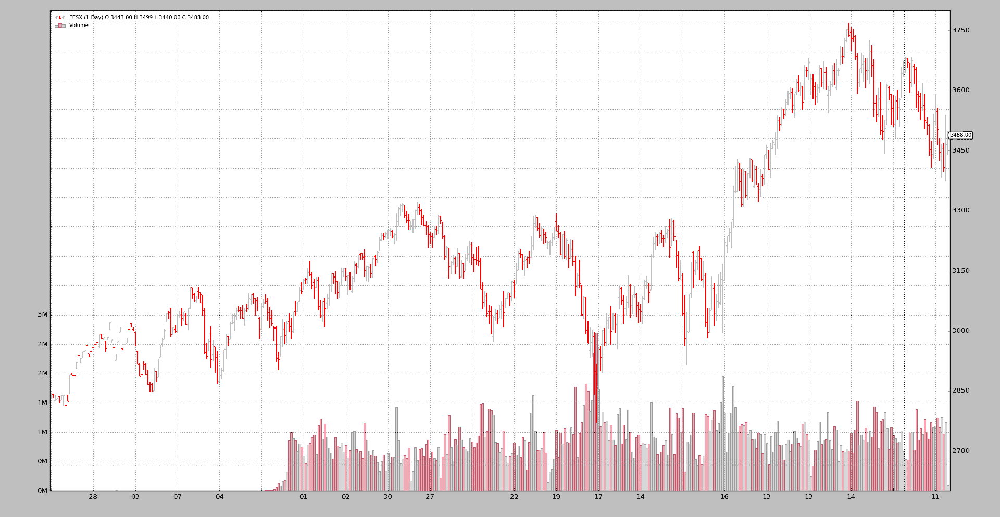
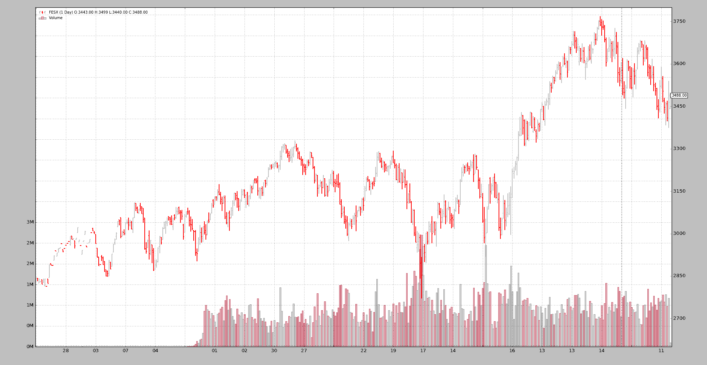

# 期货滚动

> 原文：[`www.backtrader.com/docu/data-rollover/rolling-futures-over/`](https://www.backtrader.com/docu/data-rollover/rolling-futures-over/)

并非每个提供商都为可以交易的工具提供*连续*期货。有时提供的数据是仍然有效的到期日的数据，即：仍在交易的数据

当涉及到*回测*时，这并不是很有帮助，因为数据分散在几种不同的工具上，而且...在时间上*重叠*。

能够正确地将过去的这些工具的数据合并为连续流可以减轻痛苦。问题在于：

+   没有规定如何最好地将不同到期日的数据合并为连续期货

一些文献，由*SierraChart*提供：

+   [`www.sierrachart.com/index.php?page=doc/ChangingFuturesContract.html`](http://www.sierrachart.com/index.php?page=doc/ChangingFuturesContract.html)

## 滚动数据源

*backtrader* 已经在 `1.8.10.99` 版本中添加了将不同到期日期货数据合并为连续期货的可能性：

```py
import backtrader as bt

cerebro = bt.Cerebro()
data0 = bt.feeds.MyFeed(dataname='Expiry0')
data1 = bt.feeds.MyFeed(dataname='Expiry1')
...
dataN = bt.feeds.MyFeed(dataname='ExpiryN')

drollover = cerebro.rolloverdata(data0, data1, ..., dataN, name='MyRoll', **kwargs)

cerebro.run()
```

注意

可能的 `**kwargs` 如下所述

也可以通过直接访问`RollOver`数据源来完成（如果进行子类化，则很有帮助）：

```py
import backtrader as bt

cerebro = bt.Cerebro()
data0 = bt.feeds.MyFeed(dataname='Expiry0')
data1 = bt.feeds.MyFeed(dataname='Expiry1')
...
dataN = bt.feeds.MyFeed(dataname='ExpiryN')

drollover = bt.feeds.RollOver(data0, data1, ..., dataN, dataname='MyRoll', **kwargs)
cerebro.adddata(drollover)

cerebro.run()
```

注意

可能的 `**kwargs` 如下所述

注意

使用`RollOver`时，名称使用`dataname`分配。这是用于传递*名称/标记*的所有数据源的标准参数。在这种情况下，它被重用以为所有滚动期货分配一个公共名称。

在`cerebro.rolloverdata`的情况下，使用`name`将名称分配给数据源，这已经是该方法的一个命名参数

底线：

+   数据源像往常一样创建，但不会添加到`cerebro`

+   这些数据源作为输入提供给`bt.feeds.RollOver`

    还提供了一个`dataname`，主要用于识别目的。

+   然后将此*滚动*数据源添加到`cerebro`

### 滚动选项

提供了两个参数来控制滚动过程

+   `checkdate`（默认值：`None`）

    这必须是一个*可调用*对象，具有以下签名：

    ```py
    checkdate(dt, d):` 
    ```

    其中：

    +   `dt` 是一个 `datetime.datetime` 对象

    +   `d` 是当前活跃期货的数据源

    预期返回值：

    +   `True`：只要可调用函数返回此值，就可以切换到下一个期货

        如果商品在三月的第三个星期五到期，`checkdate`可能会在到期周的整个周返回`True`。

    +   `False`：到期无法发生

+   `checkcondition`（默认值：`None`）

    注意

    仅当`checkdate`返回`True`时才会调用此函数

    如果 `None`，这将在内部评估为 `True`（执行滚动）

    否则，这必须是一个具有此签名的*可调用*对象：

    ```py
    checkcondition(d0, d1)` 
    ```

    其中：

    +   `d0` 是当前活跃期货的数据源

    +   `d1` 是下一个到期的数据源

    预期返回值：

    +   `True`：滚动到下一个期货

        接下来是`checkdate`示例，这可以说明只有当`d0`的*volume*已经小于`d1`的 volume 时，才能进行滚动

    +   `False`：到期无法发生

### 子类化`RollOver`

如果仅指定*可调用对象*不够，总是有机会对`RollOver`进行子类化。要子类化的方法：

+   `def _checkdate(self, dt, d):`

    与上面相同名称的参数的*signature*相匹配。预期的返回值也是相同的。

+   `def _checkcondition(self, d0, d1)`

    与上面相同名称的参数的*signature*相匹配。预期的返回值也是相同的。

## 让我们开始

注意

样本中的默认行为是使用`cerebro.rolloverdata`。可以通过传递`-no-cerebro`标志来更改此行为。在这种情况下，样本使用`RollOver`和`cerebro.adddata`

实现包括在*backtrader*源代码中提供的示例。

### 期货连接

让我们从运行无参数的示例开始查看纯连接。

```py
$ ./rollover.py

Len, Name, RollName, Datetime, WeekDay, Open, High, Low, Close, Volume, OpenInterest
0001, FESX, 199FESXM4, 2013-09-26, Thu, 2829.0, 2843.0, 2829.0, 2843.0, 3.0, 1000.0
0002, FESX, 199FESXM4, 2013-09-27, Fri, 2842.0, 2842.0, 2832.0, 2841.0, 16.0, 1101.0
...
0176, FESX, 199FESXM4, 2014-06-20, Fri, 3315.0, 3324.0, 3307.0, 3322.0, 134777.0, 520978.0
0177, FESX, 199FESXU4, 2014-06-23, Mon, 3301.0, 3305.0, 3265.0, 3285.0, 730211.0, 3003692.0
...
0241, FESX, 199FESXU4, 2014-09-19, Fri, 3287.0, 3308.0, 3286.0, 3294.0, 144692.0, 566249.0
0242, FESX, 199FESXZ4, 2014-09-22, Mon, 3248.0, 3263.0, 3231.0, 3240.0, 582077.0, 2976624.0
...
0306, FESX, 199FESXZ4, 2014-12-19, Fri, 3196.0, 3202.0, 3131.0, 3132.0, 226415.0, 677924.0
0307, FESX, 199FESXH5, 2014-12-22, Mon, 3151.0, 3177.0, 3139.0, 3168.0, 547095.0, 2952769.0
...
0366, FESX, 199FESXH5, 2015-03-20, Fri, 3680.0, 3698.0, 3672.0, 3695.0, 147632.0, 887205.0
0367, FESX, 199FESXM5, 2015-03-23, Mon, 3654.0, 3655.0, 3608.0, 3618.0, 802344.0, 3521988.0
...
0426, FESX, 199FESXM5, 2015-06-18, Thu, 3398.0, 3540.0, 3373.0, 3465.0, 1173246.0, 811805.0
0427, FESX, 199FESXM5, 2015-06-19, Fri, 3443.0, 3499.0, 3440.0, 3488.0, 104096.0, 516792.0
```

这使用`cerebro.chaindata`，结果应该是清楚的：

+   一旦一个*data feed*结束，下一个就接管

+   这总是发生在*星期五*和*星期一*之间：样本中的期货总是在*星期五*到期

### 期货滚动无需检查

让我们执行`--rollover`

```py
$ ./rollover.py --rollover --plot

Len, Name, RollName, Datetime, WeekDay, Open, High, Low, Close, Volume, OpenInterest
0001, FESX, 199FESXM4, 2013-09-26, Thu, 2829.0, 2843.0, 2829.0, 2843.0, 3.0, 1000.0
0002, FESX, 199FESXM4, 2013-09-27, Fri, 2842.0, 2842.0, 2832.0, 2841.0, 16.0, 1101.0
...
0176, FESX, 199FESXM4, 2014-06-20, Fri, 3315.0, 3324.0, 3307.0, 3322.0, 134777.0, 520978.0
0177, FESX, 199FESXU4, 2014-06-23, Mon, 3301.0, 3305.0, 3265.0, 3285.0, 730211.0, 3003692.0
...
0241, FESX, 199FESXU4, 2014-09-19, Fri, 3287.0, 3308.0, 3286.0, 3294.0, 144692.0, 566249.0
0242, FESX, 199FESXZ4, 2014-09-22, Mon, 3248.0, 3263.0, 3231.0, 3240.0, 582077.0, 2976624.0
...
0306, FESX, 199FESXZ4, 2014-12-19, Fri, 3196.0, 3202.0, 3131.0, 3132.0, 226415.0, 677924.0
0307, FESX, 199FESXH5, 2014-12-22, Mon, 3151.0, 3177.0, 3139.0, 3168.0, 547095.0, 2952769.0
...
0366, FESX, 199FESXH5, 2015-03-20, Fri, 3680.0, 3698.0, 3672.0, 3695.0, 147632.0, 887205.0
0367, FESX, 199FESXM5, 2015-03-23, Mon, 3654.0, 3655.0, 3608.0, 3618.0, 802344.0, 3521988.0
...
0426, FESX, 199FESXM5, 2015-06-18, Thu, 3398.0, 3540.0, 3373.0, 3465.0, 1173246.0, 811805.0
0427, FESX, 199FESXM5, 2015-06-19, Fri, 3443.0, 3499.0, 3440.0, 3488.0, 104096.0, 516792.0
```

相同的行为。可以清楚地看到合同变更是在 Mar、Jun、Sep、Dec 的第三个星期五进行的。

但这基本上是错误的。*backtrader*不可能知道，但作者知道*EuroStoxx 50*期货交易停止时间是`12:00` CET。因此，即使到期月份的第三个星期五有每日条，更改也发生得太晚了。



### 在一周内进行更改

在示例中实现了一个`checkdate`可调用对象，用于计算当前活动合同的到期日期。

`checkdate`将允许在月份的第三个星期五到来时进行滚动（例如，如果*星期一*是银行假日，则可能是*星期二*）

```py
$ ./rollover.py --rollover --checkdate --plot

Len, Name, RollName, Datetime, WeekDay, Open, High, Low, Close, Volume, OpenInterest
0001, FESX, 199FESXM4, 2013-09-26, Thu, 2829.0, 2843.0, 2829.0, 2843.0, 3.0, 1000.0
0002, FESX, 199FESXM4, 2013-09-27, Fri, 2842.0, 2842.0, 2832.0, 2841.0, 16.0, 1101.0
...
0171, FESX, 199FESXM4, 2014-06-13, Fri, 3283.0, 3292.0, 3253.0, 3276.0, 734907.0, 2715357.0
0172, FESX, 199FESXU4, 2014-06-16, Mon, 3261.0, 3275.0, 3252.0, 3262.0, 180608.0, 844486.0
...
0236, FESX, 199FESXU4, 2014-09-12, Fri, 3245.0, 3247.0, 3220.0, 3232.0, 650314.0, 2726874.0
0237, FESX, 199FESXZ4, 2014-09-15, Mon, 3209.0, 3224.0, 3203.0, 3221.0, 153448.0, 983793.0
...
0301, FESX, 199FESXZ4, 2014-12-12, Fri, 3127.0, 3143.0, 3038.0, 3042.0, 1409834.0, 2934179.0
0302, FESX, 199FESXH5, 2014-12-15, Mon, 3041.0, 3089.0, 2963.0, 2980.0, 329896.0, 904053.0
...
0361, FESX, 199FESXH5, 2015-03-13, Fri, 3657.0, 3680.0, 3627.0, 3670.0, 867678.0, 3499116.0
0362, FESX, 199FESXM5, 2015-03-16, Mon, 3594.0, 3641.0, 3588.0, 3629.0, 250445.0, 1056099.0
...
0426, FESX, 199FESXM5, 2015-06-18, Thu, 3398.0, 3540.0, 3373.0, 3465.0, 1173246.0, 811805.0
0427, FESX, 199FESXM5, 2015-06-19, Fri, 3443.0, 3499.0, 3440.0, 3488.0, 104096.0, 516792.0
```

**好多了**。现在滚动发生在*5 天之前*。快速检查*Len*索引即可看到。例如：

+   `199FESXM4`到`199FESXU4`发生在*len*`171-172`。没有`checkdate`时发生在`176-177`

滚动将在到期月份的第三个星期五之前的星期一发生。



### 添加体积条件

即使有所改进，情况仍然可以进一步改善，不仅考虑日期，还将考虑协商的*volume*。如果新合同的交易量超过当前活动合同，则进行切换。

让我们将`checkcondition`添加到混合物中并运行。

```py
$ ./rollover.py --rollover --checkdate --checkcondition --plot

Len, Name, RollName, Datetime, WeekDay, Open, High, Low, Close, Volume, OpenInterest
0001, FESX, 199FESXM4, 2013-09-26, Thu, 2829.0, 2843.0, 2829.0, 2843.0, 3.0, 1000.0
0002, FESX, 199FESXM4, 2013-09-27, Fri, 2842.0, 2842.0, 2832.0, 2841.0, 16.0, 1101.0
...
0175, FESX, 199FESXM4, 2014-06-19, Thu, 3307.0, 3330.0, 3300.0, 3321.0, 717979.0, 759122.0
0176, FESX, 199FESXU4, 2014-06-20, Fri, 3309.0, 3318.0, 3290.0, 3298.0, 711627.0, 2957641.0
...
0240, FESX, 199FESXU4, 2014-09-18, Thu, 3249.0, 3275.0, 3243.0, 3270.0, 846600.0, 803202.0
0241, FESX, 199FESXZ4, 2014-09-19, Fri, 3273.0, 3293.0, 3250.0, 3252.0, 1042294.0, 3021305.0
...
0305, FESX, 199FESXZ4, 2014-12-18, Thu, 3095.0, 3175.0, 3085.0, 3172.0, 1309574.0, 889112.0
0306, FESX, 199FESXH5, 2014-12-19, Fri, 3195.0, 3200.0, 3106.0, 3147.0, 1329040.0, 2964538.0
...
0365, FESX, 199FESXH5, 2015-03-19, Thu, 3661.0, 3691.0, 3646.0, 3668.0, 1271122.0, 1054639.0
0366, FESX, 199FESXM5, 2015-03-20, Fri, 3607.0, 3664.0, 3595.0, 3646.0, 1182235.0, 3407004.0
...
0426, FESX, 199FESXM5, 2015-06-18, Thu, 3398.0, 3540.0, 3373.0, 3465.0, 1173246.0, 811805.0
0427, FESX, 199FESXM5, 2015-06-19, Fri, 3443.0, 3499.0, 3440.0, 3488.0, 104096.0, 516792.0
```

*更好*。我们已经将切换日期移至众所周知的到期月份第三个星期五之前的*星期四*

这应该不会让人感到意外，因为期货到期的*星期五*交易时间较短，成交量必然很小。

注意

roll over 日期也可以通过 `checkdate` 可调用函数设置为*星期四*。但这并不是示例的重点。



## 结论

*backtrader* 现在包含了一个灵活的机制，允许滚动期货以创建连续的流。

## 示例用法

```py
$ ./rollover.py --help
usage: rollover.py [-h] [--no-cerebro] [--rollover] [--checkdate]
                   [--checkcondition] [--plot [kwargs]]

Sample for Roll Over of Futures

optional arguments:
  -h, --help            show this help message and exit
  --no-cerebro          Use RollOver Directly (default: False)
  --rollover
  --checkdate           Change during expiration week (default: False)
  --checkcondition      Change when a given condition is met (default: False)
  --plot [kwargs], -p [kwargs]
                        Plot the read data applying any kwargs passed For
                        example: --plot style="candle" (to plot candles)
                        (default: None)
```

## 示例代码

```py
from __future__ import (absolute_import, division, print_function,
                        unicode_literals)

import argparse
import bisect
import calendar
import datetime

import backtrader as bt

class TheStrategy(bt.Strategy):
    def start(self):
        header = ['Len', 'Name', 'RollName', 'Datetime', 'WeekDay', 'Open',
                  'High', 'Low', 'Close', 'Volume', 'OpenInterest']
        print(', '.join(header))

    def next(self):
        txt = list()
        txt.append('%04d' % len(self.data0))
        txt.append('{}'.format(self.data0._dataname))
        # Internal knowledge ... current expiration in use is in _d
        txt.append('{}'.format(self.data0._d._dataname))
        txt.append('{}'.format(self.data.datetime.date()))
        txt.append('{}'.format(self.data.datetime.date().strftime('%a')))
        txt.append('{}'.format(self.data.open[0]))
        txt.append('{}'.format(self.data.high[0]))
        txt.append('{}'.format(self.data.low[0]))
        txt.append('{}'.format(self.data.close[0]))
        txt.append('{}'.format(self.data.volume[0]))
        txt.append('{}'.format(self.data.openinterest[0]))
        print(', '.join(txt))

def checkdate(dt, d):
    # Check if the date is in the week where the 3rd friday of Mar/Jun/Sep/Dec

    # EuroStoxx50 expiry codes: MY
    # M -> H, M, U, Z (Mar, Jun, Sep, Dec)
    # Y -> 0, 1, 2, 3, 4, 5, 6, 7, 8, 9 -> year code. 5 -> 2015
    MONTHS = dict(H=3, M=6, U=9, Z=12)

    M = MONTHS[d._dataname[-2]]

    centuria, year = divmod(dt.year, 10)
    decade = centuria * 10

    YCode = int(d._dataname[-1])
    Y = decade + YCode
    if Y < dt.year:  # Example: year 2019 ... YCode is 0 for 2020
        Y += 10

    exp_day = 21 - (calendar.weekday(Y, M, 1) + 2) % 7
    exp_dt = datetime.datetime(Y, M, exp_day)

    # Get the year, week numbers
    exp_year, exp_week, _ = exp_dt.isocalendar()
    dt_year, dt_week, _ = dt.isocalendar()

    # print('dt {} vs {} exp_dt'.format(dt, exp_dt))
    # print('dt_week {} vs {} exp_week'.format(dt_week, exp_week))

    # can switch if in same week
    return (dt_year, dt_week) == (exp_year, exp_week)

def checkvolume(d0, d1):
    return d0.volume[0] < d1.volume[0]  # Switch if volume from d0 < d1

def runstrat(args=None):
    args = parse_args(args)

    cerebro = bt.Cerebro()

    fcodes = ['199FESXM4', '199FESXU4', '199FESXZ4', '199FESXH5', '199FESXM5']
    store = bt.stores.VChartFile()
    ffeeds = [store.getdata(dataname=x) for x in fcodes]

    rollkwargs = dict()
    if args.checkdate:
        rollkwargs['checkdate'] = checkdate

        if args.checkcondition:
            rollkwargs['checkcondition'] = checkvolume

    if not args.no_cerebro:
        if args.rollover:
            cerebro.rolloverdata(name='FESX', *ffeeds, **rollkwargs)
        else:
            cerebro.chaindata(name='FESX', *ffeeds)
    else:
        drollover = bt.feeds.RollOver(*ffeeds, dataname='FESX', **rollkwargs)
        cerebro.adddata(drollover)

    cerebro.addstrategy(TheStrategy)
    cerebro.run(stdstats=False)

    if args.plot:
        pkwargs = dict(style='bar')
        if args.plot is not True:  # evals to True but is not True
            npkwargs = eval('dict(' + args.plot + ')')  # args were passed
            pkwargs.update(npkwargs)

        cerebro.plot(**pkwargs)

def parse_args(pargs=None):

    parser = argparse.ArgumentParser(
        formatter_class=argparse.ArgumentDefaultsHelpFormatter,
        description='Sample for Roll Over of Futures')

    parser.add_argument('--no-cerebro', required=False, action='store_true',
                        help='Use RollOver Directly')

    parser.add_argument('--rollover', required=False, action='store_true')

    parser.add_argument('--checkdate', required=False, action='store_true',
                        help='Change during expiration week')

    parser.add_argument('--checkcondition', required=False,
                        action='store_true',
                        help='Change when a given condition is met')

    # Plot options
    parser.add_argument('--plot', '-p', nargs='?', required=False,
                        metavar='kwargs', const=True,
                        help=('Plot the read data applying any kwargs passed\n'
                              '\n'
                              'For example:\n'
                              '\n'
                              '  --plot style="candle" (to plot candles)\n'))

    if pargs is not None:
        return parser.parse_args(pargs)

    return parser.parse_args()

if __name__ == '__main__':
    runstrat()
```
