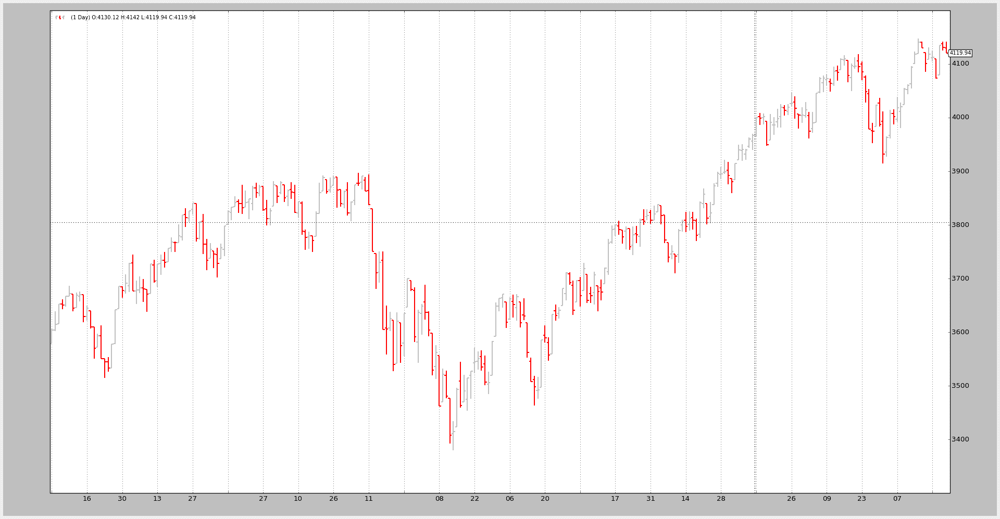

# Pandas 数据源示例

> 原文：[`www.backtrader.com/docu/pandas-datafeed/pandas-datafeed/`](https://www.backtrader.com/docu/pandas-datafeed/pandas-datafeed/)

注意

必须安装 `pandas` 及其依赖项

支持 [Pandas](http://pandas.pydata.org) Dataframes 似乎是许多人关注的问题，他们依赖于已经可用的用于不同数据源（包括 CSV）的解析代码以及 Pandas 提供的其他功能。

数据源的重要声明。

注意

这些只是声明。不要盲目复制此代码。请参见下面示例中的实际用法

```py
class PandasData(feed.DataBase):
  '''
 The ``dataname`` parameter inherited from ``feed.DataBase`` is the pandas
 DataFrame
 '''

    params = (
        # Possible values for datetime (must always be present)
        #  None : datetime is the "index" in the Pandas Dataframe
        #  -1 : autodetect position or case-wise equal name
        #  >= 0 : numeric index to the colum in the pandas dataframe
        #  string : column name (as index) in the pandas dataframe
        ('datetime', None),

        # Possible values below:
        #  None : column not present
        #  -1 : autodetect position or case-wise equal name
        #  >= 0 : numeric index to the colum in the pandas dataframe
        #  string : column name (as index) in the pandas dataframe
        ('open', -1),
        ('high', -1),
        ('low', -1),
        ('close', -1),
        ('volume', -1),
        ('openinterest', -1),
    )
```

上述从 `PandasData` 类中摘录的片段显示了键：

+   实例化期间传递给类的 `dataname` 参数保存了 Pandas Dataframe

    此参数从基类 `feed.DataBase` 继承

+   新参数使用 `DataSeries` 中常规字段的名称，并遵循以下约定

    +   `datetime`（默认值：无）

    +   None：datetime 是 Pandas Dataframe 中的“索引”

    +   -1：自动检测位置或大小写相等的名称

    +   > = 0：对应 pandas 数据帧中的列的数字索引

    +   string：pandas 数据帧中的列名（作为索引）

    +   `open`, `high`, `low`, `high`, `close`, `volume`, `openinterest`（默认值：全部为 -1）

    +   None：列不存在

    +   -1：自动检测位置或大小写相等的名称

    +   > = 0：对应 pandas 数据帧中的列的数字索引

    +   string：pandas 数据帧中的列名（作为索引）

一个小示例应该能够加载标准的 2006 示例，已由 `Pandas` 解析，而不是直接由 `backtrader` 解析

运行示例以使用 CSV 数据中的现有“标题”：

```py
$ ./panda-test.py
--------------------------------------------------
               Open     High      Low    Close  Volume  OpenInterest
Date
2006-01-02  3578.73  3605.95  3578.73  3604.33       0             0
2006-01-03  3604.08  3638.42  3601.84  3614.34       0             0
2006-01-04  3615.23  3652.46  3615.23  3652.46       0             0
```

相同但告诉脚本跳过标题：

```py
$ ./panda-test.py --noheaders
--------------------------------------------------
                  1        2        3        4  5  6
0
2006-01-02  3578.73  3605.95  3578.73  3604.33  0  0
2006-01-03  3604.08  3638.42  3601.84  3614.34  0  0
2006-01-04  3615.23  3652.46  3615.23  3652.46  0  0
```

第 2 次运行使用的是 tells `pandas.read_csv`：

+   跳过第一行输入（将 `skiprows` 关键字参数设置为 1）

+   不查找标题行（将 `header` 关键字参数设置为 None）

`backtrader` 对 Pandas 的支持尝试自动检测是否使用了列名，否则使用数字索引，并相应地采取行动，尝试提供最佳匹配。

下图是对成功的致敬。Pandas Dataframe 已正确加载（在两种情况下）



测试的示例代码。

```py
from __future__ import (absolute_import, division, print_function,
                        unicode_literals)

import argparse

import backtrader as bt
import backtrader.feeds as btfeeds

import pandas

def runstrat():
    args = parse_args()

    # Create a cerebro entity
    cerebro = bt.Cerebro(stdstats=False)

    # Add a strategy
    cerebro.addstrategy(bt.Strategy)

    # Get a pandas dataframe
    datapath = ('../../datas/2006-day-001.txt')

    # Simulate the header row isn't there if noheaders requested
    skiprows = 1 if args.noheaders else 0
    header = None if args.noheaders else 0

    dataframe = pandas.read_csv(datapath,
                                skiprows=skiprows,
                                header=header,
                                parse_dates=True,
                                index_col=0)

    if not args.noprint:
        print('--------------------------------------------------')
        print(dataframe)
        print('--------------------------------------------------')

    # Pass it to the backtrader datafeed and add it to the cerebro
    data = bt.feeds.PandasData(dataname=dataframe)

    cerebro.adddata(data)

    # Run over everything
    cerebro.run()

    # Plot the result
    cerebro.plot(style='bar')

def parse_args():
    parser = argparse.ArgumentParser(
        description='Pandas test script')

    parser.add_argument('--noheaders', action='store_true', default=False,
                        required=False,
                        help='Do not use header rows')

    parser.add_argument('--noprint', action='store_true', default=False,
                        help='Print the dataframe')

    return parser.parse_args()

if __name__ == '__main__':
    runstrat()
```
