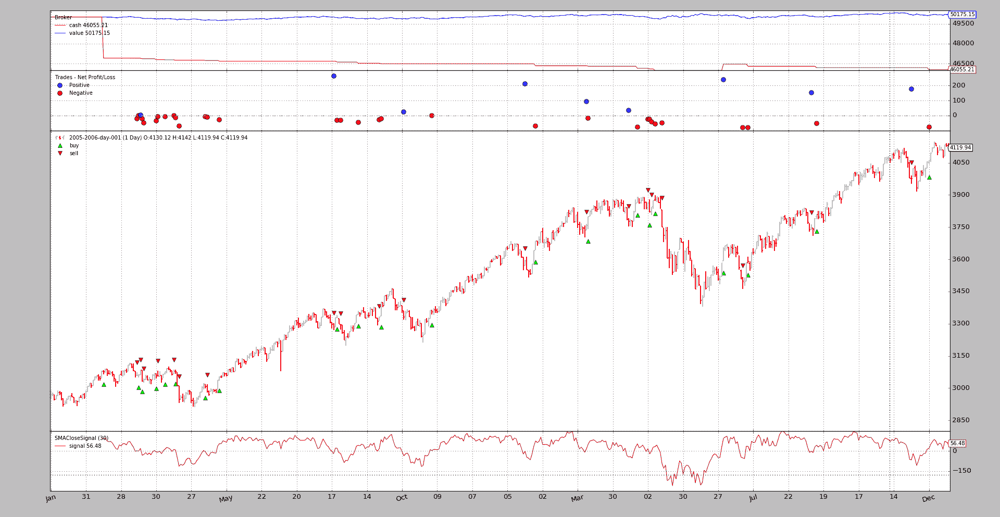
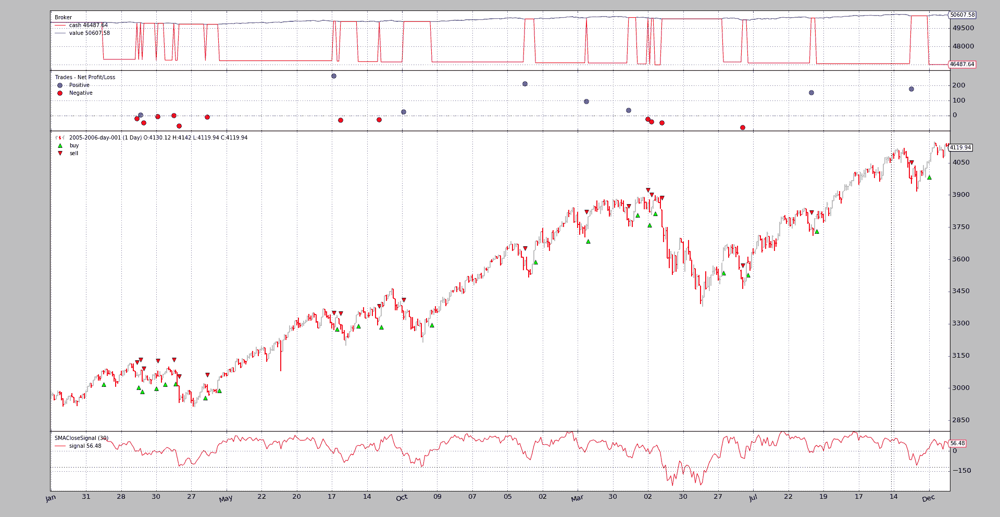
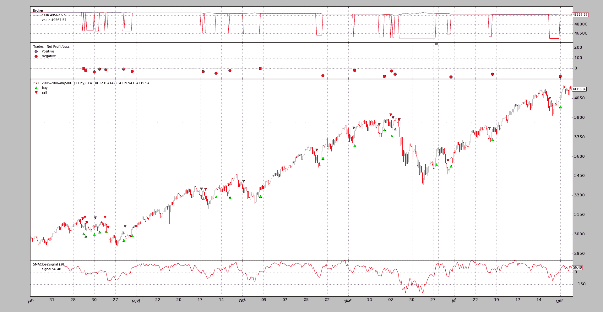
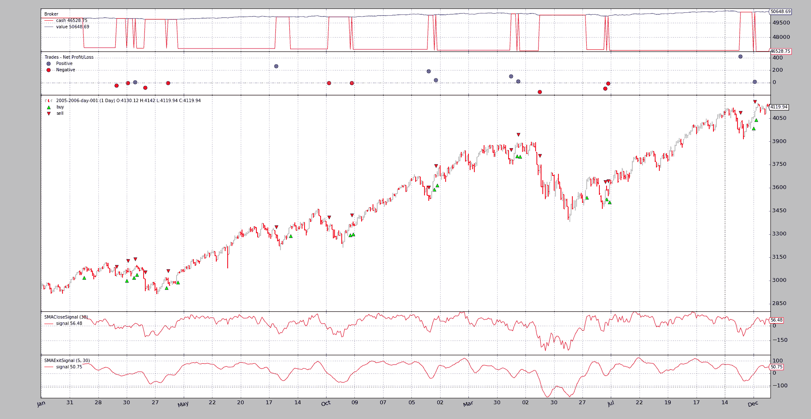

# 带信号的策略

> 原文：[`www.backtrader.com/docu/signal_strategy/signal_strategy/`](https://www.backtrader.com/docu/signal_strategy/signal_strategy/)

也可以操作*backtrader*而不必编写*Strategy*。尽管这是首选方法，但由于构成机器的对象层次结构，使用*Signals*也是可能的。

快速摘要：

+   不是编写*Strategy*类，实例化*Indicators*，编写*buy/sell*逻辑...

+   最终用户添加*Signals*（无论如何是指示器），其余操作由后台完成

快速示例：

```py
`import backtrader as bt

data = bt.feeds.OneOfTheFeeds(dataname='mydataname')
cerebro.adddata(data)

cerebro.add_signal(bt.SIGNAL_LONGSHORT, MySignal)
cerebro.run()` 
```

完成！。

当然，*Signal*本身是缺失的。让我们定义一个非常愚蠢的*Signal*，产生：

+   如果`close`价格高于*Simple Moving Average*，则发出`Long`指示。

+   如果`close`价格低于*Simple Moving Average*，则发出`Short`指示。

定义为：

```py
`class MySignal(bt.Indicator):
    lines = ('signal',)
    params = (('period', 30),)

    def __init__(self):
        self.lines.signal = self.data - bt.indicators.SMA(period=self.p.period)` 
```

现在真的完成了。当执行`run`时，*Cerebro*将负责实例化一个特殊的*Strategy*实例，该实例知道如何处理*Signals*。

## 初始*FAQ*

+   *买*/*卖*操作的数量如何确定？

    *cerebro*实例自动为策略添加了`FixedSize`大小器。最终用户可以使用`cerebro.addsizer`更改大小器以改变策略。

+   订单是如何执行的？

    执行类型为`Market`，有效性为*Good Until Canceled*。

## *Signals*技术细节

从技术和理论角度描述如下：

+   当被调用时返回另一个*对象*的可调用对象（仅一次）

    这在大多数情况下是类的实例化，但不一定是。

+   支持`__getitem__`接口。唯一请求的*key*/*index*将为`0`。

从实际角度和上述示例来看，*Signal*是：

+   来自*backtrader*生态系统的*lines*对象，主要是*Indicator*。

    当使用其他*Indicators*时，如示例中使用*Simple Moving Average*时，这很有帮助。

## *信号* 指示

当用`signal[0]`查询*signals*时，*signals*提供指示，意思是：

+   `> 0` -> `long indication`

+   `< 0` -> `short indication`

+   `== 0` -> *无指示*

该示例对`self.data - SMA`进行了简单的算术运算，并且：

+   当`data`高于`SMA`时发出`long indication`。

+   当`data`低于`SMA`时发出`short indication`。

注意

当 `data` 没有指定特定的价格字段时，参考价格为 `close` 价格。

## *信号*类型

如上例所示，下面指示的*常量*直接来自主要的*backtrader*模块，如下所示：

```py
`import backtrader as bt

bt.SIGNAL_LONG` 
```

共有 5 种*Signals*类型，分为 2 组。

**主要组**：

+   `LONGSHORT`: 此信号的`long`和`short`指示均被采纳。

+   `LONG`：

    +   采用`long`指示进入`long`

    +   采用`short`指示来*close*长头寸。但是：

    +   如果系统中存在`LONGEXIT`（见下文）信号，则将用于退出长头寸

    +   如果有`SHORT`信号可用，但没有`LONGEXIT`可用，则会在开放`short`之前关闭`long`。

+   `SHORT`：

    +   `short`指示用于开空头寸

    +   `long`指示用于*关闭*空头寸。但是：

    +   如果系统中存在一个`SHORTEXIT`（见下文）信号，它将被用于退出短头寸

    +   如果有`LONG`信号可用且没有`SHORTEXIT`可用，则将用于在开仓`long`之前关闭`short`

**退出组**：

这两个信号旨在覆盖其他信号，并提供退出`long` / `short`头寸的标准

+   `LONGEXIT`：`short`指示用于退出`long`头寸

+   `SHORTEXIT`：*长*指示被视为退出*短*头寸

## 累积和订单并发

上面显示的示例*信号*会定期发出*长*和*短*指示，因为它只是从`close`价格中减去`SMA`值，而这总是会是`> 0`和`< 0`（数学上可能为`0`，但实际上不太可能发生）

这将导致连续生成*订单*，会产生 2 种情况：

+   `Accumulation`：即使已经在市场上，*信号*也会产生新订单，这将增加市场上的仓位

+   `Concurrency`：新订单将生成，而无需等待其他订单的执行

为了避免这种情况，默认行为是：

+   *不累积*

+   *不允许并发*

如果希望这两种行为之一，可以通过`cerebro`控制：

+   `cerebro.signal_accumulate(True)`（或`False`以重新禁用它）

+   `cerebro.signal_concurrency(True)`（或`False`以重新禁用它）

## 示例

*backtrader*源代码包含一个用于测试功能的示例。

要使用的主要信号。

```py
`class SMACloseSignal(bt.Indicator):
    lines = ('signal',)
    params = (('period', 30),)

    def __init__(self):
        self.lines.signal = self.data - bt.indicators.SMA(period=self.p.period)` 
```

并且在指定选项的情况下*退出信号*

```py
`class SMAExitSignal(bt.Indicator):
    lines = ('signal',)
    params = (('p1', 5), ('p2', 30),)

    def __init__(self):
        sma1 = bt.indicators.SMA(period=self.p.p1)
        sma2 = bt.indicators.SMA(period=self.p.p2)
        self.lines.signal = sma1 - sma2` 
```

### 第一次运行：长和短

```py
`$ ./signals-strategy.py --plot --signal longshort` 
```

输出



注意：

+   *信号*被绘制出来。这是正常的，因为它只是一个指标，适用于它的绘图规则

+   策略实际上是`long`和`short`的。这可以看出，因为*现金*水平从未回到*值*水平

+   旁注：即使是一个愚蠢的想法...（没有佣金）策略也没有亏钱...

### 第二次运行：仅限长头寸

```py
`$ ./signals-strategy.py --plot --signal longonly` 
```

输出



注意：

+   在每次*卖出*后，现金水平都会回到*值*水平，这意味着策略已经退出市场

+   旁注：再次没有损失金钱……

### 第三次运行：仅限短头寸

```py
`$ ./signals-strategy.py --plot --signal shortonly` 
```

输出



注意：

+   第 1 次操作是*卖出*，符合预期，并且发生在上述两个示例中的第 1 次操作之后。只有在`close`低于`SMA`并且简单的减法得到负数时才会发生

+   在每次*买入*后，现金水平都会回到*值*水平，这意味着策略已经退出市场

+   旁注：最终系统亏损

### 第四次运行：长+长退出

```py
`$ ./signals-strategy.py --plot --signal longonly --exitsignal longexit` 
```

输出



注意：

+   许多交易都是相同的，但有些会在快速移动平均线在*退出*信号中向下穿过慢速移动平均线时中断

+   该系统展示了其*仅做多*属性，现金在每次交易结束时的价值。

+   旁注：再次赚钱……甚至有些修改后的交易也能获利

### 使用方法

```py
`$ ./signals-strategy.py --help
usage: signals-strategy.py [-h] [--data DATA] [--fromdate FROMDATE]
                           [--todate TODATE] [--cash CASH]
                           [--smaperiod SMAPERIOD] [--exitperiod EXITPERIOD]
                           [--signal {longshort,longonly,shortonly}]
                           [--exitsignal {longexit,shortexit}]
                           [--plot [kwargs]]

Sample for Signal concepts

optional arguments:
  -h, --help            show this help message and exit
  --data DATA           Specific data to be read in (default:
                        ../../datas/2005-2006-day-001.txt)
  --fromdate FROMDATE   Starting date in YYYY-MM-DD format (default: None)
  --todate TODATE       Ending date in YYYY-MM-DD format (default: None)
  --cash CASH           Cash to start with (default: 50000)
  --smaperiod SMAPERIOD
                        Period for the moving average (default: 30)
  --exitperiod EXITPERIOD
                        Period for the exit control SMA (default: 5)
  --signal {longshort,longonly,shortonly}
                        Signal type to use for the main signal (default:
                        longshort)
  --exitsignal {longexit,shortexit}
                        Signal type to use for the exit signal (default: None)
  --plot [kwargs], -p [kwargs]
                        Plot the read data applying any kwargs passed For
                        example: --plot style="candle" (to plot candles)
                        (default: None)` 
```

### 该代码

```py
`from __future__ import (absolute_import, division, print_function,
                        unicode_literals)

import argparse
import collections
import datetime

import backtrader as bt

MAINSIGNALS = collections.OrderedDict(
    (('longshort', bt.SIGNAL_LONGSHORT),
     ('longonly', bt.SIGNAL_LONG),
     ('shortonly', bt.SIGNAL_SHORT),)
)

EXITSIGNALS = {
    'longexit': bt.SIGNAL_LONGEXIT,
    'shortexit': bt.SIGNAL_LONGEXIT,
}

class SMACloseSignal(bt.Indicator):
    lines = ('signal',)
    params = (('period', 30),)

    def __init__(self):
        self.lines.signal = self.data - bt.indicators.SMA(period=self.p.period)

class SMAExitSignal(bt.Indicator):
    lines = ('signal',)
    params = (('p1', 5), ('p2', 30),)

    def __init__(self):
        sma1 = bt.indicators.SMA(period=self.p.p1)
        sma2 = bt.indicators.SMA(period=self.p.p2)
        self.lines.signal = sma1 - sma2

def runstrat(args=None):
    args = parse_args(args)

    cerebro = bt.Cerebro()
    cerebro.broker.set_cash(args.cash)

    dkwargs = dict()
    if args.fromdate is not None:
        fromdate = datetime.datetime.strptime(args.fromdate, '%Y-%m-%d')
        dkwargs['fromdate'] = fromdate

    if args.todate is not None:
        todate = datetime.datetime.strptime(args.todate, '%Y-%m-%d')
        dkwargs['todate'] = todate

    # if dataset is None, args.data has been given
    data = bt.feeds.BacktraderCSVData(dataname=args.data, **dkwargs)
    cerebro.adddata(data)

    cerebro.add_signal(MAINSIGNALS[args.signal],
                       SMACloseSignal, period=args.smaperiod)

    if args.exitsignal is not None:
        cerebro.add_signal(EXITSIGNALS[args.exitsignal],
                           SMAExitSignal,
                           p1=args.exitperiod,
                           p2=args.smaperiod)

    cerebro.run()
    if args.plot:
        pkwargs = dict(style='bar')
        if args.plot is not True:  # evals to True but is not True
            npkwargs = eval('dict(' + args.plot + ')')  # args were passed
            pkwargs.update(npkwargs)

        cerebro.plot(**pkwargs)

def parse_args(pargs=None):

    parser = argparse.ArgumentParser(
        formatter_class=argparse.ArgumentDefaultsHelpFormatter,
        description='Sample for Signal concepts')

    parser.add_argument('--data', required=False,
                        default='../../datas/2005-2006-day-001.txt',
                        help='Specific data to be read in')

    parser.add_argument('--fromdate', required=False, default=None,
                        help='Starting date in YYYY-MM-DD format')

    parser.add_argument('--todate', required=False, default=None,
                        help='Ending date in YYYY-MM-DD format')

    parser.add_argument('--cash', required=False, action='store',
                        type=float, default=50000,
                        help=('Cash to start with'))

    parser.add_argument('--smaperiod', required=False, action='store',
                        type=int, default=30,
                        help=('Period for the moving average'))

    parser.add_argument('--exitperiod', required=False, action='store',
                        type=int, default=5,
                        help=('Period for the exit control SMA'))

    parser.add_argument('--signal', required=False, action='store',
                        default=MAINSIGNALS.keys()[0], choices=MAINSIGNALS,
                        help=('Signal type to use for the main signal'))

    parser.add_argument('--exitsignal', required=False, action='store',
                        default=None, choices=EXITSIGNALS,
                        help=('Signal type to use for the exit signal'))

    # Plot options
    parser.add_argument('--plot', '-p', nargs='?', required=False,
                        metavar='kwargs', const=True,
                        help=('Plot the read data applying any kwargs passed\n'
                              '\n'
                              'For example:\n'
                              '\n'
                              '  --plot style="candle" (to plot candles)\n'))

    if pargs is not None:
        return parser.parse_args(pargs)

    return parser.parse_args()

if __name__ == '__main__':
    runstrat()` 
```
