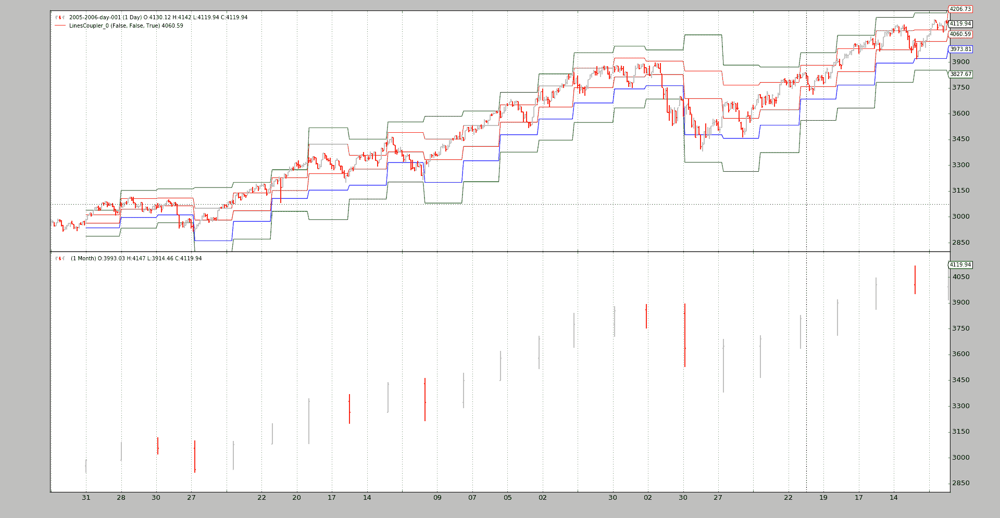

# 指标中的混合时间框架

> 原文：[`www.backtrader.com/docu/mixing-timeframes/indicators-mixing-timeframes/`](https://www.backtrader.com/docu/mixing-timeframes/indicators-mixing-timeframes/)

[发布 1.3.0.92](https://github.com/mementum/backtrader/releases/tag/1.3.0.92) 带来了可能性，使不同时间框架的数据（来自数据源和/或指标）混合。

背景：*指标是聪明的愚蠢对象。*

+   他们之所以聪明，是因为他们能进行复杂的计算。

+   他们之所以愚蠢，是因为他们在没有了解提供计算数据的来源的情况下进行操作

就这样：

+   如果提供值的数据源具有不同的时间框架，在`Cerebro`引擎内部的不同长度，指标将会中断。

计算示例，在该示例中，`data0` 的时间框架为天，而 `data1` 的时间框架为`月`：

```py
pivotpoint = btind.PivotPoint(self.data1)
sellsignal = self.data0.close < pivotpoint.s1
```

在这里寻找*卖出信号*当收盘价低于`s1`线时（*1^(st) support*）

注意

`PivotPoint`的定义上在一个较大的时间框架内运行

这将导致以下错误：

```py
return self.array[self.idx + ago]
IndexError: array index out of range
```

出于一个很好的原因：`self.data.close` 提供了来自第一个瞬间的值，但是`PivotPoint`（因此`s1`线）只会在一个**完整的月份**过去后才会提供值，大致相当于`self.data0.close`的 22 个值。在这 22 个 *收盘价* 中还没有`s1`的值，并且尝试从底层数组中获取它失败。

*Lines* 对象支持 `(ago)` 操作符（*Python* 中的 `__call__` 特殊方法）以提供其自身的延迟版本：

```py
close1 = self.data.close(-1)
```

在此示例中，对象 `close1`（通过`[0]`访问）始终包含由`close`交付的前一个值（`-1`）。语法已经被重用以适应不同的时间框架。让我们重写上面的`pivotpoint`片段：

```py
pivotpoint = btind.PivotPoint(self.data1)
sellsignal = self.data0.close < pivotpoint.s1()
```

注意看`()` 是如何执行的，不带参数（在后台提供一个`None`）。以下是正在发生的：

+   `pivotpoint.s1()` 返回一个内部的 `LinesCoupler` 对象，该对象遵循较大范围的节奏。该耦合器用最新交付的真实`s1`值填充自己（从`NaN`的默认值开始）

但是要使魔术生效，需要一些额外的东西。 `Cerebro` 必须以以下方式创建：

```py
cerebro = bt.Cerebro(runonce=False)
```

或者执行：

```py
cerebro.run(runonce=False)
```

在这种模式下，指标和晚评估的自动 *lines* 对象是逐步执行而不是在紧密循环中执行。这使整个操作变慢，但这使其**可能**

上面断开的底部的示例脚本，现在可以运行：

```py
$ ./mixing-timeframes.py
```

有输出：

```py
0021,0021,0001,2005-01-31,2984.75,2935.96,0.00
0022,0022,0001,2005-02-01,3008.85,2935.96,0.00
...
0073,0073,0003,2005-04-15,3013.89,3010.76,0.00
0074,0074,0003,2005-04-18,2947.79,3010.76,1.00
...
```

在第 74 行，发生了`close < s1`的第 1 个实例。

脚本还提供了对其他可能性的见解：*耦合指标的所有线*。之前我们有：

```py
self.sellsignal = self.data0.close < pp.s1()
```

作为替代：

```py
pp1 = pp()
self.sellsignal = self.data0.close < pp1.s1
```

现在整个`PivotPoint`指标已经耦合，可以访问其任何线（即 `p`, `r1`, `r2`, `s1`, `s2`）。脚本只对`s1`感兴趣，并且访问是直接的。:

```py
$ ./mixing-timeframes.py --multi
```

输出：

```py
0021,0021,0001,2005-01-31,2984.75,2935.96,0.00
0022,0022,0001,2005-02-01,3008.85,2935.96,0.00
...
0073,0073,0003,2005-04-15,3013.89,3010.76,0.00
0074,0074,0003,2005-04-18,2947.79,3010.76,1.00
...
```

这里没有什么意外。与以前相同。甚至可以绘制“耦合”对象：

```py
$ ./mixing-timeframes.py --multi --plot
```



## 完整的耦合语法

对于具有多行的*lines*对象（例如*Indicators*，如`PivotPoint`）：

+   `obj(clockref=None, line=-1)`

    +   `clockref` 如果`clockref`是`None`，则周围的对象（在示例中为`Strategy`）将是调整较大时间框架（例如：`Months`）到较小/更快时间框架（例如：`Days`）的参考

    如果需要，可以使用另一个参考

    `line`

    ```py
    * If the default `-1` is given, all *lines* are coupled.

    * If another integer (for example, `0` or `1`) a single line will be
      coupled and fetched by index (from `obj.lines[x]`)

    * If a string is passed, the line will be fetched by name.

      In the sample, the following could have been done:

      ```python

    coupled_s1 = pp(line='s1')

    ```py` 
    ```

对于具有单行的*lines*对象（例如来自指标`PivotPoint`的线`s1`）：

+   `obj(clockref=None)`（参见上文的`clockref`）

## 结论

在常规`()`语法中集成，来自不同时间框架的数据馈送可以在指标中混合使用，始终注意`cerebro`需要被实例化或者创建，并且`runonce=False`。

## 脚本代码和用法

在`backtrader`源代码中作为示例提供。用法：

```py
$ ./mixing-timeframes.py --help
usage: mixing-timeframes.py [-h] [--data DATA] [--multi] [--plot]

Sample for pivot point and cross plotting

optional arguments:
  -h, --help   show this help message and exit
  --data DATA  Data to be read in (default: ../../datas/2005-2006-day-001.txt)
  --multi      Couple all lines of the indicator (default: False)
  --plot       Plot the result (default: False)
```

代码：

```py
from __future__ import (absolute_import, division, print_function,
                        unicode_literals)

import argparse

import backtrader as bt
import backtrader.feeds as btfeeds
import backtrader.indicators as btind
import backtrader.utils.flushfile

class St(bt.Strategy):
    params = dict(multi=True)

    def __init__(self):
        self.pp = pp = btind.PivotPoint(self.data1)
        pp.plotinfo.plot = False  # deactivate plotting

        if self.p.multi:
            pp1 = pp()  # couple the entire indicators
            self.sellsignal = self.data0.close < pp1.s1
        else:
            self.sellsignal = self.data0.close < pp.s1()

    def next(self):
        txt = ','.join(
            ['%04d' % len(self),
             '%04d' % len(self.data0),
             '%04d' % len(self.data1),
             self.data.datetime.date(0).isoformat(),
             '%.2f' % self.data0.close[0],
             '%.2f' % self.pp.s1[0],
             '%.2f' % self.sellsignal[0]])

        print(txt)

def runstrat():
    args = parse_args()

    cerebro = bt.Cerebro()
    data = btfeeds.BacktraderCSVData(dataname=args.data)
    cerebro.adddata(data)
    cerebro.resampledata(data, timeframe=bt.TimeFrame.Months)

    cerebro.addstrategy(St, multi=args.multi)

    cerebro.run(stdstats=False, runonce=False)
    if args.plot:
        cerebro.plot(style='bar')

def parse_args():
    parser = argparse.ArgumentParser(
        formatter_class=argparse.ArgumentDefaultsHelpFormatter,
        description='Sample for pivot point and cross plotting')

    parser.add_argument('--data', required=False,
                        default='../../datas/2005-2006-day-001.txt',
                        help='Data to be read in')

    parser.add_argument('--multi', required=False, action='store_true',
                        help='Couple all lines of the indicator')

    parser.add_argument('--plot', required=False, action='store_true',
                        help=('Plot the result'))

    return parser.parse_args()

if __name__ == '__main__':
    runstrat()
```
