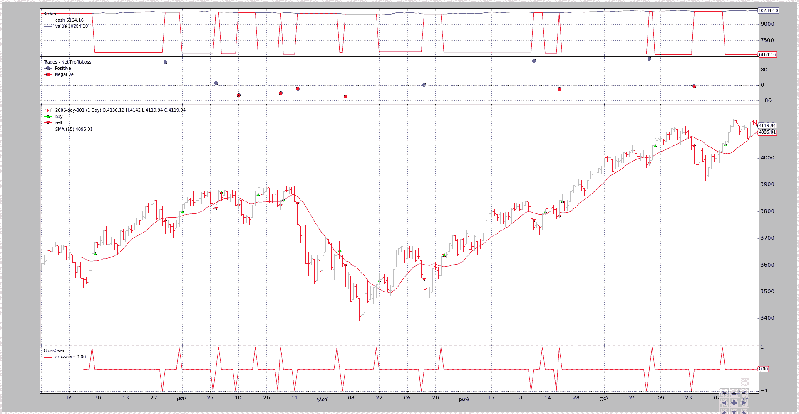
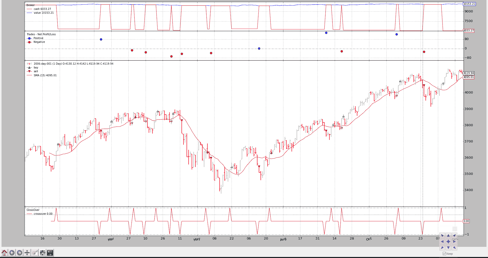
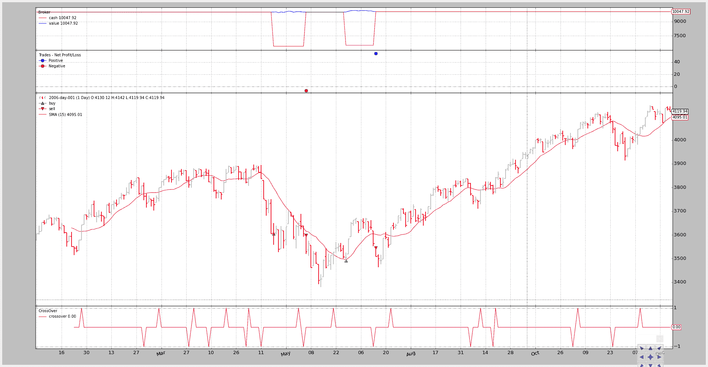
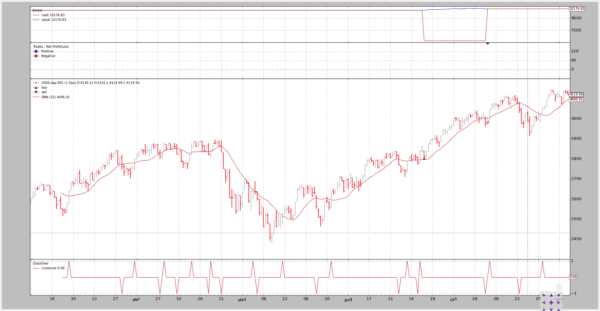
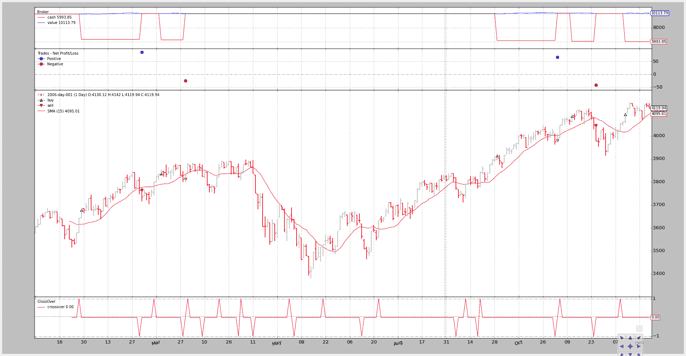
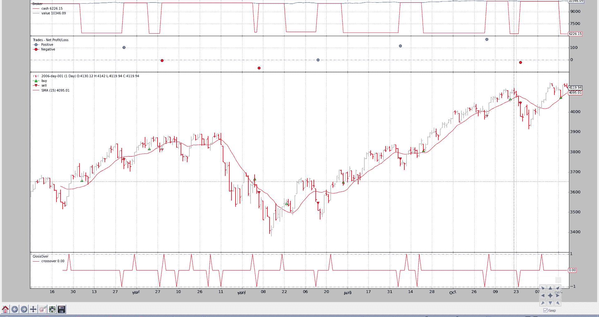

# 订单管理和执行

> 原文：[`www.backtrader.com/docu/order-creation-execution/order-creation-execution/`](https://www.backtrader.com/docu/order-creation-execution/order-creation-execution/)

如果订单不能模拟，回测和因此`backtrader`将不完整。为此，平台提供了以下功能。

对于订单管理的 3 个基本原则：

+   `buy`

+   `sell`

+   `cancel`

注意

显然，`update`原语是一种逻辑，但常识告诉我们，这种方法主要由使用判断性交易方法的手动操作者使用。

对于订单执行逻辑，有以下执行类型：

+   `Market`

+   `Close`

+   `Limit`

+   `Stop`

+   `StopLimit`

## 订单管理

一些例子：

```py
# buy the main date, with sizer default stake, Market order
order = self.buy()

# Market order - valid will be "IGNORED"
order = self.buy(valid=datetime.datetime.now() + datetime.timedelta(days=3))

# Market order - price will be IGNORED
order = self.buy(price=self.data.close[0] * 1.02)

# Market order - manual stake
order = self.buy(size=25)

# Limit order - want to set the price and can set a validity
order = self.buy(exectype=Order.Limit,
                 price=self.data.close[0] * 1.02,
                 valid=datetime.datetime.now() + datetime.timedelta(days=3)))

# StopLimit order - want to set the price, price limit
order = self.buy(exectype=Order.StopLimit,
                 price=self.data.close[0] * 1.02,
                 plimit=self.data.close[0] * 1.07)

# Canceling an existing order
self.broker.cancel(order)
```

注意

所有订单类型都可以通过创建一个`Order`实例（或其子类之一），然后通过以下方式传递给经纪人：

```py
order = self.broker.submit(order)
```

注意

`broker`本身有`buy`和`sell`的基本原则，但对于默认参数要求更严格。

## 订单执行逻辑

经纪人对订单执行有两个主要准则（假设？）

+   当前数据已经发生，不能用于执行订单。

    如果策略中的逻辑是这样的：

    ```py
     `if self.data.close > self.sma:  # where sma is a Simple Moving Average
         self.buy()` 
    ```

    期望不能是订单将以正在逻辑中检查的`close`价格执行，因为它已经发生。

    订单可以在下一个一组开/高/低/收价格点的范围内（以及订单中规定的条件）第一次执行

+   交易量不起作用

    如果交易者选择非流动资产或者精确地击中价格柱的极端点（高/低），它在实际交易中确实会发生。

    但是击中高/低点是很少发生的（如果你这样做...你就不需要`backtrader`），并且所选择的资产将有足够的流动性来吸收任何常规交易的订单

### 市场

执行：

+   下一个一组开/高/低/收价格的开盘价（通常称为*柱*）

原因：

+   如果逻辑在时间点 X 执行并发出`Market`订单，那么接下来会发生的价格是即将到来的`open`价格

注意

这个订单总是执行，并且忽略了用于创建它的`price`和`valid`参数

### Close

执行：

+   当下一个柱子实际关闭时，使用下一个柱子的`close`价格

原因：

+   大多数**回测**数据源已经包含了**关闭**的柱子，订单将立即以下一个柱子的`close`价格执行。日线数据源是最常见的例子。

    但是系统可以提供“tick”价格，并且实际柱（时间/日期方面）会不断更新新的 tick，而不会实际移动到**下一个**柱（因为时间和/或日期尚未更改）

    只有当时间或日期发生变化时，柱子才会真正关闭并执行订单

### Limit

执行：

+   订单创建时设置的`price`，如果`data`触及它，从下一个价格柱开始。

    如果设置了`valid`且时间点已到达，则订单将被取消

价格匹配：

+   `backtrader`尝试为`Limit`订单提供**最逼真的执行价格**。

    使用 4 个价格点（开盘价/最高价/最低价/收盘价），可以部分推断请求的`价格`是否可以改善。

    对于`Buy`订单

    +   情况 1：

        如果柱的`开盘`价低于限价，则订单立即以`开盘`价执行。订单已在会话开启阶段清算

    +   情况 2：

        如果`开盘`价没有穿过限价但`最低`价低于限价，则在会话期间已见到限价，订单可以执行

    对于`Sell`订单，逻辑显然是相反的。

### 停止

执行：

+   如果`数据`触及触发`价格`，则设置在订单创建时，从下一个价格柱开始。

    如果设置了`valid`且时间点已到达，则订单将被取消

价格匹配：

+   `backtrader`尝试为`Stop`订单提供**最逼真的触发价格**。

    使用 4 个价格点（开盘价/最高价/最低价/收盘价），可以部分推断请求的`价格`是否可以改善。

    对于`Buy`的`\`Stop`orders`

    +   情况 1：

        如果柱的`开盘`价高于止损价，则订单立即以`开盘`价执行。

        旨在在价格向上移动反对现有空头头寸时停止损失

    +   情况 2：

        如果`开盘`价没有穿过止损价但`最高`价高于止损价，则在会话期间已见到止损价，订单可以执行

    对于`Sell`的`Stop`订单，逻辑显然是相反的。

### 停止限价

执行：

+   触发`价格`设置订单，从下一个价格柱开始。

价格匹配：

+   **触发**：使用`Stop`匹配逻辑（但仅触发并将订单转换为`Limit`订单）

+   **限价**：使用`Limit`价格匹配逻辑

## 一些样本

一如既往，图片（带代码）价值数百万长的解释。请注意，片段集中在订单创建部分。完整代码在底部。

使用*价格在简单移动平均线上/下方关闭*策略来生成买入/卖出信号

信号在图表底部可见：使用交叉指示器的`CrossOver`。

将生成的“买入”订单的参考保留，以允许系统中最多同时存在一个订单。

### 执行类型：市价

在图表中看到，订单是在信号生成后的一个价格柱后执行的，使用开盘价。

```py
 `if self.p.exectype == 'Market':
                self.buy(exectype=bt.Order.Market)  # default if not given

                self.log('BUY CREATE, exectype Market, price %.2f' %
                         self.data.close[0])
```

输出图表。



命令行和输出：

```py
$ ./order-execution-samples.py --exectype Market
2006-01-26T23:59:59+00:00, BUY CREATE, exectype Market, price 3641.42
2006-01-26T23:59:59+00:00, ORDER ACCEPTED/SUBMITTED
2006-01-27T23:59:59+00:00, BUY EXECUTED, Price: 3643.35, Cost: 3643.35, Comm 0.00
2006-03-02T23:59:59+00:00, SELL CREATE, 3763.73
2006-03-02T23:59:59+00:00, ORDER ACCEPTED/SUBMITTED
2006-03-03T23:59:59+00:00, SELL EXECUTED, Price: 3763.95, Cost: 3763.95, Comm 0.00
...
...
2006-12-11T23:59:59+00:00, BUY CREATE, exectype Market, price 4052.89
2006-12-11T23:59:59+00:00, ORDER ACCEPTED/SUBMITTED
2006-12-12T23:59:59+00:00, BUY EXECUTED, Price: 4052.55, Cost: 4052.55, Comm 0.00
```

### 执行类型：关闭

现在订单也是在信号后一个柱执行的，但是使用收盘价。

```py
 `elif self.p.exectype == 'Close':
                self.buy(exectype=bt.Order.Close)

                self.log('BUY CREATE, exectype Close, price %.2f' %
                         self.data.close[0])
```

输出图表。



命令行和输出：

```py
$ ./order-execution-samples.py --exectype Close
2006-01-26T23:59:59+00:00, BUY CREATE, exectype Close, price 3641.42
2006-01-26T23:59:59+00:00, ORDER ACCEPTED/SUBMITTED
2006-01-27T23:59:59+00:00, BUY EXECUTED, Price: 3685.48, Cost: 3685.48, Comm 0.00
2006-03-02T23:59:59+00:00, SELL CREATE, 3763.73
2006-03-02T23:59:59+00:00, ORDER ACCEPTED/SUBMITTED
2006-03-03T23:59:59+00:00, SELL EXECUTED, Price: 3763.95, Cost: 3763.95, Comm 0.00
...
...
2006-11-06T23:59:59+00:00, BUY CREATE, exectype Close, price 4045.22
2006-11-06T23:59:59+00:00, ORDER ACCEPTED/SUBMITTED
2006-11-07T23:59:59+00:00, BUY EXECUTED, Price: 4072.86, Cost: 4072.86, Comm 0.00
2006-11-24T23:59:59+00:00, SELL CREATE, 4048.16
2006-11-24T23:59:59+00:00, ORDER ACCEPTED/SUBMITTED
2006-11-27T23:59:59+00:00, SELL EXECUTED, Price: 4045.05, Cost: 4045.05, Comm 0.00
2006-12-11T23:59:59+00:00, BUY CREATE, exectype Close, price 4052.89
2006-12-11T23:59:59+00:00, ORDER ACCEPTED/SUBMITTED
2006-12-12T23:59:59+00:00, BUY EXECUTED, Price: 4059.74, Cost: 4059.74, Comm 0.00
```

### 执行类型：限价

在几行之前计算有效性，以防已作为参数传递。

```py
 `if self.p.valid:
                valid = self.data.datetime.date(0) + \
                        datetime.timedelta(days=self.p.valid)
            else:
                valid = None
```

设置了比信号生成价格（信号栏收盘价）低 1%的限价。请注意，这样可以防止上述许多订单被执行。

```py
 `elif self.p.exectype == 'Limit':
                price = self.data.close * (1.0 - self.p.perc1 / 100.0)

                self.buy(exectype=bt.Order.Limit, price=price, valid=valid)

                if self.p.valid:
                    txt = 'BUY CREATE, exectype Limit, price %.2f, valid: %s'
                    self.log(txt % (price, valid.strftime('%Y-%m-%d')))
                else:
                    txt = 'BUY CREATE, exectype Limit, price %.2f'
                    self.log(txt % price)
```

输出图表。



仅发出了 4 个订单。试图捕捉小幅下跌的价格限制完全改变了输出结果。

命令行和输出：

```py
$ ./order-execution-samples.py --exectype Limit --perc1 1
2006-01-26T23:59:59+00:00, BUY CREATE, exectype Limit, price 3605.01
2006-01-26T23:59:59+00:00, ORDER ACCEPTED/SUBMITTED
2006-05-18T23:59:59+00:00, BUY EXECUTED, Price: 3605.01, Cost: 3605.01, Comm 0.00
2006-06-05T23:59:59+00:00, SELL CREATE, 3604.33
2006-06-05T23:59:59+00:00, ORDER ACCEPTED/SUBMITTED
2006-06-06T23:59:59+00:00, SELL EXECUTED, Price: 3598.58, Cost: 3598.58, Comm 0.00
2006-06-21T23:59:59+00:00, BUY CREATE, exectype Limit, price 3491.57
2006-06-21T23:59:59+00:00, ORDER ACCEPTED/SUBMITTED
2006-06-28T23:59:59+00:00, BUY EXECUTED, Price: 3491.57, Cost: 3491.57, Comm 0.00
2006-07-13T23:59:59+00:00, SELL CREATE, 3562.56
2006-07-13T23:59:59+00:00, ORDER ACCEPTED/SUBMITTED
2006-07-14T23:59:59+00:00, SELL EXECUTED, Price: 3545.92, Cost: 3545.92, Comm 0.00
2006-07-24T23:59:59+00:00, BUY CREATE, exectype Limit, price 3596.60
2006-07-24T23:59:59+00:00, ORDER ACCEPTED/SUBMITTED
```

### 执行类型：带有效期的限价

为了不永远等待限价订单，该订单仅在 4（日历）天内有效，而这可能只有在价格对“买入”订单不利时才能执行。

输出图表。



生成了更多订单，但除了一个“买入”订单外，所有订单均已到期，进一步限制了操作数量。

命令行和输出：

```py
$ ./order-execution-samples.py --exectype Limit --perc1 1 --valid 4
2006-01-26T23:59:59+00:00, BUY CREATE, exectype Limit, price 3605.01, valid: 2006-01-30
2006-01-26T23:59:59+00:00, ORDER ACCEPTED/SUBMITTED
2006-01-30T23:59:59+00:00, BUY EXPIRED
2006-03-10T23:59:59+00:00, BUY CREATE, exectype Limit, price 3760.48, valid: 2006-03-14
2006-03-10T23:59:59+00:00, ORDER ACCEPTED/SUBMITTED
2006-03-14T23:59:59+00:00, BUY EXPIRED
2006-03-30T23:59:59+00:00, BUY CREATE, exectype Limit, price 3835.86, valid: 2006-04-03
2006-03-30T23:59:59+00:00, ORDER ACCEPTED/SUBMITTED
2006-04-03T23:59:59+00:00, BUY EXPIRED
2006-04-20T23:59:59+00:00, BUY CREATE, exectype Limit, price 3821.40, valid: 2006-04-24
2006-04-20T23:59:59+00:00, ORDER ACCEPTED/SUBMITTED
2006-04-24T23:59:59+00:00, BUY EXPIRED
2006-05-04T23:59:59+00:00, BUY CREATE, exectype Limit, price 3804.65, valid: 2006-05-08
2006-05-04T23:59:59+00:00, ORDER ACCEPTED/SUBMITTED
2006-05-08T23:59:59+00:00, BUY EXPIRED
2006-06-01T23:59:59+00:00, BUY CREATE, exectype Limit, price 3611.85, valid: 2006-06-05
2006-06-01T23:59:59+00:00, ORDER ACCEPTED/SUBMITTED
2006-06-05T23:59:59+00:00, BUY EXPIRED
2006-06-21T23:59:59+00:00, BUY CREATE, exectype Limit, price 3491.57, valid: 2006-06-25
2006-06-21T23:59:59+00:00, ORDER ACCEPTED/SUBMITTED
2006-06-26T23:59:59+00:00, BUY EXPIRED
2006-07-24T23:59:59+00:00, BUY CREATE, exectype Limit, price 3596.60, valid: 2006-07-28
2006-07-24T23:59:59+00:00, ORDER ACCEPTED/SUBMITTED
2006-07-28T23:59:59+00:00, BUY EXPIRED
2006-09-12T23:59:59+00:00, BUY CREATE, exectype Limit, price 3751.07, valid: 2006-09-16
2006-09-12T23:59:59+00:00, ORDER ACCEPTED/SUBMITTED
2006-09-18T23:59:59+00:00, BUY EXPIRED
2006-09-20T23:59:59+00:00, BUY CREATE, exectype Limit, price 3802.90, valid: 2006-09-24
2006-09-20T23:59:59+00:00, ORDER ACCEPTED/SUBMITTED
2006-09-22T23:59:59+00:00, BUY EXECUTED, Price: 3802.90, Cost: 3802.90, Comm 0.00
2006-11-02T23:59:59+00:00, SELL CREATE, 3974.62
2006-11-02T23:59:59+00:00, ORDER ACCEPTED/SUBMITTED
2006-11-03T23:59:59+00:00, SELL EXECUTED, Price: 3979.73, Cost: 3979.73, Comm 0.00
2006-11-06T23:59:59+00:00, BUY CREATE, exectype Limit, price 4004.77, valid: 2006-11-10
2006-11-06T23:59:59+00:00, ORDER ACCEPTED/SUBMITTED
2006-11-10T23:59:59+00:00, BUY EXPIRED
2006-12-11T23:59:59+00:00, BUY CREATE, exectype Limit, price 4012.36, valid: 2006-12-15
2006-12-11T23:59:59+00:00, ORDER ACCEPTED/SUBMITTED
2006-12-15T23:59:59+00:00, BUY EXPIRED
```

### 执行类型：Stop

设置了比信号价格高 1%的停止价格。这意味着策略只有在信号产生且价格继续上涨时才会购买，这可能被解释为一种强势信号。

这完全改变了执行全景。

```py
 `elif self.p.exectype == 'Stop':
                price = self.data.close * (1.0 + self.p.perc1 / 100.0)

                self.buy(exectype=bt.Order.Stop, price=price, valid=valid)

                if self.p.valid:
                    txt = 'BUY CREATE, exectype Stop, price %.2f, valid: %s'
                    self.log(txt % (price, valid.strftime('%Y-%m-%d')))
                else:
                    txt = 'BUY CREATE, exectype Stop, price %.2f'
                    self.log(txt % price)
```

输出图表。



命令行和输出：

```py
$ ./order-execution-samples.py --exectype Stop --perc1 1
2006-01-26T23:59:59+00:00, BUY CREATE, exectype Stop, price 3677.83
2006-01-26T23:59:59+00:00, ORDER ACCEPTED/SUBMITTED
2006-01-27T23:59:59+00:00, BUY EXECUTED, Price: 3677.83, Cost: 3677.83, Comm 0.00
2006-03-02T23:59:59+00:00, SELL CREATE, 3763.73
2006-03-02T23:59:59+00:00, ORDER ACCEPTED/SUBMITTED
2006-03-03T23:59:59+00:00, SELL EXECUTED, Price: 3763.95, Cost: 3763.95, Comm 0.00
2006-03-10T23:59:59+00:00, BUY CREATE, exectype Stop, price 3836.44
2006-03-10T23:59:59+00:00, ORDER ACCEPTED/SUBMITTED
2006-03-15T23:59:59+00:00, BUY EXECUTED, Price: 3836.44, Cost: 3836.44, Comm 0.00
2006-03-28T23:59:59+00:00, SELL CREATE, 3811.45
2006-03-28T23:59:59+00:00, ORDER ACCEPTED/SUBMITTED
2006-03-29T23:59:59+00:00, SELL EXECUTED, Price: 3811.85, Cost: 3811.85, Comm 0.00
2006-03-30T23:59:59+00:00, BUY CREATE, exectype Stop, price 3913.36
2006-03-30T23:59:59+00:00, ORDER ACCEPTED/SUBMITTED
2006-09-29T23:59:59+00:00, BUY EXECUTED, Price: 3913.36, Cost: 3913.36, Comm 0.00
2006-11-02T23:59:59+00:00, SELL CREATE, 3974.62
2006-11-02T23:59:59+00:00, ORDER ACCEPTED/SUBMITTED
2006-11-03T23:59:59+00:00, SELL EXECUTED, Price: 3979.73, Cost: 3979.73, Comm 0.00
2006-11-06T23:59:59+00:00, BUY CREATE, exectype Stop, price 4085.67
2006-11-06T23:59:59+00:00, ORDER ACCEPTED/SUBMITTED
2006-11-13T23:59:59+00:00, BUY EXECUTED, Price: 4085.67, Cost: 4085.67, Comm 0.00
2006-11-24T23:59:59+00:00, SELL CREATE, 4048.16
2006-11-24T23:59:59+00:00, ORDER ACCEPTED/SUBMITTED
2006-11-27T23:59:59+00:00, SELL EXECUTED, Price: 4045.05, Cost: 4045.05, Comm 0.00
2006-12-11T23:59:59+00:00, BUY CREATE, exectype Stop, price 4093.42
2006-12-11T23:59:59+00:00, ORDER ACCEPTED/SUBMITTED
2006-12-13T23:59:59+00:00, BUY EXECUTED, Price: 4093.42, Cost: 4093.42, Comm 0.00
```

### 执行类型：StopLimit

设置了比信号价格高 1%的停止价格。但限价设置在信号（收盘）价格的 0.5%以上，这可能被解释为：等待力量显现，但不要买入顶峰。等待下跌。

有效期限制为 20（日历）天

```py
 `elif self.p.exectype == 'StopLimit':
                price = self.data.close * (1.0 + self.p.perc1 / 100.0)

                plimit = self.data.close * (1.0 + self.p.perc2 / 100.0)

                self.buy(exectype=bt.Order.StopLimit, price=price, valid=valid,
                         plimit=plimit)

                if self.p.valid:
                    txt = ('BUY CREATE, exectype StopLimit, price %.2f,'
                           ' valid: %s, pricelimit: %.2f')
                    self.log(txt % (price, valid.strftime('%Y-%m-%d'), plimit))
                else:
                    txt = ('BUY CREATE, exectype StopLimit, price %.2f,'
                           ' pricelimit: %.2f')
                    self.log(txt % (price, plimit))
```

输出图表。



命令行和输出：

```py
$ ./order-execution-samples.py --exectype StopLimit --perc1 1 --perc2 0.5 --valid 20
2006-01-26T23:59:59+00:00, BUY CREATE, exectype StopLimit, price 3677.83, valid: 2006-02-15, pricelimit: 3659.63
2006-01-26T23:59:59+00:00, ORDER ACCEPTED/SUBMITTED
2006-02-03T23:59:59+00:00, BUY EXECUTED, Price: 3659.63, Cost: 3659.63, Comm 0.00
2006-03-02T23:59:59+00:00, SELL CREATE, 3763.73
2006-03-02T23:59:59+00:00, ORDER ACCEPTED/SUBMITTED
2006-03-03T23:59:59+00:00, SELL EXECUTED, Price: 3763.95, Cost: 3763.95, Comm 0.00
2006-03-10T23:59:59+00:00, BUY CREATE, exectype StopLimit, price 3836.44, valid: 2006-03-30, pricelimit: 3817.45
2006-03-10T23:59:59+00:00, ORDER ACCEPTED/SUBMITTED
2006-03-21T23:59:59+00:00, BUY EXECUTED, Price: 3817.45, Cost: 3817.45, Comm 0.00
2006-03-28T23:59:59+00:00, SELL CREATE, 3811.45
2006-03-28T23:59:59+00:00, ORDER ACCEPTED/SUBMITTED
2006-03-29T23:59:59+00:00, SELL EXECUTED, Price: 3811.85, Cost: 3811.85, Comm 0.00
2006-03-30T23:59:59+00:00, BUY CREATE, exectype StopLimit, price 3913.36, valid: 2006-04-19, pricelimit: 3893.98
2006-03-30T23:59:59+00:00, ORDER ACCEPTED/SUBMITTED
2006-04-19T23:59:59+00:00, BUY EXPIRED
...
...
2006-12-11T23:59:59+00:00, BUY CREATE, exectype StopLimit, price 4093.42, valid: 2006-12-31, pricelimit: 4073.15
2006-12-11T23:59:59+00:00, ORDER ACCEPTED/SUBMITTED
2006-12-22T23:59:59+00:00, BUY EXECUTED, Price: 4073.15, Cost: 4073.15, Comm 0.00
```

### 测试脚本执行

在命令行`help`中详细说明：

```py
$ ./order-execution-samples.py --help
usage: order-execution-samples.py [-h] [--infile INFILE]
                                  [--csvformat {bt,visualchart,sierrachart,yahoo,yahoo_unreversed}]
                                  [--fromdate FROMDATE] [--todate TODATE]
                                  [--plot] [--plotstyle {bar,line,candle}]
                                  [--numfigs NUMFIGS] [--smaperiod SMAPERIOD]
                                  [--exectype EXECTYPE] [--valid VALID]
                                  [--perc1 PERC1] [--perc2 PERC2]

Showcase for Order Execution Types

optional arguments:
  -h, --help            show this help message and exit
  --infile INFILE, -i INFILE
                        File to be read in
  --csvformat {bt,visualchart,sierrachart,yahoo,yahoo_unreversed},
  -c {bt,visualchart,sierrachart,yahoo,yahoo_unreversed}
                        CSV Format
  --fromdate FROMDATE, -f FROMDATE
                        Starting date in YYYY-MM-DD format
  --todate TODATE, -t TODATE
                        Ending date in YYYY-MM-DD format
  --plot, -p            Plot the read data
  --plotstyle {bar,line,candle}, -ps {bar,line,candle}
                        Plot the read data
  --numfigs NUMFIGS, -n NUMFIGS
                        Plot using n figures
  --smaperiod SMAPERIOD, -s SMAPERIOD
                      Simple Moving Average Period
  --exectype EXECTYPE, -e EXECTYPE
                        Execution Type: Market (default), Close, Limit,
                        Stop, StopLimit
  --valid VALID, -v VALID
                        Validity for Limit sample: default 0 days
  --perc1 PERC1, -p1 PERC1
                        % distance from close price at order creation time for
                        the limit/trigger price in Limit/Stop orders
  --perc2 PERC2, -p2 PERC2
                        % distance from close price at order creation time for
                        the limit price in StopLimit orders
```

### 完整代码

```py
from __future__ import (absolute_import, division, print_function,
                        unicode_literals)

import argparse
import datetime
import os.path
import time
import sys

import backtrader as bt
import backtrader.feeds as btfeeds
import backtrader.indicators as btind

class OrderExecutionStrategy(bt.Strategy):
    params = (
        ('smaperiod', 15),
        ('exectype', 'Market'),
        ('perc1', 3),
        ('perc2', 1),
        ('valid', 4),
    )

    def log(self, txt, dt=None):
  ''' Logging function fot this strategy'''
        dt = dt or self.data.datetime[0]
        if isinstance(dt, float):
            dt = bt.num2date(dt)
        print('%s, %s' % (dt.isoformat(), txt))

    def notify_order(self, order):
        if order.status in [order.Submitted, order.Accepted]:
            # Buy/Sell order submitted/accepted to/by broker - Nothing to do
            self.log('ORDER ACCEPTED/SUBMITTED', dt=order.created.dt)
            self.order = order
            return

        if order.status in [order.Expired]:
            self.log('BUY EXPIRED')

        elif order.status in [order.Completed]:
            if order.isbuy():
                self.log(
                    'BUY EXECUTED, Price: %.2f, Cost: %.2f, Comm %.2f' %
                    (order.executed.price,
                     order.executed.value,
                     order.executed.comm))

            else:  # Sell
                self.log('SELL EXECUTED, Price: %.2f, Cost: %.2f, Comm %.2f' %
                         (order.executed.price,
                          order.executed.value,
                          order.executed.comm))

        # Sentinel to None: new orders allowed
        self.order = None

    def __init__(self):
        # SimpleMovingAverage on main data
        # Equivalent to -> sma = btind.SMA(self.data, period=self.p.smaperiod)
        sma = btind.SMA(period=self.p.smaperiod)

        # CrossOver (1: up, -1: down) close / sma
        self.buysell = btind.CrossOver(self.data.close, sma, plot=True)

        # Sentinel to None: new ordersa allowed
        self.order = None

    def next(self):
        if self.order:
            # An order is pending ... nothing can be done
            return

        # Check if we are in the market
        if self.position:
            # In the maerket - check if it's the time to sell
            if self.buysell < 0:
                self.log('SELL CREATE, %.2f' % self.data.close[0])
                self.sell()

        elif self.buysell > 0:
            if self.p.valid:
                valid = self.data.datetime.date(0) + \
                        datetime.timedelta(days=self.p.valid)
            else:
                valid = None

            # Not in the market and signal to buy
            if self.p.exectype == 'Market':
                self.buy(exectype=bt.Order.Market)  # default if not given

                self.log('BUY CREATE, exectype Market, price %.2f' %
                         self.data.close[0])

            elif self.p.exectype == 'Close':
                self.buy(exectype=bt.Order.Close)

                self.log('BUY CREATE, exectype Close, price %.2f' %
                         self.data.close[0])

            elif self.p.exectype == 'Limit':
                price = self.data.close * (1.0 - self.p.perc1 / 100.0)

                self.buy(exectype=bt.Order.Limit, price=price, valid=valid)

                if self.p.valid:
                    txt = 'BUY CREATE, exectype Limit, price %.2f, valid: %s'
                    self.log(txt % (price, valid.strftime('%Y-%m-%d')))
                else:
                    txt = 'BUY CREATE, exectype Limit, price %.2f'
                    self.log(txt % price)

            elif self.p.exectype == 'Stop':
                price = self.data.close * (1.0 + self.p.perc1 / 100.0)

                self.buy(exectype=bt.Order.Stop, price=price, valid=valid)

                if self.p.valid:
                    txt = 'BUY CREATE, exectype Stop, price %.2f, valid: %s'
                    self.log(txt % (price, valid.strftime('%Y-%m-%d')))
                else:
                    txt = 'BUY CREATE, exectype Stop, price %.2f'
                    self.log(txt % price)

            elif self.p.exectype == 'StopLimit':
                price = self.data.close * (1.0 + self.p.perc1 / 100.0)

                plimit = self.data.close * (1.0 + self.p.perc2 / 100.0)

                self.buy(exectype=bt.Order.StopLimit, price=price, valid=valid,
                         plimit=plimit)

                if self.p.valid:
                    txt = ('BUY CREATE, exectype StopLimit, price %.2f,'
                           ' valid: %s, pricelimit: %.2f')
                    self.log(txt % (price, valid.strftime('%Y-%m-%d'), plimit))
                else:
                    txt = ('BUY CREATE, exectype StopLimit, price %.2f,'
                           ' pricelimit: %.2f')
                    self.log(txt % (price, plimit))

def runstrat():
    args = parse_args()

    cerebro = bt.Cerebro()

    data = getdata(args)
    cerebro.adddata(data)

    cerebro.addstrategy(
        OrderExecutionStrategy,
        exectype=args.exectype,
        perc1=args.perc1,
        perc2=args.perc2,
        valid=args.valid,
        smaperiod=args.smaperiod
    )
    cerebro.run()

    if args.plot:
        cerebro.plot(numfigs=args.numfigs, style=args.plotstyle)

def getdata(args):

    dataformat = dict(
        bt=btfeeds.BacktraderCSVData,
        visualchart=btfeeds.VChartCSVData,
        sierrachart=btfeeds.SierraChartCSVData,
        yahoo=btfeeds.YahooFinanceCSVData,
        yahoo_unreversed=btfeeds.YahooFinanceCSVData
    )

    dfkwargs = dict()
    if args.csvformat == 'yahoo_unreversed':
        dfkwargs['reverse'] = True

    if args.fromdate:
        fromdate = datetime.datetime.strptime(args.fromdate, '%Y-%m-%d')
        dfkwargs['fromdate'] = fromdate

    if args.todate:
        fromdate = datetime.datetime.strptime(args.todate, '%Y-%m-%d')
        dfkwargs['todate'] = todate

    dfkwargs['dataname'] = args.infile

    dfcls = dataformat[args.csvformat]

    return dfcls(**dfkwargs)

def parse_args():
    parser = argparse.ArgumentParser(
        description='Showcase for Order Execution Types')

    parser.add_argument('--infile', '-i', required=False,
                        default='../../datas/2006-day-001.txt',
                        help='File to be read in')

    parser.add_argument('--csvformat', '-c', required=False, default='bt',
                        choices=['bt', 'visualchart', 'sierrachart',
                                 'yahoo', 'yahoo_unreversed'],
                        help='CSV Format')

    parser.add_argument('--fromdate', '-f', required=False, default=None,
                        help='Starting date in YYYY-MM-DD format')

    parser.add_argument('--todate', '-t', required=False, default=None,
                        help='Ending date in YYYY-MM-DD format')

    parser.add_argument('--plot', '-p', action='store_false', required=False,
                        help='Plot the read data')

    parser.add_argument('--plotstyle', '-ps', required=False, default='bar',
                        choices=['bar', 'line', 'candle'],
                        help='Plot the read data')

    parser.add_argument('--numfigs', '-n', required=False, default=1,
                        help='Plot using n figures')

    parser.add_argument('--smaperiod', '-s', required=False, default=15,
                        help='Simple Moving Average Period')

    parser.add_argument('--exectype', '-e', required=False, default='Market',
                        help=('Execution Type: Market (default), Close, Limit,'
                              ' Stop, StopLimit'))

    parser.add_argument('--valid', '-v', required=False, default=0, type=int,
                        help='Validity for Limit sample: default 0 days')

    parser.add_argument('--perc1', '-p1', required=False, default=0.0,
                        type=float,
                        help=('%% distance from close price at order creation'
                              ' time for the limit/trigger price in Limit/Stop'
                              ' orders'))

    parser.add_argument('--perc2', '-p2', required=False, default=0.0,
                        type=float,
                        help=('%% distance from close price at order creation'
                              ' time for the limit price in StopLimit orders'))

    return parser.parse_args()

if __name__ == '__main__':
    runstrat()
```
