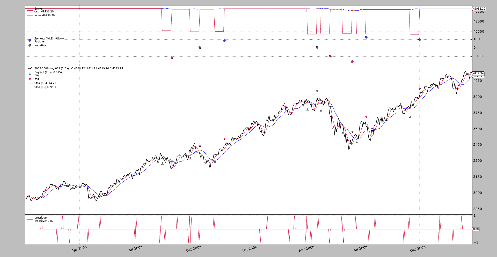

# OCO 订单

> 原文：[`www.backtrader.com/docu/order-creation-execution/oco/oco/`](https://www.backtrader.com/docu/order-creation-execution/oco/oco/)

版本`1.9.34.116`添加了`OCO`（也称为*One Cancel Others*）到回测工具中。

注意

这仅在回测中实现，尚未为实时经纪人实现

注意

更新至版本`1.9.36.116`。交互经纪人支持`StopTrail`、`StopTrailLimit`和`OCO`。

+   `OCO`总是将组中的第 1 个订单指定为参数`oco`

+   `StopTrailLimit`: 经纪人模拟和`IB`经纪人具有相同的行为。指定：`price`作为初始止损触发价格（还要指定`trailamount`），然后`plimi`作为初始限价。两者之间的差异将确定`limitoffset`（限价与止损触发价格之间的距离）

使用模式尽量保持用户友好。因此，如果策略中的逻辑决定发出订单，使用`OCO`可以这样做：

```py
def next(self):
    ...
    o1 = self.buy(...)
    ...
    o2 = self.buy(..., oco=o1)
    ...
    o3 = self.buy(..., oco=o1)  # or even oco=o2, o2 is already in o1 group
```

简单。第 1 个订单`o1`将成为组长。`o2`和`o3`通过指定`o1`的`oco`命名参数成为**OCO 组**的一部分。请注意代码片段中的注释指出，`o3`也可以通过指定`o2`（已经是组的一部分）成为组的一部分

组成后将发生以下情况：

+   如果组中的任何订单被执行、取消或到期，其他订单将被取消

下面的示例展示了`OCO`概念的运用。一个带有绘图的标准执行：

```py
$ ./oco.py --broker cash=50000 --plot
```

注意

现金增加到`50000`，因为资产达到`4000`的值，3 个`1`个项目的订单至少需要`12000`货币单位（经纪人的默认值为`10000`）

使用以下图表。



实际上并没有提供太多信息（这是一个标准的`SMA Crossover`策略）。示例执行以下操作：

+   当快速*SMA*向上穿越慢速*SMA*时，将发出 3 个订单

+   `order1`是一个`Limit`订单，将在`limdays`天（策略的参数）内到期，限价为`close`价格减少的百分比

+   `order2`是一个`Limit`订单，具有更长的到期时间和更低的限价。

+   `order3`是一个`Limit`订单，进一步降低了限价

因此，`order2`和`order3`的执行不会发生，因为：

+   `order1`将首先执行，这应该触发其他订单的取消

或

+   `order1`将到期，这将触发其他订单的取消

系统保留 3 个订单的`ref`标识符，并且只有在`notify_order`中看到这三个`ref`标识符为`Completed`、`Cancelled`、`Margin`或`Expired`时才会发出新的`buy`订单

退出只需在持有头寸一段时间后进行。

为了尝试跟踪实际执行情况，会产生文本输出。其中一些内容：

```py
2005-01-28: Oref 1 / Buy at 2941.11055
2005-01-28: Oref 2 / Buy at 2896.7722
2005-01-28: Oref 3 / Buy at 2822.87495
2005-01-31: Order ref: 1 / Type Buy / Status Submitted
2005-01-31: Order ref: 2 / Type Buy / Status Submitted
2005-01-31: Order ref: 3 / Type Buy / Status Submitted
2005-01-31: Order ref: 1 / Type Buy / Status Accepted
2005-01-31: Order ref: 2 / Type Buy / Status Accepted
2005-01-31: Order ref: 3 / Type Buy / Status Accepted
2005-02-01: Order ref: 1 / Type Buy / Status Expired
2005-02-01: Order ref: 3 / Type Buy / Status Canceled
2005-02-01: Order ref: 2 / Type Buy / Status Canceled
...
2006-06-23: Oref 49 / Buy at 3532.39925
2006-06-23: Oref 50 / Buy at 3479.147
2006-06-23: Oref 51 / Buy at 3390.39325
2006-06-26: Order ref: 49 / Type Buy / Status Submitted
2006-06-26: Order ref: 50 / Type Buy / Status Submitted
2006-06-26: Order ref: 51 / Type Buy / Status Submitted
2006-06-26: Order ref: 49 / Type Buy / Status Accepted
2006-06-26: Order ref: 50 / Type Buy / Status Accepted
2006-06-26: Order ref: 51 / Type Buy / Status Accepted
2006-06-26: Order ref: 49 / Type Buy / Status Completed
2006-06-26: Order ref: 51 / Type Buy / Status Canceled
2006-06-26: Order ref: 50 / Type Buy / Status Canceled
...
2006-11-10: Order ref: 61 / Type Buy / Status Canceled
2006-12-11: Oref 63 / Buy at 4032.62555
2006-12-11: Oref 64 / Buy at 3971.8322
2006-12-11: Oref 65 / Buy at 3870.50995
2006-12-12: Order ref: 63 / Type Buy / Status Submitted
2006-12-12: Order ref: 64 / Type Buy / Status Submitted
2006-12-12: Order ref: 65 / Type Buy / Status Submitted
2006-12-12: Order ref: 63 / Type Buy / Status Accepted
2006-12-12: Order ref: 64 / Type Buy / Status Accepted
2006-12-12: Order ref: 65 / Type Buy / Status Accepted
2006-12-15: Order ref: 63 / Type Buy / Status Expired
2006-12-15: Order ref: 65 / Type Buy / Status Canceled
2006-12-15: Order ref: 64 / Type Buy / Status Canceled
```

出现了以下情况：

+   第 1 个订单批次被下发。订单 1 到期，而 2 和 3 被取消。正如预期的那样。

+   几个月后，又下发了另一批 3 个订单。在这种情况下，订单 49 被标记为`已完成`，而 50 和 51 则立即被取消。

+   最后一个批次与第 1 个批次完全相同

现在让我们来检查一下没有`OCO`时的行为：

```py
$ ./oco.py --strat do_oco=False --broker cash=50000

2005-01-28: Oref 1 / Buy at 2941.11055
2005-01-28: Oref 2 / Buy at 2896.7722
2005-01-28: Oref 3 / Buy at 2822.87495
2005-01-31: Order ref: 1 / Type Buy / Status Submitted
2005-01-31: Order ref: 2 / Type Buy / Status Submitted
2005-01-31: Order ref: 3 / Type Buy / Status Submitted
2005-01-31: Order ref: 1 / Type Buy / Status Accepted
2005-01-31: Order ref: 2 / Type Buy / Status Accepted
2005-01-31: Order ref: 3 / Type Buy / Status Accepted
2005-02-01: Order ref: 1 / Type Buy / Status Expired
```

这就是全部，其实并不多（没有顺序执行，也不需要太多图表）

+   订单批次被下发

+   订单 1 到期了，但是因为策略已经设置了参数`do_oco=False`，订单 2 和 3 没有被纳入`OCO`组

+   因此，订单 2 和 3 并没有被取消，而且由于默认到期时间差为`1000`天后，根据样本数据（2 年的数据）它们永远不会到期。

+   系统从未下发第 2 批订单。

## 使用示例

```py
$ ./oco.py --help
usage: oco.py [-h] [--data0 DATA0] [--fromdate FROMDATE] [--todate TODATE]
              [--cerebro kwargs] [--broker kwargs] [--sizer kwargs]
              [--strat kwargs] [--plot [kwargs]]

Sample Skeleton

optional arguments:
  -h, --help           show this help message and exit
  --data0 DATA0        Data to read in (default:
                       ../../datas/2005-2006-day-001.txt)
  --fromdate FROMDATE  Date[time] in YYYY-MM-DD[THH:MM:SS] format (default: )
  --todate TODATE      Date[time] in YYYY-MM-DD[THH:MM:SS] format (default: )
  --cerebro kwargs     kwargs in key=value format (default: )
  --broker kwargs      kwargs in key=value format (default: )
  --sizer kwargs       kwargs in key=value format (default: )
  --strat kwargs       kwargs in key=value format (default: )
  --plot [kwargs]      kwargs in key=value format (default: )
```

## 代码示例

```py
from __future__ import (absolute_import, division, print_function,
                        unicode_literals)

import argparse
import datetime

import backtrader as bt

class St(bt.Strategy):
    params = dict(
        ma=bt.ind.SMA,
        p1=5,
        p2=15,
        limit=0.005,
        limdays=3,
        limdays2=1000,
        hold=10,
        switchp1p2=False,  # switch prices of order1 and order2
        oco1oco2=False,  # False - use order1 as oco for order3, else order2
        do_oco=True,  # use oco or not
    )

    def notify_order(self, order):
        print('{}: Order ref: {} / Type {} / Status {}'.format(
            self.data.datetime.date(0),
            order.ref, 'Buy' * order.isbuy() or 'Sell',
            order.getstatusname()))

        if order.status == order.Completed:
            self.holdstart = len(self)

        if not order.alive() and order.ref in self.orefs:
            self.orefs.remove(order.ref)

    def __init__(self):
        ma1, ma2 = self.p.ma(period=self.p.p1), self.p.ma(period=self.p.p2)
        self.cross = bt.ind.CrossOver(ma1, ma2)

        self.orefs = list()

    def next(self):
        if self.orefs:
            return  # pending orders do nothing

        if not self.position:
            if self.cross > 0.0:  # crossing up

                p1 = self.data.close[0] * (1.0 - self.p.limit)
                p2 = self.data.close[0] * (1.0 - 2 * 2 * self.p.limit)
                p3 = self.data.close[0] * (1.0 - 3 * 3 * self.p.limit)

                if self.p.switchp1p2:
                    p1, p2 = p2, p1

                o1 = self.buy(exectype=bt.Order.Limit, price=p1,
                              valid=datetime.timedelta(self.p.limdays))

                print('{}: Oref {} / Buy at {}'.format(
                    self.datetime.date(), o1.ref, p1))

                oco2 = o1 if self.p.do_oco else None
                o2 = self.buy(exectype=bt.Order.Limit, price=p2,
                              valid=datetime.timedelta(self.p.limdays2),
                              oco=oco2)

                print('{}: Oref {} / Buy at {}'.format(
                    self.datetime.date(), o2.ref, p2))

                if self.p.do_oco:
                    oco3 = o1 if not self.p.oco1oco2 else oco2
                else:
                    oco3 = None

                o3 = self.buy(exectype=bt.Order.Limit, price=p3,
                              valid=datetime.timedelta(self.p.limdays2),
                              oco=oco3)

                print('{}: Oref {} / Buy at {}'.format(
                    self.datetime.date(), o3.ref, p3))

                self.orefs = [o1.ref, o2.ref, o3.ref]

        else:  # in the market
            if (len(self) - self.holdstart) >= self.p.hold:
                self.close()

def runstrat(args=None):
    args = parse_args(args)

    cerebro = bt.Cerebro()

    # Data feed kwargs
    kwargs = dict()

    # Parse from/to-date
    dtfmt, tmfmt = '%Y-%m-%d', 'T%H:%M:%S'
    for a, d in ((getattr(args, x), x) for x in ['fromdate', 'todate']):
        if a:
            strpfmt = dtfmt + tmfmt * ('T' in a)
            kwargs[d] = datetime.datetime.strptime(a, strpfmt)

    # Data feed
    data0 = bt.feeds.BacktraderCSVData(dataname=args.data0, **kwargs)
    cerebro.adddata(data0)

    # Broker
    cerebro.broker = bt.brokers.BackBroker(**eval('dict(' + args.broker + ')'))

    # Sizer
    cerebro.addsizer(bt.sizers.FixedSize, **eval('dict(' + args.sizer + ')'))

    # Strategy
    cerebro.addstrategy(St, **eval('dict(' + args.strat + ')'))

    # Execute
    cerebro.run(**eval('dict(' + args.cerebro + ')'))

    if args.plot:  # Plot if requested to
        cerebro.plot(**eval('dict(' + args.plot + ')'))

def parse_args(pargs=None):
    parser = argparse.ArgumentParser(
        formatter_class=argparse.ArgumentDefaultsHelpFormatter,
        description=(
            'Sample Skeleton'
        )
    )

    parser.add_argument('--data0', default='../../datas/2005-2006-day-001.txt',
                        required=False, help='Data to read in')

    # Defaults for dates
    parser.add_argument('--fromdate', required=False, default='',
                        help='Date[time] in YYYY-MM-DD[THH:MM:SS] format')

    parser.add_argument('--todate', required=False, default='',
                        help='Date[time] in YYYY-MM-DD[THH:MM:SS] format')

    parser.add_argument('--cerebro', required=False, default='',
                        metavar='kwargs', help='kwargs in key=value format')

    parser.add_argument('--broker', required=False, default='',
                        metavar='kwargs', help='kwargs in key=value format')

    parser.add_argument('--sizer', required=False, default='',
                        metavar='kwargs', help='kwargs in key=value format')

    parser.add_argument('--strat', required=False, default='',
                        metavar='kwargs', help='kwargs in key=value format')

    parser.add_argument('--plot', required=False, default='',
                        nargs='?', const='{}',
                        metavar='kwargs', help='kwargs in key=value format')

    return parser.parse_args(pargs)

if __name__ == '__main__':
    runstrat()
```
