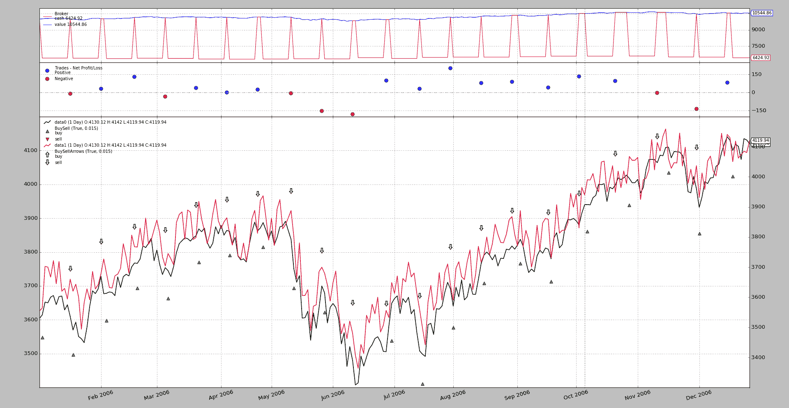
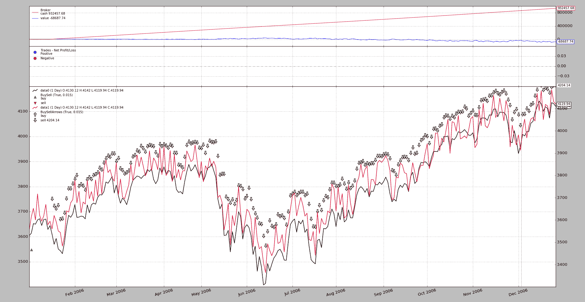

# 期货和现货补偿

> 原文：[`www.backtrader.com/docu/order-creation-execution/futurespot/future-vs-spot/`](https://www.backtrader.com/docu/order-creation-execution/futurespot/future-vs-spot/)

发布`1.9.32.116`添加了对在[社区](https://community.backtrader.com/)中提出的一个有趣用例的支持。

+   通过未来开始交易，其中包括**实物交割**

+   让指标告诉你些什么。

+   如果需要，通过对现货价格进行操作来关闭头寸，有效地取消物理交割，无论是为了收到货物还是为了交付货物（并有望获利）。

    未来到期日与现货价格操作在同一天发生。

这意味着：

+   平台从两种不同的资产中获取数据点。

+   平台必须以某种方式理解资产之间的关系，并且操作*现货*价格将关闭在*期货*上开放的头寸。

    实际上，未来并没有关闭，只有物理交割是*补偿*的。

使用*补偿*概念，`backtrader`添加了一种让用户向平台传达在一个数据源上的事情将对另一个数据源产生补偿效果的方法。使用模式

```py
import backtrader as bt

cerebro = bt.Cerebro()

data0 = bt.feeds.MyFavouriteDataFeed(dataname='futurename')
cerebro.adddata(data0)

data1 = bt.feeds.MyFavouriteDataFeed(dataname='spotname')
data1.compensate(data0)  # let the system know ops on data1 affect data0
cerebro.adddata(data1)

...

cerebro.run()
```

## 将所有内容放在一起

例子总是值得一千篇文章，所以让我们把所有的东西放在一起。

+   使用`backtrader`源中的标准示例数据之一。这将是未来的。

+   通过重复使用相同的数据源并添加一个过滤器，该过滤器将随机将价格移动到上/下几个点，以创建一个价差，来模拟类似但不同的价格。如下所示：

    ```py
    # The filter which changes the close price
    def close_changer(data, *args, **kwargs):
        data.close[0] += 50.0 * random.randint(-1, 1)
        return False  # length of stream is unchanged` 
    ```

+   将绘图到相同的轴上会混合默认包含的`BuyObserver`标记，因此标准观察器将被禁用，并手动重新添加以使用不同的每个数据标记进行绘图。

+   位置将随机输入，并在 10 天后退出。

    这与期货到期期限不符，但这只是为了实现功能，而不是检查交易日历。

!!! 注意

```py
 A simulation including execution on the spot price on the day of
  future expiration would require activating `cheat-on-close` to
  make sure the orders are executed when the future expires. This is
  not needed in this sample, because the expiration is being chosen
  at random.
```

+   注意策略

    +   `buy`操作在`data0`上执行。

    +   `sell`操作在`data1`上执行。

    ```py
    class St(bt.Strategy):
        def __init__(self):
            bt.obs.BuySell(self.data0, barplot=True)  # done here for
            BuySellArrows(self.data1, barplot=True)  # different markers per data

        def next(self):
            if not self.position:
                if random.randint(0, 1):
                    self.buy(data=self.data0)
                    self.entered = len(self)

            else:  # in the market
                if (len(self) - self.entered) >= 10:
                    self.sell(data=self.data1)` 
    ```

执行：

```py
$ ./future-spot.py --no-comp
```

使用此图形输出。



它是有效的：

+   `buy`操作以指向上的绿色三角形的形式发出信号，图例告诉我们它们属于`data0`，如预期的那样。

+   `sell`操作以向下箭头的形式发出信号，图例告诉我们它们属于`data1`，如预期的那样。

+   交易正在关闭，即使它们是以`data0`开仓并以`data1`平仓，也能实现期望的效果（在现实生活中，这意味着避免通过*期货*获得的商品的实物交割）。

如果没有*补偿*，人们可能会想象会发生什么。让我们来做一下：

```py
$ ./future-spot.py --no-comp
```

输出结果



很明显，这是失败的：

+   逻辑期望`data0`上的仓位在`data1`上的操作关闭，并且只有在市场中没有仓位时才开放`data0`上的仓位。

+   但*补偿*已被停用，并且对`data0`的初始操作（绿色三角形）从未关闭，因此不会启动任何其他操作，而`data1`上的空头仓位开始累积。

## 示例用法

```py
$ ./future-spot.py --help
usage: future-spot.py [-h] [--no-comp]

Compensation example

optional arguments:
  -h, --help  show this help message and exit
  --no-comp
```

## 示例代码

```py
from __future__ import (absolute_import, division, print_function,
                        unicode_literals)

import argparse
import random
import backtrader as bt

# The filter which changes the close price
def close_changer(data, *args, **kwargs):
    data.close[0] += 50.0 * random.randint(-1, 1)
    return False  # length of stream is unchanged

# override the standard markers
class BuySellArrows(bt.observers.BuySell):
    plotlines = dict(buy=dict(marker='$\u21E7$', markersize=12.0),
                     sell=dict(marker='$\u21E9$', markersize=12.0))

class St(bt.Strategy):
    def __init__(self):
        bt.obs.BuySell(self.data0, barplot=True)  # done here for
        BuySellArrows(self.data1, barplot=True)  # different markers per data

    def next(self):
        if not self.position:
            if random.randint(0, 1):
                self.buy(data=self.data0)
                self.entered = len(self)

        else:  # in the market
            if (len(self) - self.entered) >= 10:
                self.sell(data=self.data1)

def runstrat(args=None):
    args = parse_args(args)
    cerebro = bt.Cerebro()

    dataname = '../../datas/2006-day-001.txt'  # data feed

    data0 = bt.feeds.BacktraderCSVData(dataname=dataname, name='data0')
    cerebro.adddata(data0)

    data1 = bt.feeds.BacktraderCSVData(dataname=dataname, name='data1')
    data1.addfilter(close_changer)
    if not args.no_comp:
        data1.compensate(data0)
    data1.plotinfo.plotmaster = data0
    cerebro.adddata(data1)

    cerebro.addstrategy(St)  # sample strategy

    cerebro.addobserver(bt.obs.Broker)  # removed below with stdstats=False
    cerebro.addobserver(bt.obs.Trades)  # removed below with stdstats=False

    cerebro.broker.set_coc(True)
    cerebro.run(stdstats=False)  # execute
    cerebro.plot(volume=False)  # and plot

def parse_args(pargs=None):
    parser = argparse.ArgumentParser(
        formatter_class=argparse.ArgumentDefaultsHelpFormatter,
        description=('Compensation example'))

    parser.add_argument('--no-comp', required=False, action='store_true')
    return parser.parse_args(pargs)

if __name__ == '__main__':
    runstrat()
```
