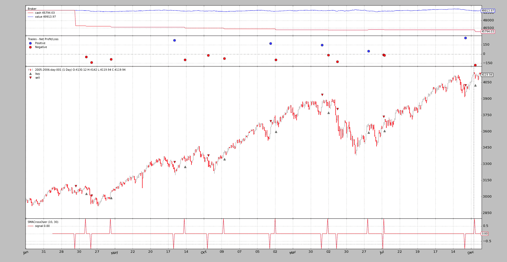

# 滑点

> 原文：[`www.backtrader.com/docu/slippage/slippage/`](https://www.backtrader.com/docu/slippage/slippage/)

回测无法保证真实市场条件。无论市场模拟有多好，在真实市场条件下都可能发生滑点。这意味着：

+   请求的价格可能无法匹配。

集成的回测经纪人支持滑点。以下参数可以传递给经纪人

+   `slip_perc` (默认值: `0.0`) 绝对百分比（正数），用于上下滑动买入/卖出订单的价格

    注意:

    +   `0.01` 是 `1%`

    +   `0.001` 是 `0.1%`

+   `slip_fixed` (默认值: `0.0`) 单位百分比（正数），用于上下滑动买入/卖出订单的价格

    注意：如果`slip_perc`不为零，则它优先于此。

+   `slip_open` (默认值: `False`) 是否为订单执行滑动价格，该价格特别使用下一个柱的*开盘*价格。一个示例是使用下一个可用刻度执行的`Market`订单，即柱的开盘价格。

    这也适用于其他一些执行，因为逻辑试图检测*开盘*价格是否会在移动到新柱时匹配请求的价格/执行类型。

+   `slip_match` (默认值: `True`)

    如果为`True`，经纪人将通过在超出时将滑点限制在`high/low`价格上来提供匹配。

    如果 `False`，经纪人将不会根据当前价格匹配订单，并将在下一次迭代中尝试执行

+   `slip_limit` (默认值: `True`)

    即使 `slip_match` 为 `False`，给定请求的精确匹配价格的`Limit`订单也会被匹配。

    此选项控制该行为。

    如果为`True`，则`Limit`订单将通过将价格限制在`limit` / `high/low`价格上来匹配

    如果 `False` 并且滑点超过上限，则不会匹配

+   `slip_out` (默认值: `False`)

    即使价格超出`high` - `low`范围，也提供*滑点*。

## 工作原理

为了决定何时应用*滑点*，订单执行类型被考虑在内：

+   `Close` - **不应用滑点**

    此订单与`close`价格匹配，此价格是当天的最后一个价格。滑点不会发生，因为订单只能在会话的最后一个刻度发生，这是一个唯一的价格，没有容忍度。

+   `Market` - *滑点*被应用

    请检查`slip_open`异常。因为`Market`订单将与下一个柱的*开盘*价格匹配。

+   `Limit` - *滑点*按照这个逻辑应用

    +   如果匹配价格将是*开盘*价格，则根据参数 `slip_open` 应用*滑点*。如果应用，则价格永远不会比请求的`limit`价格更差

    +   如果匹配价格不是`limit`价格，则应用*滑点*，并在`high/low`上限制。在这种情况下，`slip_mlimit`适用于决定是否在超出上限时会发生匹配

    +   如果匹配价格是`limit`价格，则不会应用滑点

+   `Stop` - 一旦订单被*触发*，与`市价`订单相同的逻辑将适用

+   `StopLimit` - 一旦订单被*触发*，与`限价`订单相同的逻辑将适用

该方法试图在模拟和可用数据的限制内提供尽可能逼真的方法

## 配置滑点

*经纪人*已经由每个运行的*智能交易引擎*实例化，具有默认参数。有两种方法可以更改其行为：

+   使用方法来配置*滑点*

    #### BackBroker.set_slippage_perc(perc, slip_open=True, slip_limit=True, slip_match=True, slip_out=False)

    配置滑点为基于百分比的

    #### BackBroker.set_slippage_fixed(fixed, slip_open=True, slip_limit=True, slip_match=True, slip_out=False)

    配置滑点为固定点位基础

+   将经纪人替换为：

    ```py
    `import backtrader as bt

    cerebro = bt.Cerebro()
    cerebro.broker = bt.brokers.BackBroker(slip_perc=0.005)  # 0.5%` 
    ```

## 实际示例

源代码包含一个示例，该示例使用了执行类型为`市价`的订单以及使用*信号*的*多头/空头*方法。这应该能帮助理解其逻辑。

一个没有滑点并且具有初始图表供以后参考的运行：

```py
$ ./slippage.py --plot
01 2005-03-22 23:59:59 SELL Size: -1 / Price: 3040.55
02 2005-04-11 23:59:59 BUY  Size: +1 / Price: 3088.47
03 2005-04-11 23:59:59 BUY  Size: +1 / Price: 3088.47
04 2005-04-19 23:59:59 SELL Size: -1 / Price: 2948.38
05 2005-04-19 23:59:59 SELL Size: -1 / Price: 2948.38
06 2005-05-19 23:59:59 BUY  Size: +1 / Price: 3034.88
...
35 2006-12-19 23:59:59 BUY  Size: +1 / Price: 4121.01
```



同样的运行使用了配置为`1.5%`的*滑点*：

```py
$ ./slippage.py --slip_perc 0.015
01 2005-03-22 23:59:59 SELL Size: -1 / Price: 3040.55
02 2005-04-11 23:59:59 BUY  Size: +1 / Price: 3088.47
03 2005-04-11 23:59:59 BUY  Size: +1 / Price: 3088.47
04 2005-04-19 23:59:59 SELL Size: -1 / Price: 2948.38
05 2005-04-19 23:59:59 SELL Size: -1 / Price: 2948.38
06 2005-05-19 23:59:59 BUY  Size: +1 / Price: 3034.88
...
35 2006-12-19 23:59:59 BUY  Size: +1 / Price: 4121.01
```

没有**变动**。这是该场景的预期行为。

+   执行类型：`市价`

+   而`slip_open`没有被设置为`True`

    `市价`订单与下一根柱的*开盘*价格匹配，我们不允许`open`价格被移动。

将`slip_open`设置为`True`的一个运行设置：

```py
$ ./slippage.py --slip_perc 0.015 --slip_open
01 2005-03-22 23:59:59 SELL Size: -1 / Price: 3021.66
02 2005-04-11 23:59:59 BUY  Size: +1 / Price: 3088.47
03 2005-04-11 23:59:59 BUY  Size: +1 / Price: 3088.47
04 2005-04-19 23:59:59 SELL Size: -1 / Price: 2948.38
05 2005-04-19 23:59:59 SELL Size: -1 / Price: 2948.38
06 2005-05-19 23:59:59 BUY  Size: +1 / Price: 3055.14
...
35 2006-12-19 23:59:59 BUY  Size: +1 / Price: 4121.01
```

人们可以立即看到价格**已经变动**。并且分配的价格比操作 35 的最坏或相等。*这不是复制粘贴错误*

+   2016-12-19 的`open`和`high`是相同的。

    价格不能被推高到`high`之上，因为那将意味着返回一个不存在的价格。

当然，*backtrader*允许匹配超出`high`-`low`范围的价格，如果愿意的话，可以激活`slip_out`进行运行：

```py
$ ./slippage.py --slip_perc 0.015 --slip_open --slip_out
01 2005-03-22 23:59:59 SELL Size: -1 / Price: 2994.94
02 2005-04-11 23:59:59 BUY  Size: +1 / Price: 3134.80
03 2005-04-11 23:59:59 BUY  Size: +1 / Price: 3134.80
04 2005-04-19 23:59:59 SELL Size: -1 / Price: 2904.15
05 2005-04-19 23:59:59 SELL Size: -1 / Price: 2904.15
06 2005-05-19 23:59:59 BUY  Size: +1 / Price: 3080.40
...
35 2006-12-19 23:59:59 BUY  Size: +1 / Price: 4182.83
```

用于匹配的匹配表达式将是：哦天呐！(我的天啊！）。价格明显超出了范围。只需看看操作 35，该操作在`4182.83`处匹配。快速检查本文档中的图表可以看到该资产从未接近过该价格。

`slip_match`的默认值为`True`，这意味着*backtrader*提供了一个匹配，无论是带上限价还是不带上限价，如上所示。让我们将其禁用：

```py
$ ./slippage.py --slip_perc 0.015 --slip_open --no-slip_match
01 2005-04-15 23:59:59 SELL Size: -1 / Price: 3028.10
02 2005-05-18 23:59:59 BUY  Size: +1 / Price: 3029.40
03 2005-06-01 23:59:59 BUY  Size: +1 / Price: 3124.03
04 2005-10-06 23:59:59 SELL Size: -1 / Price: 3365.57
05 2005-10-06 23:59:59 SELL Size: -1 / Price: 3365.57
06 2005-12-01 23:59:59 BUY  Size: +1 / Price: 3499.95
07 2005-12-01 23:59:59 BUY  Size: +1 / Price: 3499.95
08 2006-02-28 23:59:59 SELL Size: -1 / Price: 3782.71
09 2006-02-28 23:59:59 SELL Size: -1 / Price: 3782.71
10 2006-05-23 23:59:59 BUY  Size: +1 / Price: 3594.68
11 2006-05-23 23:59:59 BUY  Size: +1 / Price: 3594.68
12 2006-11-27 23:59:59 SELL Size: -1 / Price: 3984.37
13 2006-11-27 23:59:59 SELL Size: -1 / Price: 3984.37
```

天啊！从 35 降到了 13。原因是：

停用`slip_match`将阻止匹配操作，如果*滑点*将匹配价格推高到`high`之上或推低到柱的`low`之下。看起来，随着请求的*滑点*为`1.5%`，大约有 22 个操作无法执行。

这些示例应该已经展示了不同的*滑点*选项是如何共同工作的。
