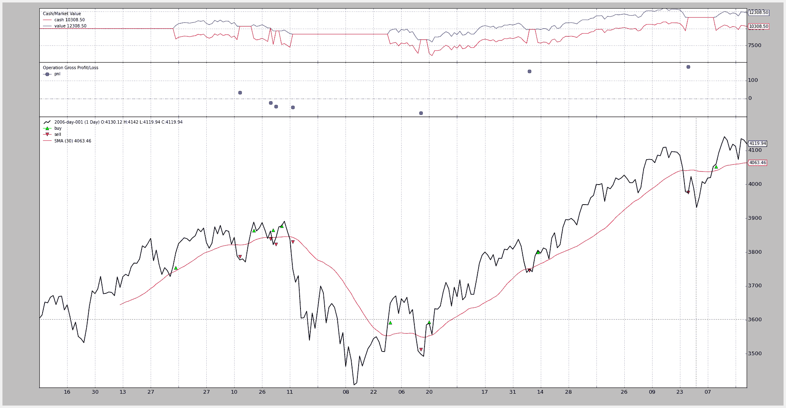
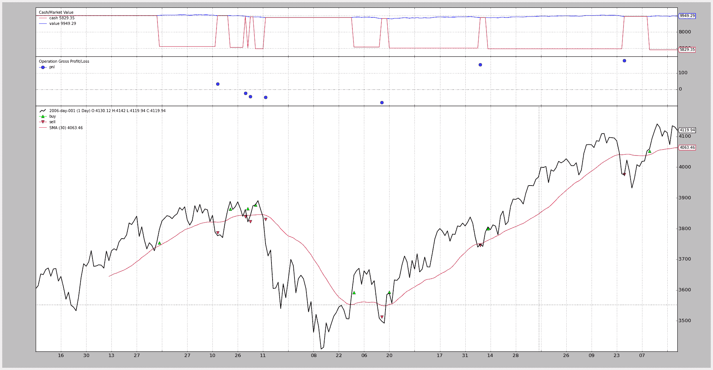

# 佣金：股票与期货

> 原文：[`www.backtrader.com/docu/commission-schemes/commission-schemes/`](https://www.backtrader.com/docu/commission-schemes/commission-schemes/)

## 不可知论

在继续之前，让我们记住，`backtrader`试图保持对数据表示的不可知性。 可以将不同的佣金方案应用于相同的数据集。

让我们看看如何做到这一点。

## 使用经纪商快捷方式

这使得最终用户远离了`CommissionInfo`对象，因为可以通过单个函数调用来创建/设置佣金方案。 在常规的`cerebro`创建/设置过程中，只需在`broker`成员属性上添加一个对`setcommission`的调用。 以下调用为使用*Interactive Brokers*时的**Eurostoxx50**期货设置了一个常规佣金方案：

```py
`cerebro.broker.setcommission(commission=2.0, margin=2000.0, mult=10.0)` 
```

由于大多数用户通常只会测试单个工具，因此这就是所有的内容。 如果您已为数据源（`data feed`）指定了`name`，因为在图表上同时考虑了多个工具，因此可以稍微扩展此调用，如下所示：

```py
`cerebro.broker.setcommission(commission=2.0, margin=2000.0, mult=10.0, name='Eurostoxxx50')` 
```

在这种情况下，此即时佣金方案仅适用于名称匹配为`Eurostoxx50`的工具。

## 设置佣金参数的含义

+   `commission`（默认值：`0.0`）

    绝对或百分比单位中每个**操作**的货币单位成本。

    在上面的示例中，每个`buy`合约的费用为 2.0 欧元，每个`sell`合约再次为 2.0 欧元。

    这里重要的问题是何时使用绝对值或百分比值。

    +   如果`margin`评估为`False`（例如为 False、0 或 None），则会认为`commission`表示`price`乘以`size`操作值的百分比

    +   如果`margin`是其他值，则认为操作发生在类似`期货`的工具上，`commission`是每个`size`合约的固定价格

+   `margin`（默认值：`None`）

    使用`期货`类似工具时需要的保证金。 如上所述

    +   如果未设置**`margin`**，则将理解`commission`为以百分比表示，并应用于`buy`或`sell`操作的`price * size`组件。

    +   如果设置了`margin`，则将理解`commission`为固定值，该值将乘以`buy`或`sell`操作的`size`组件。

+   `mult`（默认值：1.0）

    对于类似`期货`的工具，这确定要应用于利润和损失计算的乘数。

    这就是期货同时具有吸引力和风险的原因。

+   `name`（默认值：无）

    将佣金方案的应用限制为与`name`匹配的工具

    这可以在数据源创建期间设置。

    如果未设置，该方案将适用于系统中的任何数据。

## 现在有两个示例：股票 vs 期货

上述期货示例：

```py
`cerebro.broker.setcommission(commission=2.0, margin=2000.0, mult=10.0)` 
```

以股票为例：

```py
`cerebro.broker.setcommission(commission=0.005)  # 0.5% of the operation value` 
```

注意

第 2 种语法不设置*margin*和*mult*，*backtrader*会尝试通过考虑佣金为`％`来采用智能方法。

要完全指定佣金方案，需要创建`CommissionInfo`的子类

## 创建永久委员会方案

可以通过直接使用`CommissionInfo`类来创建更永久的佣金方案。用户可以选择在某处定义此定义：

```py
`import backtrader as bt

commEurostoxx50 = bt.CommissionInfo(commission=2.0, margin=2000.0, mult=10.0)` 
```

稍后在另一个 Python 模块中应用它与 `addcommissioninfo`：

```py
`from mycomm import commEurostoxx50

...

cerebro.broker.addcommissioninfo(commEuroStoxx50, name='Eurostoxxx50')` 
```

`CommissionInfo`是一个对象，它使用与`backtrader`环境中的其他对象相同的`params`声明。因此，以上内容也可以表示为：

```py
`import backtrader as bt

class CommEurostoxx50(bt.CommissionInfo):
    params = dict(commission=2.0, margin=2000.0, mult=10.0)` 
```

以后：

```py
`from mycomm import CommEurostoxx50

...

cerebro.broker.addcommissioninfoCommEuroStoxx50(), name='Eurostoxxx50')` 
```

## 现在进行与 SMA 交叉的“真实”比较

使用简单移动平均线交叉作为入/出信号，同一数据集将使用`期货`类似的佣金方案进行测试，然后使用类似于`股票`的方案进行测试。

注意

期货持仓不仅可以给出进入/退出行为，还可以在每次发生时进行反转行为。但这个示例是关于比较委员会方案的。

代码（请参阅底部的完整策略）是相同的，可以在定义策略之前选择方案。

```py
`futures_like = True

if futures_like:
    commission, margin, mult = 2.0, 2000.0, 10.0
else:
    commission, margin, mult = 0.005, None, 1` 
```

只需将`futures_like`设置为 false 即可运行类似于`股票`的方案。

已添加一些记录代码以评估不同佣金方案的影响。让我们只关注前两个操作。

对于期货：

```py
`2006-03-09, BUY CREATE, 3757.59
2006-03-10, BUY EXECUTED, Price: 3754.13, Cost: 2000.00, Comm 2.00
2006-04-11, SELL CREATE, 3788.81
2006-04-12, SELL EXECUTED, Price: 3786.93, Cost: 2000.00, Comm 2.00
2006-04-12, OPERATION PROFIT, GROSS 328.00, NET 324.00
2006-04-20, BUY CREATE, 3860.00
2006-04-21, BUY EXECUTED, Price: 3863.57, Cost: 2000.00, Comm 2.00
2006-04-28, SELL CREATE, 3839.90
2006-05-02, SELL EXECUTED, Price: 3839.24, Cost: 2000.00, Comm 2.00
2006-05-02, OPERATION PROFIT, GROSS -243.30, NET -247.30` 
```

对于股票：

```py
`2006-03-09, BUY CREATE, 3757.59
2006-03-10, BUY EXECUTED, Price: 3754.13, Cost: 3754.13, Comm 18.77
2006-04-11, SELL CREATE, 3788.81
2006-04-12, SELL EXECUTED, Price: 3786.93, Cost: 3786.93, Comm 18.93
2006-04-12, OPERATION PROFIT, GROSS 32.80, NET -4.91
2006-04-20, BUY CREATE, 3860.00
2006-04-21, BUY EXECUTED, Price: 3863.57, Cost: 3863.57, Comm 19.32
2006-04-28, SELL CREATE, 3839.90
2006-05-02, SELL EXECUTED, Price: 3839.24, Cost: 3839.24, Comm 19.20
2006-05-02, OPERATION PROFIT, GROSS -24.33, NET -62.84` 
```

第一次操作的价格如下：

+   买入（执行）-> 3754.13 / 卖出（执行）-> 3786.93

    +   期货利润与损失（含佣金）：324.0

    +   股票利润与损失（含佣金）：-4.91

嘿！！佣金完全吃掉了`股票`操作的任何利润，但对`期货`操作只是造成了小小的影响。

第二次操作：

+   买入（执行）-> `3863.57` / 卖出（执行）-> `3389.24`

    +   期货利润与损失（含佣金）：`-247.30`

    +   股票利润与损失（含佣金）：`-62.84`

对于这个负操作，`期货`的影响更大。

但：

+   期货累积净利润与损失：`324.00 + (-247.30) = 76.70`

+   股票累积净利润与损失：`(-4.91) + (-62.84) = -67.75`

累积效果可以在下面的图表中看到，在完整年份结束时，期货产生了更大的利润，但也遭受了更大的回撤（更深的亏损）

但重要的是：无论是`期货`还是`股票`…… **都可以进行回测。**

## 期货佣金



## 股票佣金



## 代码

```py
`from __future__ import (absolute_import, division, print_function,
                        unicode_literals)

import backtrader as bt
import backtrader.feeds as btfeeds
import backtrader.indicators as btind

futures_like = True

if futures_like:
    commission, margin, mult = 2.0, 2000.0, 10.0
else:
    commission, margin, mult = 0.005, None, 1

class SMACrossOver(bt.Strategy):
    def log(self, txt, dt=None):
  ''' Logging function fot this strategy'''
        dt = dt or self.datas[0].datetime.date(0)
        print('%s, %s' % (dt.isoformat(), txt))

    def notify(self, order):
        if order.status in [order.Submitted, order.Accepted]:
            # Buy/Sell order submitted/accepted to/by broker - Nothing to do
            return

        # Check if an order has been completed
        # Attention: broker could reject order if not enougth cash
        if order.status in [order.Completed, order.Canceled, order.Margin]:
            if order.isbuy():
                self.log(
                    'BUY EXECUTED, Price: %.2f, Cost: %.2f, Comm %.2f' %
                    (order.executed.price,
                     order.executed.value,
                     order.executed.comm))

                self.buyprice = order.executed.price
                self.buycomm = order.executed.comm
                self.opsize = order.executed.size
            else:  # Sell
                self.log('SELL EXECUTED, Price: %.2f, Cost: %.2f, Comm %.2f' %
                         (order.executed.price,
                          order.executed.value,
                          order.executed.comm))

                gross_pnl = (order.executed.price - self.buyprice) * \
                    self.opsize

                if margin:
                    gross_pnl *= mult

                net_pnl = gross_pnl - self.buycomm - order.executed.comm
                self.log('OPERATION PROFIT, GROSS %.2f, NET %.2f' %
                         (gross_pnl, net_pnl))

    def __init__(self):
        sma = btind.SMA(self.data)
        # > 0 crossing up / < 0 crossing down
        self.buysell_sig = btind.CrossOver(self.data, sma)

    def next(self):
        if self.buysell_sig > 0:
            self.log('BUY CREATE, %.2f' % self.data.close[0])
            self.buy()  # keep order ref to avoid 2nd orders

        elif self.position and self.buysell_sig < 0:
            self.log('SELL CREATE, %.2f' % self.data.close[0])
            self.sell()

if __name__ == '__main__':
    # Create a cerebro entity
    cerebro = bt.Cerebro()

    # Add a strategy
    cerebro.addstrategy(SMACrossOver)

    # Create a Data Feed
    datapath = ('../../datas/2006-day-001.txt')
    data = bt.feeds.BacktraderCSVData(dataname=datapath)

    # Add the Data Feed to Cerebro
    cerebro.adddata(data)

    # set commission scheme -- CHANGE HERE TO PLAY
    cerebro.broker.setcommission(
        commission=commission, margin=margin, mult=mult)

    # Run over everything
    cerebro.run()

    # Plot the result
    cerebro.plot()` 
```

## 参考

#### 类 backtrader.CommInfoBase()

基于委员会方案的基类。

参数：

+   `commission`（默认值：`0.0`）：以百分比或货币单位表示的基础佣金值

+   `mult`（默认为`1.0`）：应用于资产的值/利润的乘数

+   `margin`（默认值：`None`）：需要开设/持有操作的货币单位金额。只有当类中的最终`_stocklike`属性设置为`False`时才适用

+   `automargin`（默认：`False`）：方法`get_margin`使用的，用于自动计算以下策略所需的保证金/担保

    +   如果参数`automargin`的评估为`False`，则使用参数`margin`

    +   如果`automargin < 0`，则使用参数`mult`和`mult * price`

    +   如果`automargin > 0`，则使用参数`automargin`和`automargin * price`

+   `commtype`（默认：`None`）：支持的值为`CommInfoBase.COMM_PERC`（将佣金理解为％）和`CommInfoBase.COMM_FIXED`（将佣金理解为货币单位）

    `None`的默认值是支持的值，以保持与传统的`CommissionInfo`对象的兼容性。 如果`commtype`设置为 None，则适用以下规则：

    +   `margin`是`None`：内部`_commtype`设置为`COMM_PERC`，`_stocklike`设置为`True`（与股票的百分比方式运作）

    +   如果`margin`不是`None`：`_commtype`设置为`COMM_FIXED`，`_stocklike`设置为`False`（使用期货的固定来回佣金）

    如果此参数设置为`None`之外的内容，则它将传递给内部的`_commtype`属性，并且参数`stocklike`和内部属性`_stocklike`也是如此

+   `stocklike`（默认：`False`）：指示工具是否类似于股票或期货（参见上文的`commtype`讨论）

+   `percabs`（默认：`False`）：当`commtype`设置为 COMM_PERC 时，参数`commission`是否必须理解为 XX％或 0.XX

    如果此参数为`True`：0.XX 如果此参数为`False`：XX%

+   `interest`（默认：`0.0`）

    如果这不是零，则这是持有空头卖出头寸所收取的年息。 这主要是针对股票的空头卖出

    公式：`days * price * abs(size) * (interest / 365)`

    必须用绝对值指定：0.05 -> 5%

    注意

    通过覆盖方法`_get_credit_interest`可以更改行为

+   `interest_long`（默认：`False`）

    某些产品，如 ETF，对空头和多头头寸收取利息。 如果这是`True`并且`interest`不为零，则将在两个方向上收取利息

+   `leverage`（默认：`1.0`）

    对于所需现金的资产的杠杆倍数

#### - ``_stocklike``()

用于类 Stock-like/Futures-like 行为的最终值

#### - ``_commtype``()

PERC vs FIXED 佣金的最终值

#### 这两个参数在内部使用，而不是声明的参数，以启用该方法

#### 描述的兼容性检查适用于遗留的``CommissionInfo``()

#### 对象()

#### 类 backtrader.CommissionInfo()

实际佣金方案的基类。

CommInfoBase 被创建以保持对*backtrader*提供的原始，不完整的支持的支持。新的佣金方案派生自这个类，这些类是`CommInfoBase`的子类。

`percabs`的默认值也更改为`True`

参数：

+   `percabs`（默认：True）：当`commtype`设置为 COMM_PERC 时，参数`commission`是否必须理解为 XX％或 0.XX

    如果此参数为 True：0.XX 如果此参数为 False：XX%

#### get_leverage()

返回此佣金方案允许的杠杆水平

#### getsize(price, cash)

返回在给定价格下执行现金操作所需的大小

#### getoperationcost(size, price)

返回操作将花费的现金金额

#### getvaluesize(size, price)

返回给定价格的大小值。对于类似期货的对象，它在`size * margin`处固定。

#### getvalue(position, price)

返回给定价格的位置值。对于类似期货的对象，它在`size * margin`处固定。

#### get_margin(price)

返回给定价格下资产单个项目所需的实际保证金/担保。默认实现具有以下策略：

+   如果参数`automargin`评估为`False`，则使用参数`margin`

+   使用参数`mult`，即如果`automargin < 0`，则为`mult * price`。

+   使用参数`automargin`，即如果`automargin > 0`，则为`automargin * price`。

#### getcommission(size, price)

计算给定价格的操作的佣金

#### _getcommission(size, price, pseudoexec)

计算给定价格的操作的佣金

pseudoexec：如果为 True，则操作尚未执行

#### profitandloss(size, price, newprice)

返回位置的实际盈亏

#### cashadjust(size, price, newprice)

计算给定价格差异的现金调整

#### get_credit_interest(data, pos, dt)

计算卖空或特定产品的信用费用

#### _get_credit_interest(data, size, price, days, dt0, dt1)

此方法返回经纪人收取的信用利息成本。

如果`size > 0`，则仅在类的参数`interest_long`为`True`时才调用此方法。

计算信用利率的公式为：

公式：`days * price * abs(size) * (interest / 365)`

参数：

```py
`* `data`: data feed for which interest is charged

* `size`: current position size. > 0 for long positions and < 0 for
  short positions (this parameter will not be `0`)

* `price`: current position price

* `days`: number of days elapsed since last credit calculation
  (this is (dt0 - dt1).days)

* `dt0`: (datetime.datetime) current datetime

* `dt1`: (datetime.datetime) datetime of previous calculation` 
```

`dt0`和`dt1`在默认实现中未被使用，并作为覆盖方法的额外输入提供
