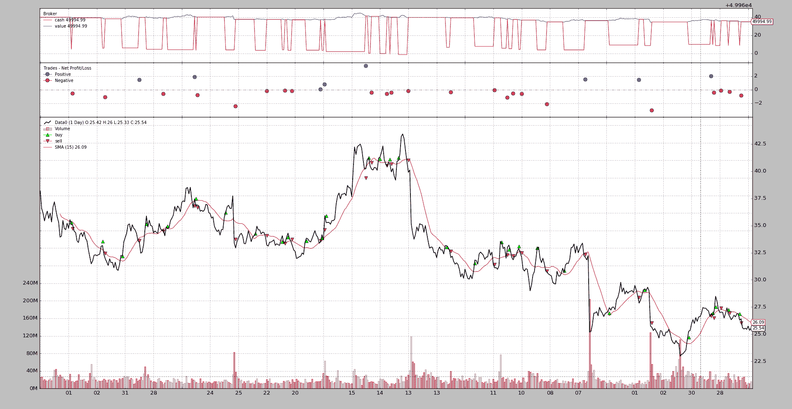
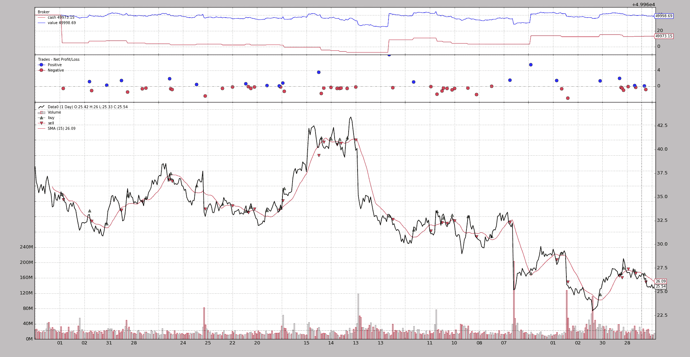

# Sizers

> 原文：[`www.backtrader.com/docu/sizers/sizers/`](https://www.backtrader.com/docu/sizers/sizers/)

+   智能押注

*Strategy*提供了交易方法，即：`buy`，`sell`和`close`。让我们看看`buy`的签名：

```py
`def buy(self, data=None,
        size=None, price=None, plimit=None,
        exectype=None, valid=None, tradeid=0, **kwargs):` 
```

注意，如果调用者没有指定，`size`的默认值为`None`。这就是*Sizers*发挥重要作用的地方：

+   `size=None`请求*Strategy*向其*Sizer*请求实际押注

这显然意味着*Strategies*有一个*Sizer*：是的，确实！背景机制会为*Strategy*添加一个默认的*sizer*，如果用户没有添加一个。添加到*strategy*的默认*Sizer*是`SizerFix`。定义的初始行：

```py
`class SizerFix(SizerBase):
    params = (('stake', 1),)` 
```

很容易猜到这个*Sizer*只是使用`1`单位的`stake`*买入/卖出*（无论是股票、合约等）

## 使用*Sizers*

### 从*Cerebro*

*Sizers*可以通过 2 种不同的方法通过*Cerebro*添加：

+   `addsizer(sizercls, *args, **kwargs)`

    添加一个将应用于添加到*cerebro*的任何策略的*Sizer*。这可以说是默认的*Sizer*。例如：

    ```py
    `cerebro = bt.Cerebro()
    cerebro.addsizer(bt.sizers.SizerFix, stake=20)  # default sizer for strategies` 
    ```

+   `addsizer_byidx(idx, sizercls, *args, **kwargs)`

    *Sizer*只会添加到由`idx`引用的*Strategy*

    这个`idx`可以从`addstrategy`的返回值中获取。就像这样：

    ```py
    `cerebro = bt.Cerebro()
    cerebro.addsizer(bt.sizers.SizerFix, stake=20)  # default sizer for strategies

    idx = cerebro.addstrategy(MyStrategy, myparam=myvalue)
    cerebro.addsizer_byidx(idx, bt.sizers.SizerFix, stake=5)

    cerebro.addstrategy(MyOtherStrategy)` 
    ```

    在这个例子中：

    +   系统中已经添加了一个默认的*Sizer*。这适用于所有没有分配特定*Sizer*的策略

    +   对于*MyStrategy*，在收集到其插入*idx*之后，会添加一个特定的调整`sizer`参数的`sizer`

    +   第二个策略，*MyOtherStrategy*，被添加到系统中。没有为其添加特定的*Sizer*

    +   这意味着：

        +   *MyStrategy*最终将拥有一个内部特定的*Sizer*

        +   *MyOtherStrategy*将获得默认的*sizer*

注意

*default*并不意味着策略共享一个单一的*Sizer*实例。每个*strategy*都会收到一个不同的默认*sizer*实例

要共享一个单一实例，要共享的*sizer*应该是一个单例类。如何定义一个超出了*backtrader*的范围

### 从*Strategy*

*Strategy*类提供了一个 API：`setsizer`和`getsizer`（以及一个*property* `sizer`）来管理*Sizer*。签名如下：

+   `def setsizer(self, sizer)`: 接受一个已实例化的*Sizer*

+   `def getsizer(self)`: 返回当前的*Sizer*实例

+   `sizer`是可以直接*get/set*的属性

在这种情况下，*Sizer*可以是：

+   作为参数传递给策略

+   在`__init__`期间使用`Sizer`或`setsizer`属性设置，如：

    ```py
    `class MyStrategy(bt.Strategy):
        params = (('sizer', None),)

        def __init__(self):
            if self.p.sizer is not None:
                self.sizer = self.p.sizer` 
    ```

    例如，这将允许在与*cerebro*调用发生在同一级别的*Sizer*并将其作为参数传递给系统中的所有策略，从而有效地实现共享*Sizer*

## *Sizer*开发

这样做很容易：

1.  从`backtrader.Sizer`继承

    这使您可以访问`self.strategy`和`self.broker`，尽管在大多数情况下不需要。可以通过`broker`访问的内容

    +   通过 `self.strategy.getposition(data)` 获取数据的持仓

    +   通过 `self.broker.getvalue()` 获取完整的投资组合价值

        请注意，当然也可以用 `self.strategy.broker.getvalue()` 来实现

    其他一些东西已经作为参数列在下面了

1.  覆盖方法 `_getsizing(self, comminfo, cash, data, isbuy)`

    +   `comminfo`: 包含有关数据委托的委员会信息的 CommissionInfo 实例，并允许计算持仓价值、操作成本和操作的委员会费用

    +   `cash`: 经纪人当前可用的现金

    +   `data`: 操作目标

    +   `isbuy`: 对于 *买入* 操作将为 `True`，对于 *卖出* 操作将为 `False`

    该方法返回 *买入/卖出* 操作的期望 `size`

    返回的符号无关紧要，即：如果操作是 *卖出* 操作（`isbuy` 将为 `False`），则该方法可能返回 `5` 或 `-5`。 *卖出* 操作仅使用绝对值。

    `Sizer` 已经去到 `broker` 并为给定的 *data* 请求了 *委员会信息*，实际的 *现金* 水平，并提供了对操作目标 *data* 的直接引用

让我们来看一下 `FixedSize` 尺寸器的定义：

```py
`import backtrader as bt

class FixedSize(bt.Sizer):
    params = (('stake', 1),)

    def _getsizing(self, comminfo, cash, data, isbuy):
        return self.params.stake` 
```

这很简单，因为 *Sizer* 不做任何计算，参数就在那里。

但是这种机制应该允许构建复杂的 *大小*（又称 *定位*）系统，在进入/退出市场时管理利害关系。

另一个例子：**头寸翻转者**：

```py
`class FixedRerverser(bt.FixedSize):

    def _getsizing(self, comminfo, cash, data, isbuy):
        position = self.broker.getposition(data)
        size = self.p.stake * (1 + (position.size != 0))
        return size` 
```

这个构建在现有的 `FixedSize` 基础上，继承了 `params` 并覆盖了 `_getsizing` 以实现：

+   通过属性 `broker` 获取 *data* 的 `position`

+   使用 `position.size` 来决定是否加倍固定赌注

+   返回计算出的值

这将从 *策略* 上卸下决定是否反向或开仓的负担，*Sizer* 控制着，可以随时替换而不影响逻辑。

## 实际 *Sizer* 应用

在不考虑复杂的大小算法的情况下，可以使用两个不同的 *Sizer* 将策略从单向变为双向。只需在 *cerebro* 执行中更改 *Sizer*，策略就会改变行为。一个非常简单的 `close` 穿越 `SMA` 算法：

```py
`class CloseSMA(bt.Strategy):
    params = (('period', 15),)

    def __init__(self):
        sma = bt.indicators.SMA(self.data, period=self.p.period)
        self.crossover = bt.indicators.CrossOver(self.data, sma)

    def next(self):
        if self.crossover > 0:
            self.buy()

        elif self.crossover < 0:
            self.sell()` 
```

注意策略不考虑当前的 *持仓*（通过查看 `self.position`）来决定是否实际执行 *买入* 或 *卖出*。只考虑 `CrossOver` 的 *信号*。 *Sizers* 将负责一切。

这个尺寸器将在已经开仓的情况下仅在卖出时返回 *非零* 大小：

```py
`class LongOnly(bt.Sizer):
    params = (('stake', 1),)

    def _getsizing(self, comminfo, cash, data, isbuy):
      if isbuy:
          return self.p.stake

      # Sell situation
      position = self.broker.getposition(data)
      if not position.size:
          return 0  # do not sell if nothing is open

      return self.p.stake` 
```

将所有内容放在一起（并假设 *backtrader* 已经被导入并且一个 *data* 已经被添加到系统中）:

```py
`...
cerebro.addstrategy(CloseSMA)
cerebro.addsizer(LongOnly)
...
cerebro.run()
...` 
```

图表（从源代码中包含的示例中获取）。



简单地将 *Sizer* 更改为上面显示的 `FixedReverser` 即可获得 *长-短* 版本：

```py
`...
cerebro.addstrategy(CloseSMA)
cerebro.addsizer(FixedReverser)
...
cerebro.run()
...` 
```

输出图表。



注意区别：

+   *交易*数量已经翻了一番

+   现金水平永远不会回到*值*，因为策略*总是*处于市场中

两种方法都是负面的，但这只是一个例子。

## *bt.Sizer* 参考

#### 类 backtrader.Sizer()

这是*Sizers*的基类。任何*sizer*都应该是这个的子类，并覆盖`_getsizing`方法

成员属性：

+   `strategy`：将由工作在其中的调整器的策略设置

    提供了策略的整个 api 访问权限，例如如果在`_getsizing`中需要实际数据位置：

    ```py
    `position = self.strategy.getposition(data)` 
    ```

+   `broker`：将由工作在其中的 Sizer 的策略设置

    提供了一些复杂调整器可能需要的信息，如投资组合价值，..

#### _getsizing(comminfo, cash, data, isbuy)

这个方法必须被 Sizer 的子类覆盖，以提供大小调整功能

参数：

```py
`* `comminfo`: The CommissionInfo instance that contains
  information about the commission for the data and allows
  calculation of position value, operation cost, commision for the
  operation

* `cash`: current available cash in the *broker*

* `data`: target of the operation

* `isbuy`: will be `True` for *buy* operations and `False`
  for *sell* operations` 
```

该方法必须返回要执行的实际大小（一个整数）。如果返回`0`，则不会执行任何操作。

返回值的绝对值将被使用
