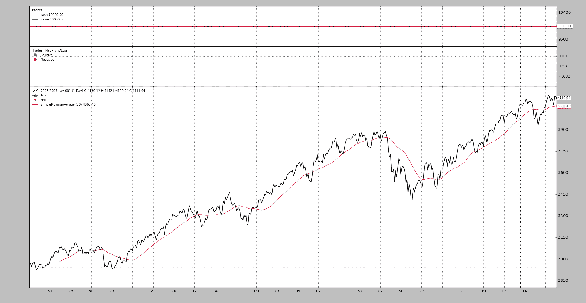

# 绘图

> [`www.backtrader.com/docu/plotting/plotting/`](https://www.backtrader.com/docu/plotting/plotting/)的原文：

尽管*回测*是基于数学计算的自动化过程，但通常情况下，人们希望实际可视化正在发生的情况。 无论是使用经过回测运行的现有算法，还是查看真正的指标（内置或自定义）与数据一起提供了什么。

而且因为一切都有人类的背后，绘制数据源、指标、操作、现金和组合价值的发展可以帮助人类更好地理解正在发生的事情，丢弃/修改/创建想法以及查看图表的人类可以用视觉信息做的任何事情。

这就是为什么*backtrader*，利用`matplotlib`提供的便利设施，提供了内置的图表功能。

## 如何绘制

任何回测运行都可以通过调用单个方法绘制：

```py
cerebro.plot()
```

当然，这通常是像这样的最后一个命令，这个简单的代码使用了*backtrader*源之一的样本数据。

```py
from __future__ import (absolute_import, division, print_function,
                        unicode_literals)

import backtrader as bt

class St(bt.Strategy):
    def __init__(self):
        self.sma = bt.indicators.SimpleMovingAverage(self.data)

data = bt.feeds.BacktraderCSVData(dataname='../../datas/2005-2006-day-001.txt')

cerebro = bt.Cerebro()
cerebro.adddata(data)
cerebro.addstrategy(St)
cerebro.run()
cerebro.plot()
```

这产生了以下图表。



图表包括 3 个*观察器*，在这种情况下，考虑到没有任何交易，它们基本上是没有意义的

+   一个`CashValue`观察器，如其名称所示，在回测运行的生命周期内跟踪`Cash`和总投资组合`Value`（包括现金）

+   一个`Trade`观察器，在一次交易结束时显示实际的*盈亏*

    交易被定义为开仓并将仓位调回`0`（直接或从多头到空头或空头到多头）

+   一个`BuySell`观察器，在价格之上绘制*买入*和*卖出*操作的位置

这*3 个观察器*是由`cerebro`自动添加的，并且通过`stdstats`参数（默认为`True`）进行控制。 如果希望禁用它们，请执行以下操作：

```py
cerebro = bt.Cerebro(stdstats=False)
```

或者稍后*运行*时，例如：

```py
cerebro = bt.Cerebro()
...
cerebro.run(stdstats=False)
```

## 绘制的元素

尽管在介绍中已经提到了`Observers`，但它们并不是唯一要绘制的元素。 这三个东西被绘制出来：

+   使用`adddata`、`replaydata`和`resampledata`将*数据源*添加到 Cerebro

+   在策略级别声明的*指标*（或者使用`addindicator`将其添加到 cerebro，这纯粹是为了实验目的，并将指标添加到虚拟策略中）

+   使用`addobserver`将*观察器*添加到 cerebro 的选项

    观察器是*lines*对象，它们与*strategy*同步运行，并且可以访问整个生态系统，以便跟踪`Cash`和`Value`等情况

## 绘图选项

*指标*和*观察器*有几个选项，控制它们在图表上的绘制方式。 有三大组：

+   影响整个对象绘图行为的选项

+   影响单个线条绘图行为的选项

+   影响系统范围绘图选项的选项

### 对象范围的绘图选项

这些由 *Indicators* 和 *Observers* 中的数据集控制：

```py
plotinfo = dict(plot=True,
                subplot=True,
                plotname='',
                plotskip=False,
                plotabove=False,
                plotlinelabels=False,
                plotlinevalues=True,
                plotvaluetags=True,
                plotymargin=0.0,
                plotyhlines=[],
                plotyticks=[],
                plothlines=[],
                plotforce=False,
                plotmaster=None,
                plotylimited=True,
           )
```

尽管在类定义期间 `plotinfo` 显示为 `dict`，但 *backtrader* 的元类机制将其转换为一个对象，该对象被继承并且可以进行多重继承。这意味着：

+   如果子类更改了 `subplot=True` 这样的值为 `subplot=False`，则层级结构下面的子类将以后者作为 `subplot` 的默认值。

给这些参数赋值有两种方法。让我们看一下第 1 种方法的 `SimpleMovingAverage` 实例化：

```py
sma = bt.indicators.SimpleMovingAverage(self.data, period=15, plotname='mysma')
```

如示例所示，`SimpleMovingAverage` 构造函数未使用的任何 `**kwargs` 将被解析（如果可能）为 `plotinfo` 的值。`SimpleMovingAverage` 仅定义了一个名为 `period` 的参数。这意味着 `plotname` 将与 `plotinfo` 中同名的参数相匹配。

第 2 种方法：

```py
sma = bt.indicators.SimpleMovingAverage(self.data, period=15)
sma.plotinfo.plotname = 'mysma'
```

可以访问沿着 *SimpleMovingAverage* 实例化的 `plotinfo` 对象，也可以使用标准的 *Python* 点符号访问其中的参数。简单且可能比上述语法更清晰。

#### 选项的含义

+   `plot`：对象是否需要绘制

+   `subplot`：是否沿数据绘制或在独立的子图上绘制。*移动平均线* 是在数据上绘制的示例。*随机指标* 和 *RSI* 是在不同比例尺上的子图中绘制的示例。

+   `plotname`：在图表上使用的名称，而不是 *类* 名称。如上例中的 `mysma` 而不是 `SimpleMovingAverage`。

+   `plotskip`（**已弃用**）：`plot` 的旧别名。

+   `plotabove`：是否在数据的上方绘制。否则在下方绘制。只有当 `subplot=True` 时才有效。

+   `plotlinelabels`：当 `subplot=False` 时，是否在图表上绘制单个线条名称的图例。

    示例：*布林带* 有 3 条线，但指标是绘制在数据的上方。在图例中仅显示单个名称如 `BollingerBands` 看起来更合理，而不是显示 3 条单独线的名称（`mid`、`top`、`bot`）。

    对于 `BuySell` 观察者的用例，将显示 2 条线和其标记的名称是有意义的：`Buy` 和 `Sell`，以便清楚地告诉最终用户什么是什么。

+   `plotlinevalues`：控制指标和观察者中的线条图例是否具有最后绘制的值。可以使用每条线的 `_plotvalue` 控制单个线的显示方式。

+   `plotvaluetags`：控制是否在线条右侧绘制带有最后值的值标签。可以使用每条线的 `_plotvaluetag` 控制单个线的显示方式。

+   `plotymargin`：在图表上单个子图的顶部和底部添加的边距

    这是一个基于 1 的百分比。例如：0.05 -> 5%

+   `plothlines`：包含在比例尺内需要绘制 *水平线* 的值的 *可迭代对象*。

    例如，这有助于经典指标，如`RSI`，通常在`70`和`30`处绘制线条的*超买*，*超卖*区域。

+   `plotyticks`：包含在比例尺上必须特别放置值刻度的*可迭代*对象

    例如，为了强制比例尺具有`50`来识别比例尺的中点。尽管这似乎很明显，指标使用自动缩放机制，如果一个具有`0-100`比例尺的指标在 30-95 之间定期移动，`50`可能不明显位于中心。

+   `plotyhlines`：包含在比例尺上必须绘制*水平*线的值（在比例尺内）。

    这可以同时控制`plothlines`和`plotyticks`。

    如果上述选项都未定义，则*水平*线和*刻度*的放置完全由此值控制

    如果上述任何选项被定义，它们将优先于此选项中的值

+   `plotforce`：有时候，通过匹配数据源和指标等复杂过程，自定义指标可能无法绘制。这是一种最后的手段机制，试图强制绘制。

    如果其他方法都失败，请使用它

+   `plotmaster`：*指标*/*观察者*有一个主数据，即其工作的*数据*。在某些情况下，可能希望使用不同的主数据来绘制它。

    一个用例是`PivotPoint`指标，它是在**月度**数据上计算的，但是适用于**每日**数据。只有在*每日*数据上绘制它才有意义，这是指标有意义的地方。

+   `plotylimited`：目前仅适用于数据源。如果设置为`True`（默认值），数据图上的其他线条不会改变比例尺。例如：布林带（顶部和底部）可能远离实际数据源的绝对最小值/最大值。如果设置为`\`plotlimited=True`，这些带子将保持在图表之外，因为数据控制着比例尺。如果设置为`False`，这些带子会影响 y 轴比例尺，并在图表上可见。

    一个用例是`PivotPoint`指标，它是在**月度**数据上计算的，但是适用于**每日**数据。只有在*每日*数据上绘制它才有意义，这是指标有意义的地方。

### 线条特定的绘图选项

*指标*/*观察者*有*线条*，如何绘制这些*线条*可以通过`plotlines`对象进行影响。`plotlines`中指定的大多数选项意味着在绘图时直接传递给`matplotlib`。因此，文档依赖于已完成的示例。

**重要**：选项是基于每行指定的。

一些选项由*backtrader*直接控制。所有这些选项都以下划线（`_`）开头：

+   `_plotskip`（*布尔值*）指示如果设置为`True`，则必须跳过特定线条的绘制

+   `_plotvalue`（*布尔值*）控制是否在此线条的图例中包含最后绘制的值（默认值为`True`）

+   `_plotvaluetag`（*布尔值*）控制是否绘制带有最后值的右侧标签（默认为`True`）

+   `_name`（*字符串*）用于更改特定线路的绘图名称

+   `_skipnan`（*布尔值*，默认值：False）：在绘图时跳过`NaN`值，例如允许绘制由指标生成的两个远点之间的线，其中所有中间值都为`NaN`（新创建的数据点的默认值）

+   `_samecolor`（*布尔值*）这会强制下一行具有与前一行相同的颜色，避免了`matplotlib`默认的循环遍历颜色映射以绘制每个新绘制的元素的机制

+   `_method`（*字符串*）选择`matplotlib`将用于元素的绘图方法。如果未指定，则将选择最基本的`plot`方法。

    来自`MACDHisto`的示例。这里`histo`线路被绘制为`bar`，这是行业的事实标准。在`MACDHisto`的定义中可以找到以下定义：

    ```py
    `lines = ('histo',)
    plotlines = dict(histo=dict(_method='bar', alpha=0.50, width=1.0))` 
    ```

    `alpha`和`width`是*matplotlib*的选项

+   `_fill_gt` / `_fill_lt`

    允许在给定线路和之间填充：

    +   另一条线路

    +   一个数值

    参数是一个包含 2 个元素的可迭代对象，其中：

    +   第一个参数是一个*字符串*（参考线路名称）或数值

        填充将在自身值和线路或数值的值之间完成

    +   第二个参数是：

        +   一个字符串，带有颜色名称（*matplotlib*兼容）或十六进制规范（参见*matloplit*示例）

        或

        +   一个可迭代对象，其中第一个元素是颜色的字符串/十六进制值，第二个元素是指定 alpha 透明度的数值（默认值：`0.20`，由绘图方案中的`fillalpha`控制）

    示例：

    ```py
    `# Fill for myline when above other_line with colour red
    plotlines = dict(
        myline=dict(_fill_gt('other_line', 'red'))
    )

    # Fill for myline when above 50 with colour red
    plotlines = dict(
        myline=dict(_fill_gt(50, 'red))
    )

    # Fill for myline when above other_line with colour red and 50%
    # transparency (1.0 means "no transparency")

    plotlines = dict(
        myline=dict(_fill_gt('other_line', ('red', 0.50)))
    )` 
    ```

#### 将选项传递给尚未知道的线路

+   使用名称`_X`，其中`X`代表零为基础索引中的数字。这意味着选项适用于线路`X`

`OscillatorMixIn`的一个用例：

```py
plotlines = dict(_0=dict(_name='osc'))
```

如名称所示，这是一个*混合*类，旨在在多重继承方案（特别是在右侧）中使用。 *mixin*对来自将成为多重继承混合的其他指标的第一个线路的实际名称（索引从零开始）没有任何了解。

这就是为什么选项被指定为：`_0`。子类化完成后，结果类的第一行将在图中具有名称`osc`。

#### 一些绘图线路示例

`BuySell`观察器包括以下内容：

```py
plotlines = dict(
    buy=dict(marker='^', markersize=8.0, color='lime', fillstyle='full'),
    sell=dict(marker='v', markersize=8.0, color='red', fillstyle='full')
)
```

`buy`和`sell`线路有一些选项，直接传递给`matplotlib`以定义*marker*、*markersize*、*color*和*fillstyle*。所有这些选项都在*matplotlib*中定义。

`Trades`观察器包括以下内容：

```py
...
lines = ('pnlplus', 'pnlminus')
...

plotlines = dict(
    pnlplus=dict(_name='Positive',
                 marker='o', color='blue',
                 markersize=8.0, fillstyle='full'),
    pnlminus=dict(_name='Negative',
                  marker='o', color='red',
                  markersize=8.0, fillstyle='full')
)
```

这里使用`_name`将线路名称重新定义为例如`pnlplus`变为`Positive`。其余选项用于*matplotlib*

`DrawDown`观察器：

```py
lines = ('drawdown', 'maxdrawdown',)

...

plotlines = dict(maxdrawdown=dict(_plotskip='True',))
```

这个定义了两条线，让最终用户不仅可以访问当前 `drawdown` 的值，还可以访问其最大值 (`maxdrawdown`)。但由于 `_plotskip=True`，后者不会绘制出来

`BollingerBands` 指标：

```py
plotlines = dict(
    mid=dict(ls='--'),
    top=dict(_samecolor=True),
    bot=dict(_samecolor=True),
)
```

这里 `mid` 线将以 *虚线* 样式绘制，而 `top` 和 `bot` 线将与 `mid` 线具有相同的颜色。

`Stochastic`（在 `_StochasticBase` 中定义并继承）：

```py
lines = ('percK', 'percD',)
...
plotlines = dict(percD=dict(_name='%D', ls='--'),
                 percK=dict(_name='%K'))
```

较慢的线 `percD` 以 *虚线* 样式绘制。并且线的名称更改为包含花哨的 `%` 符号（`%K` 和 `%D`），在 *Python* 中无法在名称定义中使用

### 控制绘图的方法

处理 *Indicators* 和 *Observers* 时，支持以下方法以进一步控制绘图：

+   `_plotlabel(self)`

    应该返回一列东西，以符合将在 *Indicators* 或 *Observer* 名称后放置在括号中的标签

    从 `RSI` 指标的一个例子：

    ```py
    `def _plotlabel(self):
        plabels = [self.p.period]
        plabels += [self.p.movav] * self.p.notdefault('movav')
        return plabels` 
    ```

    可以看到这个方法返回：

    +   一个 `int`，表示为 `RSI` 配置的周期，如果默认移动平均线已更改，则是特定的类

        在后台，两者都将转换为字符串。在 *class* 的情况下，将努力只打印类的名称，而不是完整的 `module.name` 组合。

+   `_plotinit(self)`

    在绘图开始时调用，执行指标可能需要的任何特定初始化。再次，来自 `RSI` 的一个例子：

    ```py
    `def _plotinit(self):
        self.plotinfo.plotyhlines = [self.p.upperband, self.p.lowerband]` 
    ```

    这里的代码为 `plotyhlines` 赋值，以在特定 `y` 值处绘制水平线（`hlines` 部分）。

    参数 `upperband` 和 `lowerband` 的值将用于此操作，因为参数可以由最终用户更改，所以无法事先知道

### 系统范围内的绘图选项

首先是在 cerebro 中的 `plot` 的*签名*：

```py
def plot(self, plotter=None, numfigs=1, iplot=True, **kwargs):
```

这意味着：

+   `plotter`：包含作为属性的选项，控制系统范围内绘图的对象/类

    如果传递了 `None`，则将实例化一个默认的 `PlotScheme` 对象（见下文）

+   `numfigs`：将绘图分解为多少个独立图表

    有时图表包含太多条形，如果在单个图中打包，将不容易阅读。这将根据请求的数量将其分解为相同数量的部分

+   `iplot`：如果在 Jupyter Notebook 中运行，则自动绘制内联

+   `**kwargs`：args 将用于更改 `plotter` 或默认 `PlotScheme` 对象的属性值，如果没有传递 `plotter` 则会创建默认的 `PlotScheme` 对象。

#### PlotScheme

此对象包含控制系统范围内绘图的所有选项。选项在代码中有文档：

```py
class PlotScheme(object):
    def __init__(self):
        # to have a tight packing on the chart wether only the x axis or also
        # the y axis have (see matplotlib)
        self.ytight = False

        # y-margin (top/bottom) for the subcharts. This will not overrule the
        # option plotinfo.plotymargin
        self.yadjust = 0.0
        # Each new line is in z-order below the previous one. change it False
        # to have lines paint above the previous line
        self.zdown = True
        # Rotation of the date labes on the x axis
        self.tickrotation = 15

        # How many "subparts" takes a major chart (datas) in the overall chart
        # This is proportional to the total number of subcharts
        self.rowsmajor = 5

        # How many "subparts" takes a minor chart (indicators/observers) in the
        # overall chart. This is proportional to the total number of subcharts
        # Together with rowsmajor, this defines a proportion ratio betwen data
        # charts and indicators/observers charts
        self.rowsminor = 1

        # Distance in between subcharts
        self.plotdist = 0.0

        # Have a grid in the background of all charts
        self.grid = True

        # Default plotstyle for the OHLC bars which (line -> line on close)
        # Other options: 'bar' and 'candle'
        self.style = 'line'

        # Default color for the 'line on close' plot
        self.loc = 'black'
        # Default color for a bullish bar/candle (0.75 -> intensity of gray)
        self.barup = '0.75'
        # Default color for a bearish bar/candle
        self.bardown = 'red'
        # Level of transparency to apply to bars/cancles (NOT USED)
        self.bartrans = 1.0

        # Wether the candlesticks have to be filled or be transparent
        self.barupfill = True
        self.bardownfill = True

        # Wether the candlesticks have to be filled or be transparent
        self.fillalpha = 0.20

        # Wether to plot volume or not. Note: if the data in question has no
        # volume values, volume plotting will be skipped even if this is True
        self.volume = True

        # Wether to overlay the volume on the data or use a separate subchart
        self.voloverlay = True
        # Scaling of the volume to the data when plotting as overlay
        self.volscaling = 0.33
        # Pushing overlay volume up for better visibiliy. Experimentation
        # needed if the volume and data overlap too much
        self.volpushup = 0.00

        # Default colour for the volume of a bullish day
        self.volup = '#aaaaaa'  # 0.66 of gray
        # Default colour for the volume of a bearish day
        self.voldown = '#cc6073'  # (204, 96, 115)
        # Transparency to apply to the volume when overlaying
        self.voltrans = 0.50

        # Transparency for text labels (NOT USED CURRENTLY)
        self.subtxttrans = 0.66
        # Default font text size for labels on the chart
        self.subtxtsize = 9

        # Transparency for the legend (NOT USED CURRENTLY)
        self.legendtrans = 0.25
        # Wether indicators have a leged displaey in their charts
        self.legendind = True
        # Location of the legend for indicators (see matplotlib)
        self.legendindloc = 'upper left'

        # Plot the last value of a line after the Object name
        self.linevalues = True

        # Plot a tag at the end of each line with the last value
        self.valuetags = True

        # Default color for horizontal lines (see plotinfo.plothlines)
        self.hlinescolor = '0.66'  # shade of gray
        # Default style for horizontal lines
        self.hlinesstyle = '--'
        # Default width for horizontal lines
        self.hlineswidth = 1.0

        # Default color scheme: Tableau 10
        self.lcolors = tableau10

        # strftime Format string for the display of ticks on the x axis
        self.fmt_x_ticks = None

        # strftime Format string for the display of data points values
        self.fmt_x_data = None
```

#### PlotScheme 中的颜色

`PlotScheme` 类定义了一个方法，可以在子类中重写，该方法返回下一个要使用的颜色：

```py
def color(self, idx)
```

其中`idx`是当前正在绘制的单个子图上的行的索引。例如，`MACD`绘制了 3 条线，因此`idx`变量只会有以下值：`0`、`1`和`2`。下一个图表（可能是另一个指标）将从`0`开始重新计数。

默认颜色方案使用的是*backtrader*中的（如上所示）`Tableau 10 Color Palette`，其索引修改为：

```py
tab10_index = [3, 0, 2, 1, 2, 4, 5, 6, 7, 8, 9]
```

通过覆盖`color`方法或将`lcolors`变量传递给`plot`（或在`PlotScheme`的子类中），可以完全改变着色方式。

源代码还包含了`Tableau 10 Light`和`Tableau 20`颜色调色板的定义。
