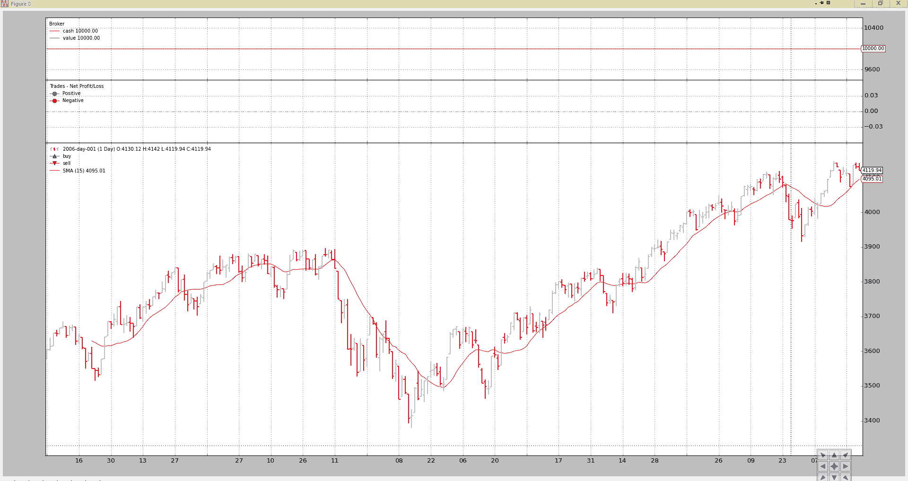
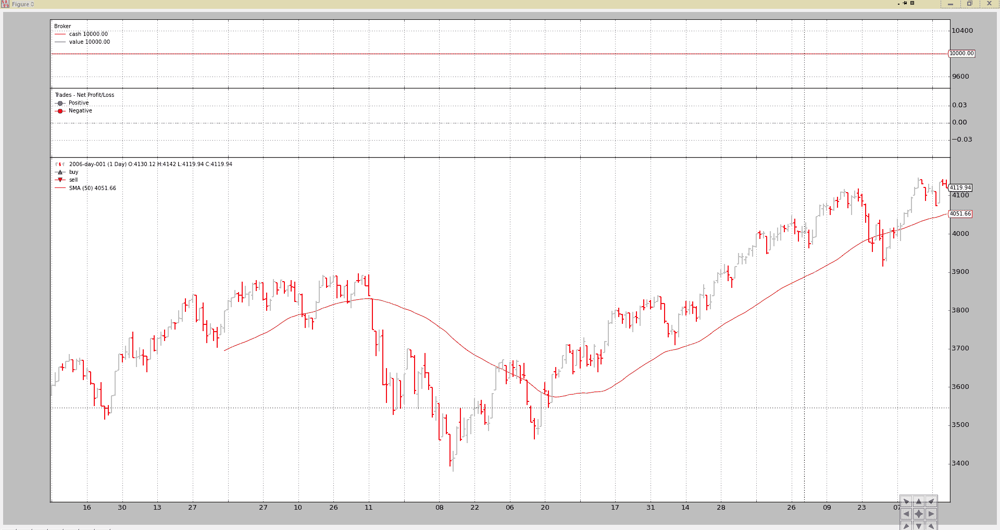
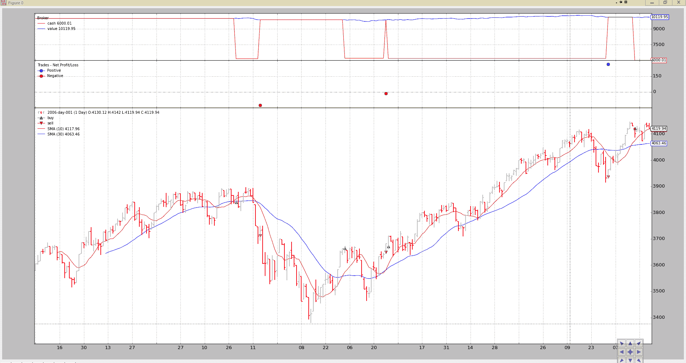
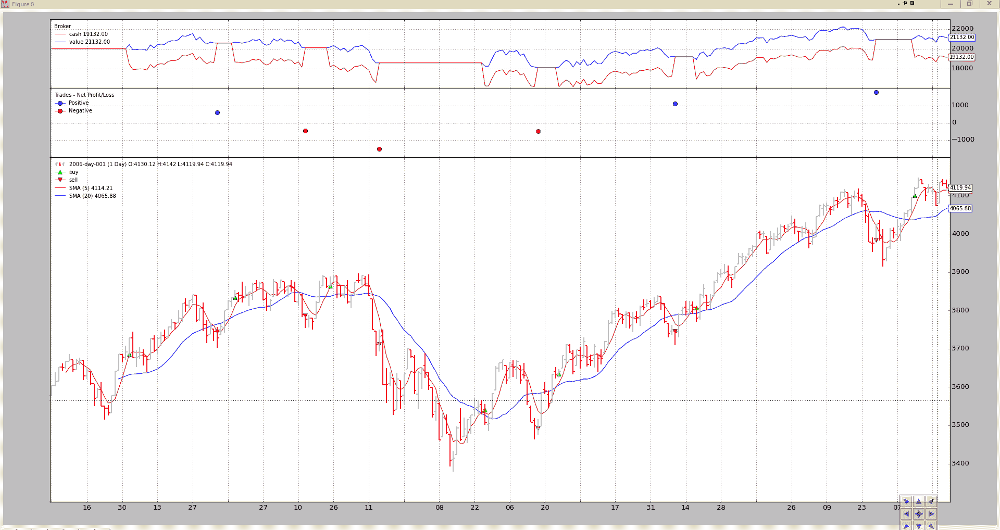
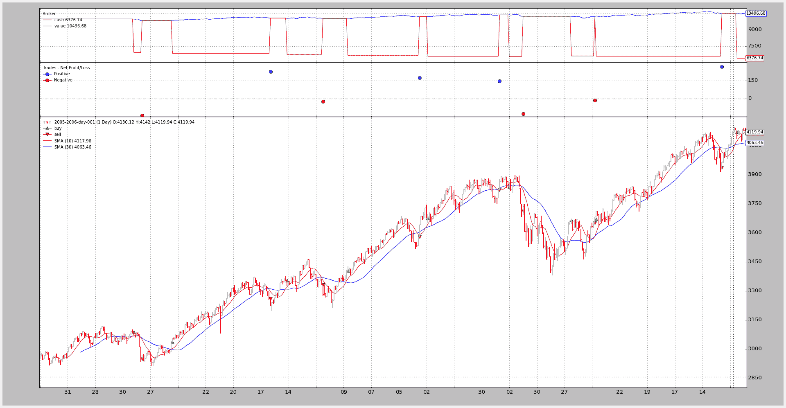
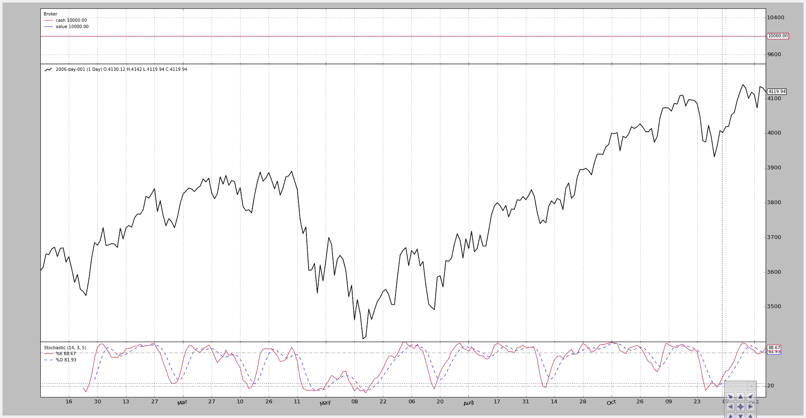
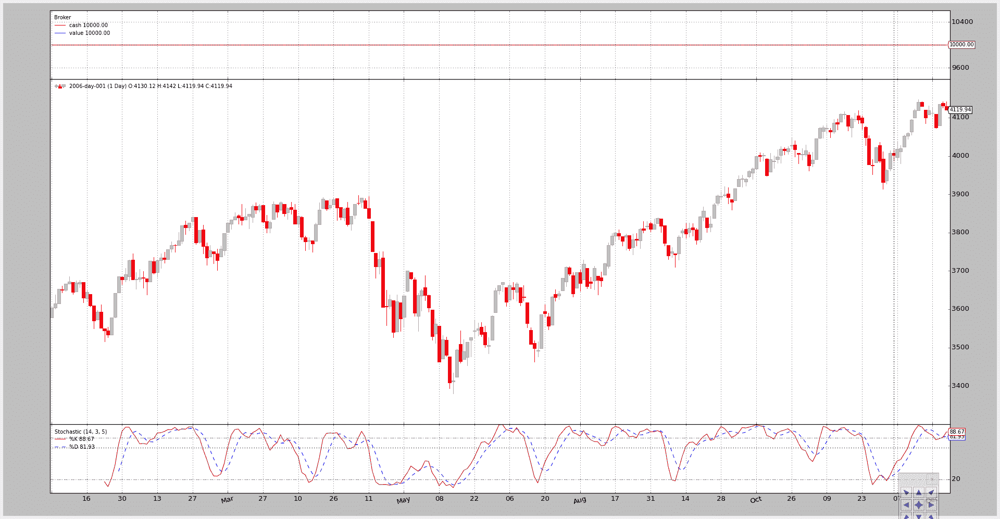

# 自动化回测

> 原文：[`www.backtrader.com/docu/automated-bt-run/automated-bt-run/`](https://www.backtrader.com/docu/automated-bt-run/automated-bt-run/)

到目前为止，所有的`backtrader`示例和工作样本都是从头开始创建一个主要的**Python**模块，该模块加载数据、策略、观察器，并准备好现金和佣金方案。

*算法交易*的一个目标之一是交易的自动化，鉴于 backtrader 是一个用于检查交易算法的*回测*平台（因此是一个*算法交易*平台），自动化使用 backtrader 是一个明显的目标。

当安装`backtrader`时，它提供了两个脚本/可执行文件形式的入口点，可以自动化大多数任务：

+   `bt-run-py` 一个使用下一项中的代码库的脚本

和

+   `btrun`（可执行文件）

    打包过程中由`setuptools`创建的入口点。在理论上，在 Windows 下不会出现“路径/文件未找到”的错误。

下面的描述同样适用于这两个工具。

`btrun` 允许最终用户：

+   说出必须加载的数据源

+   设置加载数据的格式

+   指定数据的日期范围

+   向 Cerebro 传递参数

    +   禁用标准观察器

    这是在“Cerebro”参数实现之前的一个原始额外开关。因此，如果向 cerebro 传递关于标准观察器的参数，这将被忽略（参数`stdstats`到 Cerebro）

+   加载一个或多个观察器（例如：`DrawDown`）从内置的或来自 Python 模块

+   为经纪人设置现金和佣金方案参数（佣金、保证金、倍数）

+   启用绘图，控制图表的数量和数据呈现的样式

+   向系统添加一个带参数的写入器

最后应该是核心能力是什么：

+   加载一个策略（内置的或来自 Python 模块）

+   向加载的策略传递参数

请参阅下面关于脚本的**使用**。

## 应用用户定义的策略

让我们考虑以下策略：

+   简单加载一个 SimpleMovingAverage（默认周期为 15）

+   打印输出

+   存储在一个名为`mymod.py`的文件中

```py
`from __future__ import (absolute_import, division, print_function,
                        unicode_literals)

import backtrader as bt
import backtrader.indicators as btind

class MyTest(bt.Strategy):
    params = (('period', 15),)

    def log(self, txt, dt=None):
  ''' Logging function fot this strategy'''
        dt = dt or self.data.datetime[0]
        if isinstance(dt, float):
            dt = bt.num2date(dt)
        print('%s, %s' % (dt.isoformat(), txt))

    def __init__(self):
        sma = btind.SMA(period=self.p.period)

    def next(self):
        ltxt = '%d, %.2f, %.2f, %.2f, %.2f, %.2f, %.2f'

        self.log(ltxt %
                 (len(self),
                  self.data.open[0], self.data.high[0],
                  self.data.low[0], self.data.close[0],
                  self.data.volume[0], self.data.openinterest[0]))` 
```

使用通常的测试样本执行策略很容易：

```py
`btrun --csvformat btcsv \
      --data ../../datas/2006-day-001.txt \
      --strategy mymod.py` 
```

图表输出



控制台输出：

```py
`2006-01-20T23:59:59+00:00, 15, 3593.16, 3612.37, 3550.80, 3550.80, 0.00, 0.00
2006-01-23T23:59:59+00:00, 16, 3550.24, 3550.24, 3515.07, 3544.31, 0.00, 0.00
2006-01-24T23:59:59+00:00, 17, 3544.78, 3553.16, 3526.37, 3532.68, 0.00, 0.00
2006-01-25T23:59:59+00:00, 18, 3532.72, 3578.00, 3532.72, 3578.00, 0.00, 0.00
...
...
2006-12-22T23:59:59+00:00, 252, 4109.86, 4109.86, 4072.62, 4073.50, 0.00, 0.00
2006-12-27T23:59:59+00:00, 253, 4079.70, 4134.86, 4079.70, 4134.86, 0.00, 0.00
2006-12-28T23:59:59+00:00, 254, 4137.44, 4142.06, 4125.14, 4130.66, 0.00, 0.00
2006-12-29T23:59:59+00:00, 255, 4130.12, 4142.01, 4119.94, 4119.94, 0.00, 0.00` 
```

相同的策略，但：

+   将参数`period`设置为 50

命令行：

```py
`btrun --csvformat btcsv \
      --data ../../datas/2006-day-001.txt \
      --plot \
      --strategy mymod.py:period=50` 
```

图表输出。



注意

如果没有给出`.py`扩展名，bt-run 将会添加它。

## 使用内置策略

`backtrader` 将逐渐包含样例（教科书）策略。与 `bt-run.py` 脚本一起，一个标准的*简单移动平均线交叉*策略已经包含在内。这个名称：

+   `SMA_CrossOver`

+   参数

    +   `fast`（默认 `10`）快速移动平均线的周期

    +   `slow`（默认 `30`）慢速移动平均线的周期

如果快速移动平均线上穿过快速移动平均线，则策略买入，如果它以前已经买入，则在快速移动平均线下穿过慢速移动平均线时卖出。

代码

```py
`from __future__ import (absolute_import, division, print_function,
                        unicode_literals)

import backtrader as bt
import backtrader.indicators as btind

class SMA_CrossOver(bt.Strategy):

    params = (('fast', 10), ('slow', 30))

    def __init__(self):

        sma_fast = btind.SMA(period=self.p.fast)
        sma_slow = btind.SMA(period=self.p.slow)

        self.buysig = btind.CrossOver(sma_fast, sma_slow)

    def next(self):
        if self.position.size:
            if self.buysig < 0:
                self.sell()

        elif self.buysig > 0:
            self.buy()` 
```

标准执行：

```py
`btrun --csvformat btcsv \
      --data ../../datas/2006-day-001.txt \
      --plot \
      --strategy :SMA_CrossOver` 
```

请注意 `:`。加载策略的标准表示法（见下文）是：

+   `module:stragegy:kwargs`

使用以下规则：

+   如果存在模块和/或策略，则将使用该策略

+   如果模块存在但未指定策略，则将返回模块中找到的第 1 个策略

+   如果没有指定模块，则假定“strategy”是指 backtrader 包中的策略

+   如果存在模块和/或策略，并且存在 kwargs，则将其传递给相应的策略

注意

相同的表示法和规则适用于 `--observer`、`--analyzer` 和 `--indicator` 选项

显然，适用于相应的对象类型

输出



最后一个例子，添加佣金方案，现金和更改参数：

```py
`btrun --csvformat btcsv \
      --data ../../datas/2006-day-001.txt \
      --plot \
      --cash 20000 \
      --commission 2.0 \
      --mult 10 \
      --margin 2000 \
      --strategy :SMA_CrossOver:fast=5,slow=20` 
```

输出



我们已经对策略进行了回测：

+   更改移动平均周期

+   设置新的起始现金

+   为类似期货的工具设置佣金方案

    请注意每个柱状图中现金的连续变化，因为现金会根据类似期货的工具的每日变化进行调整

## 不使用策略

这是一种言过其实的说法。将应用一种策略，但您可以忽略任何类型的策略，并添加默认的 backtrader.Strategy。

分析器、观察者和指标将自动注入策略中。

一个例子：

```py
`btrun --csvformat btcsv \
      --data ../../datas/2006-day-001.txt \
      --cash 20000 \
      --commission 2.0 \
      --mult 10 \
      --margin 2000 \
      --nostdstats \
      --observer :Broker` 
```

这将没有太大作用，但达到了预期目的：

+   默认添加了一个 backtrader.Strategy

+   Cerebro 不会实例化常规的 `stdstats` 观察者（经纪人、买卖、交易）

+   手动添加一个 `Broker` 观察者

如上所述，`nostdstats` 是一个遗留参数。较新版本的 `btrun` 可以直接将参数传递给 `Cerebro`。等效的调用将是：

```py
`btrun --csvformat btcsv \
      --data ../../datas/2006-day-001.txt \
      --cash 20000 \
      --commission 2.0 \
      --mult 10 \
      --margin 2000 \
      --cerebro stdstats=False \
      --observer :Broker` 
```

## 添加分析器

`btrun` 还支持使用与选择策略相同的语法添加 `Analyzers`。

对于 2005-2006 年的 `SharpeRatio` 分析的示例：

```py
`btrun --csvformat btcsv \
      --data ../../datas/2005-2006-day-001.txt \
      --strategy :SMA_CrossOver \
      --analyzer :SharpeRatio` 
```

控制台输出为 **nothing**。

如果希望打印 `Analyzer` 结果，则必须指定：

+   `--pranalyzer` 默认调用下一个（除非分析器已经覆盖了正确的方法）

+   `--ppranalyzer` 使用 `pprint` 模块打印结果

注意

在 `writers` 成为 backtrader 的一部分之前，两个打印选项已经实现。添加一个没有 csv 输出的 writer 将达到相同的效果（输出已经得到改进）

扩展上面的示例：

```py
`btrun --csvformat btcsv \
      --data ../../datas/2005-2006-day-001.txt \
      --strategy :SMA_CrossOver \
      --analyzer :SharpeRatio \
      --plot \
      --pranalyzer

====================
== Analyzers
====================
##########
sharperatio
##########
{'sharperatio': 11.647332609673256}` 
```

好战略！！！（事实上，这只是一个例子，也没有佣金）

图表（仅显示分析器不在图中，因为分析器不能绘制，它们不是线对象）



相同的例子，但使用了 `writer` 参数：

```py
`btrun --csvformat btcsv \
      --data ../../datas/2005-2006-day-001.txt \
      --strategy :SMA_CrossOver \
      --analyzer :SharpeRatio \
      --plot \
      --writer

===============================================================================
Cerebro:
  -----------------------------------------------------------------------------
  - Datas:
    +++++++++++++++++++++++++++++++++++++++++++++++++++++++++++++++++++++++++++
    - Data0:
      - Name: 2005-2006-day-001
      - Timeframe: Days
      - Compression: 1
  -----------------------------------------------------------------------------
  - Strategies:
    +++++++++++++++++++++++++++++++++++++++++++++++++++++++++++++++++++++++++++
    - SMA_CrossOver:
      *************************************************************************
      - Params:
        - fast: 10
        - slow: 30
        - _movav: SMA
      *************************************************************************
      - Indicators:
        .......................................................................
        - SMA:
          - Lines: sma
          ~~~~~~~~~~~~~~~~~~~~~~~~~~~~~~~~~~~~~~~~~~~~~~~~~~~~~~~~~~~~~~~~~~~~~
          - Params:
            - period: 30
        .......................................................................
        - CrossOver:
          - Lines: crossover
          - Params: None
      *************************************************************************
      - Observers:
        .......................................................................
        - Broker:
          - Lines: cash, value
          - Params: None
        .......................................................................
        - BuySell:
          - Lines: buy, sell
          - Params: None
        .......................................................................
        - Trades:
          - Lines: pnlplus, pnlminus
          - Params: None
      *************************************************************************
      - Analyzers:
        .......................................................................
        - Value:
          - Begin: 10000.0
          - End: 10496.68
        .......................................................................
        - SharpeRatio:
          - Params: None
          ~~~~~~~~~~~~~~~~~~~~~~~~~~~~~~~~~~~~~~~~~~~~~~~~~~~~~~~~~~~~~~~~~~~~~
          - Analysis:
            - sharperatio: 11.6473326097` 
```

## 添加指标和观察者

与 `Strategies` 和 `Analyzers` 一样，btrun 也可以添加：

+   `指标`

和

+   `观察者`

当添加 `Broker` 观察者时，语法与上面看到的完全相同。

让我们重复一下例子，但添加一个 `Stochastic`，`Broker` 并查看图表（我们将更改一些参数）：

```py
`btrun --csvformat btcsv \
      --data ../../datas/2006-day-001.txt \
      --nostdstats \
      --observer :Broker \
      --indicator :Stochastic:period_dslow=5 \
      --plot` 
```

图表



## 绘图控制

上面大部分的例子都使用了以下选项：

+   `--plot` 激活了默认图表的创建

通过向 `--plot` 选项添加 `kwargs` 可以实现更多控制

+   例如，使用 `--plot style="candle"` 来绘制蜡烛图，而不是使用 `LineOnClose` 样式（这是默认的绘图样式）

调用：

```py
`btrun --csvformat btcsv \
      --data ../../datas/2006-day-001.txt \
      --nostdstats \
      --observer :Broker \
      --indicator :Stochastic:period_dslow=5 \
      --plot style=\"candle\"` 
```

注意

因为示例在 bash shell 中运行，该 shell 在传递参数给脚本之前会删除反斜杠，所以围绕 `candle` 的引号被反斜杠 `\\` 引用。

在这种情况下需要使用反斜杠引用，以确保“bar”传递到脚本并可以作为字符串进行评估

图表



## 脚本的用法

直接从脚本中：

```py
`$ btrun --help
usage: btrun-script.py [-h] --data DATA [--cerebro [kwargs]] [--nostdstats]
                       [--format {yahoocsv_unreversed,vchart,vchartcsv,yahoo,mt4csv,ibdata,sierracsv,yahoocsv,btcsv,vcdata}]
                       [--fromdate FROMDATE] [--todate TODATE]
                       [--timeframe {microseconds,seconds,weeks,months,minutes,days,years}]
                       [--compression COMPRESSION]
                       [--resample RESAMPLE | --replay REPLAY]
                       [--strategy module:name:kwargs]
                       [--signal module:signaltype:name:kwargs]
                       [--observer module:name:kwargs]
                       [--analyzer module:name:kwargs]
                       [--pranalyzer | --ppranalyzer]
                       [--indicator module:name:kwargs] [--writer [kwargs]]
                       [--cash CASH] [--commission COMMISSION]
                       [--margin MARGIN] [--mult MULT] [--interest INTEREST]
                       [--interest_long] [--slip_perc SLIP_PERC]
                       [--slip_fixed SLIP_FIXED] [--slip_open]
                       [--no-slip_match] [--slip_out] [--flush]
                       [--plot [kwargs]]

Backtrader Run Script

optional arguments:
  -h, --help            show this help message and exit
  --resample RESAMPLE, -rs RESAMPLE
                        resample with timeframe:compression values
  --replay REPLAY, -rp REPLAY
                        replay with timeframe:compression values
  --pranalyzer, -pralyzer
                        Automatically print analyzers
  --ppranalyzer, -ppralyzer
                        Automatically PRETTY print analyzers
  --plot [kwargs], -p [kwargs]
                        Plot the read data applying any kwargs passed

                        For example:

                          --plot style="candle" (to plot candlesticks)

Data options:
  --data DATA, -d DATA  Data files to be added to the system

Cerebro options:
  --cerebro [kwargs], -cer [kwargs]
                        The argument can be specified with the following form:

                          - kwargs

                            Example: "preload=True" which set its to True

                        The passed kwargs will be passed directly to the cerebro
                        instance created for the execution

                        The available kwargs to cerebro are:
                          - preload (default: True)
                          - runonce (default: True)
                          - maxcpus (default: None)
                          - stdstats (default: True)
                          - live (default: False)
                          - exactbars (default: False)
                          - preload (default: True)
                          - writer (default False)
                          - oldbuysell (default False)
                          - tradehistory (default False)
  --nostdstats          Disable the standard statistics observers
  --format {yahoocsv_unreversed,vchart,vchartcsv,yahoo,mt4csv,ibdata,sierracsv,yahoocsv,btcsv,vcdata}, --csvformat {yahoocsv_unreversed,vchart,vchartcsv,yahoo,mt4csv,ibdata,sierracsv,yahoocsv,btcsv,vcdata}, -c {yahoocsv_unreversed,vchart,vchartcsv,yahoo,mt4csv,ibdata,sierracsv,yahoocsv,btcsv,vcdata}
                        CSV Format
  --fromdate FROMDATE, -f FROMDATE
                        Starting date in YYYY-MM-DD[THH:MM:SS] format
  --todate TODATE, -t TODATE
                        Ending date in YYYY-MM-DD[THH:MM:SS] format
  --timeframe {microseconds,seconds,weeks,months,minutes,days,years}, -tf {microseconds,seconds,weeks,months,minutes,days,years}
                        Ending date in YYYY-MM-DD[THH:MM:SS] format
  --compression COMPRESSION, -cp COMPRESSION
                        Ending date in YYYY-MM-DD[THH:MM:SS] format

Strategy options:
  --strategy module:name:kwargs, -st module:name:kwargs
                        This option can be specified multiple times.

                        The argument can be specified with the following form:

                          - module:classname:kwargs

                            Example: mymod:myclass:a=1,b=2

                        kwargs is optional

                        If module is omitted then class name will be sought in
                        the built-in strategies module. Such as in:

                          - :name:kwargs or :name

                        If name is omitted, then the 1st strategy found in the mod
                        will be used. Such as in:

                          - module or module::kwargs

Signals:
  --signal module:signaltype:name:kwargs, -sig module:signaltype:name:kwargs
                        This option can be specified multiple times.

                        The argument can be specified with the following form:

                          - signaltype:module:signaltype:classname:kwargs

                            Example: longshort+mymod:myclass:a=1,b=2

                        signaltype may be ommited: longshort will be used

                            Example: mymod:myclass:a=1,b=2

                        kwargs is optional

                        signaltype will be uppercased to match the defintions
                        fromt the backtrader.signal module

                        If module is omitted then class name will be sought in
                        the built-in signals module. Such as in:

                          - LONGSHORT::name:kwargs or :name

                        If name is omitted, then the 1st signal found in the mod
                        will be used. Such as in:

                          - module or module:::kwargs

Observers and statistics:
  --observer module:name:kwargs, -ob module:name:kwargs
                        This option can be specified multiple times.

                        The argument can be specified with the following form:

                          - module:classname:kwargs

                            Example: mymod:myclass:a=1,b=2

                        kwargs is optional

                        If module is omitted then class name will be sought in
                        the built-in observers module. Such as in:

                          - :name:kwargs or :name

                        If name is omitted, then the 1st observer found in the
                        will be used. Such as in:

                          - module or module::kwargs

Analyzers:
  --analyzer module:name:kwargs, -an module:name:kwargs
                        This option can be specified multiple times.

                        The argument can be specified with the following form:

                          - module:classname:kwargs

                            Example: mymod:myclass:a=1,b=2

                        kwargs is optional

                        If module is omitted then class name will be sought in
                        the built-in analyzers module. Such as in:

                          - :name:kwargs or :name

                        If name is omitted, then the 1st analyzer found in the
                        will be used. Such as in:

                          - module or module::kwargs

Indicators:
  --indicator module:name:kwargs, -ind module:name:kwargs
                        This option can be specified multiple times.

                        The argument can be specified with the following form:

                          - module:classname:kwargs

                            Example: mymod:myclass:a=1,b=2

                        kwargs is optional

                        If module is omitted then class name will be sought in
                        the built-in analyzers module. Such as in:

                          - :name:kwargs or :name

                        If name is omitted, then the 1st analyzer found in the
                        will be used. Such as in:

                          - module or module::kwargs

Writers:
  --writer [kwargs], -wr [kwargs]
                        This option can be specified multiple times.

                        The argument can be specified with the following form:

                          - kwargs

                            Example: a=1,b=2

                        kwargs is optional

                        It creates a system wide writer which outputs run data

                        Please see the documentation for the available kwargs

Cash and Commission Scheme Args:
  --cash CASH, -cash CASH
                        Cash to set to the broker
  --commission COMMISSION, -comm COMMISSION
                        Commission value to set
  --margin MARGIN, -marg MARGIN
                        Margin type to set
  --mult MULT, -mul MULT
                        Multiplier to use
  --interest INTEREST   Credit Interest rate to apply (0.0x)
  --interest_long       Apply credit interest to long positions
  --slip_perc SLIP_PERC
                        Enable slippage with a percentage value
  --slip_fixed SLIP_FIXED
                        Enable slippage with a fixed point value
  --slip_open           enable slippage for when matching opening prices
  --no-slip_match       Disable slip_match, ie: matching capped at
                        high-low if slippage goes over those limits
  --slip_out            with slip_match enabled, match outside high-low
  --flush               flush the output - useful under win32 systems` 
```
