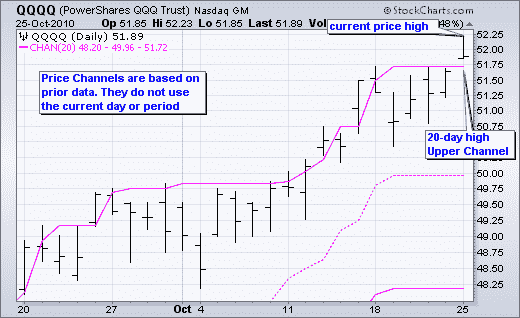
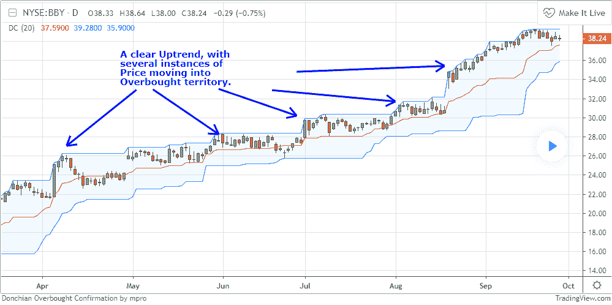
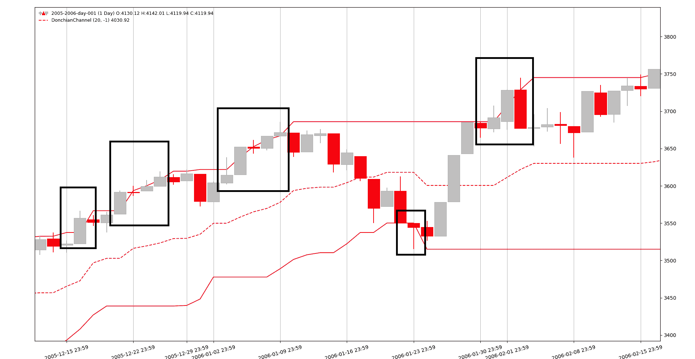
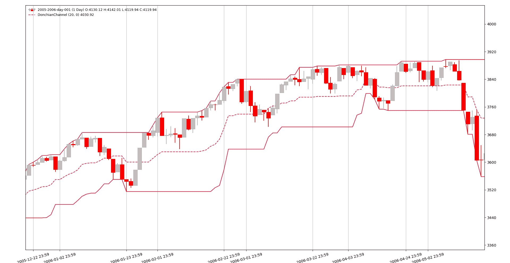

# 交叉回测陷阱

> 原文：[`www.backtrader.com/blog/posts/2019-09-04-donchian-across-platforms/donchian-across-platforms/`](https://www.backtrader.com/blog/posts/2019-09-04-donchian-across-platforms/donchian-across-platforms/)

在 [backtrader 社区](https://community.backtrader.com) 中经常出现的一件事是，用户解释了希望复制在例如 [TradingView](https://www.tradingview.com/) 中获得的回测结果，这在当今非常流行，或者其他一些回测平台。

即使不真正了解 *TradingView* 中使用的语言 `Pinescript`，并且对回测引擎的内部没有任何了解，仍然有一种方法可以让用户知道，跨平台编码必须谨慎对待。

## 指标：并非始终忠实于来源

当为 *backtrader* 实现新的指标时，无论是直接用于分发还是作为网站的片段，都会非常强调尊重原始定义。 `RSI` 就是一个很好的例子。

+   韦尔斯·怀尔德设计 `RSI` 时使用的是 `Modified Moving Average`（又称 `Smoothed Moving Average`，参见 [Wikipedia - Modified Moving Average](https://en.wikipedia.org/wiki/Moving_average#Modified_moving_average) )

+   尽管如此，许多平台给用户提供了所谓的 `RSI`，但使用的是经典的 `指数移动平均线` 而不是书中所说的。

+   鉴于这两个平均值都是指数型的，差异并不是很大，但这**并不是**韦尔斯·怀尔德定义的。它可能仍然有用，甚至可能更好，但这**不是** `RSI`。而且文档（如果有的话）也没有提到这一点。

*backtrader* 中 `RSI` 的默认配置是使用 `MMA` 以忠实于来源，但要使用哪种移动平均线是可以通过子类化或在运行时实例化期间更改的参数，以使用 `EMA` 或甚至 *简单移动平均线*。

## 一个例子：唐奇安通道

维基百科的定义：[维基百科 - 唐奇安通道](https://en.wikipedia.org/wiki/Donchian_channel) ). 这只是文本，没有提到使用通道突破作为交易信号。

另外两个定义：

+   [StockCharts - 学校 - 价格通道](https://school.stockcharts.com/doku.php?id=technical_indicators:price_channels) ).

+   [IncredibleCharts - 唐奇安通道](https://www.incrediblecharts.com/indicators/donchian_channels.php) )

这两个参考资料明确指出，用于计算通道的数据不包括当前柱，因为如果包括...突破将不会反映。这里是 *StockCharts* 的一个示例图表



现在转向 *TradingView*。首先是链接

+   [TradingView - Wiki - 唐奇安通道](https://www.tradingview.com/wiki/Donchian_Channels_(DC)) )

该页面上的一个图表。



即使*Investopedia*也使用了一张*TradingView*图表，显示**没有突破**。这里：[Investopedia - 唐奇安通道 - https://www.investopedia.com/terms/d/donchianchannels.asp](https://www.investopedia.com/terms/d/donchianchannels.asp)

正如一些人所说... **天啊！！！** 因为*TradingView*的图表中**没有**突破可见。这意味着指标的实现是使用**当前**价格栏来计算通道。

## *backtrader*中的唐奇安通道

标准*backtrader*发行版中没有`DonchianChannels`的实现，但可以很快制作。一个参数将决定当前栏是否用于通道计算。

```py
class DonchianChannels(bt.Indicator):
  '''
 Params Note:
 - ``lookback`` (default: -1)

 If `-1`, the bars to consider will start 1 bar in the past and the
 current high/low may break through the channel.

 If `0`, the current prices will be considered for the Donchian
 Channel. This means that the price will **NEVER** break through the
 upper/lower channel bands.
 '''

    alias = ('DCH', 'DonchianChannel',)

    lines = ('dcm', 'dch', 'dcl',)  # dc middle, dc high, dc low
    params = dict(
        period=20,
        lookback=-1,  # consider current bar or not
    )

    plotinfo = dict(subplot=False)  # plot along with data
    plotlines = dict(
        dcm=dict(ls='--'),  # dashed line
        dch=dict(_samecolor=True),  # use same color as prev line (dcm)
        dcl=dict(_samecolor=True),  # use same color as prev line (dch)
    )

    def __init__(self):
        hi, lo = self.data.high, self.data.low
        if self.p.lookback:  # move backwards as needed
            hi, lo = hi(self.p.lookback), lo(self.p.lookback)

        self.l.dch = bt.ind.Highest(hi, period=self.p.period)
        self.l.dcl = bt.ind.Lowest(lo, period=self.p.period)
        self.l.dcm = (self.l.dch + self.l.dcl) / 2.0  # avg of the above
```

使用`lookback=-1`参数，一个示例图表看起来像这样（放大后）



人们可以清楚地看到突破，而在`lookback=0`版本中没有突破。



## 编码影响

程序员首先去商业平台，并使用*唐奇安通道*实现一个策略。因为图表上没有显示突破，所以必须将当前价格值与前一个通道值进行比较。如下所示

```py
if price0 > channel_high_1:
    sell()
elif price0 < channel_low_1:
    buy()
```

当前价格，即：`price0`与`1`周期前的高/低通道值进行比较（因此有`_1`后缀）

作为一个谨慎的程序员，不知道*backtrader*中*唐奇安通道*的默认设置是有突破的，代码被移植过来，如下所示

```py
 `def __init__(self):
        self.donchian = DonchianChannels()

    def next(self):
        if self.data[0] > self.donchian.dch[-1]:
            self.sell()
        elif self.data[0] < self.donchian.dcl[-1]:
            self.buy()
```

这是错误的！！！因为突破发生在比较的同时。正确的代码：

```py
 `def __init__(self):
        self.donchian = DonchianChannels()

    def next(self):
        if self.data[0] > self.donchian.dch[0]:
            self.sell()
        elif self.data[0] < self.donchian.dcl[0]:
            self.buy()
```

虽然这只是一个小例子，但它展示了由于指标被编码为`1`栏差异而导致的回测结果可能会有所不同。这看起来可能并不多，但当错误的交易开始时，它肯定会产生影响。
