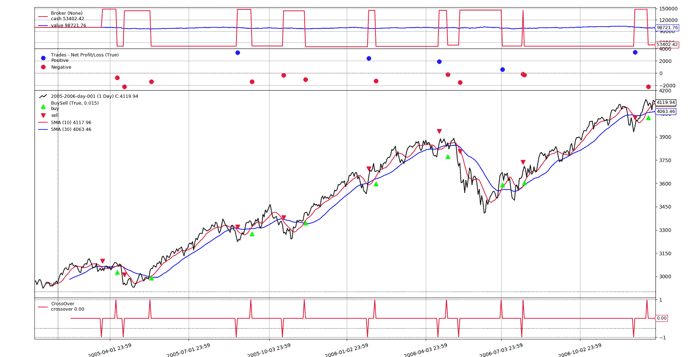
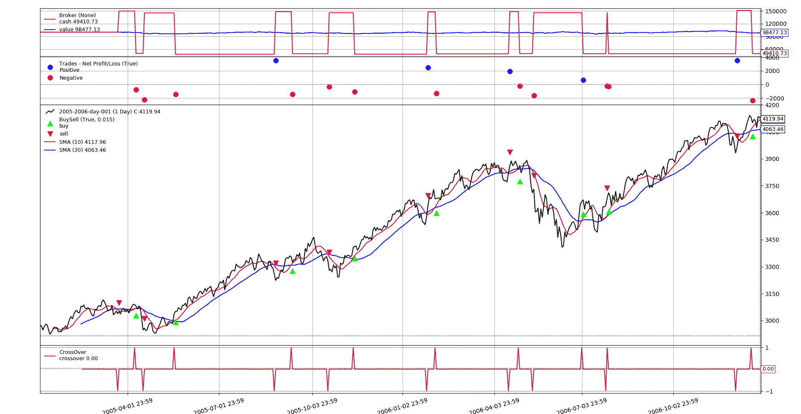

# 在 backtrader 中交易加密货币的分数大小

> 原文：[`www.backtrader.com/blog/posts/2019-08-29-fractional-sizes/fractional-sizes/`](https://www.backtrader.com/blog/posts/2019-08-29-fractional-sizes/fractional-sizes/)

首先，让我们用两行总结一下*backtrader*的工作方式：

+   就像一个基本构建块（`Cerebro`）的构建套件，可以将许多不同的部件插入其中

+   基本分发包含许多部件，如*指标*、*分析器*、*观察器*、*调整器*、*过滤器*、*数据源*、*经纪人*、*佣金/资产信息方案*，...

+   新的构建模块可以很容易地从头开始构建，或者基于现有的构建模块

+   基本构建块（`Cerebro`）已经自动进行了一些*"插入"*，使得在不必担心所有细节的情况下更容易使用该框架。

因此，该框架预先配置为提供具有默认行为的行为，例如：

+   使用单个/主数据源

+   `1-day` 时间框架/压缩组合

+   10,000 单位的货币

+   股票交易

这可能适合或不适合每个人，但重要的是：**它可以根据每个交易者/程序员的个人需求进行定制**

## 交易股票：*整数*

如上所述，默认配置是用于*股票*交易，当交易股票时，购买/出售完整股票（即：1、2...50...1000，而不是像`1.5`或`1001.7589`股票那样的金额。

这意味着当用户在默认配置中执行以下操作时：

```py
 `def next(self):
        # Apply 50% of the portfolio to buy the main asset
        self.order_target_percent(target=0.5)
```

以下发生了：

+   系统计算需要多少份资产股票，以便给定资产组合中的价值尽可能接近`50%`

+   但由于默认配置是使用**股票**进行操作，因此得到的股票数量将是一个整数，即：**一个整数**

注意

请注意，默认配置是使用单个/主数据源进行操作，这就是为什么在调用`order_percent_target`时没有指定实际数据。当操作多个数据源时，必须指定要获取/出售的数据（除非是主要数据）

## 交易加密货币：*分数*

很明显，在交易加密货币时，即使有 20 位小数，也可以购买*"半个比特币"*。

好处在于，实际上可以更改有关资产的信息。这是通过可插入的`CommissionInfo`系列实现的。

一些文档：[文档 - 佣金方案 - https://www.backtrader.com/docu/commission-schemes/commission-schemes/](https://www.backtrader.com/docu/commission-schemes/commission-schemes/)

注意

必须承认这个名字不太幸运，因为这些方案不仅包含有关*佣金*的信息，还包含其他信息。

在分数场景中，该方案的方法是：`getsize(price, cash)`，其具有以下文档字符串

```py
Returns the needed size to meet a cash operation at a given price
```

方案与经纪人密切相关，通过经纪人 API，可以在系统中添加方案。

经纪人文档位于：[文档 - 经纪人 - https://www.backtrader.com/docu/broker/](https://www.backtrader.com/docu/broker/)

相关方法为：`addcommissioninfo(comminfo, name=None)`。除了添加一个适用于所有资产的方案（当`name`为`None`时），还可以设置仅适用于具有特定名称资产的方案。

### 实施分数方案

这可以通过扩展现有的基础方案`CommissionInfo`来轻松实现。

```py
class CommInfoFractional(bt.CommissionInfo):
    def getsize(self, price, cash):
  '''Returns fractional size for cash operation @price'''
        return self.p.leverage * (cash / price)
```

同上并完成。通过子类化`CommissionInfo`并编写一行方法，实现了目标。因为原始方案定义支持`leverage`，这一点已经考虑在内，以防加密货币可以使用杠杆购买（其中默认值为`1.0`，即：无杠杆）

代码后面，该方案将被添加（通过命令行参数控制），如下所示

```py
 `if args.fractional:  # use the fractional scheme if requested
        cerebro.broker.addcommissioninfo(CommInfoFractional())
```

也就是说：子类方案的一个实例（注意用`()`进行实例化）被添加了。如上所述，未设置`name`参数，这意味着它将应用于系统中的所有资产。

## 测试野兽

下面提供了一个完整的脚本，实现了一个简单的移动平均线交叉策略，用于长/短仓位，可以直接在 shell 中使用。测试的默认数据源来自*backtrader*仓库中的一个数据源。

**整数运行：无分数 - 无趣**

```py
$ ./fractional-sizes.py --plot
2005-02-14,3079.93,3083.38,3065.27,3075.76,0.00
2005-02-15,3075.20,3091.64,3071.08,3086.95,0.00
...
2005-03-21,3052.39,3059.18,3037.80,3038.14,0.00
2005-03-21,Enter Short
2005-03-22,Sell Order Completed - Size: -16 @Price: 3040.55 Value: -48648.80 Comm: 0.00
2005-03-22,Trade Opened  - Size -16 @Price 3040.55
2005-03-22,3040.55,3053.18,3021.66,3050.44,0.00
...
```

一个大小为`16`单位的短期交易已经开启。由于显而易见的原因，整个日志未显示，其中包含许多其他操作，都是以整数大小进行交易。



**分数运行**

经过分数的艰苦子类化和一行代码的工作后...

```py
$ ./fractional-sizes.py --fractional --plot
2005-02-14,3079.93,3083.38,3065.27,3075.76,0.00
2005-02-15,3075.20,3091.64,3071.08,3086.95,0.00
...
2005-03-21,3052.39,3059.18,3037.80,3038.14,0.00
2005-03-21,Enter Short
2005-03-22,Sell Order Completed - Size: -16.457437774427774 @Price: 3040.55 Value: -50039.66 Comm: 0.00
2005-03-22,Trade Opened  - Size -16.457437774427774 @Price 3040.55
2005-03-22,3040.55,3053.18,3021.66,3050.44,0.00
...
```

`V` 为胜利。短期交易已经通过相同的交叉方式开启，但这次是以`-16.457437774427774`的分数大小。



请注意，图表中的最终投资组合价值不同，这是因为实际交易大小不同。

# 结论

是的，*backtrader* 可以。采用可插拔/可扩展的构建工具方法，很容易将行为定制为交易程序员的特定需求。

# 该脚本

```py
#!/usr/bin/env python
# -*- coding: utf-8; py-indent-offset:4 -*-
###############################################################################
# Copyright (C) 2019 Daniel Rodriguez - MIT License
#  - https://opensource.org/licenses/MIT
#  - https://en.wikipedia.org/wiki/MIT_License
###############################################################################
import argparse
import logging
import sys

import backtrader as bt

# This defines not only the commission info, but some other aspects
# of a given data asset like the "getsize" information from below
# params = dict(stocklike=True)  # No margin, no multiplier

class CommInfoFractional(bt.CommissionInfo):
    def getsize(self, price, cash):
  '''Returns fractional size for cash operation @price'''
        return self.p.leverage * (cash / price)

class St(bt.Strategy):
    params = dict(
        p1=10, p2=30,  # periods for crossover
        ma=bt.ind.SMA,  # moving average to use
        target=0.5,  # percentage of value to use
    )

    def __init__(self):
        ma1, ma2 = [self.p.ma(period=p) for p in (self.p.p1, self.p.p2)]
        self.cross = bt.ind.CrossOver(ma1, ma2)

    def next(self):
        self.logdata()
        if self.cross > 0:
            self.loginfo('Enter Long')
            self.order_target_percent(target=self.p.target)
        elif self.cross < 0:
            self.loginfo('Enter Short')
            self.order_target_percent(target=-self.p.target)

    def notify_trade(self, trade):
        if trade.justopened:
            self.loginfo('Trade Opened  - Size {} @Price {}',
                         trade.size, trade.price)
        elif trade.isclosed:
            self.loginfo('Trade Closed  - Profit {}', trade.pnlcomm)

        else:  # trade updated
            self.loginfo('Trade Updated - Size {} @Price {}',
                         trade.size, trade.price)

    def notify_order(self, order):
        if order.alive():
            return

        otypetxt = 'Buy ' if order.isbuy() else 'Sell'
        if order.status == order.Completed:
            self.loginfo(
                ('{} Order Completed - '
                 'Size: {} @Price: {} '
                 'Value: {:.2f} Comm: {:.2f}'),
                otypetxt, order.executed.size, order.executed.price,
                order.executed.value, order.executed.comm
            )
        else:
            self.loginfo('{} Order rejected', otypetxt)

    def loginfo(self, txt, *args):
        out = [self.datetime.date().isoformat(), txt.format(*args)]
        logging.info(','.join(out))

    def logerror(self, txt, *args):
        out = [self.datetime.date().isoformat(), txt.format(*args)]
        logging.error(','.join(out))

    def logdebug(self, txt, *args):
        out = [self.datetime.date().isoformat(), txt.format(*args)]
        logging.debug(','.join(out))

    def logdata(self):
        txt = []
        txt += ['{:.2f}'.format(self.data.open[0])]
        txt += ['{:.2f}'.format(self.data.high[0])]
        txt += ['{:.2f}'.format(self.data.low[0])]
        txt += ['{:.2f}'.format(self.data.close[0])]
        txt += ['{:.2f}'.format(self.data.volume[0])]
        self.loginfo(','.join(txt))

def run(args=None):
    args = parse_args(args)

    cerebro = bt.Cerebro()

    data = bt.feeds.BacktraderCSVData(dataname=args.data)
    cerebro.adddata(data)  # create and add data feed

    cerebro.addstrategy(St)  # add the strategy

    cerebro.broker.set_cash(args.cash)  # set broker cash

    if args.fractional:  # use the fractional scheme if requested
        cerebro.broker.addcommissioninfo(CommInfoFractional())

    cerebro.run()  # execute

    if args.plot:  # Plot if requested to
        cerebro.plot(**eval('dict(' + args.plot + ')'))

def logconfig(pargs):
    if pargs.quiet:
        verbose_level = logging.ERROR
    else:
        verbose_level = logging.INFO - pargs.verbose * 10  # -> DEBUG

    logger = logging.getLogger()
    for h in logger.handlers:  # Remove all loggers from root
        logger.removeHandler(h)

    stream = sys.stdout if not pargs.stderr else sys.stderr  # choose stream

    logging.basicConfig(
        stream=stream,
        format="%(message)s",  # format="%(levelname)s: %(message)s",
        level=verbose_level,
    )

def parse_args(pargs=None):
    parser = argparse.ArgumentParser(
        formatter_class=argparse.ArgumentDefaultsHelpFormatter,
        description='Fractional Sizes with CommInfo',
    )

    pgroup = parser.add_argument_group('Data Options')
    parser.add_argument('--data', default='../../datas/2005-2006-day-001.txt',
                        help='Data to read in')

    pgroup = parser.add_argument_group(title='Broker Arguments')
    pgroup.add_argument('--cash', default=100000.0, type=float,
                        help='Starting cash to use')

    pgroup.add_argument('--fractional', action='store_true',
                        help='Use fractional commission info')

    pgroup = parser.add_argument_group(title='Plotting Arguments')
    pgroup.add_argument('--plot', default='', nargs='?', const='{}',
                        metavar='kwargs', help='kwargs: "k1=v1,k2=v2,..."')

    pgroup = parser.add_argument_group('Verbosity Options')
    pgroup.add_argument('--stderr', action='store_true',
                        help='Log to stderr, else to stdout')
    pgroup = pgroup.add_mutually_exclusive_group()
    pgroup.add_argument('--quiet', '-q', action='store_true',
                        help='Silent (errors will be reported)')
    pgroup.add_argument('--verbose', '-v', action='store_true',
                        help='Increase verbosity level')

    # Parse and process some args
    pargs = parser.parse_args(pargs)
    logconfig(pargs)  # config logging
    return pargs

if __name__ == '__main__':
    run()
```
