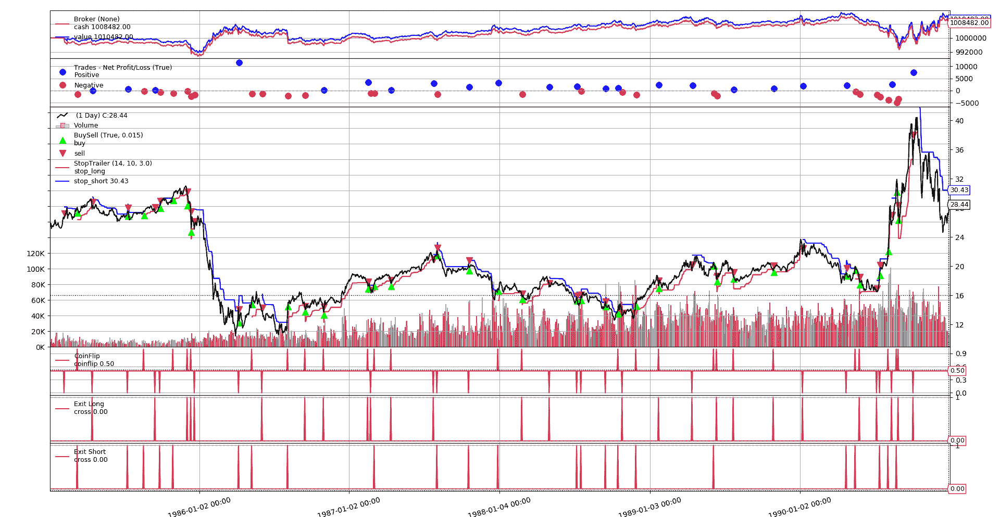

# 击败随机进入

> 原文：[`www.backtrader.com/blog/2019-08-22-practical-backtesting-replication/practical-replication/`](https://www.backtrader.com/blog/2019-08-22-practical-backtesting-replication/practical-replication/)

最近有一些关于在[reddit/r/algotrading](https://www.reddit.com/r/algotrading/)上成功复制已发布的算法交易策略的帖子。首先

+   [我已经重现了 130 多篇关于“预测股市”的研究论文，从头开始编码，并记录了结果。这是我学到的东西](https://www.reddit.com/r/algotrading/comments/cr7jey/ive_reproduced_130_research_papers_about/)

    因为这里已被删除，快速摘要如下：

    +   这些策略不起作用

    +   如果作者声称某种策略停止工作是由于阿尔法衰减，那么测试将针对过去的数据运行，而且仍然无法工作

    +   底线是：这都是过度拟合，p-值调整或微小的阿尔法，不需要衰减，因为佣金已经破坏了阿尔法。

*Artem Kaznatcheev*撰写的复制问题的复制品在以下位置：

+   [算法交易中复制危机的寓言](https://egtheory.wordpress.com/2019/08/17/algotrading-replication/)

接下来是：

+   [过度拟合](https://www.reddit.com/r/algotrading/comments/cv83yh/overfitting/)

前两者是理论的（即使第一个提到已经实施了 130 种策略），而“过度拟合”提供了实际代码。

在这么多事情发生的情况下，那么试图复制一些已经发布但不是作为论文的东西呢，就像在“过度拟合”案例中一样，采取实践方法。某些发表在著名书籍中的东西。

目标：“尝试击败随机进入”。这是本书的第 3 部分第八章中的一节：

+   [亚马逊 - 用您的方式交易至金融自由](https://www.amazon.com/Trade-Your-Way-Financial-Freedom/dp/007147871X)

+   [范·塞尔普学院 - 用您的方式交易至金融自由](https://www.vantharp.com/trade-your-way-to-financial-freedom)

书中提出了一种有结构的方法参与算法交易，特别强调：**仓位大小**和仓位管理（即：何时实际退出交易）。这比例如入场设置更重要，后者显然大多数人认为是主要驱动因素。

在第八章中，范·K·塞尔普与*汤姆·巴索*交谈并说：“从你的讲话听起来，你似乎可以通过随机进入并智能地确定仓位来稳定赚钱。” 对此的回答是*他可能可以*。

**规则**：

+   基于抛硬币的进入

+   始终处于市场中 - 多头或空头

+   一旦给出退出信号，立即重新进入

+   市场的波动性由 10 天的“平均真实范围”的“指数移动平均”确定

+   从收盘价的距离追踪止损是波动性的 3 倍

+   止损只能朝着交易的方向移动

+   固定仓位（1 份合约）或 1％风险模型（书中第十二章）

**结果**

+   测试对 10 个市场

+   固定投注：80%的时间赚钱

+   1%风险模型：100%的时间赚钱

+   可靠性水平：38%（获胜交易的百分比）

**缺失的部分**：

+   测试市场

+   测试期间

+   如果始终处于市场中意味着“今天”关闭交易并在“明天”重新进入市场，或者意味着同时发出关闭/重新开放订单。

    这实际上是最容易克服的。

对于最后两个项目，书中说 1991 年进行了谈话并使用了期货。为了对书本公平，将使用 1991 年之前的期货数据。鉴于提到了*10 日指数移动平均线*，还假设了 1 天的价格条。

最明显的问题似乎是正确地获得算法，但在这种情况下，书中对简单算法和结果的描述做得很好。为了完成它，让我们总结一下 *“百分比风险模型”*（书中称为“模型 3”的）*第十二章*。

+   `最大损失`：限制在账户价值的`x%`（即：百分比风险）

+   `合约风险`：根据给定的算法，它将是初始止损距离（3 倍波动性）乘以未来的倍数

+   合同金额：`最大损失 / 合约风险`

## 复制细节

**数据**

将使用 1985 年至 1990 年（即 6 年）的 CL（原油）期货数据。合同规格为：

+   跳变大小：`0.01`（即：每个点 100 跳变）

+   每个跳变成本：`$10`

有了这个想法，我们将使用`1000`乘以每个`1 点`的乘数（100 个跳点/点 x 10 美元/跳 = 1000 美元）

**佣金**

每次交易的合同将使用`2.00`货币单位（类似 IB）

**一些实现细节**

抛硬币被建模为一个指标，以便于可视化翻转的位置（例如，如果几个条目朝着相同的方向，这在随机情况下是可以预料的）

为了也能很好地可视化止损及其移动方式，止损价格计算和逻辑也嵌入到了指标中。注意，止损计算逻辑有两个不同的阶段

+   当交易开始时，止损价格必须与前一个止损价格无关地设置在给定距离之内

+   当交易进行时，如果可能，止损价格将根据趋势进行调整。

**绘图**

代码产生两种类型的图表

1.  包含单次测试运行详细信息的图表（`--plot`选项）。在运行单次迭代（`--iterations 1`）时使用它最有意义

1.  显示运行的利润和损失的散点图。

#1 样本



10 次运行的#2 样本


## 脚本的样本调用

**固定大小投注和绘图的单次运行**

```py
./vanktharp-coinflip.py --years 1985-1990 --fixedsize --sizer stake=1 --iterations 1 --plot

**** Iteration:    1
-- PNL: 10482.00
--   Trades 49 - Won 22 - %_Won: 0.45
**** Summary of Runs
-- Total       :        1
-- Won         :        1
-- % Won       : 1.00
**** Summary of Trades
-- Total       :       49
-- Total Won   :       22
-- % Total Won : 0.45
```

**使用 1%风险模型、10 次迭代和散点图的 100 次运行**

（为了实际目的，输出已缩短）

```py
$ ./vanktharp-coinflip.py --years 1985-1990 --percrisk --sizer percrisk=0.01 --iterations 100 --scatter
**** Iteration:    1
-- PNL: -18218.00
--   Trades 60 - Won 24 - %_Won: 0.40
**** Iteration:    2
...
...
**** Iteration:  100
-- PNL: 111366.00
--   Trades 50 - Won 26 - %_Won: 0.52
**** Summary of Runs
-- Total       :      100
-- Won         :       50
-- % Won       : 0.50
**** Summary of Trades
-- Total       :     5504
-- Total Won   :     2284
-- % Total Won : 0.41
```

## 测试运行混合

进行了 100 次迭代的 10 次测试运行，混合了以下变量：

+   固定大小的投注额为 1，或者使用 1%的百分比风险模型。

+   在同一根或连续的几根柱子上执行入场/出场操作

# 结果摘要

+   平均而言，有 49%的交易是盈利的。固定大小的投注在测试中保持在 50%左右，而百分比风险模型的变化较大，一次测试的盈利交易率最低为 39%，另一次测试的盈利交易率最高为 65%（共进行了 10 次测试）。

+   平均而言，有 39%的交易是盈利的（小偏差）

回想书中所说的：

+   当使用固定大小的投注额为 1 时，有 80%的交易是盈利的。

+   使用 1%百分比风险模型，有 100%的交易是盈利的。

+   有 38%的盈利交易

因此似乎：

+   只有最后一项被复制了。

## 结论

正如*阿尔捷姆·卡兹纳切夫*所指出的，复制危机可能是由于：

+   使用错误的数据集

+   未能正确实施算法

或者原始实施可能并没有遵循自己的规则，或者并没有发布所有细节。

注意

无论如何，我个人仍然建议阅读这本书。未能复制特定情况并不意味着这本书不值得一读，它展示了一种实用的算法交易方法。

## 完整的脚本

祝好运！

**代码也可在**：

+   [`gist.github.com/mementum/364173371634b226120dc39708cd9610`](https://gist.github.com/mementum/364173371634b226120dc39708cd9610)

```py
#!/usr/bin/env python
# -*- coding: utf-8; py-indent-offset:4 -*-
###############################################################################
# Copyright (C) 2019 Daniel Rodriguez - MIT License
#  - https://opensource.org/licenses/MIT
#  - https://en.wikipedia.org/wiki/MIT_License
###############################################################################
import argparse
import random

import pandas as pd

import backtrader as bt

def read_dataframe(filename, years):
    colnames = ['ticker', 'period', 'date', 'time',
                'open', 'high', 'low', 'close', 'volume', 'openinterest']

    colsused = ['date',
                'open', 'high', 'low', 'close', 'volume', 'openinterest']

    df = pd.read_csv(filename,
                     skiprows=1,  # using own column names, skip header
                     names=colnames,
                     usecols=colsused,
                     parse_dates=['date'],
                     index_col='date')

    if years:  # year or year range specified
        ysplit = years.split('-')

        # left side limit
        mask = df.index >= ((ysplit[0] or '0001') + '-01-01')  # support -YYYY

        # right side liit
        if len(ysplit) > 1:  # multiple or open ended (YYYY-ZZZZ or YYYY-)
            if ysplit[1]:  # open ended if not years[1] (YYYY- format)
                mask &= df.index <= (ysplit[1] + '-12-31')
        else:  # single year specified YYYY
            mask &= df.index <= (ysplit[0] + '-12-31')

        df = df.loc[mask]  # select the given date range

    return df

# DEFAULTS - CAN BE CHANGED VIA COMMAND LINE OPTIONS
COMMINFO_DEFAULT = dict(
    stocklike=False,  # Futures-like
    commtype=bt.CommissionInfo.COMM_FIXED,  # fixed price per asset
    commission=2.0,  # Standard IB Price for futures
    mult=1000.0,  # multiplier
    margin=2000.0,  # $50 x 50 => $2500
)

class PercentRiskSizer(bt.Sizer):
  '''Sizer modeling the Percentage Risk sizing model of Van K. Tharp'''
    params = dict(percrisk=0.01)  # 1% percentage risk

    def _getsizing(self, comminfo, cash, data, isbuy):
        # Risk per 1 contract
        risk = comminfo.p.mult * self.strategy.stoptrailer.stop_dist[0]
        # % of account value to risk
        torisk = self.broker.get_value() * self.p.percrisk
        return torisk // risk  # size to risk

class CoinFlip(bt.Indicator):
    lines = ('coinflip',)
    HEAD, TAIL = 1, 0

    def next(self):
        self.l.coinflip[0] = 0.5  # midway
        pass

    def flip(self):
        # self.l.coinflip[0] = cf = random.randrage(-1, 2, 2)  # -1 or 1
        self.l.coinflip[0] = cf = random.randint(0, 1)
        return cf

    def head(self, val=None):
        if val is None:
            return self.lines[0] == self.HEAD

        return val == self.HEAD

class StopTrailer(bt.Indicator):
    _nextforce = True  # force system into step by step calcs

    lines = ('stop_long', 'stop_short',)
    plotinfo = dict(subplot=False, plotlinelabels=True)

    params = dict(
        atrperiod=14,
        emaperiod=10,
        stopfactor=3.0,
    )

    def __init__(self):
        self.strat = self._owner  # alias for clarity

        # Volatility which determines stop distance
        atr = bt.ind.ATR(self.data, period=self.p.atrperiod)
        emaatr = bt.ind.EMA(atr, period=self.p.emaperiod)
        self.stop_dist = emaatr * self.p.stopfactor

        # Running stop price calc, applied in next according to market pos
        self.s_l = self.data - self.stop_dist
        self.s_s = self.data + self.stop_dist

    def next(self):
        # When entering the market, the stop has to be set
        if self.strat.entering > 0:  # entering long
            self.l.stop_long[0] = self.s_l[0]
        elif self.strat.entering < 0:  # entering short
            self.l.stop_short[0] = self.s_s[0]

        else:  # In the market, adjust stop only in the direction of the trade
            if self.strat.position.size > 0:
                self.l.stop_long[0] = max(self.s_l[0], self.l.stop_long[-1])
            elif self.strat.position.size < 0:
                self.l.stop_short[0] = min(self.s_s[0], self.l.stop_short[-1])

class St1(bt.Strategy):
    SHORT, NONE, LONG = -1, 0, 1

    params = dict(
        atrperiod=14,  # measure volatility over x days
        emaperiod=10,  # smooth out period for atr volatility
        stopfactor=3.0,  # actual stop distance for smoothed atr
        verbose=False,  # print out debug info
        samebar=True,  # close and re-open on samebar
    )

    def __init__(self):
        self.coinflip = CoinFlip()

        # Trailing Stop Indicator
        self.stoptrailer = st = StopTrailer(atrperiod=self.p.atrperiod,
                                            emaperiod=self.p.emaperiod,
                                            stopfactor=self.p.stopfactor)

        # Exit Criteria (Stop Trail) for long / short positions
        self.exit_long = bt.ind.CrossDown(self.data,
                                          st.stop_long, plotname='Exit Long')
        self.exit_short = bt.ind.CrossUp(self.data,
                                         st.stop_short, plotname='Exit Short')

    def start(self):
        self.entering = 0
        self.start_val = self.broker.get_value()

    def stop(self):
        self.stop_val = self.broker.get_value()
        self.pnl_val = self.stop_val - self.start_val
        self.log('Start Value: {:.2f}', self.start_val)
        self.log('Final Value: {:.2f}', self.stop_val)
        self.log('PNL   Value: {:.2f}', self.pnl_val)

    def notify_trade(self, trade):
        if trade.size > 0:
            self.log('Long  Entry at: {:.2f}', trade.price)
        elif trade.size < 0:
            self.log('Short Entry at: {:.2f}', trade.price)
        else:  # not trade.size - trade is over
            self.log('Trade PNL: {:.2f}', trade.pnlcomm)

    def next(self):
        self.logdata()

        # logic
        closing = None
        if self.position.size > 0:  # In the market - Long
            self.log('Long Stop Price: {:.2f}', self.stoptrailer.stop_long[0])
            if self.exit_long:
                closing = self.close()

        elif self.position.size < 0:  # In the market - Short
            self.log('Short Stop Price {:.2f}', self.stoptrailer.stop_short[0])
            if self.exit_short:
                closing = self.close()

        self.entering = self.NONE
        if not self.position or (closing and self.p.samebar):
            # Not in the market or closing pos and reenter in samebar
            if self.coinflip.flip():
                self.entering = self.LONG if self.buy() else self.NONE
            else:
                self.entering = self.SHORT if self.sell() else self.NONE

    def logdata(self):
        if self.p.verbose:  # logging
            txt = []
            txt += ['{:.2f}'.format(self.position.size)]
            txt += ['{:.2f}'.format(self.data.open[0])]
            txt += ['{:.2f}'.format(self.data.high[0])]
            txt += ['{:.2f}'.format(self.data.low[0])]
            txt += ['{:.2f}'.format(self.data.close[0])]
            self.log(','.join(txt))

    def log(self, txt, *args):
        if self.p.verbose:
            out = [self.datetime.date().isoformat(), txt.format(*args)]
            print(','.join(out))

def runstrat(args):
    cerebro = bt.Cerebro()

    # Data feed kwargs
    dataargs = dict(dataname=read_dataframe(args.data, args.years))
    dataargs.update(eval('dict(' + args.dargs + ')'))
    cerebro.adddata(bt.feeds.PandasData(**dataargs))

    # Strategy
    cerebro.addstrategy(St1, **eval('dict(' + args.strat + ')'))

    # Broker
    brokerargs = dict(cash=args.cash)
    brokerargs.update(eval('dict(' + args.broker + ')'))
    cerebro.broker = bt.brokers.BackBroker(**brokerargs)

    # Commission
    commargs = COMMINFO_DEFAULT
    commargs.update(eval('dict(' + args.commission + ')'))
    cerebro.broker.setcommission(**commargs)

    # Sizer
    szcls = PercentRiskSizer if args.percrisk else bt.sizers.FixedSize
    cerebro.addsizer(szcls, **(eval('dict(' + args.sizer + ')')))

    # Analyze the trades
    cerebro.addanalyzer(bt.analyzers.TradeAnalyzer, _name='trades')

    # Execute
    strats = cerebro.run(**eval('dict(' + args.cerebro + ')'))

    if args.plot:  # Plot if requested to
        cerebro.plot(**eval('dict(' + args.plot + ')'))

    return strats[0]

def run(args=None):
    args = parse_args(args)

    results = []
    sum_won_trades = 0
    sum_total_trades = 0

    for i in range(0, args.iterations):
        strat = runstrat(args)
        pnl = strat.pnl_val
        results.append(pnl)
        trades = strat.analyzers.trades.get_analysis()

        print('**** Iteration: {:4d}'.format(i + 1))
        print('-- PNL: {:.2f}'.format(pnl))
        total_trades = trades.total.closed
        total_won = trades.won.total
        perc_won = total_won / total_trades
        print('--   Trades {} - Won {} - %_Won: {:.2f}'.format(
            total_trades, total_won, perc_won))

        sum_won_trades += total_won
        sum_total_trades += total_trades

    total = len(results)
    won = sum(1 for x in results if x > 0)
    print('**** Summary of Runs')
    print('-- Total       : {:8d}'.format(total))
    print('-- Won         : {:8d}'.format(won))
    print('-- % Won       : {:.2f}'.format(won / total))

    perc_won = sum_won_trades / sum_total_trades
    print('**** Summary of Trades')
    print('-- Total       : {:8d}'.format(sum_total_trades))
    print('-- Total Won   : {:8d}'.format(sum_won_trades))
    print('-- % Total Won : {:.2f}'.format(perc_won))

    if args.scatter:
        import numpy as np
        import matplotlib.pyplot as plt
        x = np.linspace(min(results), max(results), num=len(results))
        y = np.asarray(results)
        plt.scatter(x, y)
        plt.show()

def parse_args(pargs=None):
    parser = argparse.ArgumentParser(
        formatter_class=argparse.ArgumentDefaultsHelpFormatter,
        description='Van K. Tharp/Basso Random Entry Scenario',
    )

    parser.add_argument('--iterations', default=1, type=int,
                        help='Number of iterations to run the system')

    pgroup = parser.add_argument_group(title='Data Options')
    pgroup.add_argument('--data', default='cl-day-001.txt',
                        help='Data to read in')

    pgroup.add_argument('--years', default='',
                        help='Formats: YYYY-ZZZZ / YYYY / YYYY- / -ZZZZ')

    parser.add_argument('--dargs', required=False, default='',
                        metavar='kwargs', help='kwargs in key=value format')

    pgroup = parser.add_argument_group(title='Cerebro Arguments')
    pgroup.add_argument('--cerebro', default='', metavar='kwargs',
                        help='Cerebro kwargs in key=value format')

    pgroup = parser.add_argument_group(title='Commission Arguments')
    pgroup.add_argument('--commission', default=str(COMMINFO_DEFAULT),
                        metavar='kwargs',
                        help='CommInfo kwargs in key=value format')

    pgroup = parser.add_argument_group(title='Broker Arguments')
    pgroup.add_argument('--broker', default='', metavar='kwargs',
                        help='Broker kwargs in key=value format')

    pgroup.add_argument('--cash', default=1000000.0, type=float,
                        help='Default cash')

    pgroup = parser.add_argument_group(title='Strategy Arguments')
    pgroup.add_argument('--strat', default='', metavar='kwargs',
                        help='Strategy kwargs in key=value format')

    pgroup = parser.add_argument_group(title='Sizer Options')
    pgroup.add_argument('--sizer', default='', metavar='kwargs',
                        help='Sizer kwargs in key=value format')

    pgroup = pgroup.add_mutually_exclusive_group()
    pgroup.add_argument('--percrisk', action='store_true',
                        help='Use Percrisk Sizer')

    pgroup.add_argument('--fixedsize', action='store_true',
                        help='Use Fixed Statke Sizer')

    pgroup = parser.add_argument_group(title='Plotting Options')
    pgroup.add_argument('--plot', default='', nargs='?', const='{}',
                        metavar='kwargs', help='kwargs in key=value format')

    pgroup.add_argument('--scatter', action='store_true',
                        help='Plot a scatter diagram of PNL results')

    return parser.parse_args(pargs)

if __name__ == '__main__':
    run()
```
