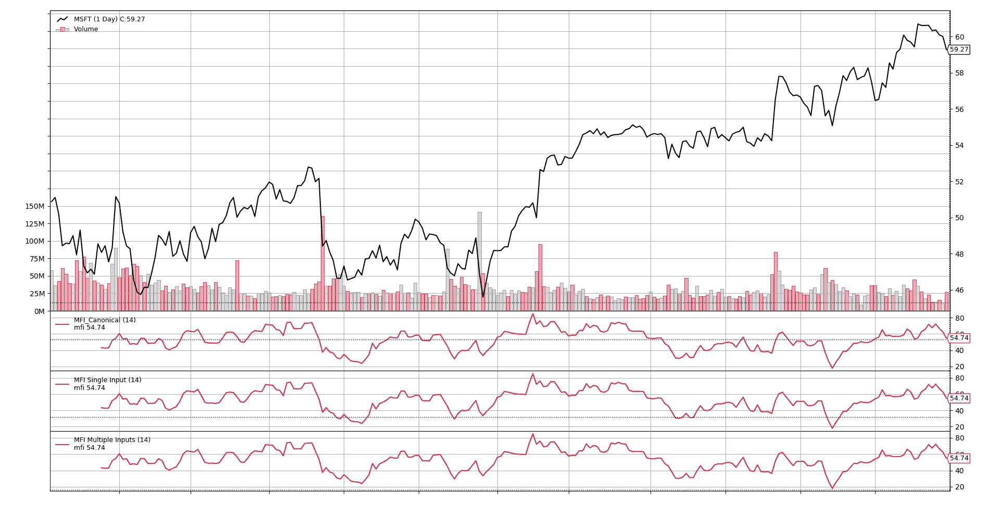
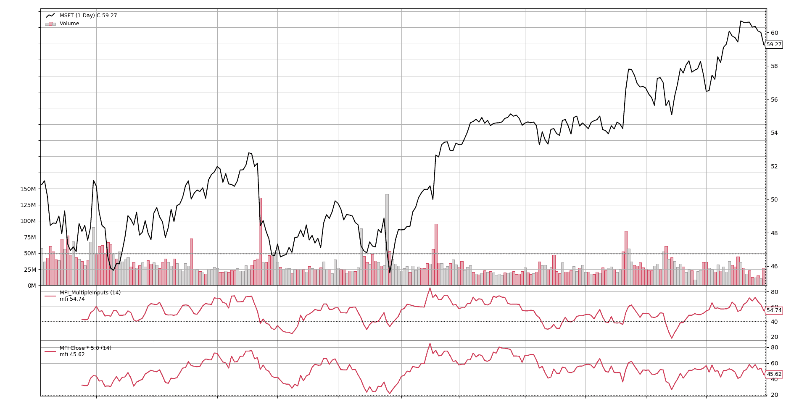

# MFI 通用

> 原文：[`www.backtrader.com/blog/2019-07-17-mfi-generic/mfi-generic/`](https://www.backtrader.com/blog/2019-07-17-mfi-generic/mfi-generic/)

在最近的规范与非规范文章中，开发了`MFI`（也称为`MoneyFlowIndicator`）。

尽管它是以*规范*方式开发的，但仍然存在一些改进和通用化的空间。

让我们关注实现的第 1 行，创建典型价格的行

```py
class MFI_Canonical(bt.Indicator):
    lines = ('mfi',)
    params = dict(period=14)

    def __init__(self):
        tprice = (self.data.close + self.data.low + self.data.high) / 3.0
        mfraw = tprice * self.data.volume
        ...
```

典型的实例化可能如下所示

```py
class MyMFIStrategy(bt.Strategy):

    def __init__(self):
        mfi = bt.MFI_Canonical(self.data)
```

这里的问题应该是显而易见的：“需要为具有`close`、`low`、`high`和`volume`组件（也称为*backtrader*生态系统中的*lines*）的指标提供输入”

当然，可能会有这样一种情况，即希望使用来自不同数据源（数据源的线或其他指标的线）的组件创建`MoneyFlowIndicator`，就像想要给`close`赋予更大的权重一样，而无需开发特定的指标。考虑到行业标准的`OHLCV`字段排序，一个多输入、额外加权`close`的实例化可能如下所示

```py
class MyMFIStrategy2(bt.Strategy):

    def __init__(self):
        wclose = self.data.close * 5.0
        mfi = bt.MFI_Canonical(self.data.high, self.data.low,
                               wclose, self.data.volume)
```

或者因为用户之前使用过`ta-lib`，喜欢多输入样式。

## 支持多个输入

*backtrader* 尽可能地遵循*pythonic*的原则，`self.datas`数组包含系统中数据源的列表（并且自动提供给您的策略），可以查询其长度。让我们使用这个来区分调用者想要的内容，并正确计算`tprice`和`mfraw`

```pypython class MFI_MultipleInputs(bt.Indicator): lines = ('mfi',) params = dict(period=14)

```

`def __init__(self):

    if len(self.datas) == 1:

        # 传递了 1 个数据源，必须有分量

        tprice = (self.data.close + self.data.low + self.data.high) / 3.0

        mfraw = tprice * self.data.volume

    否则：

        # 如果有多个数据源，则按照 OHLCV 的顺序提取各个分量

        tprice = (self.data0 + self.data1 + self.data2) / 3.0

        mfraw = tprice * self.data3

    # 与之前的实现相比没有变化

    flowpos = bt.ind.SumN(mfraw * (tprice > tprice(-1)), period=self.p.period)

    flowneg = bt.ind.SumN(mfraw * (tprice < tprice(-1)), period=self.p.period)

    mfiratio = bt.ind.DivByZero(flowpos, flowneg, zero=100.0)

    self.l.mfi = 100.0 - 100.0 / (1.0 + mfiratio)`

```py

```

* * *

**注意**

请注意，如何引用各个分量，例如`self.dataX`（例如`self.data0`、`self.data1`）

这与使用`self.datas[x]`相同，如`self.datas[0]`...

* * *

让我们从图形上看到，这个指标产生了与*规范*相同的结果，当多个输入对应于数据源的原始组件时也是如此。为此，它将在策略中运行，如下所示

```py
class MyMFIStrategy2(bt.Strategy):

    def __init__(self):
        MFI_Canonical(self.data)
        MFI_MultipleInputs(self.data, plotname='MFI Single Input')
        MFI_MultipleInputs(self.data.high,
                           self.data.low,
                           self.data.close,
                           self.data.volume,
                           plotname='MFI Multiple Inputs')
```



无需每个值都进行检查，从图片上显然可以看出这三个结果是相同的。

最后让我们看看如果给`close`加上更多的权重会发生什么。让我们这样运行。

```py
class MyMFIStrategy2(bt.Strategy):
    def __init__(self):

        MFI_MultipleInputs(self.data)
        MFI_MultipleInputs(self.data.high,
                           self.data.low,
                           self.data.close * 5.0,
                           self.data.volume,
                           plotname='MFI Close * 5.0')
```



这是否有意义留给读者决定，但可以清楚地看到给`close`添加权重已经改变了模式。

## 结论

通过简单使用 Pythonic 的`len`，一个人可以将一个使用多个组件（和固定名称）的数据源的指标转换为接受多个通用输入的指标。
