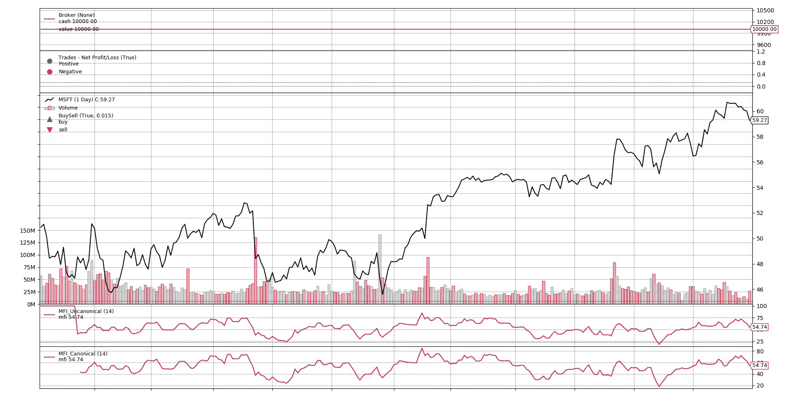
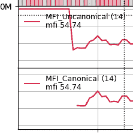

# 规范与非规范指标

> 原文：[`www.backtrader.com/blog/2019-07-08-canonical-or-not/canonical-or-not/`](https://www.backtrader.com/blog/2019-07-08-canonical-or-not/canonical-or-not/)

这个问题已经出现了几次，或多或少地是这样的：

+   如何使用*backtrader*最佳/规范地实现这个或那个？

作为*backtrader*的目标之一是**灵活**地支持尽可能多的情况和用例，答案很简单：“至少有几种方法”。总结一下指标，这是最常见的问题：

+   `__init__`方法中的 100%声明

+   `next`方法中的 100%逐步操作

+   在复杂情况下，将上述两者混合在一起，以满足声明部分无法覆盖所有所需计算的需求。

对*backtrader*内置指标的快速查看表明，它们都是以*声明*方式实现的。原因是

1.  更容易做到

1.  更易读

1.  更优雅

1.  矢量化和基于事件的实现会自动管理

## 什么？！？！自动实现矢量化？？

是的。如果一个指标完全在`__init_`方法中实现，Python 中的*元类*和运算符重载的魔法将产生以下结果

+   矢量化实现（在运行回测时的默认设置）

+   基于事件的实现（例如用于实时交易）

另一方面，如果指标的任何部分在`next`方法中实现：

+   这是直接用于基于事件的运行的代码。

+   矢量化将通过在后台为每个数据点调用`next`方法来模拟

    注意

    这意味着即使某个特定指标没有矢量化实现，所有其他具有矢量化实现的指标仍将以矢量化方式运行

## 资金流指数：一个例子

社区用户*[@Rodrigo Brito](https://community.backtrader.com/user/rodrigo-brito)*发布了一个使用`next`方法进行实现的*"资金流指数（Money Flow Index）"*指标的版本。

代码

```py
`class MFI(bt.Indicator):
    lines = ('mfi', 'money_flow_raw', 'typical', 'money_flow_pos', 'money_flow_neg')

    plotlines = dict(
        money_flow_raw=dict(_plotskip=True),
        money_flow_pos=dict(_plotskip=True),
        money_flow_neg=dict(_plotskip=True),
        typical=dict(_plotskip=True),
    )

    params = (
        ('period', 14),
    )

    def next(self):
        typical_price = (self.data.close[0] + self.data.low[0] + self.data.high[0]) / 3
        money_flow_raw = typical_price * self.data.volume[0]

        self.lines.typical[0] = typical_price
        self.lines.money_flow_raw[0] = money_flow_raw

        self.lines.money_flow_pos[0] = money_flow_raw if self.lines.typical[0] >= self.lines.typical[-1] else 0
        self.lines.money_flow_neg[0] = money_flow_raw if self.lines.typical[0] <= self.lines.typical[-1] else 0

        pos_period = math.fsum(self.lines.money_flow_pos.get(size=self.p.period))
        neg_period = math.fsum(self.lines.money_flow_neg.get(size=self.p.period))

        if neg_period == 0:
            self.lines.mfi[0] = 100
            return

        self.lines.mfi[0] =  100 - 100 / (1 +  pos_period / neg_period)` 
```

注意

保持原样发布，包括需要水平滚动的长行

*[@Rodrigo Brito](https://community.backtrader.com/user/rodrigo-brito)* 已经注意到临时线条的使用（除了`mfi`之外的所有线条）可能需要优化。确实，但在作者的谦逊意见中，实际上一切都可以稍加优化。

为了有共同的工作基础，可以使用*StockCharts*的*"资金流指数（Money Flow Index）"*定义，并查看上述实现是否良好。这是链接：

+   [`school.stockcharts.com/doku.php?id=technical_indicators:money_flow_index_mfi`](https://school.stockcharts.com/doku.php?id=technical_indicators:money_flow_index_mfi)

有了这个，一个快速的**规范**实现`MFI`指标

```py
`class MFI_Canonical(bt.Indicator):
    lines = ('mfi',)
    params = dict(period=14)

    def __init__(self):
        tprice = (self.data.close + self.data.low + self.data.high) / 3.0
        mfraw = tprice * self.data.volume

        flowpos = bt.ind.SumN(mfraw * (tprice > tprice(-1)), period=self.p.period)
        flowneg = bt.ind.SumN(mfraw * (tprice < tprice(-1)), period=self.p.period)

        mfiratio = bt.ind.DivByZero(flowpos, flowneg, zero=100.0)
        self.l.mfi = 100.0 - 100.0 / (1.0 + mfiratio)` 
```

人们应该立即注意到

+   定义了一个单行`mfi`。没有临时变量。

+   没有需要`[0]`数组索引的需求，看起来更干净

+   这里或那里没有单个`if`

+   更紧凑但更易读

如果将两个运行对同一数据集绘制的图表，会是这样的



图表显示，*规范*和*非规范*版本在**开始时**除外，显示相同的值和发展。

+   *非规范*版本从一开始就提供值

+   它提供了无意义的值（100.0，直到提供额外的 1 个值，这也不好），因为它无法正确地提供

相比之下：

+   *规范*版本在达到**最短预热时间**后自动开始提供数值。

+   没有人为干预是必需的（肯定是 *"人工智能"* 或 *"机器学习"*，... **双关语**）

查看受影响区域的近景图片



注意

当然，可以尝试通过以下方式缓解*非规范*版本的这种情况：

+   从已经具有`period`参数并知道如何处理它的`bt.ind.PeriodN`子类化（并在`__init__`期间调用`super`）

还要注意，*规范*版本也像逐步`next`代码一样考虑了公式中可能出现的*除零*情况。

```py
 `if neg_period == 0:
            self.lines.mfi[0] = 100
            return

        self.lines.mfi[0] =  100 - 100 / (1 +  pos_period / neg_period)` 
```

这是另一种方法

```py
 `mfiratio = bt.ind.DivByZero(flowpos, flowneg, zero=100.0)
        self.l.mfi = 100.0 - 100.0 / (1.0 + mfiratio)` 
```

不是有很多行，一个`return`语句和对输出*行*的不同赋值，而是对`mfiratio`计算的单个声明和对输出行`mfi`的单个赋值（按照*StockCharts*公式）

## 结论

希望这能解释在*规范*（即：在`__init__`中声明式）或*非规范*方式（逐步进行，使用数组索引在`next`中）中实现某些内容时的差异。
