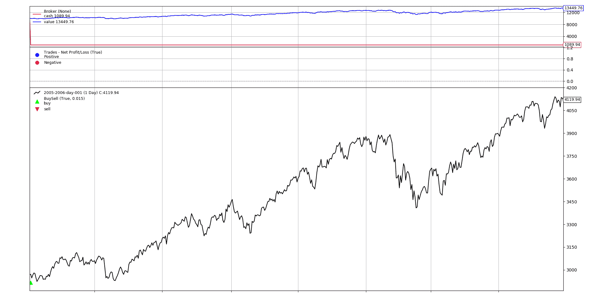
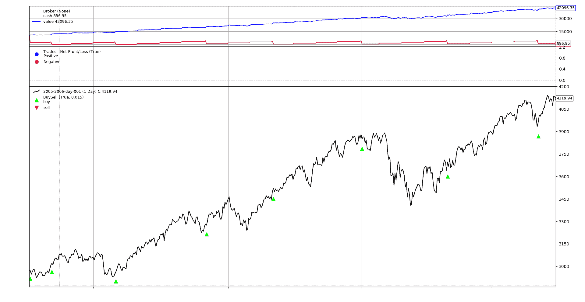
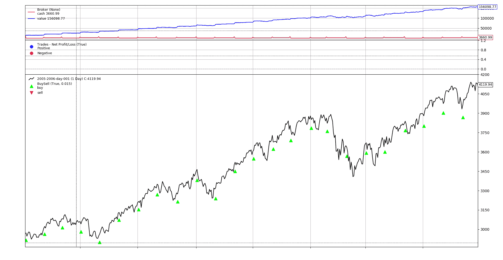

# 使用 backtrader 进行买入并持有

> 原文：[`www.backtrader.com/blog/2019-06-13-buy-and-hold/buy-and-hold/`](https://www.backtrader.com/blog/2019-06-13-buy-and-hold/buy-and-hold/)

这有时是用来测试给定策略表现的基线之一，即：“如果精心设计的逻辑无法击败简单的买入并持有方法，那么该策略可能不值一文”

一个简单的“买入并持有”策略，只需在第一个传入的数据点上买入，并查看最后一个数据点可用的投资组合价值。

提示

下面的代码片段省略了导入和设置样板。完整脚本在末尾可用。

## 在收盘时作弊

在许多情况下，像*买入并持有*这样的方法并不意味着要精确复制订单执行和价格匹配。这是关于评估大量数据。这就是为什么*backtrader*中默认经纪人的`cheat-on-close`模式将被激活。这意味着

+   由于只会发出`Market`订单，执行将根据当前的`close`价格进行。

+   请注意，当价格可用于交易逻辑（在本例中为`close`）时，该价格已经**消失**。它可能会在一段时间内可用，但实际上无法保证执行。

## 买入并忘记

```py
class BuyAndHold_1(bt.Strategy):
    def start(self):
        self.val_start = self.broker.get_cash()  # keep the starting cash

    def nextstart(self):
        # Buy all the available cash
        size = int(self.broker.get_cash() / self.data)
        self.buy(size=size)

    def stop(self):
        # calculate the actual returns
        self.roi = (self.broker.get_value() / self.val_start) - 1.0
        print('ROI: {:.2f}%'.format(100.0 * self.roi))
```

```py
class BuyAndHold_1(bt.Strategy):
    def start(self):
        self.val_start = self.broker.get_cash()  # keep the starting cash

    def nextstart(self):
        # Buy all the available cash
        self.order_target_value(target=self.broker.get_cash())

    def stop(self):
        # calculate the actual returns
        self.roi = (self.broker.get_value() / self.val_start) - 1.0
        print('ROI: {:.2f}%'.format(100.0 * self.roi))
```

这里发生了以下情况：

+   发出了一个单独的做多操作以进入市场。可以是

    +   `buy`和手动计算`size`

        所有可用的`cash`都用于购买资产的固定单位数量。请注意，它被截断为`int`。这适用于*股票*、*期货*等。

    或者

    +   `order_target_value`并让系统知道我们要使用所有现金。该方法将自动计算大小。

+   在`start`方法中，初始现金金额被保存

+   在`stop`方法中，通过当前投资组合价值和初始现金金额计算回报

注意

在*backtrader*中，当数据/指标缓冲区可以提供数据时，将**精确地**调用`nextstart`方法。默认行为是将工作委托给`next`。但是因为我们想要**仅一次**购买，并且使用**第一个**可用数据，这是正确的时机。

提示

由于只考虑了**1**个数据源，因此无需指定目标数据源。系统中的第一个（也是唯一的）数据源将被用作目标。

如果存在多个数据源，则可以使用命名参数`data`来选择目标，如下所示

```py
 self.buy(data=the_desired_data, size=calculated_size)
```

下面的示例脚本可以按以下方式执行

```py
$ ./buy-and-hold.py --bh-buy --plot
ROI:        34.50%
```

```py
$ ./buy-and-hold.py --bh-target --plot
ROI:        34.50%
```

图形输出对于两者都是相同的



## 买入和再买入

但实际上，普通人通常有一份*日常工作*，可以每个月将一定金额投入股市。这个人不关心趋势、技术分析等。唯一的关注点是在每个月的第 1 天将资金投入市场。

鉴于罗马人留给我们的日历中月份的天数不同（`28`、`29`、`30`、`31`），并考虑到非交易日，不能确定使用以下简单方法：

+   每隔**X**天购买

需要使用一种方法来识别月份的**第一个交易日**。这可以通过*backtrader*中的**计时器**来完成

注意

下面的示例中只使用`order_target_value`方法。

```py
class BuyAndHold_More(bt.Strategy):
    params = dict(
        monthly_cash=1000.0,  # amount of cash to buy every month
    )

    def start(self):
        self.cash_start = self.broker.get_cash()
        self.val_start = 100.0

        # Add a timer which will be called on the 1st trading day of the month
        self.add_timer(
            bt.timer.SESSION_END,  # when it will be called
            monthdays=[1],  # called on the 1st day of the month
            monthcarry=True,  # called on the 2nd day if the 1st is holiday
        )

    def notify_timer(self, timer, when, *args, **kwargs):
        # Add the influx of monthly cash to the broker
        self.broker.add_cash(self.p.monthly_cash)

        # buy available cash
        target_value = self.broker.get_value() + self.p.monthly_cash
        self.order_target_value(target=target_value)

    def stop(self):
        # calculate the actual returns
        self.roi = (self.broker.get_value() / self.cash_start) - 1.0
        print('ROI: {:.2f}%'.format(self.roi))
```

在`start`阶段添加了一个计时器

```py
 # Add a timer which will be called on the 1st trading day of the month
        self.add_timer(
            bt.timer.SESSION_END,  # when it will be called
            monthdays=[1],  # called on the 1st day of the month
            monthcarry=True,  # called on the 2nd day if the 1st is holiday
        )
```

+   将在会话结束时调用的计时器（`bt.timer.SESSION_END`）

    注意

    对于日线图表来说，这显然不相关，因为整个柱状图一次性交付。

+   计时器仅将每个月的第`1`天列为必须调用计时器的日期

+   如果第`1`天恰好是非交易日，则`monthcarry=True`确保计时器仍将在月的第一个交易日被调用。

计时器在`notify_timer`方法中接收，该方法被重写以执行市场操作。

```py
 def notify_timer(self, timer, when, *args, **kwargs):
        # Add the influx of monthly cash to the broker
        self.broker.add_cash(self.p.monthly_cash)

        # buy available cash
        target_value = self.broker.get_value() + self.p.monthly_cash
        self.order_target_value(target=target_value)
```

提示

注意，购买的不是**每月现金**流入，而是**账户的总价值**，包括当前投资组合和我们添加的资金。原因

+   可能有一些初始现金要消耗

+   月度操作可能不会消耗所有现金，因为一个月可能不足以购买股票，而且在购买股票后会有余额

    在我们的示例中，实际上是这样的，因为默认的每月现金流入额为`1000`，而资产的价值超过`3000`

+   如果目标是可用现金，那么这可能小于实际价值

执行

```py
$ ./buy-and-hold.py --bh-more --plot
ROI:        320.96%
```

```py
$ ./buy-and-hold.py --bh-more --strat monthly_cash=5000.0
ROI:        1460.99%
```

**雷霆万钧！！！**默认的`1000`货币单位的`ROI`为`320.96%`，而`5000`货币单位的`ROI`更高，为`1460.99%`。我们可能找到了一台印钞机...

+   *每个月我们添加的资金越多...我们赚的就越多...无论市场如何。*

当然不是...

+   在`stop`期间存储在`self.roi`中的计算**不再**有效。每月简单地向经纪人添加现金会改变规模（即使这些资金没有用于任何事情，它仍然会被计算为增量）

以 1000 货币单位的图形输出



注意市场实际操作之间的间隔，因为`1000`货币单位不足以购买`1`单位的资产，必须积累资金直到操作成功。

以 5000 货币单位的图形输出



在这种情况下，`5000`货币单位始终可以购买`1`单位的资产，市场操作每个月都会发生。

## *购买和增加购买*的绩效跟踪

如上所述，当现金被添加到（有时从中提取出）系统时，绩效必须以不同的方式进行衡量。没有必要发明什么，因为很久以前就已经发明了，这就是*基金管理*所做的事情。

+   `perf_value`被设置为跟踪绩效的参考值。很多时候，这将是`100`

+   使用该绩效值和初始现金金额，计算一定数量的`股份`，即：`shares = cash / perf_value`

+   每当现金被添加到/从系统中减去时，`股份`的数量会发生变化，但`perf_value`保持不变。

+   有时将现金投资，并更新每日的`value`，如`perf_value = portfolio_value / shares`

使用该方法可以计算实际的绩效，并且不受对系统的现金添加/提取的影响。

幸运的是，*backtrader*已经可以自动完成所有这些。

```py
class BuyAndHold_More_Fund(bt.Strategy):
    params = dict(
        monthly_cash=1000.0,  # amount of cash to buy every month
    )

    def start(self):
        # Activate the fund mode and set the default value at 100
        self.broker.set_fundmode(fundmode=True, fundstartval=100.00)

        self.cash_start = self.broker.get_cash()
        self.val_start = 100.0

        # Add a timer which will be called on the 1st trading day of the month
        self.add_timer(
            bt.timer.SESSION_END,  # when it will be called
            monthdays=[1],  # called on the 1st day of the month
            monthcarry=True,  # called on the 2nd day if the 1st is holiday
        )

    def notify_timer(self, timer, when, *args, **kwargs):
        # Add the influx of monthly cash to the broker
        self.broker.add_cash(self.p.monthly_cash)

        # buy available cash
        target_value = self.broker.get_value() + self.p.monthly_cash
        self.order_target_value(target=target_value)

    def stop(self):
        # calculate the actual returns
        self.roi = (self.broker.get_value() - self.cash_start) - 1.0
        self.froi = self.broker.get_fundvalue() - self.val_start
        print('ROI: {:.2f}%'.format(self.roi))
        print('Fund Value: {:.2f}%'.format(self.froi))
```

在`start`期间

+   使用默认的起始值`100.0`激活基金模式。

    ```py
     def start(self):
            # Activate the fund mode and set the default value at 100
            self.broker.set_fundmode(fundmode=True, fundstartval=100.00)` 
    ```

在`stop`期间

+   计算基金的`ROI`。因为起始值为`100.0`，所以操作相当简单

    ```py
     def stop(self):
            # calculate the actual returns
            ...
            self.froi = self.broker.get_fundvalue() - self.val_start` 
    ```

执行

```py
$ ./buy-and-hold.py --bh-more-fund --strat monthly_cash=5000 --plot
ROI:        1460.99%
Fund Value: 37.31%
```

在这种情况下：

+   与以前一样，实现了同样令人难以置信的纯`ROI`，即`1460.99%`

+   将其视为*基金*时，考虑到示例数据，实际的`ROI`更为适度和现实，为`37.31%`。

注意

输出图表与之前执行的图表相同，使用了`5000`货币单位。

## 示例脚本

```py
import argparse
import datetime

import backtrader as bt

class BuyAndHold_Buy(bt.Strategy):
    def start(self):
        self.val_start = self.broker.get_cash()  # keep the starting cash

    def nextstart(self):
        # Buy all the available cash
        size = int(self.broker.get_cash() / self.data)
        self.buy(size=size)

    def stop(self):
        # calculate the actual returns
        self.roi = (self.broker.get_value() / self.val_start) - 1.0
        print('ROI: {:.2f}%'.format(100.0 * self.roi))

class BuyAndHold_Target(bt.Strategy):
    def start(self):
        self.val_start = self.broker.get_cash()  # keep the starting cash

    def nextstart(self):
        # Buy all the available cash
        size = int(self.broker.get_cash() / self.data)
        self.buy(size=size)

    def stop(self):
        # calculate the actual returns
        self.roi = (self.broker.get_value() / self.val_start) - 1.0
        print('ROI: {:.2f}%'.format(100.0 * self.roi))

class BuyAndHold_More(bt.Strategy):
    params = dict(
        monthly_cash=1000.0,  # amount of cash to buy every month
    )

    def start(self):
        self.cash_start = self.broker.get_cash()
        self.val_start = 100.0

        # Add a timer which will be called on the 1st trading day of the month
        self.add_timer(
            bt.timer.SESSION_END,  # when it will be called
            monthdays=[1],  # called on the 1st day of the month
            monthcarry=True,  # called on the 2nd day if the 1st is holiday
        )

    def notify_timer(self, timer, when, *args, **kwargs):
        # Add the influx of monthly cash to the broker
        self.broker.add_cash(self.p.monthly_cash)

        # buy available cash
        target_value = self.broker.get_value() + self.p.monthly_cash
        self.order_target_value(target=target_value)

    def stop(self):
        # calculate the actual returns
        self.roi = (self.broker.get_value() / self.cash_start) - 1.0
        print('ROI: {:.2f}%'.format(100.0 * self.roi))

class BuyAndHold_More_Fund(bt.Strategy):
    params = dict(
        monthly_cash=1000.0,  # amount of cash to buy every month
    )

    def start(self):
        # Activate the fund mode and set the default value at 100
        self.broker.set_fundmode(fundmode=True, fundstartval=100.00)

        self.cash_start = self.broker.get_cash()
        self.val_start = 100.0

        # Add a timer which will be called on the 1st trading day of the month
        self.add_timer(
            bt.timer.SESSION_END,  # when it will be called
            monthdays=[1],  # called on the 1st day of the month
            monthcarry=True,  # called on the 2nd day if the 1st is holiday
        )

    def notify_timer(self, timer, when, *args, **kwargs):
        # Add the influx of monthly cash to the broker
        self.broker.add_cash(self.p.monthly_cash)

        # buy available cash
        target_value = self.broker.get_value() + self.p.monthly_cash
        self.order_target_value(target=target_value)

    def stop(self):
        # calculate the actual returns
        self.roi = (self.broker.get_value() / self.cash_start) - 1.0
        self.froi = self.broker.get_fundvalue() - self.val_start
        print('ROI: {:.2f}%'.format(100.0 * self.roi))
        print('Fund Value: {:.2f}%'.format(self.froi))

def run(args=None):
    args = parse_args(args)

    cerebro = bt.Cerebro()

    # Data feed kwargs
    kwargs = dict(**eval('dict(' + args.dargs + ')'))

    # Parse from/to-date
    dtfmt, tmfmt = '%Y-%m-%d', 'T%H:%M:%S'
    for a, d in ((getattr(args, x), x) for x in ['fromdate', 'todate']):
        if a:
            strpfmt = dtfmt + tmfmt * ('T' in a)
            kwargs[d] = datetime.datetime.strptime(a, strpfmt)

    data = bt.feeds.BacktraderCSVData(dataname=args.data, **kwargs)
    cerebro.adddata(data)

    # Strategy
    if args.bh_buy:
        stclass = BuyAndHold_Buy
    elif args.bh_target:
        stclass = BuyAndHold_Target
    elif args.bh_more:
        stclass = BuyAndHold_More
    elif args.bh_more_fund:
        stclass = BuyAndHold_More_Fund

    cerebro.addstrategy(stclass, **eval('dict(' + args.strat + ')'))

    # Broker
    broker_kwargs = dict(coc=True)  # default is cheat-on-close active
    broker_kwargs.update(eval('dict(' + args.broker + ')'))
    cerebro.broker = bt.brokers.BackBroker(**broker_kwargs)

    # Sizer
    cerebro.addsizer(bt.sizers.FixedSize, **eval('dict(' + args.sizer + ')'))

    # Execute
    cerebro.run(**eval('dict(' + args.cerebro + ')'))

    if args.plot:  # Plot if requested to
        cerebro.plot(**eval('dict(' + args.plot + ')'))

def parse_args(pargs=None):
    parser = argparse.ArgumentParser(
        formatter_class=argparse.ArgumentDefaultsHelpFormatter,
        description=(
            'Backtrader Basic Script'
        )
    )

    parser.add_argument('--data', default='../../datas/2005-2006-day-001.txt',
                        required=False, help='Data to read in')

    parser.add_argument('--dargs', required=False, default='',
                        metavar='kwargs', help='kwargs in key=value format')

    # Defaults for dates
    parser.add_argument('--fromdate', required=False, default='',
                        help='Date[time] in YYYY-MM-DD[THH:MM:SS] format')

    parser.add_argument('--todate', required=False, default='',
                        help='Date[time] in YYYY-MM-DD[THH:MM:SS] format')

    parser.add_argument('--cerebro', required=False, default='',
                        metavar='kwargs', help='kwargs in key=value format')

    parser.add_argument('--broker', required=False, default='',
                        metavar='kwargs', help='kwargs in key=value format')

    parser.add_argument('--sizer', required=False, default='',
                        metavar='kwargs', help='kwargs in key=value format')

    parser.add_argument('--strat', '--strategy', required=False, default='',
                        metavar='kwargs', help='kwargs in key=value format')

    parser.add_argument('--plot', required=False, default='',
                        nargs='?', const='{}',
                        metavar='kwargs', help='kwargs in key=value format')

    pgroup = parser.add_mutually_exclusive_group(required=True)
    pgroup.add_argument('--bh-buy', required=False, action='store_true',
                        help='Buy and Hold with buy method')

    pgroup.add_argument('--bh-target', required=False, action='store_true',
                        help='Buy and Hold with order_target method')

    pgroup.add_argument('--bh-more', required=False, action='store_true',
                        help='Buy and Hold More')

    pgroup.add_argument('--bh-more-fund', required=False, action='store_true',
                        help='Buy and Hold More with Fund ROI')

    return parser.parse_args(pargs)

if __name__ == '__main__':
    run()
```

```py
$ ./buy-and-hold.py --help
usage: buy-and-hold.py [-h] [--data DATA] [--dargs kwargs]
                       [--fromdate FROMDATE] [--todate TODATE]
                       [--cerebro kwargs] [--broker kwargs] [--sizer kwargs]
                       [--strat kwargs] [--plot [kwargs]]
                       (--bh-buy | --bh-target | --bh-more | --bh-more-fund)

Backtrader Basic Script

optional arguments:
  -h, --help            show this help message and exit
  --data DATA           Data to read in (default:
                        ../../datas/2005-2006-day-001.txt)
  --dargs kwargs        kwargs in key=value format (default: )
  --fromdate FROMDATE   Date[time] in YYYY-MM-DD[THH:MM:SS] format (default: )
  --todate TODATE       Date[time] in YYYY-MM-DD[THH:MM:SS] format (default: )
  --cerebro kwargs      kwargs in key=value format (default: )
  --broker kwargs       kwargs in key=value format (default: )
  --sizer kwargs        kwargs in key=value format (default: )
  --strat kwargs, --strategy kwargs
                        kwargs in key=value format (default: )
  --plot [kwargs]       kwargs in key=value format (default: )
  --bh-buy              Buy and Hold with buy method (default: False)
  --bh-target           Buy and Hold with order_target method (default: False)
  --bh-more             Buy and Hold More (default: False)
  --bh-more-fund        Buy and Hold More with Fund ROI (default: False)
```
