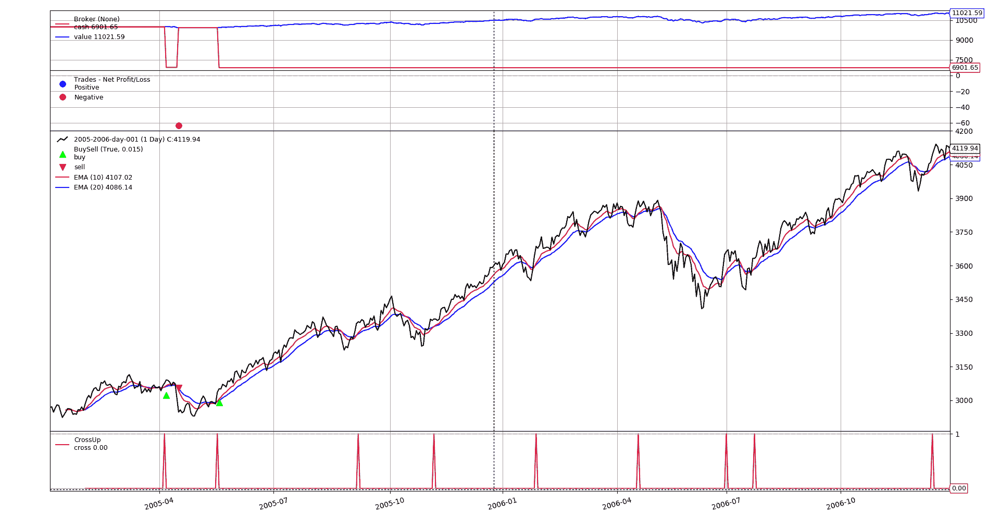
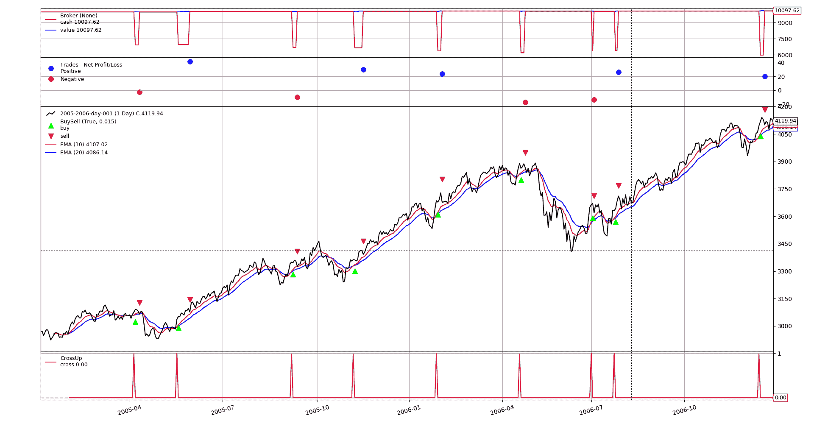
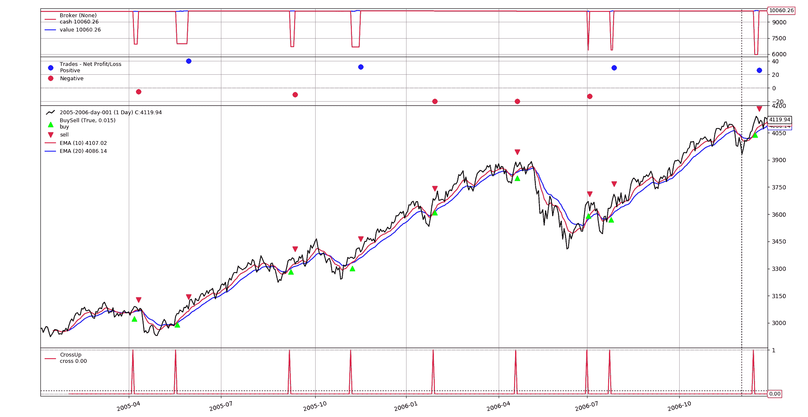
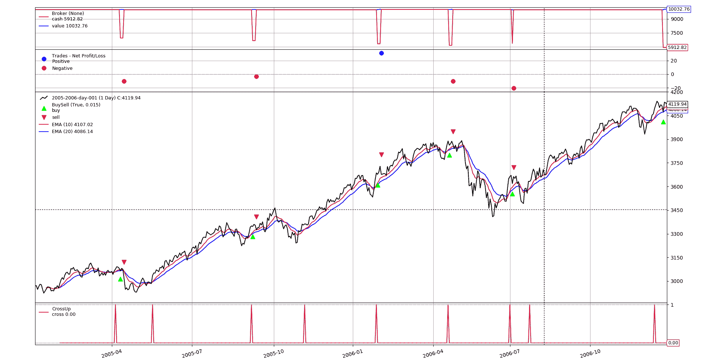

# 停止交易

> 原文：[`www.backtrader.com/blog/posts/2018-02-01-stop-trading/stop-trading/`](https://www.backtrader.com/blog/posts/2018-02-01-stop-trading/stop-trading/)

交易可能是危险的，使用止损订单可以帮助您避免巨额损失或确保利润。*backtrader*为您提供了几种实现基于*Stop*的策略的机制

## 基本策略

将使用经典的`Fast EMA`穿过`Slow EMA`的方法。但：

+   只有上穿会考虑发出`buy`订单

+   退出市场，即：`sell`将通过`Stop`进行

因此，策略将从这个简单的框架开始

```py
`class BaseStrategy(bt.Strategy):
    params = dict(
        fast_ma=10,
        slow_ma=20,
    )

    def __init__(self):
        # omitting a data implies self.datas[0] (aka self.data and self.data0)
        fast_ma = bt.ind.EMA(period=self.p.fast_ma)
        slow_ma = bt.ind.EMA(period=self.p.slow_ma)
        # our entry point
        self.crossup = bt.ind.CrossUp(fast_ma, slow_ma)` 
```

并且使用继承，我们将解决如何实现*Stops*的不同方法

### 手动方法

为了避免太多的方法，我们基本策略的这个子类将允许：

+   要么在收购价格下方的百分比处设置一个固定的`Stop`

+   或设置一个动态的`StopTrail`，它随着价格的变动而移动（在这种情况下使用点）

```py
`class ManualStopOrStopTrail(BaseStrategy):
    params = dict(
        stop_loss=0.02,  # price is 2% less than the entry point
        trail=False,
    )

    def notify_order(self, order):
        if not order.status == order.Completed:
            return  # discard any other notification

        if not self.position:  # we left the market
            print('SELL@price: {:.2f}'.format(order.executed.price))
            return

        # We have entered the market
        print('BUY @price: {:.2f}'.format(order.executed.price))

        if not self.p.trail:
            stop_price = order.executed.price * (1.0 - self.p.stop_loss)
            self.sell(exectype=bt.Order.Stop, price=stop_price)
        else:
            self.sell(exectype=bt.Order.StopTrail, trailamount=self.p.trail)

    def next(self):
        if not self.position and self.crossup > 0:
            # not in the market and signal triggered
            self.buy()` 
```

正如您所见，我们已添加了参数：

+   百分比：`stop_loss=0.02`（2%）

+   或`trail=False`，设置为数值时，策略将使用`StopTrail`

有关订单的文档，请参见：

+   [订单](https://www.backtrader.com/docu/order.html)

+   [订单管理和执行](https://www.backtrader.com/docu/order-creation-execution/order-creation-execution.html)

+   [StopTrail(Limit)](https://www.backtrader.com/docu/order-creation-execution/trail/stoptrail.html)

让我们使用固定的`Stop`执行我们的脚本：

```py
`$ ./stop-loss-approaches.py manual --plot
BUY @price: 3073.40
SELL@price: 3009.93
BUY @price: 3034.88` 
```

以及图表



正如我们所见：

+   当有一个上穿时，会发出一个`buy`

+   当此`buy`通知为`Completed`时，我们会以执行价格下`stop_loss`百分比发出`Stop`订单。

结果：

+   第一次实例很快就被止损了

+   但由于示例数据是来自趋势市场的数据...价格不会再下跌到`stop_loss`百分比以下

让我们使用相同的方法，但应用`StopTrail`订单：

```py
`$ ./stop-loss-approaches.py manual --plot --strat trail=20
BUY @price: 3073.40
SELL@price: 3070.72
BUY @price: 3034.88
SELL@price: 3076.54
BUY @price: 3349.72
SELL@price: 3339.65
BUY @price: 3364.26
SELL@price: 3393.96
BUY @price: 3684.38
SELL@price: 3708.25
BUY @price: 3884.57
SELL@price: 3867.00
BUY @price: 3664.59
SELL@price: 3650.75
BUY @price: 3635.17
SELL@price: 3661.55
BUY @price: 4100.49
SELL@price: 4120.66` 
```

以及图表



现在我们看到，与之前的方法相比，这不是那么有效。

+   尽管市场趋势，价格下跌了超过`20`个点（我们的*trail*值）

+   这让我们退出市场

+   而且因为市场趋势，需要时间才能再次以期望的方向穿越移动平均线

### 为什么使用`notify_order`？

因为这确保了必须由`Stop`控制的订单实际已被执行。在进行实时交易时，这可能不是一个大问题，但在*回测*时是。

让我们简化回测方法，使用 backtrader 提供的`cheat-on-close`模式。

```py
`class ManualStopOrStopTrailCheat(BaseStrategy):
    params = dict(
        stop_loss=0.02,  # price is 2% less than the entry point
        trail=False,
    )

    def __init__(self):
        super().__init__()
        self.broker.set_coc(True)

    def notify_order(self, order):
        if not order.status == order.Completed:
            return  # discard any other notification

        if not self.position:  # we left the market
            print('SELL@price: {:.2f}'.format(order.executed.price))
            return

        # We have entered the market
        print('BUY @price: {:.2f}'.format(order.executed.price))

    def next(self):
        if not self.position and self.crossup > 0:
            # not in the market and signal triggered
            self.buy()

            if not self.p.trail:
                stop_price = self.data.close[0] * (1.0 - self.p.stop_loss)
                self.sell(exectype=bt.Order.Stop, price=stop_price)
            else:
                self.sell(exectype=bt.Order.StopTrail,
                          trailamount=self.p.trail)` 
```

在这种情况下：

+   在策略的`__init__`阶段，经纪人会激活`cheat-on-close`模式。

+   `StopOrder` 在 `buy` 订单之后立即发布。这是因为 `cheat-on-close` 确保它将在不等待下一个柱状图的情况下被执行。

    请注意，使用收盘价格（`self.data.close[0]`）用于止损，因为尚未有执行价格。我们知道它将是收盘价格，这要归功于 `cheat-on-close`

+   现在，`notify_order` 方法纯粹是一个记录方法，告诉我们何时购买或出售。

使用 `StopTrail` 进行示例运行：

```py
`$ ./stop-loss-approaches.py manualcheat --plot --strat trail=20
BUY @price: 3076.23
SELL@price: 3070.72
BUY @price: 3036.30
SELL@price: 3076.54
BUY @price: 3349.46
SELL@price: 3339.65
BUY @price: 3362.83
SELL@price: 3393.96
SELL@price: 3685.48
SELL@price: 3665.48
SELL@price: 3888.46
SELL@price: 3868.46
BUY @price: 3662.92
SELL@price: 3650.75
BUY @price: 3631.50
SELL@price: 3661.55
BUY @price: 4094.33
SELL@price: 4120.66` 
```

和图表



注意：

+   结果与以前非常相似，但并不完全相同

    这是由于 `cheat-on-close` 给策略提供了收盘价格（这是不现实的，但可以是一个很好的近似值），而不是下一个可用价格（这是下一个开盘价）

## 自动化方法

如果可以将订单的逻辑保持在 `next` 中，并且不必使用 `cheat-on-close`，那将是完美的。这是可以实现的！！！

让我们使用

+   *父-子* 订单

注意

这是 `Bracket Order` 功能的一部分。

参见：[Bracket Orders](https://www.backtrader.com/docu/order-creation-execution/bracket/bracket.html)

```py
`class AutoStopOrStopTrail(BaseStrategy):
    params = dict(
        stop_loss=0.02,  # price is 2% less than the entry point
        trail=False,
        buy_limit=False,
    )

    buy_order = None  # default value for a potential buy_order

    def notify_order(self, order):
        if order.status == order.Cancelled:
            print('CANCEL@price: {:.2f} {}'.format(
                order.executed.price, 'buy' if order.isbuy() else 'sell'))
            return

        if not order.status == order.Completed:
            return  # discard any other notification

        if not self.position:  # we left the market
            print('SELL@price: {:.2f}'.format(order.executed.price))
            return

        # We have entered the market
        print('BUY @price: {:.2f}'.format(order.executed.price))

    def next(self):
        if not self.position and self.crossup > 0:
            if self.buy_order:  # something was pending
                self.cancel(self.buy_order)

            # not in the market and signal triggered
            if not self.p.buy_limit:
                self.buy_order = self.buy(transmit=False)
            else:
                price = self.data.close[0] * (1.0 - self.p.buy_limit)

                # transmit = False ... await child order before transmission
                self.buy_order = self.buy(price=price, exectype=bt.Order.Limit,
                                          transmit=False)

            # Setting parent=buy_order ... sends both together
            if not self.p.trail:
                stop_price = self.data.close[0] * (1.0 - self.p.stop_loss)
                self.sell(exectype=bt.Order.Stop, price=stop_price,
                          parent=self.buy_order)
            else:
                self.sell(exectype=bt.Order.StopTrail,
                          trailamount=self.p.trail,
                          parent=self.buy_order)` 
```

这种新策略仍然基于 `BaseStrategy`，做了以下工作：

+   增加将 `buy` 订单作为 `Limit` 订单发布的可能性

    参数 `buy_limit`（当不为 `False` 时）将是一个百分比，以从当前价格中减去来设置预期的购买点。

+   为 `buy` 订单设置 `transmit=False`。这意味着订单不会立即传输到经纪人。它将等待来自 *子* 订单的传输信号

+   通过使用立即发布 *子* 订单：`parent=buy_order`

    +   这将触发将两个订单传输到经纪人

    +   并且将 *子* 订单标记为在父订单执行时进行调度 **when**

    在 `buy` 订单放置之前，没有 `Stop` 订单执行的风险。

    +   如果父订单被取消，则子订单也将被取消

+   由于这是一个示例，并且是一个趋势市场，`Limit` 订单可能永远不会被执行，并且当新信号出现时仍然处于活动状态。在这种情况下，示例将简单地取消待处理的 `buy` 订单，并继续以当前价格水平发出新订单。

    如上所述，这将取消子 `Stop` 订单。

+   已取消的订单将被记录

让我们试图在当前收盘价下购买 `0.5%`，并且使用 `trail=30` 来执行

使用 `StopTrail` 进行示例运行：

```py
`$ ./stop-loss-approaches.py auto --plot --strat trail=30,buy_limit=0.005
BUY @price: 3060.85
SELL@price: 3050.54
CANCEL@price: 0.00 buy
CANCEL@price: 0.00 sell
BUY @price: 3332.71
SELL@price: 3329.65
CANCEL@price: 0.00 buy
CANCEL@price: 0.00 sell
BUY @price: 3667.05
SELL@price: 3698.25
BUY @price: 3869.02
SELL@price: 3858.46
BUY @price: 3644.61
SELL@price: 3624.02
CANCEL@price: 0.00 buy
CANCEL@price: 0.00 sell
BUY @price: 4073.86` 
```

和图表



日志和图表上的 *buy/sell* 标志表明，没有没有对应的 `buy` 订单被执行，并且取消的 `buy` 订单立即被子 `sell` 订单的取消所跟随（无需任何手动编码）

## 结论

已经展示了使用不同方法进行带止损交易。这可以用来避免损失或确保利润。

警告：非常严格的止损订单也可能只是使您的持仓退出市场的效果，如果止损设置在价格正常波动范围内。

## 脚本用法

```py
`$ ./stop-loss-approaches.py --help
usage: stop-loss-approaches.py [-h] [--data0 DATA0] [--fromdate FROMDATE]
                               [--todate TODATE] [--cerebro kwargs]
                               [--broker kwargs] [--sizer kwargs]
                               [--strat kwargs] [--plot [kwargs]]
                               {manual,manualcheat,auto}

Stop-Loss Approaches

positional arguments:
  {manual,manualcheat,auto}
                        Stop approach to use

optional arguments:
  -h, --help            show this help message and exit
  --data0 DATA0         Data to read in (default:
                        ../../datas/2005-2006-day-001.txt)
  --fromdate FROMDATE   Date[time] in YYYY-MM-DD[THH:MM:SS] format (default: )
  --todate TODATE       Date[time] in YYYY-MM-DD[THH:MM:SS] format (default: )
  --cerebro kwargs      kwargs in key=value format (default: )
  --broker kwargs       kwargs in key=value format (default: )
  --sizer kwargs        kwargs in key=value format (default: )
  --strat kwargs        kwargs in key=value format (default: )
  --plot [kwargs]       kwargs in key=value format (default: )` 
```

## 该代码

```py
`from __future__ import (absolute_import, division, print_function,
                        unicode_literals)

import argparse
import datetime

import backtrader as bt

class BaseStrategy(bt.Strategy):
    params = dict(
        fast_ma=10,
        slow_ma=20,
    )

    def __init__(self):
        # omitting a data implies self.datas[0] (aka self.data and self.data0)
        fast_ma = bt.ind.EMA(period=self.p.fast_ma)
        slow_ma = bt.ind.EMA(period=self.p.slow_ma)
        # our entry point
        self.crossup = bt.ind.CrossUp(fast_ma, slow_ma)

class ManualStopOrStopTrail(BaseStrategy):
    params = dict(
        stop_loss=0.02,  # price is 2% less than the entry point
        trail=False,
    )

    def notify_order(self, order):
        if not order.status == order.Completed:
            return  # discard any other notification

        if not self.position:  # we left the market
            print('SELL@price: {:.2f}'.format(order.executed.price))
            return

        # We have entered the market
        print('BUY @price: {:.2f}'.format(order.executed.price))

        if not self.p.trail:
            stop_price = order.executed.price * (1.0 - self.p.stop_loss)
            self.sell(exectype=bt.Order.Stop, price=stop_price)
        else:
            self.sell(exectype=bt.Order.StopTrail, trailamount=self.p.trail)

    def next(self):
        if not self.position and self.crossup > 0:
            # not in the market and signal triggered
            self.buy()

class ManualStopOrStopTrailCheat(BaseStrategy):
    params = dict(
        stop_loss=0.02,  # price is 2% less than the entry point
        trail=False,
    )

    def __init__(self):
        super().__init__()
        self.broker.set_coc(True)

    def notify_order(self, order):
        if not order.status == order.Completed:
            return  # discard any other notification

        if not self.position:  # we left the market
            print('SELL@price: {:.2f}'.format(order.executed.price))
            return

        # We have entered the market
        print('BUY @price: {:.2f}'.format(order.executed.price))

    def next(self):
        if not self.position and self.crossup > 0:
            # not in the market and signal triggered
            self.buy()

            if not self.p.trail:
                stop_price = self.data.close[0] * (1.0 - self.p.stop_loss)
                self.sell(exectype=bt.Order.Stop, price=stop_price)
            else:
                self.sell(exectype=bt.Order.StopTrail,
                          trailamount=self.p.trail)

class AutoStopOrStopTrail(BaseStrategy):
    params = dict(
        stop_loss=0.02,  # price is 2% less than the entry point
        trail=False,
        buy_limit=False,
    )

    buy_order = None  # default value for a potential buy_order

    def notify_order(self, order):
        if order.status == order.Cancelled:
            print('CANCEL@price: {:.2f} {}'.format(
                order.executed.price, 'buy' if order.isbuy() else 'sell'))
            return

        if not order.status == order.Completed:
            return  # discard any other notification

        if not self.position:  # we left the market
            print('SELL@price: {:.2f}'.format(order.executed.price))
            return

        # We have entered the market
        print('BUY @price: {:.2f}'.format(order.executed.price))

    def next(self):
        if not self.position and self.crossup > 0:
            if self.buy_order:  # something was pending
                self.cancel(self.buy_order)

            # not in the market and signal triggered
            if not self.p.buy_limit:
                self.buy_order = self.buy(transmit=False)
            else:
                price = self.data.close[0] * (1.0 - self.p.buy_limit)

                # transmit = False ... await child order before transmission
                self.buy_order = self.buy(price=price, exectype=bt.Order.Limit,
                                          transmit=False)

            # Setting parent=buy_order ... sends both together
            if not self.p.trail:
                stop_price = self.data.close[0] * (1.0 - self.p.stop_loss)
                self.sell(exectype=bt.Order.Stop, price=stop_price,
                          parent=self.buy_order)
            else:
                self.sell(exectype=bt.Order.StopTrail,
                          trailamount=self.p.trail,
                          parent=self.buy_order)

APPROACHES = dict(
    manual=ManualStopOrStopTrail,
    manualcheat=ManualStopOrStopTrailCheat,
    auto=AutoStopOrStopTrail,
)

def runstrat(args=None):
    args = parse_args(args)

    cerebro = bt.Cerebro()

    # Data feed kwargs
    kwargs = dict()

    # Parse from/to-date
    dtfmt, tmfmt = '%Y-%m-%d', 'T%H:%M:%S'
    for a, d in ((getattr(args, x), x) for x in ['fromdate', 'todate']):
        if a:
            strpfmt = dtfmt + tmfmt * ('T' in a)
            kwargs[d] = datetime.datetime.strptime(a, strpfmt)

    data0 = bt.feeds.BacktraderCSVData(dataname=args.data0, **kwargs)
    cerebro.adddata(data0)

    # Broker
    cerebro.broker = bt.brokers.BackBroker(**eval('dict(' + args.broker + ')'))

    # Sizer
    cerebro.addsizer(bt.sizers.FixedSize, **eval('dict(' + args.sizer + ')'))

    # Strategy
    StClass = APPROACHES[args.approach]
    cerebro.addstrategy(StClass, **eval('dict(' + args.strat + ')'))

    # Execute
    cerebro.run(**eval('dict(' + args.cerebro + ')'))

    if args.plot:  # Plot if requested to
        cerebro.plot(**eval('dict(' + args.plot + ')'))

def parse_args(pargs=None):
    parser = argparse.ArgumentParser(
        formatter_class=argparse.ArgumentDefaultsHelpFormatter,
        description=(
            'Stop-Loss Approaches'
        )
    )

    parser.add_argument('--data0', default='../../datas/2005-2006-day-001.txt',
                        required=False, help='Data to read in')

    # Strategy to choose
    parser.add_argument('approach', choices=APPROACHES.keys(),
                        help='Stop approach to use')

    # Defaults for dates
    parser.add_argument('--fromdate', required=False, default='',
                        help='Date[time] in YYYY-MM-DD[THH:MM:SS] format')

    parser.add_argument('--todate', required=False, default='',
                        help='Date[time] in YYYY-MM-DD[THH:MM:SS] format')

    parser.add_argument('--cerebro', required=False, default='',
                        metavar='kwargs', help='kwargs in key=value format')

    parser.add_argument('--broker', required=False, default='',
                        metavar='kwargs', help='kwargs in key=value format')

    parser.add_argument('--sizer', required=False, default='',
                        metavar='kwargs', help='kwargs in key=value format')

    parser.add_argument('--strat', required=False, default='',
                        metavar='kwargs', help='kwargs in key=value format')

    parser.add_argument('--plot', required=False, default='',
                        nargs='?', const='{}',
                        metavar='kwargs', help='kwargs in key=value format')

    return parser.parse_args(pargs)

if __name__ == '__main__':
    runstrat()` 
```
