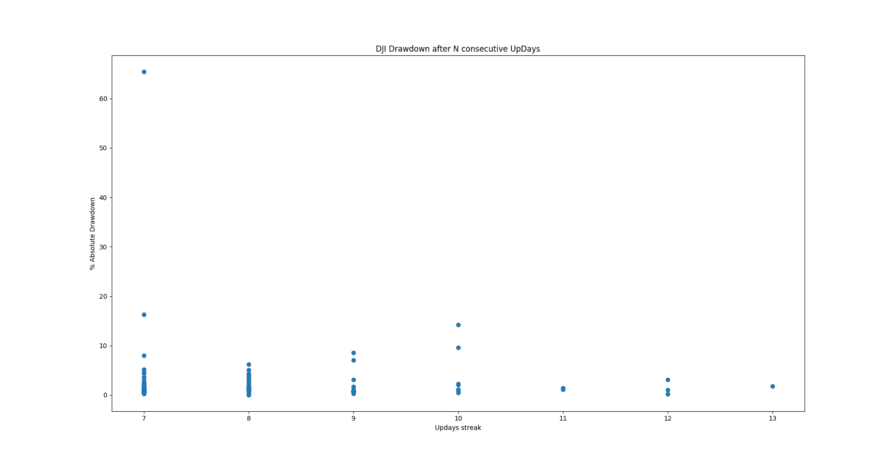
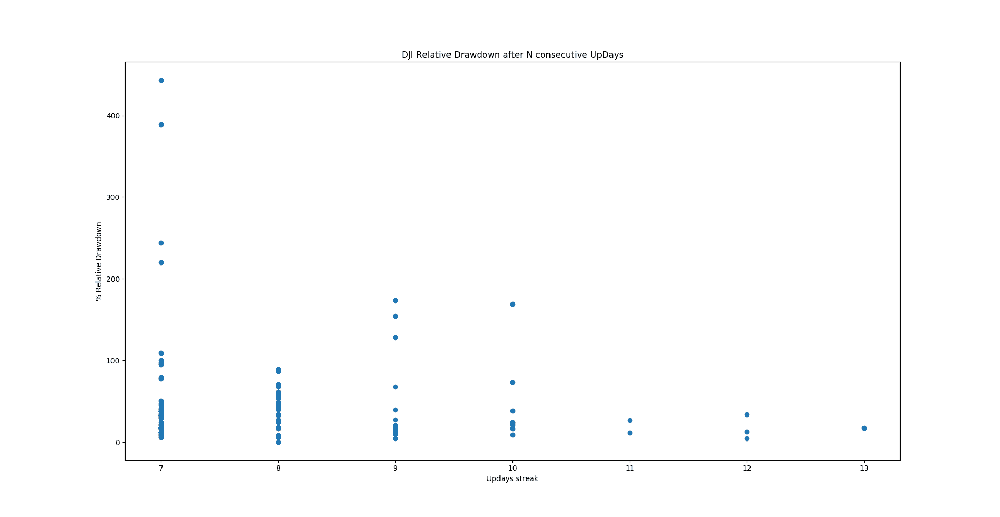

# 道琼斯工业平均指数 10 天连涨

> 原文：[`www.backtrader.com/blog/posts/2017-08-08-dow-10-day-streak/dow-10-day-streak/`](https://www.backtrader.com/blog/posts/2017-08-08-dow-10-day-streak/dow-10-day-streak/)

这已经成为新闻了。道琼斯工业平均指数创下了历史新高，已经连续上涨了 10 天，创下了 9 次历史新高。例如：

+   [ZeroHedge - 道指连续第 9 天创新纪录收盘，成交量为年内最低](http://www.zerohedge.com/news/2017-08-07/dow-rises-9th-straight-record-close-lowest-volume-years)

许多人肯定已经注意到道琼斯正在经历这样的连涨，文章只是告诉我们这已成为*主流*。但是一些问题出现了：

+   *这是正常还是非凡的*？

+   *之后会发生什么*？

让我们通过启动 *backtrader* 来回答这些问题，通过制定一个 *分析器* 来做到这一点：分析情况并回答问题（有关代码，请参见下文）

我们的样本数据包含`5923`个交易日。让我们看看当前的连续上涨日在哪里。

## 这是正常还是非凡的？

执行我们的代码显示，连续`10`天这样的日子至少是非凡的，如果不是特别的话。

```py
`$ ./updaystreaks.py --data 099I-DJI --upstreak hilo=True
            count  rank  upstreak       upleg   upleg %  drawdown  rel drawdown
1987-01-02      1     1        13  219.069946  0.116193  0.017616      0.171407
2017-02-09      2     2        12  822.109375  0.041074  0.001875      0.047548
1970-11-19      3     2        12   66.900024  0.088986  0.010321      0.127055
1929-06-20      4     2        12   32.000000  0.101716  0.031134      0.340625
1991-12-18      5     3        11  315.100098  0.109167  0.011113      0.113614
1955-01-18      6     3        11   22.200012  0.057290  0.014334      0.265765
2017-07-25      7     4        10  622.289062  0.028949       NaN           NaN
2013-03-01      8     4        10  488.959961  0.034801  0.008102      0.240919
1996-11-04      9     4        10  348.839844  0.058148  0.004792      0.087605
1973-07-16     10     4        10   53.600037  0.060695  0.095935      1.686565
1959-11-17     11     4        10   31.599976  0.049945  0.011216      0.237342
1959-06-24     12     4        10   36.200012  0.057680  0.020649      0.381215
1955-08-23     13     4        10   25.400024  0.056344  0.008772      0.165353
1933-03-03     14     4        10   12.600002  0.250497  0.142415      0.730158
1920-12-29     15     4        10    8.099998  0.119118  0.022339      0.209876
2016-07-08     16     5         9  778.378906  0.043688  0.016552      0.396003
1996-05-08     17     5         9  334.369629  0.061755  0.002442      0.041990
1989-07-03     18     5         9  141.890137  0.058804  0.007179      0.129677
1968-04-23     19     5         9   38.000000  0.043123  0.070535      1.736842
1967-04-13     20     5         9   49.700012  0.059061  0.006593      0.118713
1967-01-03     21     5         9   55.799988  0.071603  0.006321      0.094982
1965-01-22     22     5         9   18.500000  0.020838  0.031326      1.540541
1964-03-06     23     5         9   19.600037  0.024506  0.016127      0.678570
1955-06-15     24     5         9   12.399994  0.028343  0.005537      0.201613
1955-04-05     25     5         9   16.299988  0.039553  0.010465      0.276074
1954-09-01     26     5         9   18.599976  0.055822  0.009325      0.177419
1945-04-06     27     5         9    9.000000  0.058140  0.008526      0.155555
1929-02-18     28     5         9   21.800018  0.072812  0.086005      1.279815
1921-10-18     29     5         9    4.300003  0.061871  0.008130      0.139536` 
```

当前的连涨，尚未结束，排名（并列）第 4。请注意：

+   连涨时期的上涨幅度在连涨 10 天或更长时间时最小

+   三个连续上涨日为 9 天的日子在百分比方面略小，分别是 1955 年、1964 年和 1965 年

+   今年有另一个长达 12 天的排名第二的连涨

## 之后会发生什么？

即使表格已经显示了持续上涨日结束后的回撤和相对回撤（从上涨日开始计算，因此可能 > 100%），但最好通过视觉方式来回答问题。





图表很快就会显示出来：

+   这样的长连涨似乎表明了强劲，不会真的预期到有大的回撤作为反应

## 但是等等！！！

在排名第 1 和第 2 的 remarkable 日期中，我们有：

```py
 `count  rank  upstreak       upleg   upleg %  drawdown  rel drawdown
1987-01-02      1     1        13  219.069946  0.116193  0.017616      0.171407
2017-02-09      2     2        12  822.109375  0.041074  0.001875      0.047548
1970-11-19      3     2        12   66.900024  0.088986  0.010321      0.127055
1929-06-20      4     2        12   32.000000  0.101716  0.031134      0.340625
...` 
```

的确，因为`1987`和`1929`后来确实有非常大的熊市。但是并不是连涨结束后立即发生，如统计数据所示：相对回撤没有超过 100%，因此新高跟随了那些连涨结束后。

## 代码

```py
`from __future__ import (absolute_import, division, print_function,
                        unicode_literals)

import argparse
import collections
import datetime
import itertools

import matplotlib.pyplot as plt
import pandas as pd

import backtrader as bt

class UpStreak(bt.Analyzer):
    params = dict(
        sep=',',
        hilo=False,
    )

    def __init__(self):
        self.upday = bt.ind.UpDayBool()
        self.curdt = None  # streak start date

        self.incs = dict()  # upleg in points
        self.pincs = dict()  # upleg in percentage
        self.close0 = dict()  # starting price for upleg
        self.peaks = collections.deque()  # endng price for upleg
        self.ddown = dict()  # absolute drawdowns
        self.ddownrel = dict()  # relative drawdown (% of upleg retraced)

        self.rets = collections.defaultdict(int)  # holds main results

    def next(self):
        curclose = self.data.close[0]
        lastclose = self.data.close[-1]

        self.peaks.append((None, None))
        while True:
            dt, peak = self.peaks.popleft()
            if dt is None:
                break  # all elements seen

            if peak > curclose:  # peak not overdone, update drawdown
                ddown = 1.0 - curclose / peak
                self.ddown[dt] = max(self.ddown[dt], ddown)
                self.peaks.append((dt, peak))  # not done yet

                inc = self.incs[dt]
                fall = peak - curclose
                ddownrel = fall / inc
                self.ddownrel[dt] = max(self.ddownrel[dt], ddownrel)

        if self.upday:
            if self.curdt is None:  # streak begins
                self.curdt = self.strategy.datetime.date()
                if self.p.hilo:
                    lastclose = self.data.low[-1]
                self.close0[self.curdt] = lastclose

            self.incs[self.curdt] = inc = curclose - self.close0[self.curdt]
            self.pincs[self.curdt] = inc / self.close0[self.curdt]
            self.rets[self.curdt] += 1  # update current streak
        else:
            if self.curdt is not None:  # streak ends
                if self.p.hilo:
                    lastclose = self.data.high[-1]

                inc = self.incs[self.curdt]
                fall = lastclose - curclose
                self.ddownrel[self.curdt] = fall / inc
                self.ddown[self.curdt] = 1.0 - curclose / lastclose
                self.peaks.append((self.curdt, lastclose))

                self.curdt = None

    def stop(self):
        s = sorted(
            self.rets.items(),
            reverse=True,
            key=lambda item: (item[1], item[0])
        )
        # keep it in dict format
        self.rets = collections.OrderedDict(s)

        self.s = collections.OrderedDict(s)

        self.headers = [
            'date',
            'count', 'rank', 'upstreak',
            'upleg', 'upleg %',
            'drawdown', 'rel drawdown',
        ]

        i = 0
        count = itertools.count(1)
        last = float('inf')
        for dt, streak in self.s.items():
            if streak < last:
                i += 1
                last = streak
            ddown = self.ddown.get(dt, None)
            ddownrel = self.ddownrel.get(dt, None)
            inc = self.incs.get(dt, None)
            pinc = self.pincs.get(dt, None)

            self.s[dt] = [
                next(count), i,
                streak,
                inc, pinc,
                ddown, ddownrel
            ]

    def get_dataframe(self):
        return pd.DataFrame.from_items(
            self.s.items(),
            orient='index',
            columns=self.headers[1:],  # skip index
        )

    def print_ranking(self):
        i = 0
        last = float('inf')
        print(self.p.sep.join(self.headers))

        for dt, items in self.s.items():
            print(
                self.p.sep.join(
                    str(x) for x in itertools.chain([dt], items)
                )
            )

def runstrat(args=None):
    args = parse_args(args)

    cerebro = bt.Cerebro()

    kwargs = dict()  # Data feed kwargs

    # Parse from/to-date
    dtfmt, tmfmt = '%Y-%m-%d', 'T%H:%M:%S'
    for a, d in ((getattr(args, x), x) for x in ['fromdate', 'todate']):
        if a:
            strpfmt = dtfmt + tmfmt * ('T' in a)
            kwargs[d] = datetime.datetime.strptime(a, strpfmt)

    fromdate = kwargs.get('fromdate', datetime.date.min)

    store = bt.stores.VChartFile()
    data = store.getdata(dataname=args.data, **kwargs)
    cerebro.adddata(data)

    cerebro.addanalyzer(UpStreak, **eval('dict(' + args.upstreak + ')'))
    result = cerebro.run()
    st0 = result[0]

    a = st0.analyzers.upstreak

    # Plot some things
    # pd.set_option('display.max_columns', 500)
    pd.set_option('display.expand_frame_repr', False)
    df = a.get_dataframe()
    up = df['upstreak']

    up9 = df[up >= 9]
    print(up9)

    up7 = df[up >= 7]
    x = up7['upstreak']
    y = up7['rel drawdown'] * 100.0

    plt.scatter(x, y)
    plt.ylabel('% Relative Drawdown')
    plt.xlabel('Updays streak')
    plt.title('DJI Relative Drawdown after N consecutive UpDays')
    plt.show()

    # Plot some things
    y = up7['drawdown'] * 100.0
    plt.ylabel('% Absolute Drawdown')
    plt.xlabel('Updays streak')
    plt.title('DJI Drawdown after N consecutive UpDays')
    plt.scatter(x, y)
    plt.show()

def parse_args(pargs=None):
    parser = argparse.ArgumentParser(
        formatter_class=argparse.ArgumentDefaultsHelpFormatter,
        description=(
            'UpDayStreaks'
        )
    )

    parser.add_argument('--data', default='', required=True,
                        help='Data Ticker')

    parser.add_argument('--fromdate', required=False, default='',
                        help='Date[time] in YYYY-MM-DD[THH:MM:SS] format')

    parser.add_argument('--todate', required=False, default='',
                        help='Date[time] in YYYY-MM-DD[THH:MM:SS] format')

    parser.add_argument('--cerebro', required=False, default='',
                        metavar='kwargs', help='kwargs in key=value format')

    parser.add_argument('--upstreak', required=False, default='',
                        metavar='kwargs', help='kwargs in key=value format')

    parser.add_argument('--strat', required=False, default='',
                        metavar='kwargs', help='kwargs in key=value format')

    parser.add_argument('--plot', required=False, default='',
                        nargs='?', const='{}',
                        metavar='kwargs', help='kwargs in key=value format')

    return parser.parse_args(pargs)

if __name__ == '__main__':
    runstrat()` 
```
