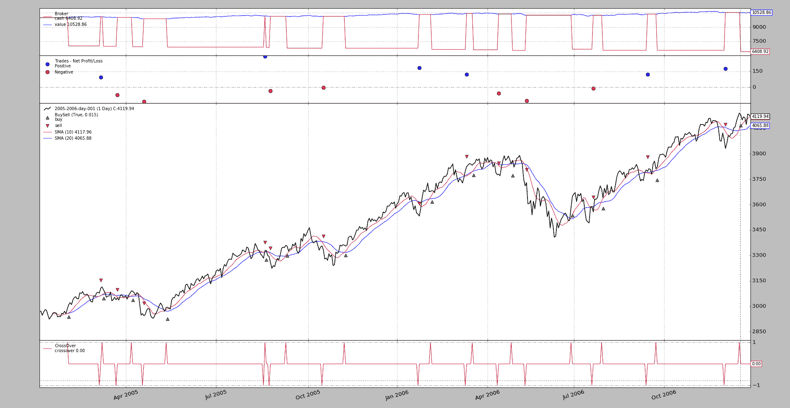

# 评估外部历史表现

> 原文：[`www.backtrader.com/blog/posts/2017-07-05-order-history/order-history/`](https://www.backtrader.com/blog/posts/2017-07-05-order-history/order-history/)

使用版本`1.9.55.122`，*backtrader*现在可以用于评估外部一组订单的性能。 例如可以用于：

+   评估一组使用主观交易（即：人为离散决策）的订单/交易

+   评估在另一个平台创建的订单并验证该平台的分析器

+   当然，也要反向评估*backtrader*返回的结果与其他平台的已知结果是否匹配

## 使用模式

```py
`...
cerebro.adddata(mydata)
...
cerebro.add_order_history(orders, notify=True or False)
...
cerebro.run()` 
```

显而易见的问题在于`orders`应该是什么样子。让我们引用文档：

+   `orders`：是一个可迭代对象（例如：列表、元组、迭代器、生成器），其中每个元素也将是一个具有以下子元素的可迭代对象（有 2 种格式）

    `[datetime, size, price]`或`[datetime, size, price, data]`

    **注意**：它必须按排序（或产生排序元素）

    ```py
    `datetime ascending` 
    ```

    其中：

    +   `datetime`是一个 python `date/datetime`实例或具有格式 YYYY-MM-DD[THH:MM:SS[.us]]的字符串，其中括号中的元素是可选的

    +   `size`是一个整数（*买*为正，*卖*为负）

    +   `price`是一个浮点数/整数

    +   `data`如果存在，可以取以下任何值

        +   *None* - 将使用第一个数据源作为目标

        +   *integer* - 将使用具有该索引的数据（**Cerebro**中的插入顺序）

        +   *string* - 具有该名称的数据，例如使用`cerebro.addata(data, name=value)`分配的，将是目标

对于`notify`的情况：

+   `notify`（默认值：*True*）

    如果`True`，则系统中插入的第一个策略将收到根据`orders`中每个订单信息创建的人为订单的通知

注意

注意上面的示例是如何添加*数据源*的。**是的**，这是必要的。

orders 可能的样子的一个实际例子

```py
`ORDER_HISTORY = (
    ('2005-02-01', 1, 2984.63),
    ('2005-03-04', -1, 3079.93),
    ...
    ('2006-12-18', 1, 4140.99),
)` 
```

一个有 3 个元素的可迭代对象，可以完全从*CSV*文件中加载。

## 一个例子

下面的示例执行两件事：

1.  执行一个简单的*SMA 交叉*策略

1.  添加一个执行与*SMA 交叉*策略相同操作的订单历史记录

    在第 2 种情况下，添加了一个空策略以通过`notify_order`和`notify_trade`接收订单和交易通知

在两种情况下加载了一组*分析器*（*时间回报*以*月*和*年*计以及一个`TradeAnalyzer`）……它们应该返回相同的值。

## 运行 1：SMA 交叉

```py
`$ ./order-history.py --plot --cerebro writer=True` 
```

这产生了一个图表



和一些文本输出（为简洁起见截断）：

```py
`Creating Signal Strategy
2005-02-01,1,2984.63
2005-03-04,-1,3079.93
...
2006-12-01,-1,3993.03
profit 177.9000000000001
2006-12-18,1,4140.99
===============================================================================
Cerebro:
...
        - timereturn1:
          ~~~~~~~~~~~~~~~~~~~~~~~~~~~~~~~~~~~~~~~~~~~~~~~~~~~~~~~~~~~~~~~~~~~~~
          - Params:
            - timeframe: 8
            - compression: None
            - _doprenext: True
            - data: None
            - firstopen: True
            - fund: None
          ~~~~~~~~~~~~~~~~~~~~~~~~~~~~~~~~~~~~~~~~~~~~~~~~~~~~~~~~~~~~~~~~~~~~~
          - Analysis:
            - 2005-12-31: 0.03580099999999975
            - 2006-12-31: 0.01649448108275653
        .......................................................................
        - tradeanalyzer:
          - Params: None
          ~~~~~~~~~~~~~~~~~~~~~~~~~~~~~~~~~~~~~~~~~~~~~~~~~~~~~~~~~~~~~~~~~~~~~
          - Analysis:
            """""""""""""""""""""""""""""""""""""""""""""""""""""""""""""""""""
            - total:
              - total: 14
              - open: 1
              - closed: 13
            """""""""""""""""""""""""""""""""""""""""""""""""""""""""""""""""""
            - streak:
              ^^^^^^^^^^^^^^^^^^^^^^^^^^^^^^^^^^^^^^^^^^^^^^^^^^^^^^^^^^^^^^^^^
              - won:
                - current: 2
                - longest: 2
...` 
```

## 运行 2：订单历史

```py
`$ ./order-history.py --plot --cerebro writer=True --order-history` 
```

这产生了一个看起来没有差异的图表


和一些文本输出（为了简洁起见再次截断）：

```py
`Creating Empty Strategy
2005-02-01,1,2984.63
2005-03-04,-1,3079.93
...
        .......................................................................
        - timereturn1:
          ~~~~~~~~~~~~~~~~~~~~~~~~~~~~~~~~~~~~~~~~~~~~~~~~~~~~~~~~~~~~~~~~~~~~~
          - Params:
            - timeframe: 8
            - compression: None
            - _doprenext: True
            - data: None
            - firstopen: True
            - fund: None
          ~~~~~~~~~~~~~~~~~~~~~~~~~~~~~~~~~~~~~~~~~~~~~~~~~~~~~~~~~~~~~~~~~~~~~
          - Analysis:
            - 2005-12-31: 0.03580099999999975
            - 2006-12-31: 0.01649448108275653
        .......................................................................
        - tradeanalyzer:
          - Params: None
          ~~~~~~~~~~~~~~~~~~~~~~~~~~~~~~~~~~~~~~~~~~~~~~~~~~~~~~~~~~~~~~~~~~~~~
          - Analysis:
            """""""""""""""""""""""""""""""""""""""""""""""""""""""""""""""""""
            - total:
              - total: 14
              - open: 1
              - closed: 13
            """""""""""""""""""""""""""""""""""""""""""""""""""""""""""""""""""
            - streak:
              ^^^^^^^^^^^^^^^^^^^^^^^^^^^^^^^^^^^^^^^^^^^^^^^^^^^^^^^^^^^^^^^^^
              - won:
                - current: 2
                - longest: 2
...` 
```

并且所期望的值与参考值相匹配。

## 结论

例如，可以测量判断性交易的表现。有时会与算法交易结合使用，其中算法生成信号，但人类最终决定是否将信号转化为实际交易。

## 示例用法

```py
`$ ./order-history.py --help
usage: order-history.py [-h] [--data0 DATA0] [--fromdate FROMDATE]
                        [--todate TODATE] [--order-history] [--cerebro kwargs]
                        [--broker kwargs] [--sizer kwargs] [--strat kwargs]
                        [--plot [kwargs]]

Order History Sample

optional arguments:
  -h, --help           show this help message and exit
  --data0 DATA0        Data to read in (default:
                       ../../datas/2005-2006-day-001.txt)
  --fromdate FROMDATE  Date[time] in YYYY-MM-DD[THH:MM:SS] format (default: )
  --todate TODATE      Date[time] in YYYY-MM-DD[THH:MM:SS] format (default: )
  --order-history      use order history (default: False)
  --cerebro kwargs     kwargs in key=value format (default: )
  --broker kwargs      kwargs in key=value format (default: )
  --sizer kwargs       kwargs in key=value format (default: )
  --strat kwargs       kwargs in key=value format (default: )
  --plot [kwargs]      kwargs in key=value format (default: )` 
```

## 示例代码

```py
`from __future__ import (absolute_import, division, print_function,
                        unicode_literals)

import argparse
import datetime

import backtrader as bt

ORDER_HISTORY = (
    ('2005-02-01', 1, 2984.63),
    ('2005-03-04', -1, 3079.93),
    ('2005-03-08', 1, 3113.82),
    ('2005-03-22', -1, 3040.55),
    ('2005-04-08', 1, 3092.07),
    ('2005-04-20', -1, 2957.92),
    ('2005-05-13', 1, 2991.71),
    ('2005-08-19', -1, 3284.35),
    ('2005-08-22', 1, 3328.84),
    ('2005-08-25', -1, 3293.69),
    ('2005-09-12', 1, 3361.1),
    ('2005-10-18', -1, 3356.73),
    ('2005-11-09', 1, 3361.92),
    ('2006-01-24', -1, 3544.78),
    ('2006-02-06', 1, 3678.87),
    ('2006-03-13', -1, 3801.03),
    ('2006-03-20', 1, 3833.25),
    ('2006-04-13', -1, 3777.24),
    ('2006-05-02', 1, 3839.24),
    ('2006-05-16', -1, 3711.46),
    ('2006-06-30', 1, 3592.01),
    ('2006-07-21', -1, 3580.53),
    ('2006-08-01', 1, 3687.82),
    ('2006-09-14', -1, 3809.08),
    ('2006-09-25', 1, 3815.13),
    ('2006-12-01', -1, 3993.03),
    ('2006-12-18', 1, 4140.99),
)

class SmaCross(bt.SignalStrategy):
    params = dict(sma1=10, sma2=20)

    def notify_order(self, order):
        if not order.alive():
            print(','.join(str(x) for x in
                           (self.data.num2date(order.executed.dt).date(),
                            order.executed.size * 1 if order.isbuy() else -1,
                            order.executed.price)))

    def notify_trade(self, trade):
        if trade.isclosed:
            print('profit {}'.format(trade.pnlcomm))

    def __init__(self):
        print('Creating Signal Strategy')
        sma1 = bt.ind.SMA(period=self.params.sma1)
        sma2 = bt.ind.SMA(period=self.params.sma2)
        crossover = bt.ind.CrossOver(sma1, sma2)
        self.signal_add(bt.SIGNAL_LONG, crossover)

class St(bt.Strategy):
    params = dict(
    )

    def notify_order(self, order):
        if not order.alive():
            print(','.join(str(x) for x in
                           (self.data.num2date(order.executed.dt).date(),
                            order.executed.size * 1 if order.isbuy() else -1,
                            order.executed.price)))

    def notify_trade(self, trade):
        if trade.isclosed:
            print('profit {}'.format(trade.pnlcomm))

    def __init__(self):
        print('Creating Empty Strategy')
        pass

    def next(self):
        pass

def runstrat(args=None):
    args = parse_args(args)

    cerebro = bt.Cerebro()

    # Data feed kwargs
    kwargs = dict()

    # Parse from/to-date
    dtfmt, tmfmt = '%Y-%m-%d', 'T%H:%M:%S'
    for a, d in ((getattr(args, x), x) for x in ['fromdate', 'todate']):
        if a:
            strpfmt = dtfmt + tmfmt * ('T' in a)
            kwargs[d] = datetime.datetime.strptime(a, strpfmt)

    data0 = bt.feeds.BacktraderCSVData(dataname=args.data0, **kwargs)
    cerebro.adddata(data0)

    # Broker
    cerebro.broker = bt.brokers.BackBroker(**eval('dict(' + args.broker + ')'))

    # Sizer
    cerebro.addsizer(bt.sizers.FixedSize, **eval('dict(' + args.sizer + ')'))

    # Strategy
    if not args.order_history:
        cerebro.addstrategy(SmaCross, **eval('dict(' + args.strat + ')'))
    else:
        cerebro.addstrategy(St, **eval('dict(' + args.strat + ')'))
        cerebro.add_order_history(ORDER_HISTORY, notify=True)

    cerebro.addanalyzer(bt.analyzers.TimeReturn, timeframe=bt.TimeFrame.Months)
    cerebro.addanalyzer(bt.analyzers.TimeReturn, timeframe=bt.TimeFrame.Years)
    cerebro.addanalyzer(bt.analyzers.TradeAnalyzer)

    # Execute
    cerebro.run(**eval('dict(' + args.cerebro + ')'))

    if args.plot:  # Plot if requested to
        cerebro.plot(**eval('dict(' + args.plot + ')'))

def parse_args(pargs=None):
    parser = argparse.ArgumentParser(
        formatter_class=argparse.ArgumentDefaultsHelpFormatter,
        description=(
            'Order History Sample'
        )
    )

    parser.add_argument('--data0', default='../../datas/2005-2006-day-001.txt',
                        required=False, help='Data to read in')

    # Defaults for dates
    parser.add_argument('--fromdate', required=False, default='',
                        help='Date[time] in YYYY-MM-DD[THH:MM:SS] format')

    parser.add_argument('--todate', required=False, default='',
                        help='Date[time] in YYYY-MM-DD[THH:MM:SS] format')

    parser.add_argument('--order-history', required=False, action='store_true',
                        help='use order history')

    parser.add_argument('--cerebro', required=False, default='',
                        metavar='kwargs', help='kwargs in key=value format')

    parser.add_argument('--broker', required=False, default='',
                        metavar='kwargs', help='kwargs in key=value format')

    parser.add_argument('--sizer', required=False, default='',
                        metavar='kwargs', help='kwargs in key=value format')

    parser.add_argument('--strat', required=False, default='',
                        metavar='kwargs', help='kwargs in key=value format')

    parser.add_argument('--plot', required=False, default='',
                        nargs='?', const='{}',
                        metavar='kwargs', help='kwargs in key=value format')

    return parser.parse_args(pargs)

if __name__ == '__main__':
    runstrat()` 
```
