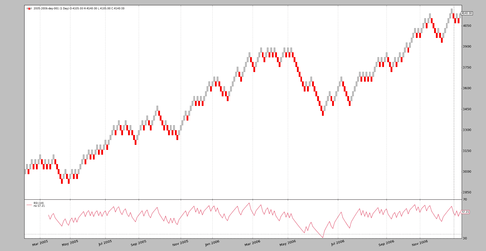

# 砖形图

> 原文：[`www.backtrader.com/blog/posts/2017-06-26-renko-bricks/renko-bricks/`](https://www.backtrader.com/blog/posts/2017-06-26-renko-bricks/renko-bricks/)

*砖形图*是一种以价格比时间更重要的方式展示价格演变的方法。这已经在*backtrader*的`1.9.54.122`版本中作为*过滤器*引入了。

*Stockcharts*对*砖形图*有一个很好的参考。请参阅[StockCharts 上的砖形图](http://stockcharts.com/school/doku.php?id=chart_school:chart_analysis:renko)

## 一些示例

注意

`size=35`和`align=10.0`参数适用于*backtrader*存储库中的示例数据。这些值必须针对每个数据资产进行微调。

首先，让我们将*砖形图*单独放在一个图表上：

```py
$ ./renko.py --renko size=35,align=10.0 --plot
```

输出



人们可以看到图表立即显示出一些支撑/阻力区域，这是*砖形图*的主要优势之一。显然，X 轴上的时间演变不再是恒定的，而是被拉伸或压缩，取决于价格行动在期间是更静态还是移动了几个砖块。

为了更好地看到和欣赏效果，让我们将普通的价格条和*砖形图*放在一起在一个图表上：

```py
$ ./renko.py --renko size=35,align=10.0 --plot --dual
```

输出


时间周期的拉伸和压缩现在更加明显。另一个要考虑的因素是价格行动的关注如何影响应用的指标，正如图表上显示的两个`RSI`指标所示。

## 示例用法

```py
$ ./renko.py --help
usage: renko.py [-h] [--data0 DATA0] [--fromdate FROMDATE] [--todate TODATE]
                [--cerebro kwargs] [--broker kwargs] [--sizer kwargs]
                [--strat kwargs] [--plot [kwargs]] [--renko kwargs] [--dual]

Renko bricks sample

optional arguments:
  -h, --help           show this help message and exit
  --data0 DATA0        Data to read in (default:
                       ../../datas/2005-2006-day-001.txt)
  --fromdate FROMDATE  Date[time] in YYYY-MM-DD[THH:MM:SS] format (default: )
  --todate TODATE      Date[time] in YYYY-MM-DD[THH:MM:SS] format (default: )
  --cerebro kwargs     kwargs in key=value format (default: )
  --broker kwargs      kwargs in key=value format (default: )
  --sizer kwargs       kwargs in key=value format (default: )
  --strat kwargs       kwargs in key=value format (default: )
  --plot [kwargs]      kwargs in key=value format (default: )
  --renko kwargs       kwargs in key=value format (default: )
  --dual               put the filter on a second version of the data
                       (default: False)
```

## 示例代码

```py
from __future__ import (absolute_import, division, print_function,
                        unicode_literals)

import argparse
import datetime

import backtrader as bt

class St(bt.Strategy):
    params = dict(
    )

    def __init__(self):
        for d in self.datas:
            bt.ind.RSI(d)

    def next(self):
        pass

def runstrat(args=None):
    args = parse_args(args)

    cerebro = bt.Cerebro()

    # Data feed kwargs
    kwargs = dict()

    # Parse from/to-date
    dtfmt, tmfmt = '%Y-%m-%d', 'T%H:%M:%S'
    for a, d in ((getattr(args, x), x) for x in ['fromdate', 'todate']):
        if a:
            strpfmt = dtfmt + tmfmt * ('T' in a)
            kwargs[d] = datetime.datetime.strptime(a, strpfmt)

    data0 = bt.feeds.BacktraderCSVData(dataname=args.data0, **kwargs)

    fkwargs = dict()
    fkwargs.update(**eval('dict(' + args.renko + ')'))

    if not args.dual:
        data0.addfilter(bt.filters.Renko, **fkwargs)
        cerebro.adddata(data0)
    else:
        cerebro.adddata(data0)
        data1 = data0.clone()
        data1.addfilter(bt.filters.Renko, **fkwargs)
        cerebro.adddata(data1)

    # Broker
    cerebro.broker = bt.brokers.BackBroker(**eval('dict(' + args.broker + ')'))

    # Sizer
    cerebro.addsizer(bt.sizers.FixedSize, **eval('dict(' + args.sizer + ')'))

    # Strategy
    cerebro.addstrategy(St, **eval('dict(' + args.strat + ')'))

    # Execute
    kwargs = dict(stdstats=False)
    kwargs.update(**eval('dict(' + args.cerebro + ')'))
    cerebro.run(**kwargs)

    if args.plot:  # Plot if requested to
        kwargs = dict(style='candle')
        kwargs.update(**eval('dict(' + args.plot + ')'))
        cerebro.plot(**kwargs)

def parse_args(pargs=None):
    parser = argparse.ArgumentParser(
        formatter_class=argparse.ArgumentDefaultsHelpFormatter,
        description=(
            'Renko bricks sample'
        )
    )

    parser.add_argument('--data0', default='../../datas/2005-2006-day-001.txt',
                        required=False, help='Data to read in')

    # Defaults for dates
    parser.add_argument('--fromdate', required=False, default='',
                        help='Date[time] in YYYY-MM-DD[THH:MM:SS] format')

    parser.add_argument('--todate', required=False, default='',
                        help='Date[time] in YYYY-MM-DD[THH:MM:SS] format')

    parser.add_argument('--cerebro', required=False, default='',
                        metavar='kwargs', help='kwargs in key=value format')

    parser.add_argument('--broker', required=False, default='',
                        metavar='kwargs', help='kwargs in key=value format')

    parser.add_argument('--sizer', required=False, default='',
                        metavar='kwargs', help='kwargs in key=value format')

    parser.add_argument('--strat', required=False, default='',
                        metavar='kwargs', help='kwargs in key=value format')

    parser.add_argument('--plot', required=False, default='',
                        nargs='?', const='{}',
                        metavar='kwargs', help='kwargs in key=value format')

    parser.add_argument('--renko', required=False, default='',
                        metavar='kwargs', help='kwargs in key=value format')

    parser.add_argument('--dual', required=False, action='store_true',
                        help='put the filter on a second version of the data')

    return parser.parse_args(pargs)

if __name__ == '__main__':
    runstrat()
```
