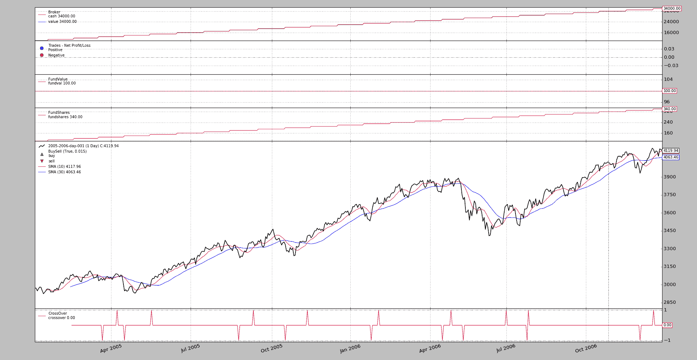
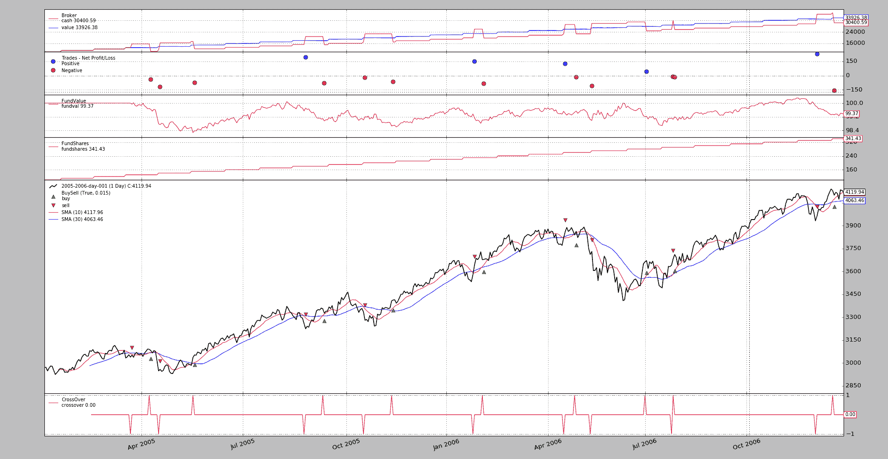

# Backtrader：该基金

> 原文：[`www.backtrader.com/blog/posts/2017-06-19-fund-tracking/fund-tracking/`](https://www.backtrader.com/blog/posts/2017-06-19-fund-tracking/fund-tracking/)

*backtrader*已经有一段时间被使用，可以说是*专业*使用，除了一些银行和交易公司之外，还有*Backtrader 基金*。

## 历史

一群志同道合且相互认识已久的人决定走上开设（避险）基金的道路，并以*backtrader*作为交易理念的基石。有一件事情是不可或缺的：它必须是 100%受监管的（但不在开曼群岛或类似地方）

位置、传统和网络在欧盟首先，然后在西班牙放置重点，西班牙（以及其他一些地方）的立法允许*伞形基金*托管*子基金*，这使得可以用较少的资金和参与者数量创建一个完全受监管的基金。

还有……基金已被西班牙的监管机构*CNMV*（西班牙国家证券市场委员会）批准，*ISIN*为`ES0131444038`。链接：

+   [伞形基金](https://www.cnmv.es/portal/ANCV/ISIN.aspx?nif=V04856381)

+   [子基金](https://www.cnmv.es/portal/Consultas/IIC/Fondo.aspx?isin=ES0131444038)

对于能阅读西班牙语的人，*backtrader*的使用已在官方基金说明书中记录。

对于那些可能在某个时候决定走这条路的人，最重要的事情是：

+   官僚主义很慢，沿途会有很多问题

+   保持一切的记录（执行的操作、现金/净资产价值水平、头寸、杠杆）

+   向监管机构报告是必须的（因此需要收集和保持前述信息的良好组织）

+   遵循定义的风险/波动性水平不仅仅是一个指导方针

+   管理其他人的资金（OPM）是一种真正的心理负担。会有损失，会有问题。无论问题有多么善意和天真：它们都会产生影响。

*backtrader*是交易理念的基础，并且它已经找到了一个新的应用领域：*报告*。自定义的*分析器*和*指标*可以帮助控制风险/波动性，从而减轻了行政负担。

可能是因为我们年纪大了（而且是老派的），我们仍然更喜欢手动执行（自动执行将在未来某个时候接管）

下面描述的功能是为了辅助管理基金和回测资金进出以及绩效不再是追踪净资产价值的问题。

# 基金跟踪

在版本`1.9.52.121`中，*backtrader*中的经纪人不仅在*现金*/*价值*方面跟踪会计，而且像在*基金*中一样进行，即：

+   基金价值（实际基金份额的价值）

+   股份数量

通过这样做，我们可以模拟现金存款和提款，同时仍然跟踪实际表现，而常规会计会被现金流入/流出所扭曲。

除了经纪人的变化外，*分析器*和*观察者*也已经适应（那些与净资产价值有关的）以支持`fund`参数，以决定实际应该追踪什么。例如`TimeReturn`：

```py
...
cerebro.addanalyzer(bt.analyzers.TimeReturn)  # auto-detect broker mode
cerebro.addanalyzer(bt.analyzers.TimeReturn, fund=True)  # track fund value
cerebro.addanalyzer(bt.analyzers.TimeReturn, fund=False)  # track net asset value
...
```

## 这是什么*基金追踪*？

想象一下使用案例（稍后在示例中）：某人从 1000 货币单位开始，在每个月的 15 日添加 100 货币单位。12 个月后，账户中的总额为 2200。根据最初的持仓计算的回报率为

以通常的方式计算回报，这意味着在没有执行任何操作的情况下，年度回报率为`120%`。当然，这是不正确的。

为了缓解这个问题，不管账户的初始值如何，基金份额（*fundvalue*）的价值被设定为`100.0`。并且根据此值和起始净资产价值（`1000`货币单位），计算基金份额数量如下：

+   `fundshares = 净资产价值 / 基金价值`

在这种情况下，实际上是`1000 / 100.0 = 10 份股份`

每次加入现金后，我们都会增加股份数量：

+   `new_fund_shares = 加入现金 / 基金价值`

因为我们每次添加`100.0`货币单位且没有执行任何操作：

```py
- ``100.0 / 100.0 = 1 share```

```py

Notice that the *fundvalue* remains unchanged. Quickly forwarding to the end of the year we have the following:

*   Starting net-asset-value: `1000`

*   Final net-asset-value: `2200`

*   Starting fundvalue = `100`

*   Final fundvalue = `100`

*   Starting number of shares: `10`

*   Final number of shares: `22`

Now if we calculate the returns using the starting and ending *fundvalues* and because they are the same we have a: `0%` which matches the reality. because cash additions have not changed

## Using *fund tracking* in backtrader

### Adding cash

First, the broker has gained a method to canonically add cash to the system:

```

`add_cash(cash)`

```py

Using it inside the strategy for example:

```

`def next(self):

    如果条件成立：

        self.broker.add_cash(1000.0)`

```py

This method **MUST** be used to track the entry and exit of cash into the system and properly track the fund value.

### Automatic

Activate it in the *broker*:

```

`...

cerebro.broker.set_fundmode(True)

...`

```py

changing at the same time the default fund start value:

```

`...

cerebro.broker.set_fundmode(True, 10.0)  # 默认为 100

...`

```py

or in independent calls:

```

`...

cerebro.broker.set_fundmode(True)

cerebro.broker.set_fundstartval(10.0)  # 默认为 100

...`

```py

After activation of the default mode and coming back to the `TimeReturn` analyzer examples from above:

```

`...

# 1

cerebro.addanalyzer(bt.analyzers.TimeReturn)  # 自动检测经纪人模式

# 2

cerebro.addanalyzer(bt.analyzers.TimeReturn, fund=True)  # 追踪基金价值

# 3

cerebro.addanalyzer(bt.analyzers.TimeReturn, fund=False)  # 追踪净资产价值

...`

```py

`1` and `2` are equivalent. But one should go for `1`. If one wishes to compare, one can always force the `TimeReturn` analyzer to not use the *fundvalue* and rather track the *net-asset-value*

An example is worth a thousand words. In the sample, we’ll be using doing as described above but with some extra cash (the asset has a per-share value over `3000`). The initial cash level will be `10000`, the default in *backtrader* and on the *15^(th)* of each month, `1000` extra monetary units will be added (using a recurring `Timer`). It will be 24 months (which is the size of the standard data sample used in *backtrader*)

#### Without any operations

```

`$ ./fund-tracker.py --broker fundmode=True --strat cash2add=1000 --cerebro writer=True --plot`

```py

The graphical view



And the text output (capped for readability):

```

`- timereturn:

~~~~~~~~~~~~~~~~~~~~~~~~~~~~~~~~~~~~~~~~~~~~~~~~~~~~~~~~~~~~~~~~~~~~~

    ...

    - 基金：无

~~~~~~~~~~~~~~~~~~~~~~~~~~~~~~~~~~~~~~~~~~~~~~~~~~~~~~~~~~~~~~~~~~~~~

- 分析：

    - 2005-12-31: 0.0

    - 2006-12-31: 0.0

.......................................................................

- timereturn1:

~~~~~~~~~~~~~~~~~~~~~~~~~~~~~~~~~~~~~~~~~~~~~~~~~~~~~~~~~~~~~~~~~~~~~

- 参数：

    ...

    - 基金：真

~~~~~~~~~~~~~~~~~~~~~~~~~~~~~~~~~~~~~~~~~~~~~~~~~~~~~~~~~~~~~~~~~~~~~

- 分析：

    - 2005-12-31: 0.0

    - 2006-12-31: 0.0

.......................................................................

- timereturn2:

~~~~~~~~~~~~~~~~~~~~~~~~~~~~~~~~~~~~~~~~~~~~~~~~~~~~~~~~~~~~~~~~~~~~~

    ...

    - 基金：假

~~~~~~~~~~~~~~~~~~~~~~~~~~~~~~~~~~~~~~~~~~~~~~~~~~~~~~~~~~~~~~~~~~~~~

- 分析：

    - 2005-12-31: 1.2

    - 2006-12-31: 0.545454545455`

```py

There are 3 `TimeReturn` analyzers getting added.

*   The 1^(st) has `fund=None` (default) which means to track the actual `fundmode` set in the broker (in this case `True`)

    It says that the yearly returns were `0.0` and `0.0`. Since we made no operations: **Ok**

*   The 2^(nd) has `fund=True` which means to use the *fundvalue* always

    It says that the yearly returns were `0.0` and `0.0`. Since we made no operations: **Ok**

*   The 3^(rd) has `fund=False` which means to use the *net-asset-value* always

    It says that the yearly returns were `1.2` (*120%*) and `0.54` (*54%*). Since we made no operations: **This is clearly wrong**

The plot contains also the 2 new *Observers* (`FundValue` and `FundShares`) which allow to see how even if the *net-asset-value* grows with the addition of cash every month, the *fundvalue* remains constant as `100.0`. At the same times the shares grow with each cash addition.

#### Let’s trade

The same as above but with some trading using a standard moving average crossover

```

`$ ./fund-tracker.py --broker fundmode=True --strat cash2add=1000,trade=True --cerebro writer=True --plot`

```py

The graphical view



And the text output (capped for readability):

```

`- timereturn：

    ...

    - 基金：无

~~~~~~~~~~~~~~~~~~~~~~~~~~~~~~~~~~~~~~~~~~~~~~~~~~~~~~~~~~~~~~~~~~~~~

- 分析：

    - 2005-12-31：-0.00642229824537

    - 2006-12-31：7.78998679263e-05

.......................................................................

- timereturn1：

    ...

    - 基金：真

~~~~~~~~~~~~~~~~~~~~~~~~~~~~~~~~~~~~~~~~~~~~~~~~~~~~~~~~~~~~~~~~~~~~~

- 分析：

    - 2005-12-31：-0.00642229824537

    - 2006-12-31：7.78998679263e-05

.......................................................................

- timereturn2：

~~~~~~~~~~~~~~~~~~~~~~~~~~~~~~~~~~~~~~~~~~~~~~~~~~~~~~~~~~~~~~~~~~~~~

    ...

    - 基金：假

~~~~~~~~~~~~~~~~~~~~~~~~~~~~~~~~~~~~~~~~~~~~~~~~~~~~~~~~~~~~~~~~~~~~~

- 分析：

    - 2005-12-31：1.19378185337

    - 2006-12-31：0.546479045423`

```py

The same three `TimeReturn` analyzers from before. The ones with `fund=None` and `fund=True` give reasonable results whereas the one using `fund=False` is clearly off the chart again with `119%` and `54%`, which is clearly not the return offered by the moving average crossover.

### Manual

In this case (which is the default in the broker and even if the broker is tracking the value of the fund, only those analyzers with `fund=True` will use the value.

A quick run with only the textual ouput:

```

`$ ./fund-tracker.py --strat cash2add=1000,trade=True --cerebro writer=True`

```py

Output:

```

`- timereturn：

~~~~~~~~~~~~~~~~~~~~~~~~~~~~~~~~~~~~~~~~~~~~~~~~~~~~~~~~~~~~~~~~~~~~~

    ...

    - 基金：无

~~~~~~~~~~~~~~~~~~~~~~~~~~~~~~~~~~~~~~~~~~~~~~~~~~~~~~~~~~~~~~~~~~~~~

- 分析：

    - 2005-12-31：1.19378185337

    - 2006-12-31：0.546479045423

.......................................................................

- timereturn1：

~~~~~~~~~~~~~~~~~~~~~~~~~~~~~~~~~~~~~~~~~~~~~~~~~~~~~~~~~~~~~~~~~~~~~

    ...

    - 基金：真

~~~~~~~~~~~~~~~~~~~~~~~~~~~~~~~~~~~~~~~~~~~~~~~~~~~~~~~~~~~~~~~~~~~~~

- 分析：

    - 2005-12-31：-0.00642229824537

    - 2006-12-31：7.78998679263e-05

.......................................................................

- timereturn2：

~~~~~~~~~~~~~~~~~~~~~~~~~~~~~~~~~~~~~~~~~~~~~~~~~~~~~~~~~~~~~~~~~~~~~

    ...

    - 基金：假

~~~~~~~~~~~~~~~~~~~~~~~~~~~~~~~~~~~~~~~~~~~~~~~~~~~~~~~~~~~~~~~~~~~~~

- 分析：

    - 2005-12-31：1.19378185337

    - 2006-12-31：0.546479045423`

```py

Now only the `TimeReturn` with `fund=True` delivers sensible results.

## Conclusion

The new `fundmode` implemented in the broker and which can be used (automatically/manually) in the analyzers, allows to use *backtrader* to model the inner workings of a real fund or use cases like constant investment of money at given intervals.

## Sample Usage

```

`$ ./fund-tracker.py --help

用法：fund-tracker.py [-h] [--data0 DATA0] [--fromdate FROMDATE]

                    [--todate TODATE] [--cerebro kwargs] [--broker kwargs]

                    [--sizer kwargs] [--strat kwargs] [--plot [kwargs]]

基金跟踪示例

可选参数：

-h，--help           显示此帮助消息并退出

--data0 DATA0        要读取的数据（默认值：

                    ../../datas/2005-2006-day-001.txt)

--fromdate FROMDATE  日期[时间]的格式为 YYYY-MM-DD[THH:MM:SS]（默认值：

--todate TODATE      日期[时间]的格式为 YYYY-MM-DD[THH:MM:SS]（默认值：

--cerebro kwargs     以键=值格式的 kwargs（默认值：）

--broker kwargs      以键=值格式的 kwargs（默认值：）

--sizer kwargs       以键=值格式的 kwargs（默认值：）

--strat kwargs       以键=值格式的 kwargs（默认值：）

--plot [kwargs]      以键=值格式的 kwargs（默认值：）`

```py

## Sample Code

```

`from __future__ import (absolute_import, division, print_function,

                        unicode_literals）

导入 argparse

导入 datetime

导入 backtrader as bt

类 St(bt.SignalStrategy)：

    参数 = 字典(

        cash2add=None,

        cashonday=15,

        pfast=10,

        pslow=30,

        trade=False,

    )

    def __init__(self):

        self.add_timer(when=bt.Timer.SESSION_END, monthdays=[self.p.cashonday])

        sma1 = bt.ind.SMA(period=self.p.pfast)

        sma2 = bt.ind.SMA(period=self.p.pslow)

        signal = bt.ind.CrossOver(sma1, sma2)

        if self.p.trade:

            self.signal_add(bt.SIGNAL_LONGSHORT, signal)

    def notify_timer(self, timer, when, *args, **kwargs):

        # 无需检查计时器，只有一个

        if self.p.cash2add is not None:

            self.broker.add_cash(self.p.cash2add)

    def next(self):

        pass

def runstrat(args=None):

    args = parse_args(args)

    cerebro = bt.Cerebro()

    # 数据源关键字参数

    kwargs = dict()

    # 从/到日期解析

    dtfmt, tmfmt = '%Y-%m-%d', 'T%H:%M:%S'

    for a, d in ((getattr(args, x), x) for x in ['fromdate', 'todate']):

        if a:

            strpfmt = dtfmt + tmfmt * ('T' in a)

            kwargs[d] = datetime.datetime.strptime(a, strpfmt)

    data0 = bt.feeds.BacktraderCSVData(dataname=args.data0, **kwargs)

    cerebro.adddata(data0)

    # 经纪人

    cerebro.broker = bt.brokers.BackBroker(**eval('dict(' + args.broker + ')'))

    # 大小规模

    cerebro.addsizer(bt.sizers.PercentSizer,

                    **eval('dict(' + args.sizer + ')'))

    # 策略

    cerebro.addstrategy(St, **eval('dict(' + args.strat + ')'))

    cerebro.addobserver(bt.observers.FundValue)

    cerebro.addobserver(bt.observers.FundShares)

    ankwargs = dict(timeframe=bt.TimeFrame.Years)

    cerebro.addanalyzer(bt.analyzers.TimeReturn, **ankwargs)

    cerebro.addanalyzer(bt.analyzers.TimeReturn, fund=True, **ankwargs)

    cerebro.addanalyzer(bt.analyzers.TimeReturn, fund=False, **ankwargs)

    # 执行

    cerebro.run(**eval('dict(' + args.cerebro + ')'))

    if args.plot:  # 如果要求绘图，则绘制

        cerebro.plot(**eval('dict(' + args.plot + ')'))

def parse_args(pargs=None):

    parser = argparse.ArgumentParser(

        formatter_class=argparse.ArgumentDefaultsHelpFormatter,

        描述=(

            '基金跟踪示例'

        )

    )

    parser.add_argument('--data0', default='../../datas/2005-2006-day-001.txt',

                        required=False, help='要读取的数据')

    # 日期的默认值

    parser.add_argument('--fromdate', required=False, default='',

                        help='以 YYYY-MM-DD[THH:MM:SS] 格式的日期[时间]')

    parser.add_argument('--todate', required=False, default='',

                        help='以 YYYY-MM-DD[THH:MM:SS] 格式的日期[时间]')

    parser.add_argument('--cerebro', required=False, default='',

                        metavar='kwargs', help='以键=值格式的关键字参数')

    parser.add_argument('--broker', required=False, default='',

                        metavar='kwargs', help='以键=值格式的关键字参数')

    parser.add_argument('--sizer', required=False, default='',

                        metavar='kwargs', help='以键=值格式的关键字参数')

    parser.add_argument('--strat', required=False, default='',

                        metavar='kwargs', help='以键=值格式的关键字参数')

    parser.add_argument('--plot', required=False, default='',

                        nargs='?', const='{}',

                        metavar='kwargs', help='以键=值格式的关键字参数')

    return parser.parse_args(pargs)

if __name__ == '__main__':

    runstrat()`

```
