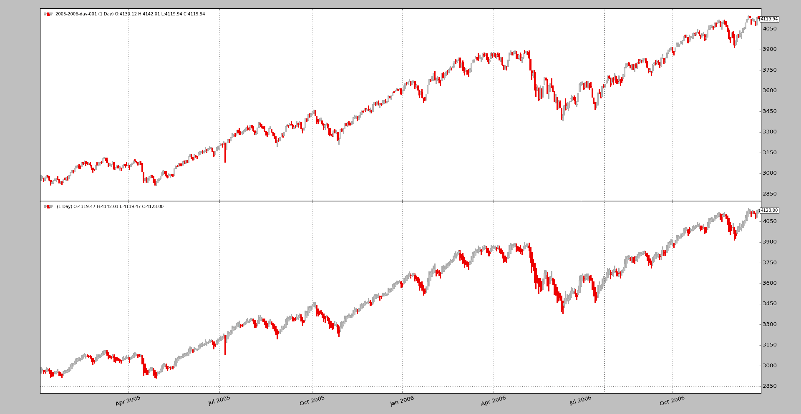
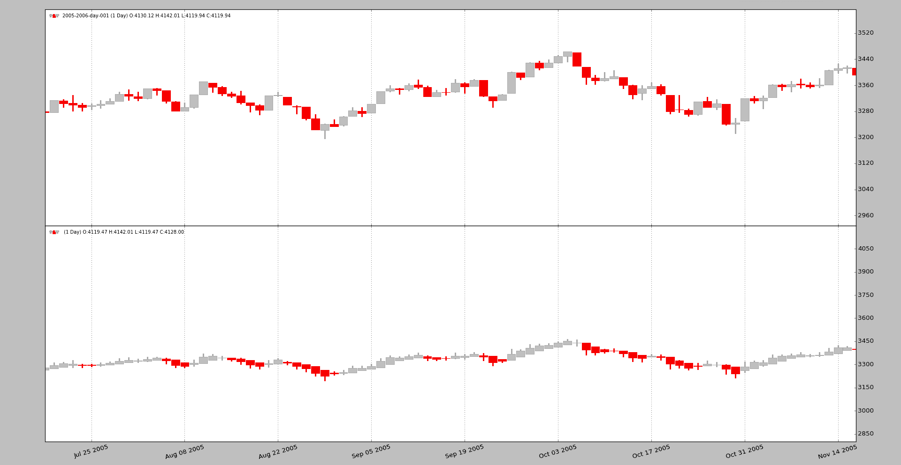
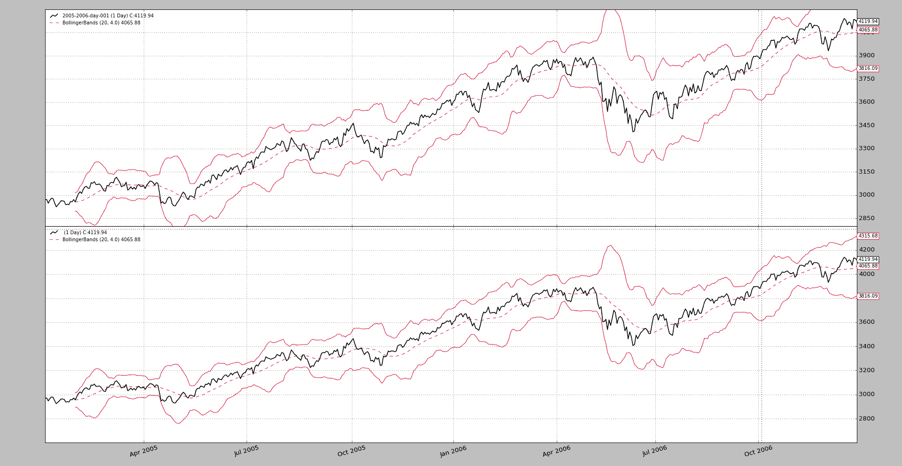
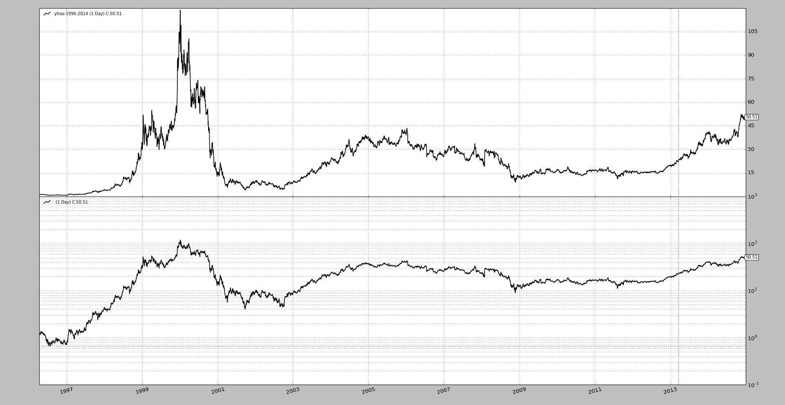

# 发布版本 1.9.51.121

> 原文：[`www.backtrader.com/blog/posts/2017-06-12-release-1.9.51.121/release-1.9.51.121/`](https://www.backtrader.com/blog/posts/2017-06-12-release-1.9.51.121/release-1.9.51.121/)

即使是一个次要版本，也有一些有趣的东西，可能值得为它们撰写专门的博客文章。

## `linealias`

[Pull-Request #320](https://github.com/mementum/backtrader/pull/320) 包括指标`相对动量指数`（或`RMI`），根据文献，这是`RSI`的演变，它：

+   考虑*up*和*down*周期，回溯期大于`1`

因此，与其让一个指标重复`RSI`的大部分内容，做两件事似乎更有用：

1.  扩展`RSI`（以及子指标如`UpDay`和`DownDay`）以支持大于*1*的回溯期。`RMI`可以作为一个简单具有一些不同默认值的子类来实现。

1.  `RMI`指标的逻辑名称是`rmi`，但`RSI`已经决定了名称为`rsi`。通过添加一个名为`linealias`的新功能来解决这个问题

`RMI`的实现看起来是这样的：

```py
class RelativeMomentumIndex(RSI):
    alias = ('RMI', )

    linealias = (('rsi', 'rmi',),)  # add an alias for this class rmi -> rsi
    plotlines = dict(rsi=dict(_name='rmi'))  # change line plotting name
```

为基类添加了`rsi`线的别名，名称为`rmi`。如果有人想要创建一个子类并使用名称`rmi`，现在是可能的。

此外，`rsi`线的绘图名称也更改为`rmi`。还有一种替代实现方式：

```py
class RelativeMomentumIndex(RSI):
    alias = ('RMI', )

    linesoverrride = True  # allow redefinition of the lines hierarcy
    lines = ('rmi',)  # define the line
    linealias = (('rmi', 'rsi',),)  # add an alias for base class rsi -> rmi
```

在这里，不再考虑`RSI`的现有层次结构，而是使用`lines`来定义唯一的名为`rmi`的线。不需要定义绘图名称，因为唯一的线现在具有预期的名称。

但基类将无法填充值，因为它期望有一个名为`rsi`的线。因此添加了一个反向别名，让它找到该线。

## 交互式经纪人优化

使用*交互式经纪人*作为优化数据源的实时连接并未被预见。然而，有用户尝试了这种方法，导致了出现了速度违规。原因在于*交互式经纪人*数据源标记为`live`数据源，允许系统绕过某些事情，比如数据预加载。

没有预加载，每次优化实例都会尝试重新从*交互式经纪人*下载相同的历史数据。考虑到这一点，很明显数据源可以查看用户是否只请求历史下载，在这种情况下不报告自己为`live`，允许平台预加载数据并在优化实例之间共享。

查看社区帖子。[使用 IBStore 进行优化会导致冗余连接/下载](https://community.backtrader.com/topic/401/optimizing-with-ibstore-causes-redundant-connections-downloads/)

## 平均趋势蜡烛图

这个其他社区帖子试图开发*平滑蜡烛图*作为指标：[Develop Heikinashi Indicators](https://community.backtrader.com/topic/458/develop-heikinashi-indicators)，面临着一些问题，因为需要一个种子值，这可以在指标的`prenext`阶段完成。

作为传统蜡烛图的一个有趣的显示替代方案，这已经被实现为一个过滤器，允许修改数据源以真正提供*平滑蜡烛图*。就像这样：

```py
data0 = MyDataFeed(dataname='xxx', timeframe=bt.TimeFrame.Days, compression=1)
data0.addfilter(bt.filters.HeikinAshi)
cerebro.adddata(data0)
```

任何人都可以通过这段代码快速比较蜡烛图：

```py
data0 = MyDataFeed(dataname='xxx', timeframe=bt.TimeFrame.Days, compression=1)
cerebro.adddata(data0)

data1 = data0.clone()
data1.addfilter(bt.filters.HeikinAshi)
cerebro.adddata(data1)
```

要绘制蜡烛图，请记住执行：

```py
cerebro.plot(style='candle')
```

使用样本每日数据来自 2005 年和 2006 年的来源。



并稍微放大以更好地欣赏差异



## 允许辅助演员重新调整 y 轴的比例

数据源的轴始终将主数据源用作比例所有者，因为数据始终是视图中最重要的部分。例如，考虑一下`布林带`，可能会导致顶部带远离数据的最大值，并且允许此带重新调整图表，将减少数据在图表中占用的空间，这是不希望的。

现在可以使用`plotylimited`来控制行为，例如：

```py
...
data0 = MyDataFeed(dataname='xxx', timeframe=bt.TimeFrame.Days, compression=1)
data0.plotinfo.plotlog = False  # allow other actors to resize the axis
...
```

在下图中，底部的数据源使用了`plotylimited=False`进行绘制。*布林带*不会超出图表，因为它们会影响缩放，并且一切都适合图表中。



这在社区中也有所评论。[How max - min plot boundaries are set?](https://community.backtrader.com/topic/339/how-max-min-plot-boundaries-are-set/)

## 半对数图（也称为对数图）

现在可以使用半对数刻度（y 轴刻度）绘制单个轴。例如：

```py
...
data0 = MyDataFeed(dataname='xxx', timeframe=bt.TimeFrame.Days, compression=1)
data0.plotinfo.plotlog = True
data0.plotinfo.plotylimited = True
cerebro.adddata(data0)
...
```

这意味着由此数据源控制的轴将使用对数刻度，但其他轴不会，因此

+   在数据上绘制移动平均线也将使用该刻度进行绘制

+   随机指标（位于不同轴上且具有不同刻度）仍将以线性方式绘制

注意

请注意，使用了`plotylimited=True`。这是为了让`matplotlib`正确地计算对数图表的限制（因为刻度是 10 的幂）以适应图表中的内容。

简单地比较*Yahoo*数据的长期期间的示例。



## 允许`plotmaster`指向自身

在同一轴上绘制多个数据源已经是可能的，但是一个小麻烦不允许设置`plotinfo.plotmaster`值的干净循环。之前必须执行以下操作：

```py
mydatas = []
data = MyDataFeed(dataname=mytickers[0], timeframe=..., compression=...)
mydatafeeds.append(data)
for ticker in mytickers[1:]
    data = MyDataFeed(dataname=ticker, timeframe=..., compression=...)
    mydatafeeds.append(data)
    data.plotinfo.plotmaster = mydatas[0]
```

现在可以使用更清晰的循环：

```py
mydatas = []
for ticker in mytickers:
    data = MyDataFeed(dataname=ticker, timeframe=..., compression=...)
    mydatafeeds.append(data)
    data.plotinfo.plotmaster = mydatas[0]
```

## 并且`dnames`已经被记录了

引用数据源的名称已经可用，但它被忽略了，没有出现在文档中，因此它是一个隐藏的宝藏。策略中的 `dnames` 属性支持*点表示法*和*[]*表示法（实际上是一个 `dict` 子类）。如果我们首先添加一些数据源：

```py
mytickers = ['YHOO', 'IBM', 'AAPL']
for t in mytickers:
  d = bt.feeds.YahooFinanceData(dataname=t, fromdate=..., name=t.lower())
```

在策略中稍后可以执行以下操作：

```py
def __init__(self):
  yhoosma = bt.ind.SMA(self.dnames.yhoo, period=20)
  aaplsma = bt.ind.SMA(self.dnames['aapl'], period=30)

  # or even go over the keys/items/values like in a regular dict
  # for example with a dictionary comprehension
  stocs = {name: bt.ind.Stochastic(data) for name, data in self.dnames.items()}
```

## 结论

一个包含小改动的小版本发布，增加了一些巧妙的功能。
