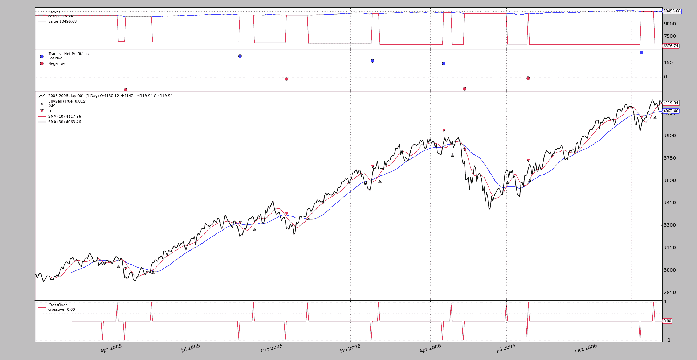
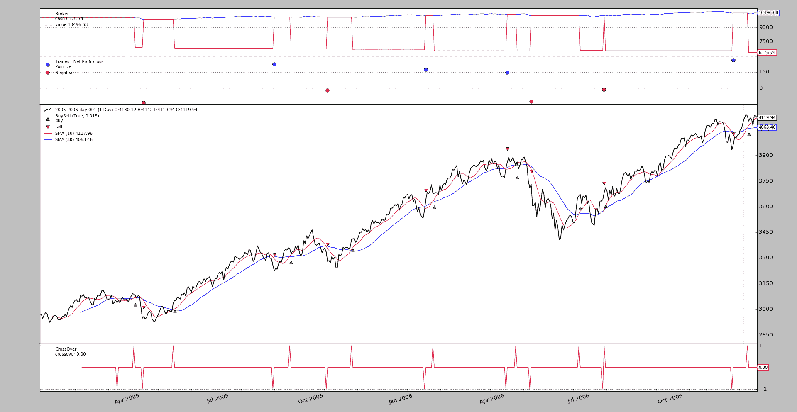

# 欺骗开盘价

> 原文：[`www.backtrader.com/blog/posts/2017-05-01-cheat-on-open/cheat-on-open/`](https://www.backtrader.com/blog/posts/2017-05-01-cheat-on-open/cheat-on-open/)

发布`1.9.44.116`版本增加了对`Cheat-On-Open`的支持。这似乎是人们要求的功能，他们在某个条的结束后进行了计算，但期望与`open`价格匹配

当*开盘*价格出现间隙（向上或向下，取决于`buy`或`sell`是否生效）且现金不足以进行*全仓*操作时，这种用例将失败。这迫使经纪人拒绝操作

尽管人们可以尝试通过积极的`[1]`索引方法来预测未来，但这需要预加载数据，而这并不总是可用的

这种模式：

```py
`cerebro = bt.Cerebro(cheat_on_open=True)` 
```

这：

+   在系统中激活了一个额外的周期，该周期调用策略中的`next_open`、`nextstart_open`和`prenext_open`方法

    决定增加另一组方法是为了明确区分基于检查的价格不再可用且未来未知的常规方法和作弊模式中的操作

    这也避免了对常规`next`方法的两次调用

在`xxx_open`方法内部时，以下内容为真：

+   指标尚未重新计算，并保留了在等效的`xxx`常规方法中上一个周期中看到的值

+   经纪人尚未评估新周期的待处理订单，可以引入新订单，如果可能的话将进行评估

请注意：

+   `Cerebro`还有一个`broker_coo`（默认为`True`）参数，告诉 cerebro，如果激活了`cheat-on-open`，则尽可能在经纪人中也激活它

    模拟经纪人有一个名为：`coo`的参数和一个名为`set_coo`的方法

## 尝试欺骗开盘价

下面的示例具有具有 2 种不同行为的策略：

+   如果*cheat-on-open*为*True*，则只会从`next_open`操作

+   如果*cheat-on-open*为*False*，则只会从`next`操作

在两种情况下，匹配价格必须是**相同**的

+   如果不作弊，则订单在前一天结束时发布，并将与下一个到来的价格匹配，即`open`价格

+   如果作弊，则订单在执行当天发布。因为订单是在经纪人评估订单之前发布的，所以它也将与下一个到来的价格匹配，即`open`价格

    这种第二种情况，允许计算*全仓*策略的确切赌注，因为可以直接访问当前的`open`价格

在两种情况下

+   当前的`open`和`close`价格将从`next`中打印出来

常规执行：

```py
`$ ./cheat-on-open.py --cerebro cheat_on_open=False

...
2005-04-07 next, open 3073.4 close 3090.72
2005-04-08 next, open 3092.07 close 3088.92
Strat Len 68 2005-04-08 Send Buy, fromopen False, close 3088.92
2005-04-11 Buy Executed at price 3088.47
2005-04-11 next, open 3088.47 close 3080.6
2005-04-12 next, open 3080.42 close 3065.18
...` 
```



订单：

+   在 2005-04-08 *close*之后发布

+   在 2005-04-11 以`3088.47`的`open`价格执行

欺骗执行：

```py
`$ ./cheat-on-open.py --cerebro cheat_on_open=True

...
2005-04-07 next, open 3073.4 close 3090.72
2005-04-08 next, open 3092.07 close 3088.92
2005-04-11 Send Buy, fromopen True, close 3080.6
2005-04-11 Buy Executed at price 3088.47
2005-04-11 next, open 3088.47 close 3080.6
2005-04-12 next, open 3080.42 close 3065.18
...` 
```



订单：

+   在 2005 年 04 月 11 日在*开盘*之前发布

+   它在 2005 年 04 月 11 日以`3088.47`的`open`价格执行。

而且在图表上看到的整体结果也是相同的。

## 结论

在开盘前作弊允许在开盘前发布订单，这样可以例如允许精确计算*all-in*情景的赌注。

## 样本用法

```py
`$ ./cheat-on-open.py --help
usage: cheat-on-open.py [-h] [--data0 DATA0] [--fromdate FROMDATE]
                        [--todate TODATE] [--cerebro kwargs] [--broker kwargs]
                        [--sizer kwargs] [--strat kwargs] [--plot [kwargs]]

Cheat-On-Open Sample

optional arguments:
  -h, --help           show this help message and exit
  --data0 DATA0        Data to read in (default:
                       ../../datas/2005-2006-day-001.txt)
  --fromdate FROMDATE  Date[time] in YYYY-MM-DD[THH:MM:SS] format (default: )
  --todate TODATE      Date[time] in YYYY-MM-DD[THH:MM:SS] format (default: )
  --cerebro kwargs     kwargs in key=value format (default: )
  --broker kwargs      kwargs in key=value format (default: )
  --sizer kwargs       kwargs in key=value format (default: )
  --strat kwargs       kwargs in key=value format (default: )
  --plot [kwargs]      kwargs in key=value format (default: )` 
```

## 样本来源

```py
`from __future__ import (absolute_import, division, print_function,
                        unicode_literals)

import argparse
import datetime

import backtrader as bt

class St(bt.Strategy):
    params = dict(
        periods=[10, 30],
        matype=bt.ind.SMA,
    )

    def __init__(self):
        self.cheating = self.cerebro.p.cheat_on_open
        mas = [self.p.matype(period=x) for x in self.p.periods]
        self.signal = bt.ind.CrossOver(*mas)
        self.order = None

    def notify_order(self, order):
        if order.status != order.Completed:
            return

        self.order = None
        print('{} {} Executed at price {}'.format(
            bt.num2date(order.executed.dt).date(),
            'Buy' * order.isbuy() or 'Sell', order.executed.price)
        )

    def operate(self, fromopen):
        if self.order is not None:
            return
        if self.position:
            if self.signal < 0:
                self.order = self.close()
        elif self.signal > 0:
            print('{} Send Buy, fromopen {}, close {}'.format(
                self.data.datetime.date(),
                fromopen, self.data.close[0])
            )
            self.order = self.buy()

    def next(self):
        print('{} next, open {} close {}'.format(
            self.data.datetime.date(),
            self.data.open[0], self.data.close[0])
        )

        if self.cheating:
            return
        self.operate(fromopen=False)

    def next_open(self):
        if not self.cheating:
            return
        self.operate(fromopen=True)

def runstrat(args=None):
    args = parse_args(args)

    cerebro = bt.Cerebro()

    # Data feed kwargs
    kwargs = dict()

    # Parse from/to-date
    dtfmt, tmfmt = '%Y-%m-%d', 'T%H:%M:%S'
    for a, d in ((getattr(args, x), x) for x in ['fromdate', 'todate']):
        if a:
            strpfmt = dtfmt + tmfmt * ('T' in a)
            kwargs[d] = datetime.datetime.strptime(a, strpfmt)

    # Data feed
    data0 = bt.feeds.BacktraderCSVData(dataname=args.data0, **kwargs)
    cerebro.adddata(data0)

    # Broker
    cerebro.broker = bt.brokers.BackBroker(**eval('dict(' + args.broker + ')'))

    # Sizer
    cerebro.addsizer(bt.sizers.FixedSize, **eval('dict(' + args.sizer + ')'))

    # Strategy
    cerebro.addstrategy(St, **eval('dict(' + args.strat + ')'))

    # Execute
    cerebro.run(**eval('dict(' + args.cerebro + ')'))

    if args.plot:  # Plot if requested to
        cerebro.plot(**eval('dict(' + args.plot + ')'))

def parse_args(pargs=None):
    parser = argparse.ArgumentParser(
        formatter_class=argparse.ArgumentDefaultsHelpFormatter,
        description=(
            'Cheat-On-Open Sample'
        )
    )

    parser.add_argument('--data0', default='../../datas/2005-2006-day-001.txt',
                        required=False, help='Data to read in')

    # Defaults for dates
    parser.add_argument('--fromdate', required=False, default='',
                        help='Date[time] in YYYY-MM-DD[THH:MM:SS] format')

    parser.add_argument('--todate', required=False, default='',
                        help='Date[time] in YYYY-MM-DD[THH:MM:SS] format')

    parser.add_argument('--cerebro', required=False, default='',
                        metavar='kwargs', help='kwargs in key=value format')

    parser.add_argument('--broker', required=False, default='',
                        metavar='kwargs', help='kwargs in key=value format')

    parser.add_argument('--sizer', required=False, default='',
                        metavar='kwargs', help='kwargs in key=value format')

    parser.add_argument('--strat', required=False, default='',
                        metavar='kwargs', help='kwargs in key=value format')

    parser.add_argument('--plot', required=False, default='',
                        nargs='?', const='{}',
                        metavar='kwargs', help='kwargs in key=value format')

    return parser.parse_args(pargs)

if __name__ == '__main__':
    runstrat()` 
```
