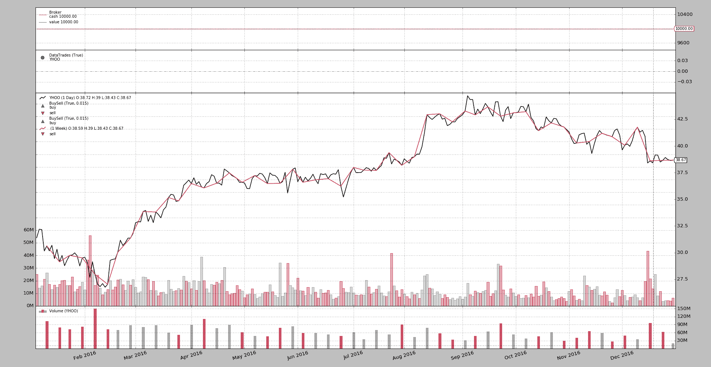

# 交易日历

> 原文：[`www.backtrader.com/blog/posts/2017-04-16-trading-calendar/tradingcalendar/`](https://www.backtrader.com/blog/posts/2017-04-16-trading-calendar/tradingcalendar/)

发行版`1.9.42.116`增加了对*交易日历*的支持。在以下场景中重采样时，这是有用的：

+   现在，每日到每周的重采样可以与该周的最后一根柱子一起传递。

    这是因为交易日历确定了*下一个交易日*，并且*本周的最后一个交易日*可以提前确定

+   当会话结束不是常规结束时（可以已经在数据源中指定）的子每日到每日重新采样

## 交易日历接口

有一个基类`TradingCalendarBase`，它用作任何交易日历的基础。它定义了必须被重写的两个（2）方法：

```py
class TradingCalendarBase(with_metaclass(MetaParams, object)):
    def _nextday(self, day):
        '''
        Returns the next trading day (datetime/date instance) after ``day``
        (datetime/date instance) and the isocalendar components

        The return value is a tuple with 2 components: (nextday, (y, w, d))
        where (y, w, d)
        '''
        raise NotImplementedError

    def schedule(self, day):
        '''
        Returns a tuple with the opening and closing times (``datetime.time``)
        for the given ``date`` (``datetime/date`` instance)
        '''
        raise NotImplementedError
```

## 实现

### PandasMarketCalendar

此实现基于一个整洁的包，该包是 Quantopian 初始功能的衍生物。该软件包位于：[pandas_market_calendars](https://github.com/rsheftel/pandas_market_calendars)，并且可以轻松安装：

```py
pip install pandas_market_calendars
```

实现具有以下接口：

```py
class PandasMarketCalendar(TradingCalendarBase):
    '''
    Wrapper of ``pandas_market_calendars`` for a trading calendar. The package
    ``pandas_market_calendar`` must be installed

    Params:

      - ``calendar`` (default ``None``)

        The param ``calendar`` accepts the following:

        - string: the name of one of the calendars supported, for example
          `NYSE`. The wrapper will attempt to get a calendar instance

        - calendar instance: as returned by ``get_calendar('NYSE')``

      - ``cachesize`` (default ``365``)

        Number of days to cache in advance for lookup

    See also:

      - https://github.com/rsheftel/pandas_market_calendars

      - http://pandas-market-calendars.readthedocs.io/

    '''
    params = (
        ('calendar', None),  # A pandas_market_calendars instance or exch name
        ('cachesize', 365),  # Number of days to cache in advance
    )
```

### 交易日历

此实现允许使用自行收集的信息构建日历，方法是指定节假日、提前天数、非交易工作日和开放和关闭会话时间：

```py
class TradingCalendar(TradingCalendarBase):
    '''
    Wrapper of ``pandas_market_calendars`` for a trading calendar. The package
    ``pandas_market_calendar`` must be installed

    Params:

      - ``open`` (default ``time.min``)

        Regular start of the session

      - ``close`` (default ``time.max``)

        Regular end of the session

      - ``holidays`` (default ``[]``)

        List of non-trading days (``datetime.datetime`` instances)

      - ``earlydays`` (default ``[]``)

        List of tuples determining the date and opening/closing times of days
        which do not conform to the regular trading hours where each tuple has
        (``datetime.datetime``, ``datetime.time``, ``datetime.time`` )

      - ``offdays`` (default ``ISOWEEKEND``)

        A list of weekdays in ISO format (Monday: 1 -> Sunday: 7) in which the
        market doesn't trade. This is usually Saturday and Sunday and hence the
        default

    '''
    params = (
        ('open', time.min),
        ('close', _time_max),
        ('holidays', []),  # list of non trading days (date)
        ('earlydays', []),  # list of tuples (date, opentime, closetime)
        ('offdays', ISOWEEKEND),  # list of non trading (isoweekdays)
    )
```

## 使用模式

### 全局交易日历

通过`Cerebro`，可以添加一个全局日历，该日历是所有数据源的默认日历，除非为数据源指定了一个：

```py
def addcalendar(self, cal):
    '''Adds a global trading calendar to the system. Individual data feeds
    may have separate calendars which override the global one

    ``cal`` can be an instance of ``TradingCalendar`` a string or an
    instance of ``pandas_market_calendars``. A string will be will be
    instantiated as a ``PandasMarketCalendar`` (which needs the module
    ``pandas_market_calendar`` installed in the system.

    If a subclass of `TradingCalendarBase` is passed (not an instance) it
    will be instantiated
    '''
```

### 每个数据源

通过在`addcalendar`中描述的相同约定指定`calendar`参数。

例如：

```py
...
data = bt.feeds.YahooFinanceData(dataname='YHOO', calendar='NYSE', ...)
cerebro.adddata(data)
...
```

## 示例

### 每日到每周

让我们来看一下下面可以找到的代码示例的运行情况。在 2016 年，复活节星期五（2016-03-25）也是`NYSE`的节假日。如果样本运行时没有交易日历，让我们看看那天附近会发生什么。

在这种情况下，正在从每日重新采样到每周（使用`YHOO`和 2016 年的每日数据）：

```py
$ ./tcal.py

...
Strategy len 56 datetime 2016-03-23 Data0 len 56 datetime 2016-03-23 Data1 len 11 datetime 2016-03-18
Strategy len 57 datetime 2016-03-24 Data0 len 57 datetime 2016-03-24 Data1 len 11 datetime 2016-03-18
Strategy len 58 datetime 2016-03-28 Data0 len 58 datetime 2016-03-28 Data1 len 12 datetime 2016-03-24
...
```

在这个输出中，第 1^(st)日期是策略进行的会计。第 2^(nd)日期是每日的。

周末如预期地在 2016-03-24（星期四）结束，但没有交易日历，重采样代码无法知道，因此传递了日期为 2016-03-18（前一周）的重采样条。当交易转移到 2016-03-28（星期一）时，重新采样器检测到周转变并在同一天传递了日期为 2016-03-24 的重采样条。

使用`PandasMarketCalendar`运行相同的操作，但用于`NYSE`（并添加绘图）

```py
$ ./tcal.py --plot --pandascal NYSE

...
Strategy len 56 datetime 2016-03-23 Data0 len 56 datetime 2016-03-23 Data1 len 11 datetime 2016-03-18
Strategy len 57 datetime 2016-03-24 Data0 len 57 datetime 2016-03-24 Data1 len 12 datetime 2016-03-24
Strategy len 58 datetime 2016-03-28 Data0 len 58 datetime 2016-03-28 Data1 len 12 datetime 2016-03-24
...
```

有一个变化！由于日历，重新采样器知道在 2016-03-24 周结束，并在同一天传递了相应的 2016-03-24 周重采样条。

以及绘图。



由于信息可能不一定对每个市场都可用，因此可以制定日历。对于`NYSE`和`2016`，它看起来像是：

```py
class NYSE_2016(bt.TradingCalendar):
    params = dict(
        holidays=[
            datetime.date(2016, 1, 1),
            datetime.date(2016, 1, 18),
            datetime.date(2016, 2, 15),
            datetime.date(2016, 3, 25),
            datetime.date(2016, 5, 30),
            datetime.date(2016, 7, 4),
            datetime.date(2016, 9, 5),
            datetime.date(2016, 11, 24),
            datetime.date(2016, 12, 26),
        ]
    )
```

复活节星期五（2016-03-25）被列为假期之一。现在运行示例：

```py
$ ./tcal.py --plot --owncal

...
Strategy len 56 datetime 2016-03-23 Data0 len 56 datetime 2016-03-23 Data1 len 11 datetime 2016-03-18
Strategy len 57 datetime 2016-03-24 Data0 len 57 datetime 2016-03-24 Data1 len 12 datetime 2016-03-24
Strategy len 58 datetime 2016-03-28 Data0 len 58 datetime 2016-03-28 Data1 len 12 datetime 2016-03-24
...
```

并且相同的结果已通过精心制作的日历定义获得。

### 分钟转换为每日

使用一些私有的日内数据和知道市场在 2016-11-25 提前收盘的知识（感恩节后的第二天，市场在 `US/Eastern` 时区在 13:00 关闭），进行另一次测试运行，这次是第二个样本。

注意

源数据直接来自显示的数据，并且处于 `CET` 时区，即使所涉及的资产 `YHOO` 在美国交易。 代码中使用 `tzinput='CET'` 和 `tz='US/Eastern'` 的数据源来让平台适当地转换输入并显示输出

首先没有交易日历

```py
$ ./tcal-intra.py

...
Strategy len 6838 datetime 2016-11-25 18:00:00 Data0 len 6838 datetime 2016-11-25 13:00:00 Data1 len 21 datetime 2016-11-23 16:00:00
Strategy len 6839 datetime 2016-11-25 18:01:00 Data0 len 6839 datetime 2016-11-25 13:01:00 Data1 len 21 datetime 20 16-11-23 16:00:00
Strategy len 6840 datetime 2016-11-28 14:31:00 Data0 len 6840 datetime 2016-11-28 09:31:00 Data1 len 22 datetime 2016-11-25 16:00:00
Strategy len 6841 datetime 2016-11-28 14:32:00 Data0 len 6841 datetime 2016-11-28 09:32:00 Data1 len 22 datetime 2016-11-25 16:00:00
...
```

如预期的那样，当天在 `13:00` 提前关闭，但是重新采样器不知道（正式会话在 `16:00` 结束），并且继续从前一天（2016-11-23）交付重新采样的每日柱，并且新的重新采样的每日柱首次在下一个交易日（2016-11-28）交付，日期为 2016-11-25。

注意

数据有一个额外的分钟柱 `13:01`，这可能是由于市场闭市后的竞价过程提供了最后一个价格。

我们可以向流中添加过滤器，以过滤掉在会话时间之外的柱子（过滤器将从交易日历中找到）

但这不是这个示例的重点。

使用 `PandasMarketCalendar` 实例进行相同的运行：

```py
$ ./tcal-intra.py --pandascal NYSE

...
Strategy len 6838 datetime 2016-11-25 18:00:00 Data0 len 6838 datetime 2016-11-25 13:00:00 Data1 len 15 datetime 2016-11-25 13:00:00
Strategy len 6839 datetime 2016-11-25 18:01:00 Data0 len 6839 datetime 2016-11-25 13:01:00 Data1 len 15 datetime 2016-11-25 13:00:00
Strategy len 6840 datetime 2016-11-28 14:31:00 Data0 len 6840 datetime 2016-11-28 09:31:00 Data1 len 15 datetime 2016-11-25 13:00:00
Strategy len 6841 datetime 2016-11-28 14:32:00 Data0 len 6841 datetime 2016-11-28 09:32:00 Data1 len 15 datetime 2016-11-25 13:00:00
...
```

现在，当日内 1 分钟的数据源命中 2016-11-25 13:00 时（让我们忽略 13:01 的柱子），每日柱子就被交付，因为交易日历告诉重新采样代码这一天已经结束。

让我们添加一个精心制作的定义。与以前相同，但通过一些 `earlydays` 扩展它

```py
class NYSE_2016(bt.TradingCalendar):
    params = dict(
        holidays=[
            datetime.date(2016, 1, 1),
            datetime.date(2016, 1, 18),
            datetime.date(2016, 2, 15),
            datetime.date(2016, 3, 25),
            datetime.date(2016, 5, 30),
            datetime.date(2016, 7, 4),
            datetime.date(2016, 9, 5),
            datetime.date(2016, 11, 24),
            datetime.date(2016, 12, 26),
        ],
        earlydays=[
            (datetime.date(2016, 11, 25),
             datetime.time(9, 30), datetime.time(13, 1))
        ],
        open=datetime.time(9, 30),
        close=datetime.time(16, 0),
    )
```

运行：

```py
$ ./tcal-intra.py --owncal

...
Strategy len 6838 datetime 2016-11-25 18:00:00 Data0 len 6838 datetime 2016-11-25 13:00:00 Data1 len 15 datetime 2016-11-23 16:00:00
Strategy len 6839 datetime 2016-11-25 18:01:00 Data0 len 6839 datetime 2016-11-25 13:01:00 Data1 len 16 datetime 2016-11-25 13:01:00
Strategy len 6840 datetime 2016-11-28 14:31:00 Data0 len 6840 datetime 2016-11-28 09:31:00 Data1 len 16 datetime 2016-11-25 13:01:00
Strategy len 6841 datetime 2016-11-28 14:32:00 Data0 len 6841 datetime 2016-11-28 09:32:00 Data1 len 16 datetime 2016-11-25 13:01:00
...
```

热心的读者会注意到，精心制作的定义包含了将 `13:01`（用 `datetime.time(13, 1)` 定义）定义为我们 2016-11-25 的短日的会话结束。这仅仅是为了展示精心制作的 `TradingCalendar` 如何帮助调整事物。

现在，2016-11-25 的每日重新采样的柱子与 13:01 的 1 分钟柱子一起交付。

### 策略的额外奖金

第一个 `datetime`，属于策略的那个时间，总是在另一个时区，实际上是 `UTC`。也随着此版本 `1.9.42.116` 这可以被同步。下面的参数已添加到 `Cerebro` 中（在实例化期间或使用 `cerebro.run` 时使用）

```py
- ``tz`` (default: ``None``)

  Adds a global timezone for strategies. The argument ``tz`` can be

    - ``None``: in this case the datetime displayed by strategies will be
      in UTC, which has been always the standard behavior

    - ``pytz`` instance. It will be used as such to convert UTC times to
      the chosen timezone

    - ``string``. Instantiating a ``pytz`` instance will be attempted.

    - ``integer``. Use, for the strategy, the same timezone as the
      corresponding ``data`` in the ``self.datas`` iterable (``0`` would
      use the timezone from ``data0``)
```

它也支持 `cerebro.addtz` 方法：

```py
def addtz(self, tz):
    '''
    This can also be done with the parameter ``tz``

    Adds a global timezone for strategies. The argument ``tz`` can be

      - ``None``: in this case the datetime displayed by strategies will be
        in UTC, which has been always the standard behavior

      - ``pytz`` instance. It will be used as such to convert UTC times to
        the chosen timezone

      - ``string``. Instantiating a ``pytz`` instance will be attempted.

      - ``integer``. Use, for the strategy, the same timezone as the
        corresponding ``data`` in the ``self.datas`` iterable (``0`` would
        use the timezone from ``data0``)

    '''
```

重复上次的日内示例运行，并使用 `0` 作为 `tz`（与 `data0` 的时区同步），以下是关注相同日期和时间的输出：

```py
$ ./tcal-intra.py --owncal --cerebro tz=0

...
Strategy len 6838 datetime 2016-11-25 13:00:00 Data0 len 6838 datetime 2016-11-25 13:00:00 Data1 len 15 datetime 2016-11-23 16:00:00
Strategy len 6839 datetime 2016-11-25 13:01:00 Data0 len 6839 datetime 2016-11-25 13:01:00 Data1 len 16 datetime 2016-11-25 13:01:00
Strategy len 6840 datetime 2016-11-28 09:31:00 Data0 len 6840 datetime 2016-11-28 09:31:00 Data1 len 16 datetime 2016-11-25 13:01:00
Strategy len 6841 datetime 2016-11-28 09:32:00 Data0 len 6841 datetime 2016-11-28 09:32:00 Data1 len 16 datetime 2016-11-25 13:01:00
...
```

时间戳现在是时区对齐的。

## 示例用法（tcal.py）

```py
$ ./tcal.py --help
usage: tcal.py [-h] [--data0 DATA0] [--offline] [--fromdate FROMDATE]
               [--todate TODATE] [--cerebro kwargs] [--broker kwargs]
               [--sizer kwargs] [--strat kwargs] [--plot [kwargs]]
               [--pandascal PANDASCAL | --owncal]
               [--timeframe {Weeks,Months,Years}]

Trading Calendar Sample

optional arguments:
  -h, --help            show this help message and exit
  --data0 DATA0         Data to read in (default: YHOO)
  --offline             Read from disk with same name as ticker (default:
                        False)
  --fromdate FROMDATE   Date[time] in YYYY-MM-DD[THH:MM:SS] format (default:
                        2016-01-01)
  --todate TODATE       Date[time] in YYYY-MM-DD[THH:MM:SS] format (default:
                        2016-12-31)
  --cerebro kwargs      kwargs in key=value format (default: )
  --broker kwargs       kwargs in key=value format (default: )
  --sizer kwargs        kwargs in key=value format (default: )
  --strat kwargs        kwargs in key=value format (default: )
  --plot [kwargs]       kwargs in key=value format (default: )
  --pandascal PANDASCAL
                        Name of trading calendar to use (default: )
  --owncal              Apply custom NYSE 2016 calendar (default: False)
  --timeframe {Weeks,Months,Years}
                        Timeframe to resample to (default: Weeks)
```

## 示例用法（tcal-intra.py）

```py
$ ./tcal-intra.py --help
usage: tcal-intra.py [-h] [--data0 DATA0] [--fromdate FROMDATE]
                     [--todate TODATE] [--cerebro kwargs] [--broker kwargs]
                     [--sizer kwargs] [--strat kwargs] [--plot [kwargs]]
                     [--pandascal PANDASCAL | --owncal] [--timeframe {Days}]

Trading Calendar Sample

optional arguments:
  -h, --help            show this help message and exit
  --data0 DATA0         Data to read in (default: yhoo-2016-11.csv)
  --fromdate FROMDATE   Date[time] in YYYY-MM-DD[THH:MM:SS] format (default:
                        2016-01-01)
  --todate TODATE       Date[time] in YYYY-MM-DD[THH:MM:SS] format (default:
                        2016-12-31)
  --cerebro kwargs      kwargs in key=value format (default: )
  --broker kwargs       kwargs in key=value format (default: )
  --sizer kwargs        kwargs in key=value format (default: )
  --strat kwargs        kwargs in key=value format (default: )
  --plot [kwargs]       kwargs in key=value format (default: )
  --pandascal PANDASCAL
                        Name of trading calendar to use (default: )
  --owncal              Apply custom NYSE 2016 calendar (default: False)
  --timeframe {Days}    Timeframe to resample to (default: Days)
```

## 示例代码（tcal.py）

```py
from __future__ import (absolute_import, division, print_function,
                        unicode_literals)

import argparse
import datetime

import backtrader as bt

class NYSE_2016(bt.TradingCalendar):
    params = dict(
        holidays=[
            datetime.date(2016, 1, 1),
            datetime.date(2016, 1, 18),
            datetime.date(2016, 2, 15),
            datetime.date(2016, 3, 25),
            datetime.date(2016, 5, 30),
            datetime.date(2016, 7, 4),
            datetime.date(2016, 9, 5),
            datetime.date(2016, 11, 24),
            datetime.date(2016, 12, 26),
        ]
    )

class St(bt.Strategy):
    params = dict(
    )

    def __init__(self):
        pass

    def start(self):
        self.t0 = datetime.datetime.utcnow()

    def stop(self):
        t1 = datetime.datetime.utcnow()
        print('Duration:', t1 - self.t0)

    def prenext(self):
        self.next()

    def next(self):
        print('Strategy len {} datetime {}'.format(
            len(self), self.datetime.date()), end=' ')

        print('Data0 len {} datetime {}'.format(
            len(self.data0), self.data0.datetime.date()), end=' ')

        if len(self.data1):
            print('Data1 len {} datetime {}'.format(
                len(self.data1), self.data1.datetime.date()))
        else:
            print()

def runstrat(args=None):
    args = parse_args(args)

    cerebro = bt.Cerebro()

    # Data feed kwargs
    kwargs = dict()

    # Parse from/to-date
    dtfmt, tmfmt = '%Y-%m-%d', 'T%H:%M:%S'
    for a, d in ((getattr(args, x), x) for x in ['fromdate', 'todate']):
        if a:
            strpfmt = dtfmt + tmfmt * ('T' in a)
            kwargs[d] = datetime.datetime.strptime(a, strpfmt)

    YahooData = bt.feeds.YahooFinanceData
    if args.offline:
        YahooData = bt.feeds.YahooFinanceCSVData  # change to read file

    # Data feed
    data0 = YahooData(dataname=args.data0, **kwargs)
    cerebro.adddata(data0)

    d1 = cerebro.resampledata(data0,
                              timeframe=getattr(bt.TimeFrame, args.timeframe))
    d1.plotinfo.plotmaster = data0
    d1.plotinfo.sameaxis = True

    if args.pandascal:
        cerebro.addcalendar(args.pandascal)
    elif args.owncal:
        cerebro.addcalendar(NYSE_2016)

    # Broker
    cerebro.broker = bt.brokers.BackBroker(**eval('dict(' + args.broker + ')'))

    # Sizer
    cerebro.addsizer(bt.sizers.FixedSize, **eval('dict(' + args.sizer + ')'))

    # Strategy
    cerebro.addstrategy(St, **eval('dict(' + args.strat + ')'))

    # Execute
    cerebro.run(**eval('dict(' + args.cerebro + ')'))

    if args.plot:  # Plot if requested to
        cerebro.plot(**eval('dict(' + args.plot + ')'))

def parse_args(pargs=None):
    parser = argparse.ArgumentParser(
        formatter_class=argparse.ArgumentDefaultsHelpFormatter,
        description=(
            'Trading Calendar Sample'
        )
    )

    parser.add_argument('--data0', default='YHOO',
                        required=False, help='Data to read in')

    parser.add_argument('--offline', required=False, action='store_true',
                        help='Read from disk with same name as ticker')

    # Defaults for dates
    parser.add_argument('--fromdate', required=False, default='2016-01-01',
                        help='Date[time] in YYYY-MM-DD[THH:MM:SS] format')

    parser.add_argument('--todate', required=False, default='2016-12-31',
                        help='Date[time] in YYYY-MM-DD[THH:MM:SS] format')

    parser.add_argument('--cerebro', required=False, default='',
                        metavar='kwargs', help='kwargs in key=value format')

    parser.add_argument('--broker', required=False, default='',
                        metavar='kwargs', help='kwargs in key=value format')

    parser.add_argument('--sizer', required=False, default='',
                        metavar='kwargs', help='kwargs in key=value format')

    parser.add_argument('--strat', required=False, default='',
                        metavar='kwargs', help='kwargs in key=value format')

    parser.add_argument('--plot', required=False, default='',
                        nargs='?', const='{}',
                        metavar='kwargs', help='kwargs in key=value format')

    pgroup = parser.add_mutually_exclusive_group(required=False)
    pgroup.add_argument('--pandascal', required=False, action='store',
                        default='', help='Name of trading calendar to use')

    pgroup.add_argument('--owncal', required=False, action='store_true',
                        help='Apply custom NYSE 2016 calendar')

    parser.add_argument('--timeframe', required=False, action='store',
                        default='Weeks', choices=['Weeks', 'Months', 'Years'],
                        help='Timeframe to resample to')

    return parser.parse_args(pargs)

if __name__ == '__main__':
    runstrat()
```

## 示例代码（tcal-intra.py）

```py
from __future__ import (absolute_import, division, print_function,
                        unicode_literals)

import argparse
import datetime

import backtrader as bt

class NYSE_2016(bt.TradingCalendar):
    params = dict(
        holidays=[
            datetime.date(2016, 1, 1),
            datetime.date(2016, 1, 18),
            datetime.date(2016, 2, 15),
            datetime.date(2016, 3, 25),
            datetime.date(2016, 5, 30),
            datetime.date(2016, 7, 4),
            datetime.date(2016, 9, 5),
            datetime.date(2016, 11, 24),
            datetime.date(2016, 12, 26),
        ],
        earlydays=[
            (datetime.date(2016, 11, 25),
             datetime.time(9, 30), datetime.time(13, 1))
        ],
        open=datetime.time(9, 30),
        close=datetime.time(16, 0),
    )

class St(bt.Strategy):
    params = dict(
    )

    def __init__(self):
        pass

    def prenext(self):
        self.next()

    def next(self):
        print('Strategy len {} datetime {}'.format(
            len(self), self.datetime.datetime()), end=' ')

        print('Data0 len {} datetime {}'.format(
            len(self.data0), self.data0.datetime.datetime()), end=' ')

        if len(self.data1):
            print('Data1 len {} datetime {}'.format(
                len(self.data1), self.data1.datetime.datetime()))
        else:
            print()

def runstrat(args=None):
    args = parse_args(args)

    cerebro = bt.Cerebro()

    # Data feed kwargs
    # kwargs = dict(tz='US/Eastern')
    # import pytz
    # tz = tzinput = pytz.timezone('Europe/Berlin')
    tzinput = 'Europe/Berlin'
    # tz = tzinput
    tz = 'US/Eastern'
    kwargs = dict(tzinput=tzinput, tz=tz)

    # Parse from/to-date
    dtfmt, tmfmt = '%Y-%m-%d', 'T%H:%M:%S'
    for a, d in ((getattr(args, x), x) for x in ['fromdate', 'todate']):
        if a:
            strpfmt = dtfmt + tmfmt * ('T' in a)
            kwargs[d] = datetime.datetime.strptime(a, strpfmt)

    # Data feed
    data0 = bt.feeds.BacktraderCSVData(dataname=args.data0, **kwargs)
    cerebro.adddata(data0)

    d1 = cerebro.resampledata(data0,
                              timeframe=getattr(bt.TimeFrame, args.timeframe))
    # d1.plotinfo.plotmaster = data0
    # d1.plotinfo.sameaxis = False

    if args.pandascal:
        cerebro.addcalendar(args.pandascal)
    elif args.owncal:
        cerebro.addcalendar(NYSE_2016())  # or NYSE_2016() to pass an instance

    # Broker
    cerebro.broker = bt.brokers.BackBroker(**eval('dict(' + args.broker + ')'))

    # Sizer
    cerebro.addsizer(bt.sizers.FixedSize, **eval('dict(' + args.sizer + ')'))

    # Strategy
    cerebro.addstrategy(St, **eval('dict(' + args.strat + ')'))

    # Execute
    cerebro.run(**eval('dict(' + args.cerebro + ')'))

    if args.plot:  # Plot if requested to
        cerebro.plot(**eval('dict(' + args.plot + ')'))

def parse_args(pargs=None):
    parser = argparse.ArgumentParser(
        formatter_class=argparse.ArgumentDefaultsHelpFormatter,
        description=(
            'Trading Calendar Sample'
        )
    )

    parser.add_argument('--data0', default='yhoo-2016-11.csv',
                        required=False, help='Data to read in')

    # Defaults for dates
    parser.add_argument('--fromdate', required=False, default='2016-01-01',
                        help='Date[time] in YYYY-MM-DD[THH:MM:SS] format')

    parser.add_argument('--todate', required=False, default='2016-12-31',
                        help='Date[time] in YYYY-MM-DD[THH:MM:SS] format')

    parser.add_argument('--cerebro', required=False, default='',
                        metavar='kwargs', help='kwargs in key=value format')

    parser.add_argument('--broker', required=False, default='',
                        metavar='kwargs', help='kwargs in key=value format')

    parser.add_argument('--sizer', required=False, default='',
                        metavar='kwargs', help='kwargs in key=value format')

    parser.add_argument('--strat', required=False, default='',
                        metavar='kwargs', help='kwargs in key=value format')

    parser.add_argument('--plot', required=False, default='',
                        nargs='?', const='{}',
                        metavar='kwargs', help='kwargs in key=value format')

    pgroup = parser.add_mutually_exclusive_group(required=False)
    pgroup.add_argument('--pandascal', required=False, action='store',
                        default='', help='Name of trading calendar to use')

    pgroup.add_argument('--owncal', required=False, action='store_true',
                        help='Apply custom NYSE 2016 calendar')

    parser.add_argument('--timeframe', required=False, action='store',
                        default='Days', choices=['Days'],
                        help='Timeframe to resample to')

    return parser.parse_args(pargs)

if __name__ == '__main__':
    runstrat()
```
