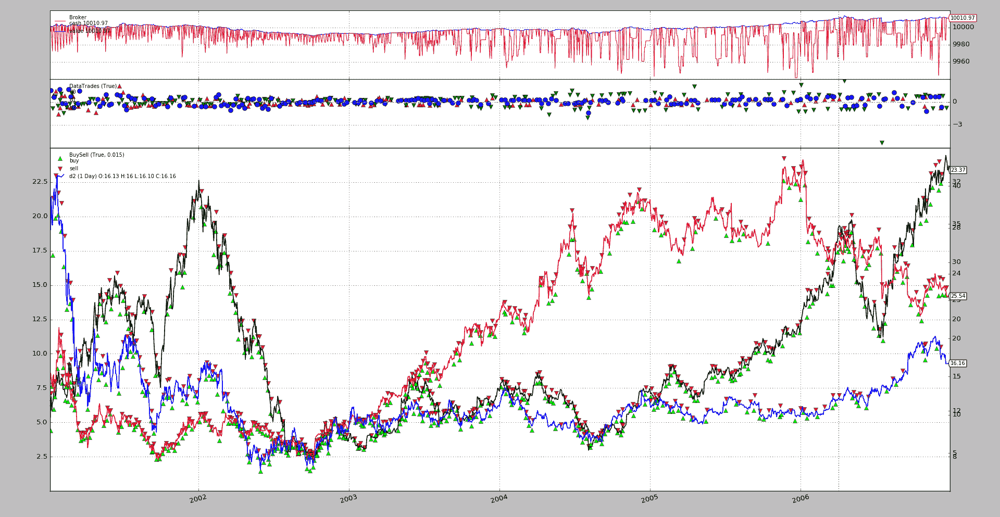
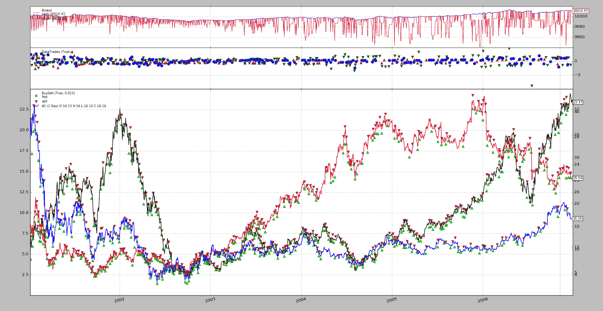
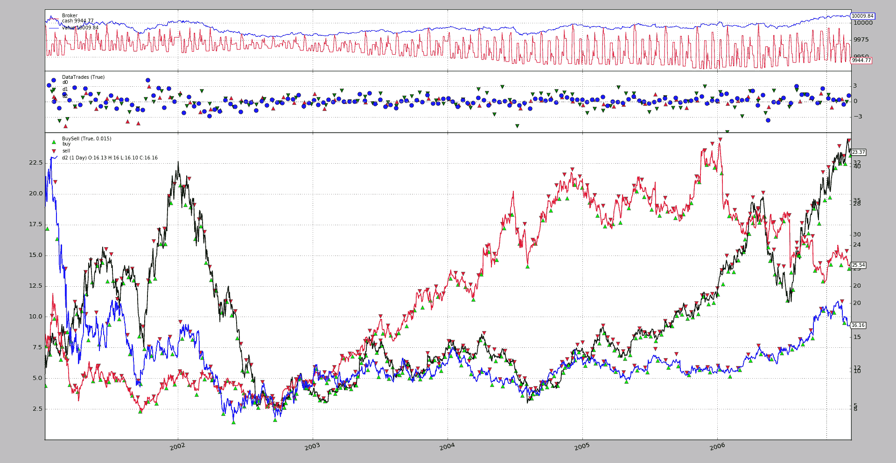

# 多个示例

> 原文：[`www.backtrader.com/blog/posts/2017-04-09-multi-example/multi-example/`](https://www.backtrader.com/blog/posts/2017-04-09-multi-example/multi-example/)

一些[社区](https://community.backtrader.com)中的主题似乎是如何跟踪订单，特别是当有多个数据源在运行时，以及包括多个订单共同工作的情况，如*bracket orders*的情况

下面的脚本试图作为示例，允许用户：

+   使用 3 个数据源

+   选择使用

    +   当`usebracket=False`时，只包含类型为`Market`的单个*buy*订单

    或

    +   设置*bracket*订单（`usebracket=True`

    在这种情况下，可以指定如何创建*bracket set*

    +   当`rawbracket=True`时，发出 3 个订单（1 个父级+2 个子级）

    +   当`rawbracket=False`时调用`buy_bracket`

    主要*bracket*订单在`valid`天后具有到期时间（默认为`10`）

+   当`weekday`与为每个数据源定义的`enter`值匹配时，将进入（或至少尝试进入）一个仓位，默认为`[1, 3, 4]`

+   将退出一个开放的仓位

    +   在`holding`期后正常`close`。期间为每个数据源分别定义，参数`hold`默认为`[7, 10, 15]`

    如果存在*bracket*订单的`stop`方被触发，则会触发*bracket*订单的取消（这将自动取消另一方）

    +   或者如果使用*brackets*，则在执行`stop`（限制损失）或`limit`（获利）方之一时（系统将自动取消另一方）

+   订单保留在

    +   `dict`中，使用`data`作为键

    +   包含每个`data`条目的订单的`list`，这些订单对每个`data`都是打开的

    一旦订单已发出，管理就在`notify_order`中完成

此外：

+   使用`TestSizer`，它将为`buy`和`sell`订单返回不同的值作为测试

    因为只有*long*操作被启动，所以只返回`buy`大小，并且输出日志中不包含`sell`大小的痕迹。

创建丰富的操作、持仓和订单管理日志，以帮助理解发生了什么。

让我们看一个带有`usebracket=True`和`rawbracket=True`默认值的示例执行（为了简化图表，将删除音量）：

```py
`$ ./mult-values.py --plot volume=False

2001-01-02 d0 Position 0
2001-01-02 Data d0 OType buy Sizing to 1
2001-01-02 d0 Main 1 Stp 2 Lmt 3
2001-01-02 d1 Position 0
2001-01-02 d2 Position 0
2001-01-03 d0 Order 1 Status Accepted
2001-01-03 d0 Order 2 Status Accepted
2001-01-03 d0 Order 3 Status Accepted
2001-01-03 d0 Order 1 Status Completed
-- No longer alive main Ref
2001-01-03 d0 Position 1
2001-01-03 d1 Position 0
2001-01-03 d2 Position 0
2001-01-04 d0 Order 3 Status Completed
-- No longer alive limit Ref
2001-01-04 d0 Order 2 Status Canceled
-- No longer alive stop Ref
...
...
...
2006-12-27 d0 Order 2036 Status Accepted
2006-12-27 d0 Order 2037 Status Accepted
2006-12-27 d0 Order 2038 Status Accepted
2006-12-27 d0 Position 0
2006-12-27 d1 Position 0
2006-12-27 d2 Position 0
2006-12-28 d0 Position 0
2006-12-28 d1 Position 0
2006-12-28 d2 Position 0
2006-12-29 d0 Position 0
2006-12-29 d1 Position 0
2006-12-29 d2 Position 0` 
```



第二个执行设置`rawbracket=False`

```py
`$ ./mult-values.py --plot volume=False --strat rawbracket=False` 
```

这将输出完全相同的结果，这次使用了`buy_bracket`。



最后禁用括号使用：

```py
`./mult-values.py --strat usebracket=False --plot volume=False` 
```



## 结论

这应该作为订单管理的良好示例，具有多个数据源和订单集。

## 示例用法

```py
`$ ./mult-values.py --help
usage: mult-values.py [-h] [--data0 DATA0] [--data1 DATA1] [--data2 DATA2]
                      [--fromdate FROMDATE] [--todate TODATE]
                      [--cerebro kwargs] [--broker kwargs] [--sizer kwargs]
                      [--strat kwargs] [--plot [kwargs]]

Multiple Values and Brackets

optional arguments:
  -h, --help           show this help message and exit
  --data0 DATA0        Data0 to read in (default:
                       ../../datas/nvda-1999-2014.txt)
  --data1 DATA1        Data1 to read in (default:
                       ../../datas/yhoo-1996-2014.txt)
  --data2 DATA2        Data1 to read in (default:
                       ../../datas/orcl-1995-2014.txt)
  --fromdate FROMDATE  Date[time] in YYYY-MM-DD[THH:MM:SS] format (default:
                       2001-01-01)
  --todate TODATE      Date[time] in YYYY-MM-DD[THH:MM:SS] format (default:
                       2007-01-01)
  --cerebro kwargs     kwargs in key=value format (default: )
  --broker kwargs      kwargs in key=value format (default: )
  --sizer kwargs       kwargs in key=value format (default: )
  --strat kwargs       kwargs in key=value format (default: )
  --plot [kwargs]      kwargs in key=value format (default: )` 
```

## 示例代码

```py
`from __future__ import (absolute_import, division, print_function,
                        unicode_literals)

import argparse
import datetime

import backtrader as bt

class TestSizer(bt.Sizer):
    params = dict(stake=1)

    def _getsizing(self, comminfo, cash, data, isbuy):
        dt, i = self.strategy.datetime.date(), data._id
        s = self.p.stake * (1 + (not isbuy))
        print('{} Data {} OType {} Sizing to {}'.format(
            dt, data._name, ('buy' * isbuy) or 'sell', s))

        return s

class St(bt.Strategy):
    params = dict(
        enter=[1, 3, 4],  # data ids are 1 based
        hold=[7, 10, 15],  # data ids are 1 based
        usebracket=True,
        rawbracket=True,
        pentry=0.015,
        plimits=0.03,
        valid=10,
    )

    def notify_order(self, order):
        if order.status == order.Submitted:
            return

        dt, dn = self.datetime.date(), order.data._name
        print('{} {} Order {} Status {}'.format(
            dt, dn, order.ref, order.getstatusname())
        )

        whichord = ['main', 'stop', 'limit', 'close']
        if not order.alive():  # not alive - nullify
            dorders = self.o[order.data]
            idx = dorders.index(order)
            dorders[idx] = None
            print('-- No longer alive {} Ref'.format(whichord[idx]))

            if all(x is None for x in dorders):
                dorders[:] = []  # empty list - New orders allowed

    def __init__(self):
        self.o = dict()  # orders per data (main, stop, limit, manual-close)
        self.holding = dict()  # holding periods per data

    def next(self):
        for i, d in enumerate(self.datas):
            dt, dn = self.datetime.date(), d._name
            pos = self.getposition(d).size
            print('{} {} Position {}'.format(dt, dn, pos))

            if not pos and not self.o.get(d, None):  # no market / no orders
                if dt.weekday() == self.p.enter[i]:
                    if not self.p.usebracket:
                        self.o[d] = [self.buy(data=d)]
                        print('{} {} Buy {}'.format(dt, dn, self.o[d][0].ref))

                    else:
                        p = d.close[0] * (1.0 - self.p.pentry)
                        pstp = p * (1.0 - self.p.plimits)
                        plmt = p * (1.0 + self.p.plimits)
                        valid = datetime.timedelta(self.p.valid)

                        if self.p.rawbracket:
                            o1 = self.buy(data=d, exectype=bt.Order.Limit,
                                          price=p, valid=valid, transmit=False)

                            o2 = self.sell(data=d, exectype=bt.Order.Stop,
                                           price=pstp, size=o1.size,
                                           transmit=False, parent=o1)

                            o3 = self.sell(data=d, exectype=bt.Order.Limit,
                                           price=plmt, size=o1.size,
                                           transmit=True, parent=o1)

                            self.o[d] = [o1, o2, o3]

                        else:
                            self.o[d] = self.buy_bracket(
                                data=d, price=p, stopprice=pstp,
                                limitprice=plmt, oargs=dict(valid=valid))

                        print('{} {} Main {} Stp {} Lmt {}'.format(
                            dt, dn, *(x.ref for x in self.o[d])))

                    self.holding[d] = 0

            elif pos:  # exiting can also happen after a number of days
                self.holding[d] += 1
                if self.holding[d] >= self.p.hold[i]:
                    o = self.close(data=d)
                    self.o[d].append(o)  # manual order to list of orders
                    print('{} {} Manual Close {}'.format(dt, dn, o.ref))
                    if self.p.usebracket:
                        self.cancel(self.o[d][1])  # cancel stop side
                        print('{} {} Cancel {}'.format(dt, dn, self.o[d][1]))

def runstrat(args=None):
    args = parse_args(args)

    cerebro = bt.Cerebro()

    # Data feed kwargs
    kwargs = dict()

    # Parse from/to-date
    dtfmt, tmfmt = '%Y-%m-%d', 'T%H:%M:%S'
    for a, d in ((getattr(args, x), x) for x in ['fromdate', 'todate']):
        if a:
            strpfmt = dtfmt + tmfmt * ('T' in a)
            kwargs[d] = datetime.datetime.strptime(a, strpfmt)

    # Data feed
    data0 = bt.feeds.YahooFinanceCSVData(dataname=args.data0, **kwargs)
    cerebro.adddata(data0, name='d0')

    data1 = bt.feeds.YahooFinanceCSVData(dataname=args.data1, **kwargs)
    data1.plotinfo.plotmaster = data0
    cerebro.adddata(data1, name='d1')

    data2 = bt.feeds.YahooFinanceCSVData(dataname=args.data2, **kwargs)
    data2.plotinfo.plotmaster = data0
    cerebro.adddata(data2, name='d2')

    # Broker
    cerebro.broker = bt.brokers.BackBroker(**eval('dict(' + args.broker + ')'))
    cerebro.broker.setcommission(commission=0.001)

    # Sizer
    # cerebro.addsizer(bt.sizers.FixedSize, **eval('dict(' + args.sizer + ')'))
    cerebro.addsizer(TestSizer, **eval('dict(' + args.sizer + ')'))

    # Strategy
    cerebro.addstrategy(St, **eval('dict(' + args.strat + ')'))

    # Execute
    cerebro.run(**eval('dict(' + args.cerebro + ')'))

    if args.plot:  # Plot if requested to
        cerebro.plot(**eval('dict(' + args.plot + ')'))

def parse_args(pargs=None):
    parser = argparse.ArgumentParser(
        formatter_class=argparse.ArgumentDefaultsHelpFormatter,
        description=(
            'Multiple Values and Brackets'
        )
    )

    parser.add_argument('--data0', default='../../datas/nvda-1999-2014.txt',
                        required=False, help='Data0 to read in')

    parser.add_argument('--data1', default='../../datas/yhoo-1996-2014.txt',
                        required=False, help='Data1 to read in')

    parser.add_argument('--data2', default='../../datas/orcl-1995-2014.txt',
                        required=False, help='Data1 to read in')

    # Defaults for dates
    parser.add_argument('--fromdate', required=False, default='2001-01-01',
                        help='Date[time] in YYYY-MM-DD[THH:MM:SS] format')

    parser.add_argument('--todate', required=False, default='2007-01-01',
                        help='Date[time] in YYYY-MM-DD[THH:MM:SS] format')

    parser.add_argument('--cerebro', required=False, default='',
                        metavar='kwargs', help='kwargs in key=value format')

    parser.add_argument('--broker', required=False, default='',
                        metavar='kwargs', help='kwargs in key=value format')

    parser.add_argument('--sizer', required=False, default='',
                        metavar='kwargs', help='kwargs in key=value format')

    parser.add_argument('--strat', required=False, default='',
                        metavar='kwargs', help='kwargs in key=value format')

    parser.add_argument('--plot', required=False, default='',
                        nargs='?', const='{}',
                        metavar='kwargs', help='kwargs in key=value format')

    return parser.parse_args(pargs)

if __name__ == '__main__':
    runstrat()` 
```
