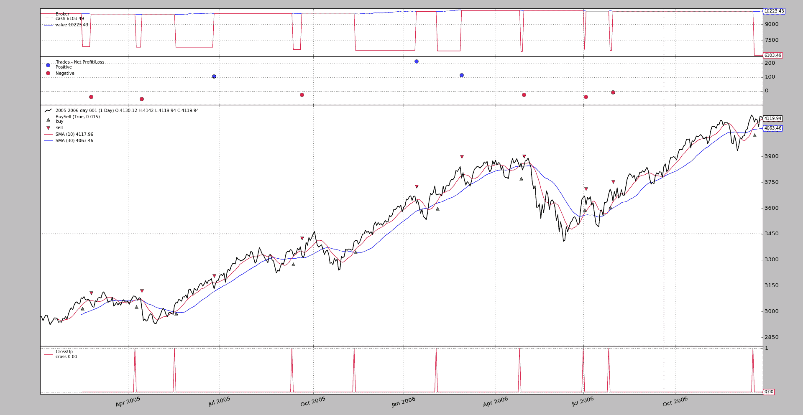
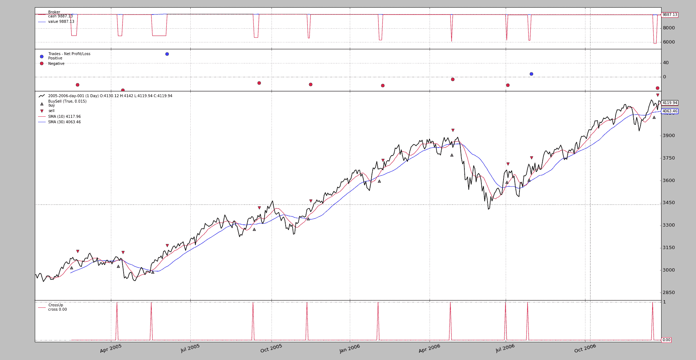
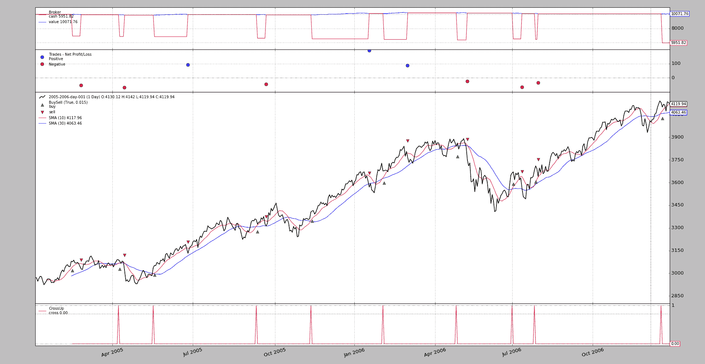

# StopTrail(Limit)

> 原文：[`www.backtrader.com/blog/posts/2017-03-22-stoptrail/stoptrail/`](https://www.backtrader.com/blog/posts/2017-03-22-stoptrail/stoptrail/)

版本`1.9.35.116`为回测工具库添加了`StopTrail`和`StopTrailLimit`订单执行类型。

注意

这只在回测中实现了，尚未实现实时经纪人的功能

注意

更新至版本`1.9.36.116`。交互式经纪人支持`StopTrail`、`StopTrailLimit`和`OCO`。

+   `OCO`始终将一组中的第 1 个订单指定为参数`oco`

+   `StopTrailLimit`：经纪人模拟和`IB`经纪人具有相同的行为。指定：`price`作为初始止损触发价格（还要指定`trailamount`），然后`plimi`作为初始限价。两者之间的差异将确定`limitoffset`（限价价格与停止触发价格之间的距离）

使用模式完全集成到了策略实例的标准`buy`、`sell`和`close`市场操作方法中。要注意：

+   指定所需的执行类型，如`exectype=bt.Order.StopTrail`

+   以及尾随价格是固定距离还是基于百分比的距离计算

    +   固定距离：`trailamount=10`

    +   基于百分比的距离：`trailpercent=0.02`（即：`2%`）

如果通过发出`buy`进入市场，则使用`StopTrail`和`trailamount`的`sell`就是这样做的操作：

+   如果未指定`price`，则使用最新的`close`价格

+   `trailamount`从价格中减去以找到`stop`（或触发）价格

+   *broker*的下一次迭代将检查触发价格是否已达到

    +   如果**是**：订单将以`市价`执行方式执行

    +   如果**否**，则`stop`价格会通过使用最新的`close`价格重新计算，并减去`trailamount`的距离。

    +   如果新价格上涨，则会更新

    +   如果新价格会下跌（或保持不变），则将其丢弃

也就是说：尾随止损价格会随着价格上涨而上涨，但如果价格开始下跌，价格将保持不变，以潜在地确保利润。

如果已经用`sell`进入市场，那么只需使用`StopTrail`发出`buy`订单就可以做相反的操作，即：价格向下跟随。

一些使用模式

```py
# For a StopTrail going downwards
# last price will be used as reference
self.buy(size=1, exectype=bt.Order.StopTrail, trailamount=0.25)
# or
self.buy(size=1, exectype=bt.Order.StopTrail, price=10.50, trailamount=0.25)

# For a StopTrail going upwards
# last price will be used as reference
self.sell(size=1, exectype=bt.Order.StopTrail, trailamount=0.25)
# or
self.sell(size=1, exectype=bt.Order.StopTrail, price=10.50, trailamount=0.25)
```

也可以指定`trailpercent`而不是`trailamount`，并且距离将以价格的百分比计算

```py
# For a StopTrail going downwards with 2% distance
# last price will be used as reference
self.buy(size=1, exectype=bt.Order.StopTrail, trailpercent=0.02)
# or
self.buy(size=1, exectype=bt.Order.StopTrail, price=10.50, trailpercent=0.0.02)

# For a StopTrail going upwards with 2% difference
# last price will be used as reference
self.sell(size=1, exectype=bt.Order.StopTrail, trailpercent=0.02)
# or
self.sell(size=1, exectype=bt.Order.StopTrail, price=10.50, trailpercent=0.02)
```

对于`StopTrailLimit`

+   当触发尾随止损价格时，唯一的区别在于发生了什么。

+   在这种情况下，订单将作为`限价`订单执行（与`StopLimit`订单具有相同的行为，但在这种情况下具有动态触发价格）

    注意

    必须指定`plimit=x.x`来`buy`或`sell`，这将是*限价*。

    注意

    *限价*价格不像停止/触发价格那样动态更改

例子永远都是值得一千言语的，因此通常的*backtrader*示例，

+   使用移动平均线交叉进入市场的方法

+   使用跟踪止损退出市场

执行与固定价格距离为`50`点

```py
$ ./trail.py --plot --strat trailamount=50.0
```

产生以下图表



以及以下输出：

```py
**************************************************
2005-02-14,3075.76,3025.76,3025.76
----------
2005-02-15,3086.95,3036.95,3036.95
2005-02-16,3068.55,3036.95,3018.55
2005-02-17,3067.34,3036.95,3017.34
2005-02-18,3072.04,3036.95,3022.04
2005-02-21,3063.64,3036.95,3013.64
...
...
**************************************************
2005-05-19,3051.79,3001.79,3001.79
----------
2005-05-20,3050.45,3001.79,3000.45
2005-05-23,3070.98,3020.98,3020.98
2005-05-24,3066.55,3020.98,3016.55
2005-05-25,3059.84,3020.98,3009.84
2005-05-26,3086.08,3036.08,3036.08
2005-05-27,3084.0,3036.08,3034.0
2005-05-30,3096.54,3046.54,3046.54
2005-05-31,3076.75,3046.54,3026.75
2005-06-01,3125.88,3075.88,3075.88
2005-06-02,3131.03,3081.03,3081.03
2005-06-03,3114.27,3081.03,3064.27
2005-06-06,3099.2,3081.03,3049.2
2005-06-07,3134.82,3084.82,3084.82
2005-06-08,3125.59,3084.82,3075.59
2005-06-09,3122.93,3084.82,3072.93
2005-06-10,3143.85,3093.85,3093.85
2005-06-13,3159.83,3109.83,3109.83
2005-06-14,3162.86,3112.86,3112.86
2005-06-15,3147.55,3112.86,3097.55
2005-06-16,3160.09,3112.86,3110.09
2005-06-17,3178.48,3128.48,3128.48
2005-06-20,3162.14,3128.48,3112.14
2005-06-21,3179.62,3129.62,3129.62
2005-06-22,3182.08,3132.08,3132.08
2005-06-23,3190.8,3140.8,3140.8
2005-06-24,3161.0,3140.8,3111.0
...
...
...
**************************************************
2006-12-19,4100.48,4050.48,4050.48
----------
2006-12-20,4118.54,4068.54,4068.54
2006-12-21,4112.1,4068.54,4062.1
2006-12-22,4073.5,4068.54,4023.5
2006-12-27,4134.86,4084.86,4084.86
2006-12-28,4130.66,4084.86,4080.66
2006-12-29,4119.94,4084.86,4069.94
```

而不是等待通常的交叉下行模式，系统使用跟踪止损退出市场。让我们以第 1 次操作为例

+   进入多头时的收盘价格：`3075.76`

+   系统计算的跟踪止损价格：`3025.76`（距离`50`个单位）

+   样本计算的跟踪止损价格：`3025.76`（每行显示的最后价格）

在第一次计算之后：

+   收盘价上涨至`3086.95`且止损价格调整为`3036.95`

+   以下收盘价格均不超过`3086.95`且触发价格不变

在其他 2 次操作中也可以看到相同的模式。

为了比较，使用固定距离为`30`点的执行（只有图表）

```py
$ ./trail.py --plot --strat trailamount=30.0
```

以及图表



接着最后一个执行，使用`trailpercent=0.02`

```py
$ ./trail.py --plot --strat trailpercent=0.02
```

相应的图表。



示例用法

```py
$ ./trail.py --help
usage: trail.py [-h] [--data0 DATA0] [--fromdate FROMDATE] [--todate TODATE]
                [--cerebro kwargs] [--broker kwargs] [--sizer kwargs]
                [--strat kwargs] [--plot [kwargs]]

StopTrail Sample

optional arguments:
  -h, --help           show this help message and exit
  --data0 DATA0        Data to read in (default:
                       ../../datas/2005-2006-day-001.txt)
  --fromdate FROMDATE  Date[time] in YYYY-MM-DD[THH:MM:SS] format (default: )
  --todate TODATE      Date[time] in YYYY-MM-DD[THH:MM:SS] format (default: )
  --cerebro kwargs     kwargs in key=value format (default: )
  --broker kwargs      kwargs in key=value format (default: )
  --sizer kwargs       kwargs in key=value format (default: )
  --strat kwargs       kwargs in key=value format (default: )
  --plot [kwargs]      kwargs in key=value format (default: )
```

示例代码

```py
from __future__ import (absolute_import, division, print_function,
                        unicode_literals)

import argparse
import datetime

import backtrader as bt

class St(bt.Strategy):
    params = dict(
        ma=bt.ind.SMA,
        p1=10,
        p2=30,
        stoptype=bt.Order.StopTrail,
        trailamount=0.0,
        trailpercent=0.0,
    )

    def __init__(self):
        ma1, ma2 = self.p.ma(period=self.p.p1), self.p.ma(period=self.p.p2)
        self.crup = bt.ind.CrossUp(ma1, ma2)
        self.order = None

    def next(self):
        if not self.position:
            if self.crup:
                o = self.buy()
                self.order = None
                print('*' * 50)

        elif self.order is None:
            self.order = self.sell(exectype=self.p.stoptype,
                                   trailamount=self.p.trailamount,
                                   trailpercent=self.p.trailpercent)

            if self.p.trailamount:
                tcheck = self.data.close - self.p.trailamount
            else:
                tcheck = self.data.close * (1.0 - self.p.trailpercent)
            print(','.join(
                map(str, [self.datetime.date(), self.data.close[0],
                          self.order.created.price, tcheck])
                )
            )
            print('-' * 10)
        else:
            if self.p.trailamount:
                tcheck = self.data.close - self.p.trailamount
            else:
                tcheck = self.data.close * (1.0 - self.p.trailpercent)
            print(','.join(
                map(str, [self.datetime.date(), self.data.close[0],
                          self.order.created.price, tcheck])
                )
            )

def runstrat(args=None):
    args = parse_args(args)

    cerebro = bt.Cerebro()

    # Data feed kwargs
    kwargs = dict()

    # Parse from/to-date
    dtfmt, tmfmt = '%Y-%m-%d', 'T%H:%M:%S'
    for a, d in ((getattr(args, x), x) for x in ['fromdate', 'todate']):
        if a:
            strpfmt = dtfmt + tmfmt * ('T' in a)
            kwargs[d] = datetime.datetime.strptime(a, strpfmt)

    # Data feed
    data0 = bt.feeds.BacktraderCSVData(dataname=args.data0, **kwargs)
    cerebro.adddata(data0)

    # Broker
    cerebro.broker = bt.brokers.BackBroker(**eval('dict(' + args.broker + ')'))

    # Sizer
    cerebro.addsizer(bt.sizers.FixedSize, **eval('dict(' + args.sizer + ')'))

    # Strategy
    cerebro.addstrategy(St, **eval('dict(' + args.strat + ')'))

    # Execute
    cerebro.run(**eval('dict(' + args.cerebro + ')'))

    if args.plot:  # Plot if requested to
        cerebro.plot(**eval('dict(' + args.plot + ')'))

def parse_args(pargs=None):
    parser = argparse.ArgumentParser(
        formatter_class=argparse.ArgumentDefaultsHelpFormatter,
        description=(
            'StopTrail Sample'
        )
    )

    parser.add_argument('--data0', default='../../datas/2005-2006-day-001.txt',
                        required=False, help='Data to read in')

    # Defaults for dates
    parser.add_argument('--fromdate', required=False, default='',
                        help='Date[time] in YYYY-MM-DD[THH:MM:SS] format')

    parser.add_argument('--todate', required=False, default='',
                        help='Date[time] in YYYY-MM-DD[THH:MM:SS] format')

    parser.add_argument('--cerebro', required=False, default='',
                        metavar='kwargs', help='kwargs in key=value format')

    parser.add_argument('--broker', required=False, default='',
                        metavar='kwargs', help='kwargs in key=value format')

    parser.add_argument('--sizer', required=False, default='',
                        metavar='kwargs', help='kwargs in key=value format')

    parser.add_argument('--strat', required=False, default='',
                        metavar='kwargs', help='kwargs in key=value format')

    parser.add_argument('--plot', required=False, default='',
                        nargs='?', const='{}',
                        metavar='kwargs', help='kwargs in key=value format')

    return parser.parse_args(pargs)

if __name__ == '__main__':
    runstrat()
```
