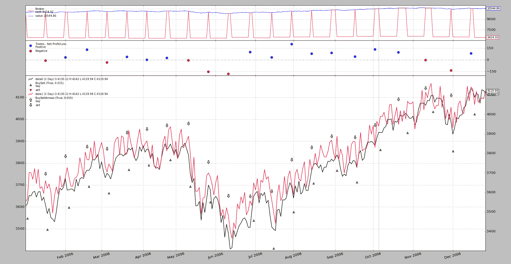

# 在同一轴上绘图

> 原文：[`www.backtrader.com/blog/posts/2017-03-17-plot-sameaxis/plot-sameaxis/`](https://www.backtrader.com/blog/posts/2017-03-17-plot-sameaxis/plot-sameaxis/)

以前的帖子《期货和现货补偿》在相同空间上绘制了原始数据和略微（随机）修改的数据，但没有在相同轴上绘制。

从该帖子中恢复第 1 张图片。



人们可以看到：

+   图表的左右两侧有不同的刻度

+   当看摆动的红线（随机数据）时，这一点最为明显，它在原始数据周围振荡`+- 50`点。

    在图表上，视觉印象是这些随机数据大多总是在原始数据之上。这只是由于不同的比例而产生的视觉印象。

尽管发布版本`1.9.32.116`已经初步支持在同一轴上进行完整绘制，但是图例标签将被复制（仅标签，不是数据），这真的很令人困惑。

发布版本`1.9.33.116`修复了该问题，并允许在同一轴上进行完整绘图。使用模式类似于决定与哪些其他数据一起绘制。来自上一篇帖子。

```py
`import backtrader as bt

cerebro = bt.Cerebro()

data0 = bt.feeds.MyFavouriteDataFeed(dataname='futurename')
cerebro.adddata(data0)

data1 = bt.feeds.MyFavouriteDataFeed(dataname='spotname')
data1.compensate(data0)  # let the system know ops on data1 affect data0
data1.plotinfo.plotmaster = data0
data1.plotinfo.sameaxis = True
cerebro.adddata(data1)

...

cerebro.run()` 
```

`data1`得到一些`plotinfo`值以：

+   在与`plotmaster`（即`data0`）相同的空间上绘图

+   获取使用`sameaxis`的指示

    这一指示的原因是平台无法预先知道每个数据的刻度是否兼容。这就是为什么它会在独立的刻度上绘制它们的原因。

前面的示例获得了一个额外选项来在`sameaxis`上绘制。一个示例执行：

```py
`$ ./future-spot.py --sameaxis` 
```

结果图表


注意：

+   右侧只有一个刻度

+   现在，随机化数据似乎清楚地在原始数据周围振荡，这是预期的可视行为

## 示例用法

```py
`$ ./future-spot.py --help
usage: future-spot.py [-h] [--no-comp] [--sameaxis]

Compensation example

optional arguments:
  -h, --help  show this help message and exit
  --no-comp
  --sameaxis` 
```

## 示例代码

```py
`from __future__ import (absolute_import, division, print_function,
                        unicode_literals)

import argparse
import random
import backtrader as bt

# The filter which changes the close price
def close_changer(data, *args, **kwargs):
    data.close[0] += 50.0 * random.randint(-1, 1)
    return False  # length of stream is unchanged

# override the standard markers
class BuySellArrows(bt.observers.BuySell):
    plotlines = dict(buy=dict(marker='$\u21E7$', markersize=12.0),
                     sell=dict(marker='$\u21E9$', markersize=12.0))

class St(bt.Strategy):
    def __init__(self):
        bt.obs.BuySell(self.data0, barplot=True)  # done here for
        BuySellArrows(self.data1, barplot=True)  # different markers per data

    def next(self):
        if not self.position:
            if random.randint(0, 1):
                self.buy(data=self.data0)
                self.entered = len(self)

        else:  # in the market
            if (len(self) - self.entered) >= 10:
                self.sell(data=self.data1)

def runstrat(args=None):
    args = parse_args(args)
    cerebro = bt.Cerebro()

    dataname = '../../datas/2006-day-001.txt'  # data feed

    data0 = bt.feeds.BacktraderCSVData(dataname=dataname, name='data0')
    cerebro.adddata(data0)

    data1 = bt.feeds.BacktraderCSVData(dataname=dataname, name='data1')
    data1.addfilter(close_changer)
    if not args.no_comp:
        data1.compensate(data0)
    data1.plotinfo.plotmaster = data0
    if args.sameaxis:
        data1.plotinfo.sameaxis = True
    cerebro.adddata(data1)

    cerebro.addstrategy(St)  # sample strategy

    cerebro.addobserver(bt.obs.Broker)  # removed below with stdstats=False
    cerebro.addobserver(bt.obs.Trades)  # removed below with stdstats=False

    cerebro.broker.set_coc(True)
    cerebro.run(stdstats=False)  # execute
    cerebro.plot(volume=False)  # and plot

def parse_args(pargs=None):
    parser = argparse.ArgumentParser(
        formatter_class=argparse.ArgumentDefaultsHelpFormatter,
        description=('Compensation example'))

    parser.add_argument('--no-comp', required=False, action='store_true')
    parser.add_argument('--sameaxis', required=False, action='store_true')
    return parser.parse_args(pargs)

if __name__ == '__main__':
    runstrat()` 
```
