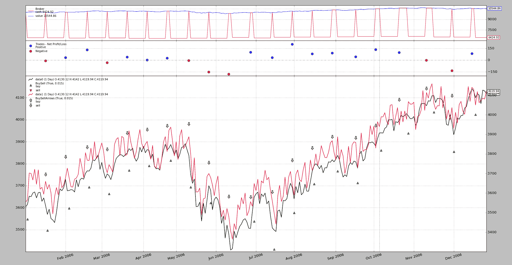
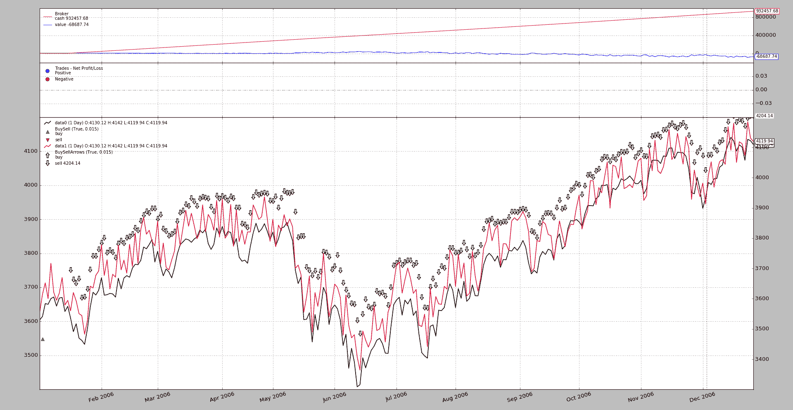

# 期货和现货补偿

> 原文：[`www.backtrader.com/blog/posts/2017-03-15-future-vs-spot/future-vs-spot/`](https://www.backtrader.com/blog/posts/2017-03-15-future-vs-spot/future-vs-spot/)

发布`1.9.32.116`添加了对[社区](https://community.backtrader.com/)中提出的一个有趣用例的支持

+   使用期货开始交易，其中包括**实物交付**

+   让指标告诉你一些信息

+   如果需要，通过操作现货价格来关闭持仓，从而有效地取消实物交付，无论是为了收到货物还是为了交付货物（并希望获利）。

    期货在同一天到期，与现货价格的操作同时进行。

这意味着：

+   平台接收来自两种不同资产的数据点

+   平台必须以某种方式理解资产之间的关联，并且现货价格的操作将关闭期货的持仓。

    实际上，期货并没有关闭，只是实物交付被*补偿*了。

使用*补偿*概念，`backtrader`添加了一种让用户与平台通信的方式，即一个数据源上的事物会对另一个数据源产生补偿效果。 使用模式

```py
import backtrader as bt

cerebro = bt.Cerebro()

data0 = bt.feeds.MyFavouriteDataFeed(dataname='futurename')
cerebro.adddata(data0)

data1 = bt.feeds.MyFavouriteDataFeed(dataname='spotname')
data1.compensate(data0)  # let the system know ops on data1 affect data0
cerebro.adddata(data1)

...

cerebro.run()
```

## 将所有内容放在一起

一个例子总比千言万语更有说服力，所以让我们把所有的要点都放在一起。

+   使用`backtrader`源中的标准样本数据源之一。 这将是期货。

+   通过重新使用相同的数据源并添加一个过滤器来模拟类似但不同的价格，该过滤器将随机将价格上/下移动一些点，以创建价差。 就像这样简单：

    ```py
    # The filter which changes the close price
    def close_changer(data, *args, **kwargs):
        data.close[0] += 50.0 * random.randint(-1, 1)
        return False  # length of stream is unchanged` 
    ```

+   在同一轴上绘制将混合默认包含的`BuyObserver`标记，因此标准观察者将被禁用，并手动重新添加以使用不同的每个数据标记进行绘制

+   位置将随机进入并在 10 天后退出。

    这与期货到期期间不匹配，但这只是为了将功能放在那里，而不是检查交易日历

!!! 注意

```py
 A simulation including execution on the spot price on the day of
  future expiration would require activating `cheat-on-close` to
  make sure the orders are executed when the future expires. This is
  not needed in this sample, because the expiration is being chosen
  at random.
```

+   注意策略

    +   `buy` 操作在`data0`上执行

    +   `sell` 操作在`data1`上执行

    ```py
    class St(bt.Strategy):
        def __init__(self):
            bt.obs.BuySell(self.data0, barplot=True)  # done here for
            BuySellArrows(self.data1, barplot=True)  # different markers per data

        def next(self):
            if not self.position:
                if random.randint(0, 1):
                    self.buy(data=self.data0)
                    self.entered = len(self)

            else:  # in the market
                if (len(self) - self.entered) >= 10:
                    self.sell(data=self.data1)` 
    ```

执行：

```py
$ ./future-spot.py --no-comp
```

使用这个图形输出。



它有效：

+   `buy` 操作以绿色向上指的三角形表示，图例告诉我们它们属于`data0`，正如预期的那样。

+   `sell` 操作通过向下指的箭头表示，图例告诉我们它们属于`data1`，正如预期的那样。

+   交易正在关闭，即使它们是在`data0`上开启的，并且是在`data1`上关闭的，也能达到期望的效果（在现实生活中，这意味着避免通过*期货*获得的货物的实际交付）。

只能想象如果应用相同的逻辑而不进行*补偿*会发生什么。 让我们试试：

```py
$ ./future-spot.py --no-comp
```

和输出



这显然是失败的：

+   逻辑期望在`data0`上的位置在对`data1`的操作关闭时关闭，并且仅当不在市场上时才打开`data0`上的位置。

+   但是*补偿*已被停用，并且对`data0`的初始操作（绿色三角形）从未关闭，因此不会启动任何其他操作，而`data1`上的空头头寸开始积累。

## 示例用法

```py
$ ./future-spot.py --help
usage: future-spot.py [-h] [--no-comp]

Compensation example

optional arguments:
  -h, --help  show this help message and exit
  --no-comp
```

## 示例代码

```py
from __future__ import (absolute_import, division, print_function,
                        unicode_literals)

import argparse
import random
import backtrader as bt

# The filter which changes the close price
def close_changer(data, *args, **kwargs):
    data.close[0] += 50.0 * random.randint(-1, 1)
    return False  # length of stream is unchanged

# override the standard markers
class BuySellArrows(bt.observers.BuySell):
    plotlines = dict(buy=dict(marker='$\u21E7$', markersize=12.0),
                     sell=dict(marker='$\u21E9$', markersize=12.0))

class St(bt.Strategy):
    def __init__(self):
        bt.obs.BuySell(self.data0, barplot=True)  # done here for
        BuySellArrows(self.data1, barplot=True)  # different markers per data

    def next(self):
        if not self.position:
            if random.randint(0, 1):
                self.buy(data=self.data0)
                self.entered = len(self)

        else:  # in the market
            if (len(self) - self.entered) >= 10:
                self.sell(data=self.data1)

def runstrat(args=None):
    args = parse_args(args)
    cerebro = bt.Cerebro()

    dataname = '../../datas/2006-day-001.txt'  # data feed

    data0 = bt.feeds.BacktraderCSVData(dataname=dataname, name='data0')
    cerebro.adddata(data0)

    data1 = bt.feeds.BacktraderCSVData(dataname=dataname, name='data1')
    data1.addfilter(close_changer)
    if not args.no_comp:
        data1.compensate(data0)
    data1.plotinfo.plotmaster = data0
    cerebro.adddata(data1)

    cerebro.addstrategy(St)  # sample strategy

    cerebro.addobserver(bt.obs.Broker)  # removed below with stdstats=False
    cerebro.addobserver(bt.obs.Trades)  # removed below with stdstats=False

    cerebro.broker.set_coc(True)
    cerebro.run(stdstats=False)  # execute
    cerebro.plot(volume=False)  # and plot

def parse_args(pargs=None):
    parser = argparse.ArgumentParser(
        formatter_class=argparse.ArgumentDefaultsHelpFormatter,
        description=('Compensation example'))

    parser.add_argument('--no-comp', required=False, action='store_true')
    return parser.parse_args(pargs)

if __name__ == '__main__':
    runstrat()
```
