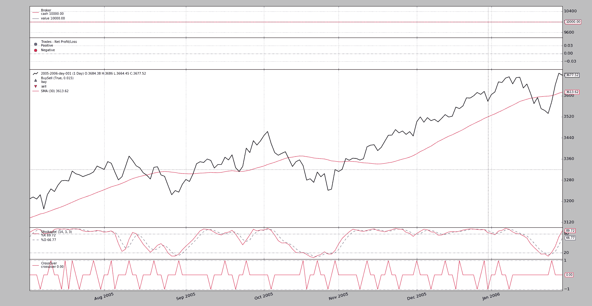
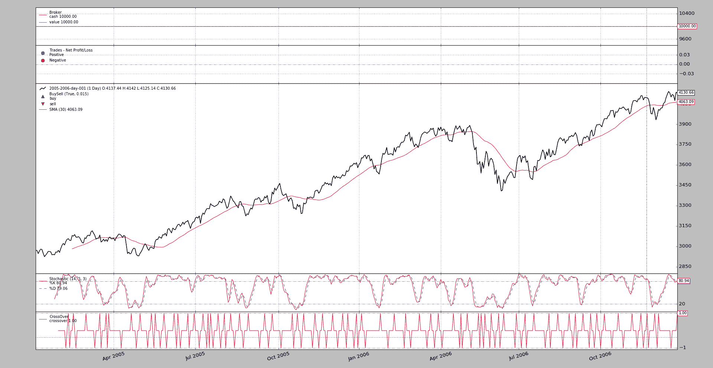

# 绘制日期范围

> 原文：[`www.backtrader.com/blog/posts/2017-03-07-plotting-date-ranges/plotting-date-ranges/`](https://www.backtrader.com/blog/posts/2017-03-07-plotting-date-ranges/plotting-date-ranges/)

发布 `1.9.31.x` 添加了制作部分图形的功能。

+   要么使用完整长度数组的索引来获取 *strategy* 实例中保存的 *timestamps*

+   或者使用实际的 `datetime.date` 或 `datetime.datetime` 实例，限制需要绘制的内容。

一切仍然在标准的 `cerebro.plot` 之上。例如：

```py
cerebro.plot(start=datetime.date(2005, 7, 1), end=datetime.date(2006, 1, 31))
```

对于人类而言，这是一种直接的方法。具有扩展功能的人类实际上可以尝试将索引映射到 `datetime` 时间戳，如下所示：

```py
cerebro.plot(start=75, end=185)
```

一个非常标准的示例包含了 *简单移动平均*（在数据绘图中）、*随机指标*（独立绘图）和 *随机指标* 线的 *交叉*，如下所示。`cerebro.plot` 的参数作为命令行参数传递。

使用 `date` 方法进行执行：

```py
./partial-plot.py --plot 'start=datetime.date(2005, 7, 1),end=datetime.date(2006, 1, 31)'
```

Python 中的 `eval` 魔法允许在命令行中直接编写 `datetime.date` 并将其实际映射到合理的内容。输出图表



让我们与完整的图形进行比较，看看数据实际上是从两端跳过的：

```py
./partial-plot.py --plot
```

Python 中的 `eval` 魔法允许在命令行中直接编写 `datetime.date` 并将其实际映射到合理的内容。输出图表



## 示例用法

```py
$ ./partial-plot.py --help
usage: partial-plot.py [-h] [--data0 DATA0] [--fromdate FROMDATE]
                       [--todate TODATE] [--cerebro kwargs] [--broker kwargs]
                       [--sizer kwargs] [--strat kwargs] [--plot [kwargs]]

Sample for partial plotting

optional arguments:
  -h, --help           show this help message and exit
  --data0 DATA0        Data to read in (default:
                       ../../datas/2005-2006-day-001.txt)
  --fromdate FROMDATE  Date[time] in YYYY-MM-DD[THH:MM:SS] format (default: )
  --todate TODATE      Date[time] in YYYY-MM-DD[THH:MM:SS] format (default: )
  --cerebro kwargs     kwargs in key=value format (default: )
  --broker kwargs      kwargs in key=value format (default: )
  --sizer kwargs       kwargs in key=value format (default: )
  --strat kwargs       kwargs in key=value format (default: )
  --plot [kwargs]      kwargs in key=value format (default: )
```

## 代码示例

```py
from __future__ import (absolute_import, division, print_function,
                        unicode_literals)

import argparse
import datetime

import backtrader as bt

class St(bt.Strategy):
    params = (
    )

    def __init__(self):
        bt.ind.SMA()
        stoc = bt.ind.Stochastic()
        bt.ind.CrossOver(stoc.lines.percK, stoc.lines.percD)

    def next(self):
        pass

def runstrat(args=None):
    args = parse_args(args)

    cerebro = bt.Cerebro()

    # Data feed kwargs
    kwargs = dict()

    # Parse from/to-date
    dtfmt, tmfmt = '%Y-%m-%d', 'T%H:%M:%S'
    for a, d in ((getattr(args, x), x) for x in ['fromdate', 'todate']):
        if a:
            strpfmt = dtfmt + tmfmt * ('T' in a)
            kwargs[d] = datetime.datetime.strptime(a, strpfmt)

    # Data feed
    data0 = bt.feeds.BacktraderCSVData(dataname=args.data0, **kwargs)
    cerebro.adddata(data0)

    # Broker
    cerebro.broker = bt.brokers.BackBroker(**eval('dict(' + args.broker + ')'))

    # Sizer
    cerebro.addsizer(bt.sizers.FixedSize, **eval('dict(' + args.sizer + ')'))

    # Strategy
    cerebro.addstrategy(St, **eval('dict(' + args.strat + ')'))

    # Execute
    cerebro.run(**eval('dict(' + args.cerebro + ')'))

    if args.plot:  # Plot if requested to
        cerebro.plot(**eval('dict(' + args.plot + ')'))

def parse_args(pargs=None):
    parser = argparse.ArgumentParser(
        formatter_class=argparse.ArgumentDefaultsHelpFormatter,
        description=(
            'Sample for partial plotting'
        )
    )

    parser.add_argument('--data0', default='../../datas/2005-2006-day-001.txt',
                        required=False, help='Data to read in')

    # Defaults for dates
    parser.add_argument('--fromdate', required=False, default='',
                        help='Date[time] in YYYY-MM-DD[THH:MM:SS] format')

    parser.add_argument('--todate', required=False, default='',
                        help='Date[time] in YYYY-MM-DD[THH:MM:SS] format')

    parser.add_argument('--cerebro', required=False, default='',
                        metavar='kwargs', help='kwargs in key=value format')

    parser.add_argument('--broker', required=False, default='',
                        metavar='kwargs', help='kwargs in key=value format')

    parser.add_argument('--sizer', required=False, default='',
                        metavar='kwargs', help='kwargs in key=value format')

    parser.add_argument('--strat', required=False, default='',
                        metavar='kwargs', help='kwargs in key=value format')

    parser.add_argument('--plot', required=False, default='',
                        nargs='?', const='{}',
                        metavar='kwargs', help='kwargs in key=value format')

    return parser.parse_args(pargs)

if __name__ == '__main__':
    runstrat()
```
