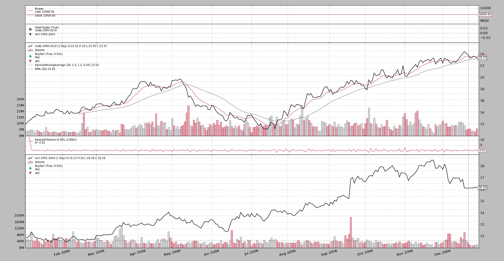

# 卡尔曼等人

> 原文：[`www.backtrader.com/blog/posts/2017-02-14-kalman-et-al/kalman-et-al/`](https://www.backtrader.com/blog/posts/2017-02-14-kalman-et-al/kalman-et-al/)

注

下面指令的支持始于提交

# 在开发分支中的 1146c83d9f9832630e97daab3ec7359705dc2c77

发布版本 `1.9.30.x` 将是第 1 个包含它的版本。

*backtrader* 的一个最初目标是保持纯 Python，即：只使用标准发行版中可用的包。与 `matplotlib` 一起做了一个例外，以便在不重新发明轮子的情况下进行绘图。尽管在最后可能的时刻导入以避免干扰可能根本不需要绘图的标准操作（并避免如果没有安装和不希望绘图时出现错误）

第 2 个例外部分地使用了 `pytz`，当添加对可能位于本地时区之外的实时数据源的时区支持时。同样，*import* 操作在后台进行，仅在 `pytz` 可用时才进行（用户可以选择传递 `pytz` 实例）

但现在是时候做一个完全的例外了，因为 *backtraders* 使用着像 `numpy`、`pandas`、`statsmodel` 这样的著名包，以及一些更谦逊的包，比如 `pykalman`。否则，将这些包使用到平台中。

社区中的一些示例：

+   [移植一个依赖于 pandas dataframe 的指标](https://community.backtrader.com/topic/11/porting-a-pandas-dataframe-dependent-indicator)

+   [线性回归和标准差 #211](https://community.backtrader.com/topic/5/linear-regression-and-std-211)

+   [机器学习 + backtrader](https://community.backtrader.com/topic/102/machine-learning-backtrader)

这个愿望已经添加到这里简要规划的快速路线图中：

+   [v1.x - 快速路线图](https://community.backtrader.com/topic/195/v1-x-quick-roadmap)

## 声明式方法

保持 *backtrader* 的原始精神，并同时允许使用这些包的关键是不强制纯 Python 用户必须安装这些包。

虽然这可能看起来具有挑战性并且容易出现多个条件语句，但在平台内部和外部用户方面，这种方法都是依赖于已用于开发其他概念的相同原则，例如 *参数*（称为 *params*）。

让我们回顾一下如何定义接受 *params* 并定义 *lines* 的 `Indicator`：

```py
`class MyIndicator(bt.Indicator):
    lines = ('myline',)
    params = (
        ('period', 50),
    )` 
```

以及后续可以作为 `self.params.period` 或 `self.p.period` 的参数：

```py
`def __init__(self):
    print('my period is:', self.p.period)` 
```

以及作为 `self.lines.myline` 或 `self.l.myline` 的当前值：

```py
`def next(self):
    print('mylines[0]:', self.lines.myline[0])` 
```

这并不特别有用，只是展示了 **声明式** 方法的 **params** 背景机制，该机制还具有适当的继承支持（包括 *多继承*）

## 引入 `packages`

使用相同的声明技术（有些人称之为 *元编程*），支持外部 *包* 可以这样实现：

```py
`class MyIndicator(bt.Indicator):
    packages = ('pandas',)
    lines = ('myline',)
    params = (
        ('period', 50),
    )` 
```

天啊！这似乎只是另一个声明。指标的实施者的第一个问题将是：

+   *我需要手动导入 ``pandas`` 吗？*

答案很明显：**不**。后台机制将导入 `pandas` 并使其在定义 `MyIndicator` 的模块中可用。现在可以在 `next` 中执行以下操作：

```py
`def next(self):
    print('mylines[0]:', pandas.SomeFunction(self.lines.myline[0]))` 
```

`packages` 指令也可以用于：

+   在一个声明中导入多个包

+   将导入分配给别名，如 `import pandas as pd`

假设还希望将 statsmodel 命名为 `sm` 以完成 `pandas.SomeFunction`：

```py
`class MyIndicator(bt.Indicator):
    packages = ('pandas', ('statsmodel', 'sm'),)
    lines = ('myline',)
    params = (
        ('period', 50),
    )

    def next(self):
        print('mylines[0]:', sm.XX(pandas.SomeFunction(self.lines.myline[0])))` 
```

`statsmodel` 已被导入为 `sm` 并可用。只需传递一个可迭代对象（`tuple` 是 *backtrader* 的约定）包含包的名称和所需的别名。

## 添加 `frompackages`

Python 以不断查找事物而闻名，这也是该语言在动态性、内省设施和元编程方面出色的原因之一。同时也是无法提供相同性能的原因之一。

常见的加速之一是通过直接从模块中导入符号而不是查找模块来实现本地查找。使用我们从 `pandas` 中的 `SomeFunction`，会是这样的：

```py
`from pandas import SomeFunction` 
```

或者使用别名：

```py
`from pandas import SomeFunction as SomeFunc` 
```

*backtrader* 提供了对 `frompackages` 指令的支持。让我们重新设计 `MyIndicator`：

```py
`class MyIndicator(bt.Indicator):
    frompackages = (('pandas', 'SomeFunction'),)
    lines = ('myline',)
    params = (
        ('period', 50),
    )

    def next(self):
        print('mylines[0]:', SomeFunction(self.lines.myline[0]))` 
```

当然，这开始增加更多的括号。例如，如果要从 `pandas` 中导入两个（2）个东西，看起来会像这样：

```py
`class MyIndicator(bt.Indicator):
    frompackages = (('pandas', ['SomeFunction', 'SomeFunction2']),)
    lines = ('myline',)
    params = (
        ('period', 50),
    )

    def next(self):
        print('mylines[0]:', SomeFunction2(SomeFunction(self.lines.myline[0])))` 
```

为了清晰起见，`SomeFunction` 和 `SomeFunction2` 已放在一个 `list` 而不是一个 `tuple` 中，以便使用方括号 `[]` 并更好地阅读它。

也可以将 `SomeFunction` 别名为例如 `SFunc`。完整示例：

```py
`class MyIndicator(bt.Indicator):
    frompackages = (('pandas', [('SomeFunction', 'SFunc'), 'SomeFunction2']),)
    lines = ('myline',)
    params = (
        ('period', 50),
    )

    def next(self):
        print('mylines[0]:', SomeFunction2(SFunc(self.lines.myline[0])))` 
```

从不同的包中导入也是可能的，但会增加更多的括号。当然，换行和缩进会有所帮助：

```py
`class MyIndicator(bt.Indicator):
    frompackages = (
        ('pandas', [('SomeFunction', 'SFunc'), 'SomeFunction2']),
        ('statsmodel', 'XX'),
    )
    lines = ('myline',)
    params = (
        ('period', 50),
    )

    def next(self):
        print('mylines[0]:', XX(SomeFunction2(SFunc(self.lines.myline[0]))))` 
```

## 使用继承

`packages` 和 `frompackages` 都支持（多重）继承。例如，可以有一个基类，为所有子类添加 `numpy` 支持：

```py
`class NumPySupport(object):
    packages = ('numpy',)

class MyIndicator(bt.Indicator, NumPySupport):
    packages = ('pandas',)` 
```

`MyIndicator` 将需要从后台机制中导入 `numpy` 和 `pandas` 并将能够使用它们。

## 介绍 Kalman 和朋友

注意

下面的两个指标都需要同行审查以确认实现。谨慎使用。

下面可以找到一个实现 `KalmanMovingAverage` 的示例。这是模仿这里的一篇文章：[Quantopian Lecture Series: Kalman Filters](https://www.quantopian.com/posts/quantopian-lecture-series-kalman-filters)

实现：

```py
`class KalmanMovingAverage(bt.indicators.MovingAverageBase):
    packages = ('pykalman',)
    frompackages = (('pykalman', [('KalmanFilter', 'KF')]),)
    lines = ('kma',)
    alias = ('KMA',)
    params = (
        ('initial_state_covariance', 1.0),
        ('observation_covariance', 1.0),
        ('transition_covariance', 0.05),
    )

    plotlines = dict(cov=dict(_plotskip=True))

    def __init__(self):
        self.addminperiod(self.p.period)  # when to deliver values
        self._dlast = self.data(-1)  # get previous day value

    def nextstart(self):
        self._k1 = self._dlast[0]
        self._c1 = self.p.initial_state_covariance

        self._kf = pykalman.KalmanFilter(
            transition_matrices=[1],
            observation_matrices=[1],
            observation_covariance=self.p.observation_covariance,
            transition_covariance=self.p.transition_covariance,
            initial_state_mean=self._k1,
            initial_state_covariance=self._c1,
        )

        self.next()

    def next(self):
        k1, self._c1 = self._kf.filter_update(self._k1, self._c1, self.data[0])
        self.lines.kma[0] = self._k1 = k1` 
```

还有一个基于这里的一篇文章的 `KalmanFilter`：[Kalman Filter-Based Pairs Trading Strategy In QSTrader](https://www.quantstart.com/articles/kalman-filter-based-pairs-trading-strategy-in-qstrader)

```py
`class NumPy(object):
    packages = (('numpy', 'np'),)

class KalmanFilterInd(bt.Indicator, NumPy):
    _mindatas = 2  # needs at least 2 data feeds

    packages = ('pandas',)
    lines = ('et', 'sqrt_qt')

    params = dict(
        delta=1e-4,
        vt=1e-3,
    )

    def __init__(self):
        self.wt = self.p.delta / (1 - self.p.delta) * np.eye(2)
        self.theta = np.zeros(2)
        self.P = np.zeros((2, 2))
        self.R = None

        self.d1_prev = self.data1(-1)  # data1 yesterday's price

    def next(self):
        F = np.asarray([self.data0[0], 1.0]).reshape((1, 2))
        y = self.d1_prev[0]

        if self.R is not None:  # self.R starts as None, self.C set below
            self.R = self.C + self.wt
        else:
            self.R = np.zeros((2, 2))

        yhat = F.dot(self.theta)
        et = y - yhat

        # Q_t is the variance of the prediction of observations and hence
        # \sqrt{Q_t} is the standard deviation of the predictions
        Qt = F.dot(self.R).dot(F.T) + self.p.vt
        sqrt_Qt = np.sqrt(Qt)

        # The posterior value of the states \theta_t is distributed as a
        # multivariate Gaussian with mean m_t and variance-covariance C_t
        At = self.R.dot(F.T) / Qt
        self.theta = self.theta + At.flatten() * et
        self.C = self.R - At * F.dot(self.R)

        # Fill the lines
        self.lines.et[0] = et
        self.lines.sqrt_qt[0] = sqrt_Qt` 
```

为了说明这一点，展示了 `packages` 如何与继承一起工作（`pandas` 实际上并不是必需的）

一个样例的执行：

```py
`$ ./kalman-things.py --plot` 
```

生成了这张图表



## 样例用法

```py
`$ ./kalman-things.py --help
usage: kalman-things.py [-h] [--data0 DATA0] [--data1 DATA1]
                        [--fromdate FROMDATE] [--todate TODATE]
                        [--cerebro kwargs] [--broker kwargs] [--sizer kwargs]
                        [--strat kwargs] [--plot [kwargs]]

Packages and Kalman

optional arguments:
  -h, --help           show this help message and exit
  --data0 DATA0        Data to read in (default:
                       ../../datas/nvda-1999-2014.txt)
  --data1 DATA1        Data to read in (default:
                       ../../datas/orcl-1995-2014.txt)
  --fromdate FROMDATE  Date[time] in YYYY-MM-DD[THH:MM:SS] format (default:
                       2006-01-01)
  --todate TODATE      Date[time] in YYYY-MM-DD[THH:MM:SS] format (default:
                       2007-01-01)
  --cerebro kwargs     kwargs in key=value format (default: runonce=False)
  --broker kwargs      kwargs in key=value format (default: )
  --sizer kwargs       kwargs in key=value format (default: )
  --strat kwargs       kwargs in key=value format (default: )
  --plot [kwargs]      kwargs in key=value format (default: )` 
```

## 样例代码

```py
`from __future__ import (absolute_import, division, print_function,
                        unicode_literals)

import argparse
import datetime

import backtrader as bt

class KalmanMovingAverage(bt.indicators.MovingAverageBase):
    packages = ('pykalman',)
    frompackages = (('pykalman', [('KalmanFilter', 'KF')]),)
    lines = ('kma',)
    alias = ('KMA',)
    params = (
        ('initial_state_covariance', 1.0),
        ('observation_covariance', 1.0),
        ('transition_covariance', 0.05),
    )

    def __init__(self):
        self.addminperiod(self.p.period)  # when to deliver values
        self._dlast = self.data(-1)  # get previous day value

    def nextstart(self):
        self._k1 = self._dlast[0]
        self._c1 = self.p.initial_state_covariance

        self._kf = pykalman.KalmanFilter(
            transition_matrices=[1],
            observation_matrices=[1],
            observation_covariance=self.p.observation_covariance,
            transition_covariance=self.p.transition_covariance,
            initial_state_mean=self._k1,
            initial_state_covariance=self._c1,
        )

        self.next()

    def next(self):
        k1, self._c1 = self._kf.filter_update(self._k1, self._c1, self.data[0])
        self.lines.kma[0] = self._k1 = k1

class NumPy(object):
    packages = (('numpy', 'np'),)

class KalmanFilterInd(bt.Indicator, NumPy):
    _mindatas = 2  # needs at least 2 data feeds

    packages = ('pandas',)
    lines = ('et', 'sqrt_qt')

    params = dict(
        delta=1e-4,
        vt=1e-3,
    )

    def __init__(self):
        self.wt = self.p.delta / (1 - self.p.delta) * np.eye(2)
        self.theta = np.zeros(2)
        self.R = None

        self.d1_prev = self.data1(-1)  # data1 yesterday's price

    def next(self):
        F = np.asarray([self.data0[0], 1.0]).reshape((1, 2))
        y = self.d1_prev[0]

        if self.R is not None:  # self.R starts as None, self.C set below
            self.R = self.C + self.wt
        else:
            self.R = np.zeros((2, 2))

        yhat = F.dot(self.theta)
        et = y - yhat

        # Q_t is the variance of the prediction of observations and hence
        # \sqrt{Q_t} is the standard deviation of the predictions
        Qt = F.dot(self.R).dot(F.T) + self.p.vt
        sqrt_Qt = np.sqrt(Qt)

        # The posterior value of the states \theta_t is distributed as a
        # multivariate Gaussian with mean m_t and variance-covariance C_t
        At = self.R.dot(F.T) / Qt
        self.theta = self.theta + At.flatten() * et
        self.C = self.R - At * F.dot(self.R)

        # Fill the lines
        self.lines.et[0] = et
        self.lines.sqrt_qt[0] = sqrt_Qt

class KalmanSignals(bt.Indicator):
    _mindatas = 2  # needs at least 2 data feeds

    lines = ('long', 'short',)

    def __init__(self):
        kf = KalmanFilterInd()
        et, sqrt_qt = kf.lines.et, kf.lines.sqrt_qt

        self.lines.long = et < -1.0 * sqrt_qt
        # longexit is et > -1.0 * sqrt_qt ... the opposite of long
        self.lines.short = et > sqrt_qt
        # shortexit is et < sqrt_qt ... the opposite of short

class St(bt.Strategy):
    params = dict(
        ksigs=False,  # attempt trading
        period=30,
    )

    def __init__(self):
        if self.p.ksigs:
            self.ksig = KalmanSignals()
            KalmanFilter()

        KalmanMovingAverage(period=self.p.period)
        bt.ind.SMA(period=self.p.period)
        if True:
            kf = KalmanFilterInd()
            kf.plotlines.sqrt_qt._plotskip = True

    def next(self):
        if not self.p.ksigs:
            return

        size = self.position.size
        if not size:
            if self.ksig.long:
                self.buy()
            elif self.ksig.short:
                self.sell()

        elif size > 0:
            if not self.ksig.long:
                self.close()
        elif not self.ksig.short:  # implicit size < 0
            self.close()

def runstrat(args=None):
    args = parse_args(args)

    cerebro = bt.Cerebro()

    # Data feed kwargs
    kwargs = dict()

    # Parse from/to-date
    dtfmt, tmfmt = '%Y-%m-%d', 'T%H:%M:%S'
    for a, d in ((getattr(args, x), x) for x in ['fromdate', 'todate']):
        if a:
            strpfmt = dtfmt + tmfmt * ('T' in a)
            kwargs[d] = datetime.datetime.strptime(a, strpfmt)

    # Data feed
    data0 = bt.feeds.YahooFinanceCSVData(dataname=args.data0, **kwargs)
    cerebro.adddata(data0)

    data1 = bt.feeds.YahooFinanceCSVData(dataname=args.data1, **kwargs)
    data1.plotmaster = data0
    cerebro.adddata(data1)

    # Broker
    cerebro.broker = bt.brokers.BackBroker(**eval('dict(' + args.broker + ')'))

    # Sizer
    cerebro.addsizer(bt.sizers.FixedSize, **eval('dict(' + args.sizer + ')'))

    # Strategy
    cerebro.addstrategy(St, **eval('dict(' + args.strat + ')'))

    # Execute
    cerebro.run(**eval('dict(' + args.cerebro + ')'))

    if args.plot:  # Plot if requested to
        cerebro.plot(**eval('dict(' + args.plot + ')'))

def parse_args(pargs=None):
    parser = argparse.ArgumentParser(
        formatter_class=argparse.ArgumentDefaultsHelpFormatter,
        description=(
            'Packages and Kalman'
        )
    )

    parser.add_argument('--data0', default='../../datas/nvda-1999-2014.txt',
                        required=False, help='Data to read in')

    parser.add_argument('--data1', default='../../datas/orcl-1995-2014.txt',
                        required=False, help='Data to read in')

    # Defaults for dates
    parser.add_argument('--fromdate', required=False, default='2006-01-01',
                        help='Date[time] in YYYY-MM-DD[THH:MM:SS] format')

    parser.add_argument('--todate', required=False, default='2007-01-01',
                        help='Date[time] in YYYY-MM-DD[THH:MM:SS] format')

    parser.add_argument('--cerebro', required=False, default='runonce=False',
                        metavar='kwargs', help='kwargs in key=value format')

    parser.add_argument('--broker', required=False, default='',
                        metavar='kwargs', help='kwargs in key=value format')

    parser.add_argument('--sizer', required=False, default='',
                        metavar='kwargs', help='kwargs in key=value format')

    parser.add_argument('--strat', required=False, default='',
                        metavar='kwargs', help='kwargs in key=value format')

    parser.add_argument('--plot', required=False, default='',
                        nargs='?', const='{}',
                        metavar='kwargs', help='kwargs in key=value format')

    return parser.parse_args(pargs)

if __name__ == '__main__':
    runstrat()` 
```
