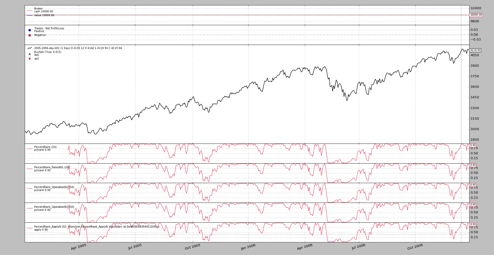

# 百分位重加载

> 原文：[`www.backtrader.com/blog/posts/2017-02-05-percentrank-reloaded/percentrank-reloaded/`](https://www.backtrader.com/blog/posts/2017-02-05-percentrank-reloaded/percentrank-reloaded/)

社区用户`@randyt`已经能够将*backtrader*推至极限。找到一些晦涩的角落，甚至在那里添加了`pdb`语句，并且一直是获得重新取样流的更精细的同步的推动力。

最近，`@randyt`提交了一个拉取请求，集成了一个名为`PercentRank`的新指标。以下是原始代码

```py
`class PercentRank(bt.Indicator):
    lines = ('pctrank',)
    params = (('period', 50),)

    def __init__(self):
        self.addminperiod(self.p.period)

    def next(self):
        self.lines.pctrank[0] = \
            (math.fsum([x < self.data[0]
                       for x in self.data.get(size=self.p.period)])
            / self.p.period)
        super(PercentRank, self).__init__()` 
```

这真的展示了某人如何深入研究*backtrader*的源代码，提出了一些问题，并理解了一些概念。这真的很棒：

```py
`self.addminperiod(self.p.period)` 
```

出乎意料，因为最终用户甚至不会预期到某人可以在*lines*对象中使用该 API 调用。这个调用告诉机器确保指标至少有`self.p.period`个*data feeds*样本可用，因为它们需要用于计算。

在原始代码中可以看到`self.data.get(size=self.p.period)`，这只有在后台引擎确保在进行第一次计算之前有那么多样本可用时才能起作用（如果使用`exactbars`来减少内存使用，则始终有那么多样本可用）

## 初始重载

代码可以重新编写以利用预先存在的旨在减轻开发的实用程序。没有什么最终用户必须知道的，但如果一个人不断开发或原型化指标，则是了解的好时机。

```py
`class PercentRank_PeriodN1(bt.ind.PeriodN):
    lines = ('pctrank',)
    params = (('period', 50),)

    def next(self):
        d0 = self.data[0]  # avoid dict/array lookups each time
        dx = self.data.get(size=self.p.period)
        self.l.pctrank[0] = math.fsum((x < d0 for x in dx)) / self.p.period` 
```

重新使用`PeriodN`是关键，以消除`self.addminperiod`的魔术，并使指标在某种程度上更易处理。`PeriodN`已经具有一个`period`参数，并将为用户调用（如果`__init__`被覆盖，则记得调用`super(cls, self).__init__()`）。

计算已被分解为 3 行，以首先缓存字典和数组查找，并使其更易读（尽管后者只是品味问题）

代码行数也从 13 减少到了 8 行。这通常在阅读时会有所帮助。

## 通过 OperationN 重载

像`SumN`这样的现有指标，它对数据源的值在一段时间内求和，不像上面那样直接构建在`PeriodN`上，而是构建在一个名为`OperationN`的子类上。与其父类一样，它仍然不定义*lines*，并且具有一个名为`func`的类属性。

`func`将被调用，其中包含宿主函数必须操作的期间的数据的数组。签名基本上是：`func(data[0:period])`并返回适合存储在*line*中的内容，即：一个浮点值。

知道了这一点，我们可以尝试一下显而易见的

```py
`class PercentRank_OperationN1(bt.ind.OperationN):
    lines = ('pctrank',)
    params = (('period', 50),)
    func = (lambda d: math.fsum((x < d[-1] for x in d)) / self.p.period)` 
```

降至 4 行。但这将失败，只需要最后一行：

```py
`TypeError: <lambda>() takes 1 positional argument but 2 were given` 
```

（使用`--strat n1=True`使示例失败）

通过将我们的无名函数放入`func`中，似乎已将其转换为方法，因为它需要两个参数。这可以很快解决。

```py
`class PercentRank_OperationN2(bt.ind.OperationN):
    lines = ('pctrank',)
    params = (('period', 50),)
    func = (lambda self, d: math.fsum((x < d[-1] for x in d)) / self.p.period)` 
```

它起作用了。但有一些不好看的地方：这不是大多数情况下人们期望传递函数的方式，即：将`self`作为参数。在这种情况下，我们控制函数，但这并不总是情况（可能需要一个包装器来解决）

在 Python 中的语法糖通过`staticmethod`拯救了我们，但在我们这样做之前，我们知道在`staticmethod`中将不再可能引用`self.p.period`，失去了以前进行平均计算的能力。

但由于`func`接收一个固定长度的可迭代对象，可以使用`len`。

现在是新代码。

```py
`class PercentRank_OperationN3(bt.ind.OperationN):
    lines = ('pctrank',)
    params = (('period', 50),)
    func = staticmethod(lambda d: math.fsum((x < d[-1] for x in d)) / len(d))` 
```

一切都很好，但这让人思考为什么以前没有考虑让用户有机会传递自己的函数。子类化`OperationN`是一个不错的选择，但可能有更好的方法，避免使用`staticmethod`或将`self`作为参数并构建在*backtrader*中的机制之上。

让我们定义`OperationN`的一个方便的子类。

```py
`class ApplyN(bt.ind.OperationN):
    lines = ('apply',)
    params = (('func', None),)

    def __init__(self):
        self.func = self.p.func
        super(ApplyN, self).__init__()` 
```

这应该很久以前就在平台上了。唯一真正需要考虑的是`lines = ('apply',)`是否必须存在，或者用户是否可以自由定义该行和其他一些行。在集成之前需要考虑的事情。

有了`ApplyN`，`PercentRank`的最终版本完全符合我们的所有预期。首先，手动平均计算版本。

```py
`class PercentRank_ApplyN(ApplyN):
    params = (
        ('period', 50),
        ('func', lambda d: math.fsum((x < d[-1] for x in d)) / len(d)),
    )` 
```

在不违反`PEP-8`的情况下，我们仍然可以重新格式化两者以适应 3 行... 很好！

## 让我们运行示例

下面可以看到的示例具有通常的骨架样板，但旨在展示不同`PercentRank`实现的视觉比较。

注意

使用`--strat n1=True`来执行它，尝试`PercentRank_OperationN1`版本，它不起作用

图形输出。



## 示例用法

```py
`$ ./percentrank.py --help
usage: percentrank.py [-h] [--data0 DATA0] [--fromdate FROMDATE]
                      [--todate TODATE] [--cerebro kwargs] [--broker kwargs]
                      [--sizer kwargs] [--strat kwargs] [--plot [kwargs]]

Sample Skeleton

optional arguments:
  -h, --help           show this help message and exit
  --data0 DATA0        Data to read in (default:
                       ../../datas/2005-2006-day-001.txt)
  --fromdate FROMDATE  Date[time] in YYYY-MM-DD[THH:MM:SS] format (default: )
  --todate TODATE      Date[time] in YYYY-MM-DD[THH:MM:SS] format (default: )
  --cerebro kwargs     kwargs in key=value format (default: )
  --broker kwargs      kwargs in key=value format (default: )
  --sizer kwargs       kwargs in key=value format (default: )
  --strat kwargs       kwargs in key=value format (default: )
  --plot [kwargs]      kwargs in key=value format (default: )` 
```

## 示例代码

```py
`from __future__ import (absolute_import, division, print_function,
                        unicode_literals)

import argparse
import datetime
import math

import backtrader as bt

class PercentRank(bt.Indicator):
    lines = ('pctrank',)
    params = (('period', 50),)

    def __init__(self):
        self.addminperiod(self.p.period)

    def next(self):
        self.lines.pctrank[0] = \
            (math.fsum([x < self.data[0]
                       for x in self.data.get(size=self.p.period)])
            / self.p.period)
        super(PercentRank, self).__init__()

class PercentRank_PeriodN1(bt.ind.PeriodN):
    lines = ('pctrank',)
    params = (('period', 50),)

    def next(self):
        d0 = self.data[0]  # avoid dict/array lookups each time
        dx = self.data.get(size=self.p.period)
        self.l.pctrank[0] = math.fsum((x < d0 for x in dx)) / self.p.period

class PercentRank_OperationN1(bt.ind.OperationN):
    lines = ('pctrank',)
    params = (('period', 50),)
    func = (lambda d: math.fsum((x < d[-1] for x in d)) / self.p.period)

class PercentRank_OperationN2(bt.ind.OperationN):
    lines = ('pctrank',)
    params = (('period', 50),)
    func = (lambda self, d: math.fsum((x < d[-1] for x in d)) / self.p.period)

class PercentRank_OperationN3(bt.ind.OperationN):
    lines = ('pctrank',)
    params = (('period', 50),)
    func = staticmethod(lambda d: math.fsum((x < d[-1] for x in d)) / len(d))

class ApplyN(bt.ind.OperationN):
    lines = ('apply',)
    params = (('func', None),)

    def __init__(self):
        self.func = self.p.func
        super(ApplyN, self).__init__()

class PercentRank_ApplyN(ApplyN):
    params = (
        ('period', 50),
        ('func', lambda d: math.fsum((x < d[-1] for x in d)) / len(d)),
    )

class St(bt.Strategy):
    params = (
        ('n1', False),
    )

    def __init__(self):
        PercentRank()
        PercentRank_PeriodN1()
        if self.p.n1:
            PercentRank_OperationN1()
        PercentRank_OperationN2()
        PercentRank_OperationN3()
        PercentRank_ApplyN()

    def next(self):
        pass

def runstrat(args=None):
    args = parse_args(args)

    cerebro = bt.Cerebro()

    # Data feed kwargs
    kwargs = dict()

    # Parse from/to-date
    dtfmt, tmfmt = '%Y-%m-%d', 'T%H:%M:%S'
    for a, d in ((getattr(args, x), x) for x in ['fromdate', 'todate']):
        if a:
            strpfmt = dtfmt + tmfmt * ('T' in a)
            kwargs[d] = datetime.datetime.strptime(a, strpfmt)

    # Data feed
    data0 = bt.feeds.BacktraderCSVData(dataname=args.data0, **kwargs)
    cerebro.adddata(data0)

    # Broker
    cerebro.broker = bt.brokers.BackBroker(**eval('dict(' + args.broker + ')'))

    # Sizer
    cerebro.addsizer(bt.sizers.FixedSize, **eval('dict(' + args.sizer + ')'))

    # Strategy
    cerebro.addstrategy(St, **eval('dict(' + args.strat + ')'))

    # Execute
    cerebro.run(**eval('dict(' + args.cerebro + ')'))

    if args.plot:  # Plot if requested to
        cerebro.plot(**eval('dict(' + args.plot + ')'))

def parse_args(pargs=None):
    parser = argparse.ArgumentParser(
        formatter_class=argparse.ArgumentDefaultsHelpFormatter,
        description=(
            'Sample Skeleton'
        )
    )

    parser.add_argument('--data0', default='../../datas/2005-2006-day-001.txt',
                        required=False, help='Data to read in')

    # Defaults for dates
    parser.add_argument('--fromdate', required=False, default='',
                        help='Date[time] in YYYY-MM-DD[THH:MM:SS] format')

    parser.add_argument('--todate', required=False, default='',
                        help='Date[time] in YYYY-MM-DD[THH:MM:SS] format')

    parser.add_argument('--cerebro', required=False, default='',
                        metavar='kwargs', help='kwargs in key=value format')

    parser.add_argument('--broker', required=False, default='',
                        metavar='kwargs', help='kwargs in key=value format')

    parser.add_argument('--sizer', required=False, default='',
                        metavar='kwargs', help='kwargs in key=value format')

    parser.add_argument('--strat', required=False, default='',
                        metavar='kwargs', help='kwargs in key=value format')

    parser.add_argument('--plot', required=False, default='',
                        nargs='?', const='{}',
                        metavar='kwargs', help='kwargs in key=value format')

    return parser.parse_args(pargs)

if __name__ == '__main__':
    runstrat()` 
```
