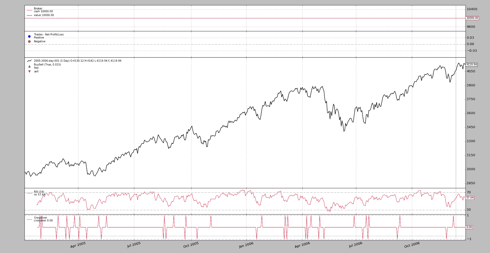

# 数字交叉

> 原文：[`www.backtrader.com/blog/posts/2017-02-04-crossing-over-numbers/crossing-over-numbers/`](https://www.backtrader.com/blog/posts/2017-02-04-crossing-over-numbers/crossing-over-numbers/)

在*backtrader*的`1.9.27.105`版本中已经纠正了一个疏忽。这是一个疏忽，因为所有的拼图都已经就位，但并没有在所有角落进行激活。

该机制使用一个名为`_mindatas`的属性，让我们称之为：`mindatas`。

社区提出了问题，答案并不完全正确。请查看这里的对话：

+   [`community.backtrader.com/topic/125/strategy-auto-generation/23`](https://community.backtrader.com/topic/125/strategy-auto-generation/23)

即使对话是关于其他事情的，问题也可以很快得到回答：“嘿，实际上应该可以工作！”但是现在谁有时间考虑一个恰当而周到的答案呢。

让我们考虑穿越一个普通的数字参数的用例。类似这样

```py
`mycrossover = bt.ind.CrossOver(bt.ind.RSI(), 50.0)` 
```

这将会像这样断开

```py
`Traceback (most recent call last):
  File "./cross-over-num.py", line 114, in <module>
    runstrat()
  File "./cross-over-num.py", line 70, in runstrat
    cerebro.run(**eval('dict(' + args.cerebro + ')'))
  File "d:\dro\01-docs\01-home\src\backtrader\backtrader\cerebro.py", line 810, in run
    runstrat = self.runstrategies(iterstrat)
  File "d:\dro\01-docs\01-home\src\backtrader\backtrader\cerebro.py", line 878, in runstrategies
    strat = stratcls(*sargs, **skwargs)
  File "d:\dro\01-docs\01-home\src\backtrader\backtrader\metabase.py", line 87, in __call__
    _obj, args, kwargs = cls.doinit(_obj, *args, **kwargs)
  File "d:\dro\01-docs\01-home\src\backtrader\backtrader\metabase.py", line 77, in doinit
    _obj.__init__(*args, **kwargs)
  File "./cross-over-num.py", line 35, in __init__
    bt.ind.CrossOver(bt.ind.RSI(), 50)
  File "d:\dro\01-docs\01-home\src\backtrader\backtrader\indicator.py", line 53, in __call__
    return super(MetaIndicator, cls).__call__(*args, **kwargs)
  File "d:\dro\01-docs\01-home\src\backtrader\backtrader\metabase.py", line 87, in __call__
    _obj, args, kwargs = cls.doinit(_obj, *args, **kwargs)
  File "d:\dro\01-docs\01-home\src\backtrader\backtrader\metabase.py", line 77, in doinit
    _obj.__init__(*args, **kwargs)
 Typeerror: __init__() takes exactly 1 argument (2 given)` 
```

最后一行最具信息性，因为它告诉我们有太多的参数。这意味着`50.0`正在伤害我们。

为了解决手头的问题，给出了一个数字包装器作为答案。

```py
`class ConstantValue(bt.Indicator):
    lines = ('constant',)
    params = (('constant', float('NaN')),)

    def next(self):
        self.lines.constant[0] = self.p.constant

...

mycrossover = bt.ind.CrossOver(bt.ind.RSI(), ConstantValue(50.0))` 
```

问题解决了。但等等，解决方案已经在手边。有一个内部助手，用于解决问题，但被完全遗忘了：`LineNum`。它做的就是名字所暗示的：*获取一个数字并将其变成一行*。问题的解决方案就在那里，解决方案可能看起来像这样：

```py
`mycrossover = bt.ind.CrossOver(bt.ind.RSI(), bt.LineNum(50.0))` 
```

通常的后台线程仍在不断地运行，告诉我们仍然有一些地方不是 100%清晰，解决方案应该是显而易见的，而不需要用户指定*包装器*。

然后出现了疏忽。即使`mindatas`机制存在并应用于系统的某些部分，但并没有应用于`CrossOver`。尝试过，但有时人类会失败，他们相信自己已经做了某事，结果发现他们没有往下滚动。这就是情况。像这样添加一行代码：

```py
`class CrossOver(Indicator):
    ...
    _mindatas = 2
    ...` 
```

现在问题的解决方案很明显：

```py
`mycrossover = bt.ind.CrossOver(bt.ind.RSI(), 50.0)` 
```

应该一直是这样的方式（参见下面的示例和图表）

## `mindatas`在工作

这是一个方便的属性，旨在用于特定情况，因此前面有`_`，表示应该非常谨慎使用。指标的默认值是：

+   `_mindatas = 1`

    这告诉系统，如果没有向指标传递任何数据源，系统应该从父级复制第一个数据源。如果没有这个，例如实例化`RelativeStrengthIndicator`应该这样做：

    ```py
    `class Strategy(bt.Indicator):
        def __init__(self):
            rsi = bt.ind.RSI(self.data0)` 
    ```

    但是使用`_mindatas`给出的默认指示，以下是可能的：

    ```py
    `class Strategy(bt.Indicator):
        def __init__(self):
            rsi = bt.ind.RSI()` 
    ```

    结果完全相同，因为策略中的第一个数据源`self.data0`被传递给`RSI`的实例化

像 `CrossOver` 这样的指示器需要 2 个数据源，因为它正在检查一件事是否穿过另一件事。在这种情况下，并如上所示，默认值已设置为：

+   `_mindatas = 2`

这告诉系统一些信息，比如：

+   如果没有数据被传递，则从父级复制 2 个数据源（如果可能的话）。

+   如果只传递了 1 个数据，尝试将下一个传入的参数转换为 *lines* 对象，以便有 2 个数据源可用。对于普通浮点数的线穿越用例很有用。再次参考：

    ```py
    `mycrossover = bt.ind.CrossOver(bt.ind.RSI(), 50.0)` 
    ```

+   如果向 `CrossOver` 传递了 2 个或更多个数据源，则不执行任何操作，并继续执行。

在社区中，最近已经将该机制应用于例如实现配对交易的 `KalmanFilter` 的第一稿。当谈论到配对时，需要 2 个数据源，因此：`_mindatas = 2`

一个小示例（尽管有一个完整的框架）来测试完整的解决方案：

```py
`$ ./cross-over-num.py --plot` 
```

这将产生这样的输出。



## 示例用法

```py
`$ ./cross-over-num.py --help
usage: cross-over-num.py [-h] [--data0 DATA0] [--fromdate FROMDATE]
                         [--todate TODATE] [--cerebro kwargs]
                         [--broker kwargs] [--sizer kwargs] [--strat kwargs]
                         [--plot [kwargs]]

Sample Skeleton

optional arguments:
  -h, --help           show this help message and exit
  --data0 DATA0        Data to read in (default:
                       ../../datas/2005-2006-day-001.txt)
  --fromdate FROMDATE  Date[time] in YYYY-MM-DD[THH:MM:SS] format (default: )
  --todate TODATE      Date[time] in YYYY-MM-DD[THH:MM:SS] format (default: )
  --cerebro kwargs     kwargs in key=value format (default: )
  --broker kwargs      kwargs in key=value format (default: )
  --sizer kwargs       kwargs in key=value format (default: )
  --strat kwargs       kwargs in key=value format (default: )
  --plot [kwargs]      kwargs in key=value format (default: )` 
```

## 示例代码

```py
`from __future__ import (absolute_import, division, print_function,
                        unicode_literals)

import argparse
import datetime

import backtrader as bt

class St(bt.Strategy):
    params = ()

    def __init__(self):
        bt.ind.CrossOver(bt.ind.RSI(), 50)

    def next(self):
        pass

def runstrat(args=None):
    args = parse_args(args)

    cerebro = bt.Cerebro()

    # Data feed kwargs
    kwargs = dict()

    # Parse from/to-date
    dtfmt, tmfmt = '%Y-%m-%d', 'T%H:%M:%S'
    for a, d in ((getattr(args, x), x) for x in ['fromdate', 'todate']):
        if a:
            strpfmt = dtfmt + tmfmt * ('T' in a)
            kwargs[d] = datetime.datetime.strptime(a, strpfmt)

    # Data feed
    data0 = bt.feeds.BacktraderCSVData(dataname=args.data0, **kwargs)
    cerebro.adddata(data0)

    # Broker
    cerebro.broker = bt.brokers.BackBroker(**eval('dict(' + args.broker + ')'))

    # Sizer
    cerebro.addsizer(bt.sizers.FixedSize, **eval('dict(' + args.sizer + ')'))

    # Strategy
    cerebro.addstrategy(St, **eval('dict(' + args.strat + ')'))

    # Execute
    cerebro.run(**eval('dict(' + args.cerebro + ')'))

    if args.plot:  # Plot if requested to
        cerebro.plot(**eval('dict(' + args.plot + ')'))

def parse_args(pargs=None):
    parser = argparse.ArgumentParser(
        formatter_class=argparse.ArgumentDefaultsHelpFormatter,
        description=(
            'Sample Skeleton'
        )
    )

    parser.add_argument('--data0', default='../../datas/2005-2006-day-001.txt',
                        required=False, help='Data to read in')

    # Defaults for dates
    parser.add_argument('--fromdate', required=False, default='',
                        help='Date[time] in YYYY-MM-DD[THH:MM:SS] format')

    parser.add_argument('--todate', required=False, default='',
                        help='Date[time] in YYYY-MM-DD[THH:MM:SS] format')

    parser.add_argument('--cerebro', required=False, default='',
                        metavar='kwargs', help='kwargs in key=value format')

    parser.add_argument('--broker', required=False, default='',
                        metavar='kwargs', help='kwargs in key=value format')

    parser.add_argument('--sizer', required=False, default='',
                        metavar='kwargs', help='kwargs in key=value format')

    parser.add_argument('--strat', required=False, default='',
                        metavar='kwargs', help='kwargs in key=value format')

    parser.add_argument('--plot', required=False, default='',
                        nargs='?', const='{}',
                        metavar='kwargs', help='kwargs in key=value format')

    return parser.parse_args(pargs)

if __name__ == '__main__':
    runstrat()` 
```
