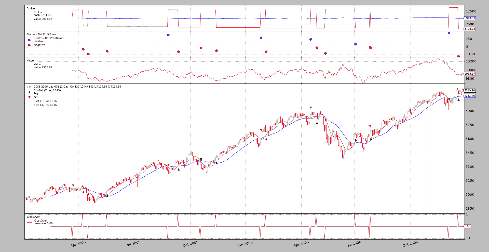
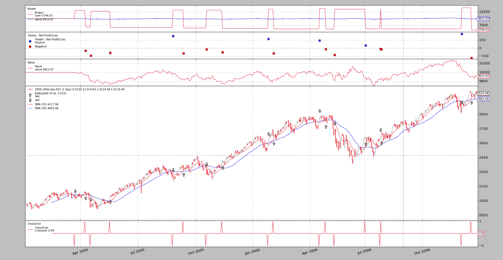

# 为 BuySell 观察者的箭头

> 原文：[`www.backtrader.com/blog/posts/2016-12-10-buysellarrows/buysellarrows/`](https://www.backtrader.com/blog/posts/2016-12-10-buysellarrows/buysellarrows/)

*backtrader*的构想是为了提供易用性。创建*指标*和其他常见的对象应该很容易。

当然，定制现有项目也应该是交易的一部分。

社区中的一个话题，[BuySell Arrows](https://community.backtrader.com/topic/8/change-buysell-to-trade-arrows-in-charts-213)，源自从问题迁移而来，是一个很好的例子。

可通过运行示例查看当前行为：

```py
`./buysellarrows.py --plot style="'ohlc'"` 
```

具有以下输出



使用时示例执行以下操作：

+   定义`BuySell`观察者的子类

+   重写`plotlines`定义，简单地更改指示买入和卖出操作的标记

+   用自定义的观察者猴子补丁现有的观察者

以代码术语表示。

```py
`class MyBuySell(bt.observers.BuySell):
    plotlines = dict(
        buy=dict(marker='$\u21E7$', markersize=12.0),
        sell=dict(marker='$\u21E9$', markersize=12.0)
    )` 
```

和：

```py
 `# Patch observer if needed
    if args.myobserver:
        bt.observers.BuySell = MyBuySell` 
```

注意

猴子补丁并不是绝对必要的。也可以按照标准方式进行：

```py
`cerebro = bt.Cerebro(stdstats=False)  # remove the standard observers

...
cerebro.addobserver(MyObserver, barplot=True)

...` 
```

并且将使用自定义观察者，但其他常规实例化的观察者将缺失。因此，在示例中进行猴子补丁，简单地修改观察者并保持外观。

再次运行时使用正确参数：

```py
`$ ./buysellarrows.py --plot style="'ohlc'" --myobserver` 
```

然后输出。



因为`matplotlib`允许使用*Unicode*字符，观察者的默认外观可以更改为任何形式，而不仅仅是箭头。随意发挥。例如来自*维基百科*：

+   [箭头（Unicode 块）](https://en.wikipedia.org/wiki/Arrows_%28Unicode_block%29)

## 示例用法

```py
`$ ./buysellarrows.py --help
usage: buysellarrows.py [-h] [--data DATA | --yahoo TICKER]
                        [--fromdate FROMDATE] [--todate TODATE]
                        [--cerebro kwargs] [--broker kwargs] [--sizer kwargs]
                        [--strat kwargs] [--plot [kwargs]] [--myobserver]

buysell arrows ...

optional arguments:
  -h, --help           show this help message and exit
  --data DATA          Data to read in (default:
                       ../../datas/2005-2006-day-001.txt)
  --yahoo TICKER       Yahoo ticker to download (default: )
  --fromdate FROMDATE  Date[time] in YYYY-MM-DD[THH:MM:SS] format (default: )
  --todate TODATE      Date[time] in YYYY-MM-DD[THH:MM:SS] format (default: )
  --cerebro kwargs     kwargs in key=value format (default: )
  --broker kwargs      kwargs in key=value format (default: )
  --sizer kwargs       kwargs in key=value format (default: )
  --strat kwargs       kwargs in key=value format (default: )
  --plot [kwargs]      kwargs in key=value format (default: )
  --myobserver         Patch in Custom BuySell observer (default: False)` 
```

## 示例代码

```py
`from __future__ import (absolute_import, division, print_function,
                        unicode_literals)

import argparse
import datetime

import backtrader as bt

class MyBuySell(bt.observers.BuySell):
    plotlines = dict(
        buy=dict(marker='$\u21E7$', markersize=12.0),
        sell=dict(marker='$\u21E9$', markersize=12.0)
    )

class MACrossOver(bt.SignalStrategy):
    params = (('ma', bt.ind.MovAv.SMA), ('p1', 10), ('p2', 30),)

    def __init__(self):
        ma1, ma2 = self.p.ma(period=self.p.p1), self.p.ma(period=self.p.p2)
        self.signal_add(bt.SIGNAL_LONGSHORT, bt.ind.CrossOver(ma1, ma2))

def runstrat(args=None):
    args = parse_args(args)

    cerebro = bt.Cerebro()

    # Data feed kwargs
    kwargs = dict(dataname=args.yahoo or args.data)

    # Parse from/to-date
    dtfmt, tmfmt = '%Y-%m-%d', 'T%H:%M:%S'
    for a, d in ((getattr(args, x), x) for x in ['fromdate', 'todate']):
        if a:
            strpfmt = dtfmt + tmfmt * ('T' in a)
            kwargs[d] = datetime.datetime.strptime(a, strpfmt)

    # Data feed kwargs
    if args.yahoo:
        data0 = bt.feeds.YahooFinanceData(**kwargs)
    else:
        data0 = bt.feeds.BacktraderCSVData(**kwargs)
    cerebro.adddata(data0)

    # Broker
    kwargs = eval('dict(' + args.broker + ')')
    cerebro.broker = bt.brokers.BackBroker(**kwargs)

    # Sizer
    kwargs = eval('dict(' + args.sizer + ')')
    cerebro.addsizer(bt.sizers.FixedSize, **kwargs)

    # Strategy
    kwargs = eval('dict(' + args.strat + ')')
    cerebro.addstrategy(MACrossOver, **kwargs)

    # better net liquidation value view
    cerebro.addobserver(bt.observers.Value)

    # Patch observer if needed
    if args.myobserver:
        bt.observers.BuySell = MyBuySell

    # Execute
    cerebro.run(**(eval('dict(' + args.cerebro + ')')))

    if args.plot:  # Plot if requested to
        cerebro.plot(**(eval('dict(' + args.plot + ')')))

def parse_args(pargs=None):

    parser = argparse.ArgumentParser(
        formatter_class=argparse.ArgumentDefaultsHelpFormatter,
        description='buysell arrows ...')

    pgroup = parser.add_mutually_exclusive_group(required=False)
    pgroup.add_argument('--data', required=False,
                        default='../../datas/2005-2006-day-001.txt',
                        help='Data to read in')

    pgroup.add_argument('--yahoo', required=False, default='',
                        metavar='TICKER', help='Yahoo ticker to download')

    parser.add_argument('--fromdate', required=False, default='',
                        help='Date[time] in YYYY-MM-DD[THH:MM:SS] format')

    parser.add_argument('--todate', required=False, default='',
                        help='Date[time] in YYYY-MM-DD[THH:MM:SS] format')

    parser.add_argument('--cerebro', required=False, default='',
                        metavar='kwargs', help='kwargs in key=value format')

    parser.add_argument('--broker', required=False, default='',
                        metavar='kwargs', help='kwargs in key=value format')

    parser.add_argument('--sizer', required=False, default='',
                        metavar='kwargs', help='kwargs in key=value format')

    parser.add_argument('--strat', required=False, default='',
                        metavar='kwargs', help='kwargs in key=value format')

    parser.add_argument('--plot', required=False, default='',
                        nargs='?', const='{}',
                        metavar='kwargs', help='kwargs in key=value format')

    parser.add_argument('--myobserver', required=False, action='store_true',
                        help='Patch in Custom BuySell observer')

    return parser.parse_args(pargs)

if __name__ == '__main__':
    runstrat()` 
```
