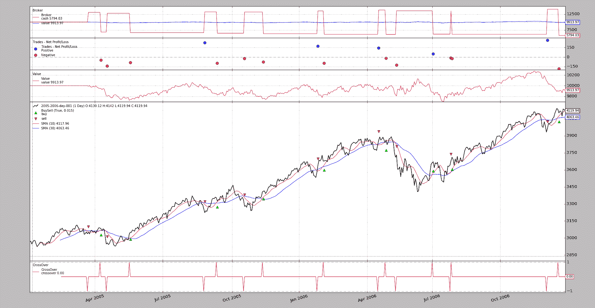
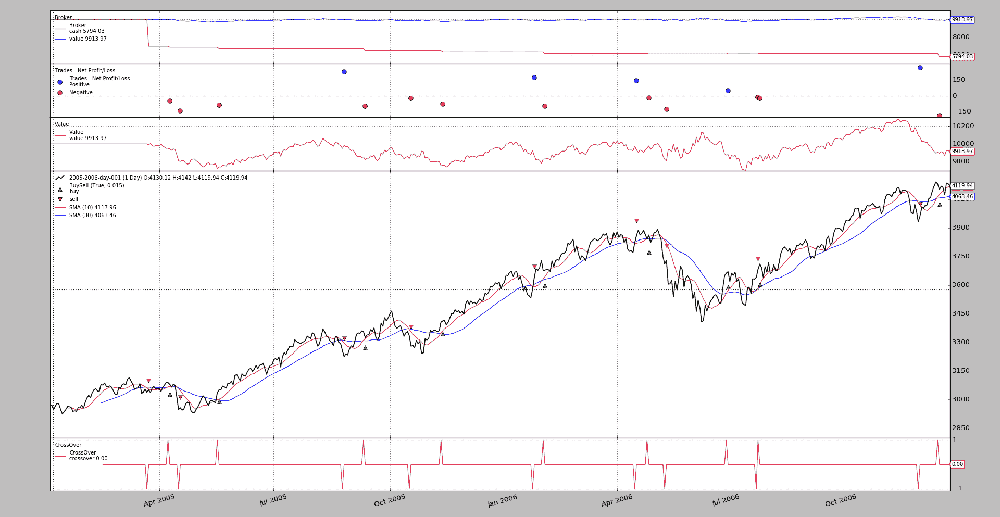

# 做空现金

> 原文：[`www.backtrader.com/blog/posts/2016-12-06-shorting-cash/shorting-cash/`](https://www.backtrader.com/blog/posts/2016-12-06-shorting-cash/shorting-cash/)

从一开始*backtrader*就被启用来对任何东西进行做空，包括*类股票*和*类期货*工具。当做空操作时，现金减少，做空资产的价值用于总净清算价值。

从一边减少，从另一边增加保持事物平衡。

似乎人们更喜欢现金增加，这可能导致更多的支出。

在发布`1.9.7.105`时，经纪人已更改了默认行为以增加现金并减少价值。这可以通过参数`shortcash`来控制，默认为`True`。更改方式如下：

```py
`cerebro.broker.set_shortcash(False)` 
```

或者：

```py
`cerebro.broker = bt.brokers.BackBroker(shortcash=False, **other_kwargs)` 
```

## 行动中

下面的示例使用标准的移动平均线交叉，并可用于查看差异。不带参数运行它并且新行为：

```py
`$ ./shortcash.py --plot` 
```



可以与以下行为进行比较：

```py
`$ ./shortcash.py --plot --broker shortcash=False` 
```



保持不变的事物：

+   最终结果

+   交易

+   净清算价值演变

    为了看到这一点，添加了额外的*观察者*，以确保缩放允许详细查看演变过程

变化：

+   当`shortcash`设置为`False`时，现金永远不会超过初始水平，因为每次操作都会花费资金。

    但是通过新的默认行为，我们已经可以看到第 1 个做空操作（恰好是第 1 个）向系统中添加了现金，然后*多头*从系统中扣除了现金（显然做空是第 1 个关闭的）

## 使用示例

```py
`$ ./shortcash.py --help
usage: shortcash.py [-h] [--data DATA] [--cerebro CEREBRO] [--broker BROKER]
                    [--sizer SIZER] [--strat STRAT] [--plot [kwargs]]

shortcash testing ...

optional arguments:
  -h, --help            show this help message and exit
  --data DATA           Data to read in (default:
                        ../../datas/2005-2006-day-001.txt)
  --cerebro CEREBRO     kwargs in key=value format (default: )
  --broker BROKER       kwargs in key=value format (default: )
  --sizer SIZER         kwargs in key=value format (default: )
  --strat STRAT         kwargs in key=value format (default: )
  --plot [kwargs], -p [kwargs]
                        Plot the read data applying any kwargs passed For
                        example: --plot style="candle" (to plot candles)
                        (default: None)` 
```

## 示例代码

```py
`from __future__ import (absolute_import, division, print_function,
                        unicode_literals)

import argparse

import backtrader as bt

class MACrossOver(bt.SignalStrategy):
    params = (('ma', bt.ind.MovAv.SMA), ('p1', 10), ('p2', 30),)

    def __init__(self):
        ma1, ma2 = self.p.ma(period=self.p.p1), self.p.ma(period=self.p.p2)
        self.signal_add(bt.SIGNAL_LONGSHORT, bt.ind.CrossOver(ma1, ma2))

def runstrat(args=None):
    args = parse_args(args)

    cerebro = bt.Cerebro()

    # Data feed
    data0 = bt.feeds.BacktraderCSVData(dataname=args.data)
    cerebro.adddata(data0)

    # Broker
    kwargs = eval('dict(' + args.broker + ')')
    cerebro.broker = bt.brokers.BackBroker(**kwargs)

    # Sizer
    kwargs = eval('dict(' + args.sizer + ')')
    cerebro.addsizer(bt.sizers.FixedSize, **kwargs)

    # Strategy
    kwargs = eval('dict(' + args.strat + ')')
    cerebro.addstrategy(MACrossOver, **kwargs)

    # better net liquidation value view
    cerebro.addobserver(bt.observers.Value)

    # Execute
    cerebro.run(**(eval('dict(' + args.cerebro + ')')))

    if args.plot:  # Plot if requested to
        cerebro.plot(**(eval('dict(' + args.plot + ')')))

def parse_args(pargs=None):

    parser = argparse.ArgumentParser(
        formatter_class=argparse.ArgumentDefaultsHelpFormatter,
        description='shortcash testing ...')

    parser.add_argument('--data', default='../../datas/2005-2006-day-001.txt',
                        required=False, help='Data to read in')

    parser.add_argument('--cerebro', required=False, action='store',
                        default='', help='kwargs in key=value format')

    parser.add_argument('--broker', required=False, action='store',
                        default='', help='kwargs in key=value format')

    parser.add_argument('--sizer', required=False, action='store',
                        default='', help='kwargs in key=value format')

    parser.add_argument('--strat', required=False, action='store',
                        default='', help='kwargs in key=value format')

    parser.add_argument('--plot', '-p', nargs='?', required=False,
                        metavar='kwargs', const='{}',
                        help=('Plot the read data applying any kwargs passed\n'
                              '\n'
                              'For example:\n'
                              '\n'
                              '  --plot style="candle" (to plot candles)\n'))

    return parser.parse_args(pargs)

if __name__ == '__main__':
    runstrat()` 
```
