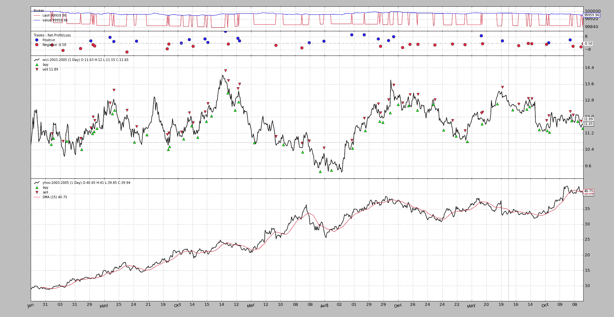
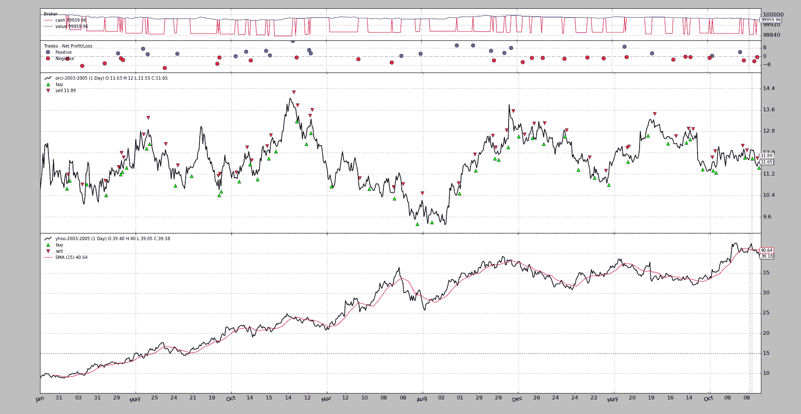
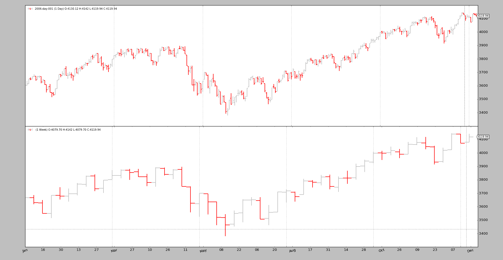
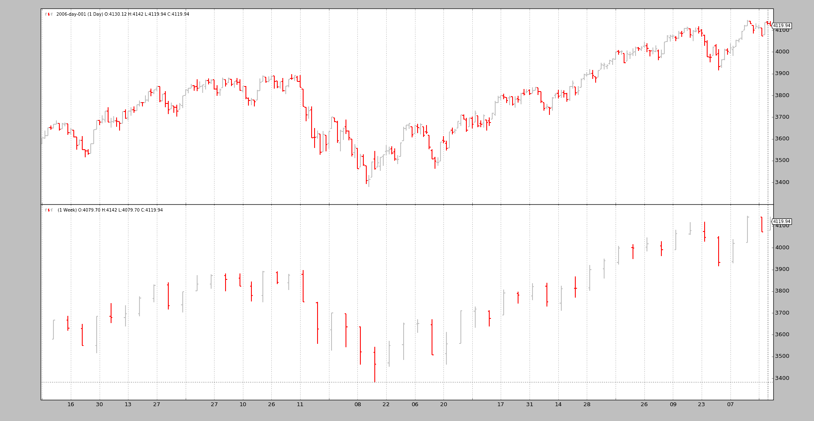

# 数据同步重写

> 原文：[`www.backtrader.com/blog/posts/2016-09-17-data-synchronization/data-synchronization/`](https://www.backtrader.com/blog/posts/2016-09-17-data-synchronization/data-synchronization/)

在最新版本中，*次要*编号已从 8 移至 9，以指示可能具有一些行为影响的更改，即使已考虑到兼容性。

通过发布 1.9.0.99 版本，使用*日期时间*同步多个数据的整个机制已进行了重写（对于*next*和*once*模式）。

注意

所有标准测试用例都会从`nosetests`中获得很好的 OK，但复杂的用例可能会发现未涵盖的边缘情况。

先前的行为在问题[#39](https://github.com/mementum/backtrader/issues/39)、[#76](https://github.com/mementum/backtrader/issues/76)、[#115](https://github.com/mementum/backtrader/issues/115)和[#129](https://github.com/mementum/backtrader/issues/129)中有所讨论，并且这已成为废弃旧行为的基础。

现在，检查传入价格的*日期时间*时间戳以对齐数据，并提供新内容（先前的条形图）。优点：

+   非时间对齐数据现在也可以使用了。

+   在实时数据中，行为改善因为重新自动同步

让我们回顾一下，旧行为使用系统中引入的第一个数据作为时间同步的主数据，并且没有其他数据可以更快。现在系统中引入数据的顺序不再起作用。

重写的一部分解决了绘图问题，该问题天真地假设所有数据最终具有相同的长度，这是具有时间主数据的结果。新的绘图代码允许具有不同长度的数据。

注意

通过使用以下命令仍然可以使用旧行为：

```py
cerebro = bt.Cerebro(oldsync=True)
```

或：

```py
cerebro.run(oldsync=True)
```

## 通过示例查看

`multidata-strategy`示例已用作`multidata-strategy-unaligned`示例的基础（在相同的文件夹中）。两个数据样本已手动更改以删除一些条形图。两者均为`756`条，已在两个不同时间点上限制为`753`

+   2004 年末，2005 年初为`YHOO`

+   2005 年底为`ORCL`

一如既往，执行胜过千言万语。

### 首先是旧行为

执行：

```py
$ ./multidata-strategy-unaligned.py --oldsync --plot
```

从输出来看，重要部分就在最后：

```py
...
Self  len: 753
Data0 len: 753
Data1 len: 750
Data0 len == Data1 len: False
Data0 dt: 2005-12-27 23:59:59
Data1 dt: 2005-12-27 23:59:59
...
```

注意：

+   *策略*长度为`753`

+   第一个数据（时间主数据）也为`753`

+   第二个数据（时间从属）为`750`

从输出中并不明显，但`YHOO`文件包含截至`2005-12-30`的数据，系统未对其进行处理。

可视化图表



### 新行为

执行：

```py
$ ./multidata-strategy-unaligned.py --plot
```

从输出来看，重要部分就在最后：

```py
...
Self  len: 756
Data0 len: 753
Data1 len: 753
Data0 len == Data1 len: True
Data0 dt: 2005-12-27 23:59:59
Data1 dt: 2005-12-30 23:59:59
...
```

行为显然已经改善：

+   *策略*长度为`756`，每个数据都有完整的`753`个数据点。

+   因为移除的数据点不与数据重叠，所以策略最终比数据多`3`个单位。

+   已经达到`2005-12-30`，使用了`data1`（它是为了`data0`而删除的数据点之一），所以所有数据都已经处理到最后

可视化图表



尽管图表看起来没有明显差异，但实际上它们在幕后是不同的。

## 另一个检查

对于感兴趣的用户，`data-multitimeframe` 示例已更新，还支持一个`--oldsync`参数。因为现在正在绘制不同长度的数据，所以较大时间框架的视觉效果更好。

### 使用新同步模型执行



### 使用旧同步模型执行



## 示例用法

```py
$ ./multidata-strategy-unaligned.py --help
usage: multidata-strategy-unaligned.py [-h] [--data0 DATA0] [--data1 DATA1]
                                       [--fromdate FROMDATE] [--todate TODATE]
                                       [--period PERIOD] [--cash CASH]
                                       [--runnext] [--nopreload] [--oldsync]
                                       [--commperc COMMPERC] [--stake STAKE]
                                       [--plot] [--numfigs NUMFIGS]

MultiData Strategy

optional arguments:
  -h, --help            show this help message and exit
  --data0 DATA0, -d0 DATA0
                        1st data into the system
  --data1 DATA1, -d1 DATA1
                        2nd data into the system
  --fromdate FROMDATE, -f FROMDATE
                        Starting date in YYYY-MM-DD format
  --todate TODATE, -t TODATE
                        Starting date in YYYY-MM-DD format
  --period PERIOD       Period to apply to the Simple Moving Average
  --cash CASH           Starting Cash
  --runnext             Use next by next instead of runonce
  --nopreload           Do not preload the data
  --oldsync             Use old data synchronization method
  --commperc COMMPERC   Percentage commission (0.005 is 0.5%
  --stake STAKE         Stake to apply in each operation
  --plot, -p            Plot the read data
  --numfigs NUMFIGS, -n NUMFIGS
                        Plot using numfigs figures
```

## 示例代码

```py
from __future__ import (absolute_import, division, print_function,
                        unicode_literals)

import argparse
import datetime

# The above could be sent to an independent module
import backtrader as bt
import backtrader.feeds as btfeeds
import backtrader.indicators as btind

class MultiDataStrategy(bt.Strategy):
    '''
    This strategy operates on 2 datas. The expectation is that the 2 datas are
    correlated and the 2nd data is used to generate signals on the 1st

      - Buy/Sell Operationss will be executed on the 1st data
      - The signals are generated using a Simple Moving Average on the 2nd data
        when the close price crosses upwwards/downwards

    The strategy is a long-only strategy
    '''
    params = dict(
        period=15,
        stake=10,
        printout=True,
    )

    def log(self, txt, dt=None):
        if self.p.printout:
            dt = dt or self.data.datetime[0]
            dt = bt.num2date(dt)
            print('%s, %s' % (dt.isoformat(), txt))

    def notify_order(self, order):
        if order.status in [bt.Order.Submitted, bt.Order.Accepted]:
            return  # Await further notifications

        if order.status == order.Completed:
            if order.isbuy():
                buytxt = 'BUY COMPLETE, %.2f' % order.executed.price
                self.log(buytxt, order.executed.dt)
            else:
                selltxt = 'SELL COMPLETE, %.2f' % order.executed.price
                self.log(selltxt, order.executed.dt)

        elif order.status in [order.Expired, order.Canceled, order.Margin]:
            self.log('%s ,' % order.Status[order.status])
            pass  # Simply log

        # Allow new orders
        self.orderid = None

    def __init__(self):
        # To control operation entries
        self.orderid = None

        # Create SMA on 2nd data
        sma = btind.MovAv.SMA(self.data1, period=self.p.period)
        # Create a CrossOver Signal from close an moving average
        self.signal = btind.CrossOver(self.data1.close, sma)

    def next(self):
        if self.orderid:
            return  # if an order is active, no new orders are allowed

        if self.p.printout:
            print('Self  len:', len(self))
            print('Data0 len:', len(self.data0))
            print('Data1 len:', len(self.data1))
            print('Data0 len == Data1 len:',
                  len(self.data0) == len(self.data1))

            print('Data0 dt:', self.data0.datetime.datetime())
            print('Data1 dt:', self.data1.datetime.datetime())

        if not self.position:  # not yet in market
            if self.signal > 0.0:  # cross upwards
                self.log('BUY CREATE , %.2f' % self.data1.close[0])
                self.buy(size=self.p.stake)

        else:  # in the market
            if self.signal < 0.0:  # crosss downwards
                self.log('SELL CREATE , %.2f' % self.data1.close[0])
                self.sell(size=self.p.stake)

    def stop(self):
        print('==================================================')
        print('Starting Value - %.2f' % self.broker.startingcash)
        print('Ending   Value - %.2f' % self.broker.getvalue())
        print('==================================================')

def runstrategy():
    args = parse_args()

    # Create a cerebro
    cerebro = bt.Cerebro()

    # Get the dates from the args
    fromdate = datetime.datetime.strptime(args.fromdate, '%Y-%m-%d')
    todate = datetime.datetime.strptime(args.todate, '%Y-%m-%d')

    # Create the 1st data
    data0 = btfeeds.YahooFinanceCSVData(
        dataname=args.data0,
        fromdate=fromdate,
        todate=todate)

    # Add the 1st data to cerebro
    cerebro.adddata(data0)

    # Create the 2nd data
    data1 = btfeeds.YahooFinanceCSVData(
        dataname=args.data1,
        fromdate=fromdate,
        todate=todate)

    # Add the 2nd data to cerebro
    cerebro.adddata(data1)

    # Add the strategy
    cerebro.addstrategy(MultiDataStrategy,
                        period=args.period,
                        stake=args.stake)

    # Add the commission - only stocks like a for each operation
    cerebro.broker.setcash(args.cash)

    # Add the commission - only stocks like a for each operation
    cerebro.broker.setcommission(commission=args.commperc)

    # And run it
    cerebro.run(runonce=not args.runnext,
                preload=not args.nopreload,
                oldsync=args.oldsync)

    # Plot if requested
    if args.plot:
        cerebro.plot(numfigs=args.numfigs, volume=False, zdown=False)

def parse_args():
    parser = argparse.ArgumentParser(description='MultiData Strategy')

    parser.add_argument('--data0', '-d0',
                        default='../../datas/orcl-2003-2005.txt',
                        help='1st data into the system')

    parser.add_argument('--data1', '-d1',
                        default='../../datas/yhoo-2003-2005.txt',
                        help='2nd data into the system')

    parser.add_argument('--fromdate', '-f',
                        default='2003-01-01',
                        help='Starting date in YYYY-MM-DD format')

    parser.add_argument('--todate', '-t',
                        default='2005-12-31',
                        help='Starting date in YYYY-MM-DD format')

    parser.add_argument('--period', default=15, type=int,
                        help='Period to apply to the Simple Moving Average')

    parser.add_argument('--cash', default=100000, type=int,
                        help='Starting Cash')

    parser.add_argument('--runnext', action='store_true',
                        help='Use next by next instead of runonce')

    parser.add_argument('--nopreload', action='store_true',
                        help='Do not preload the data')

    parser.add_argument('--oldsync', action='store_true',
                        help='Use old data synchronization method')

    parser.add_argument('--commperc', default=0.005, type=float,
                        help='Percentage commission (0.005 is 0.5%%')

    parser.add_argument('--stake', default=10, type=int,
                        help='Stake to apply in each operation')

    parser.add_argument('--plot', '-p', action='store_true',
                        help='Plot the read data')

    parser.add_argument('--numfigs', '-n', default=1,
                        help='Plot using numfigs figures')

    return parser.parse_args()

if __name__ == '__main__':
    runstrategy()
```
