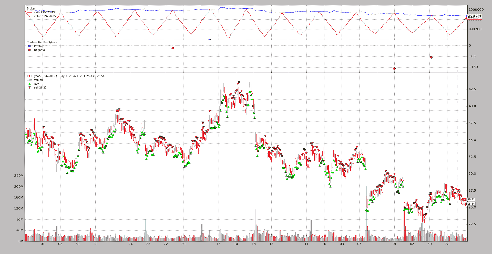
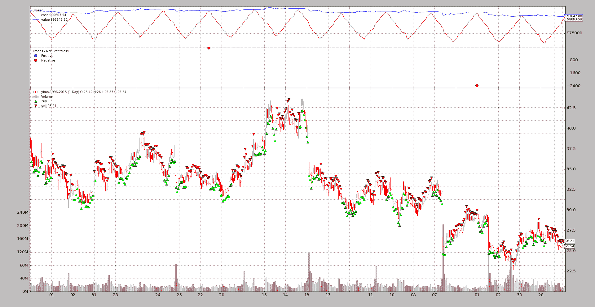
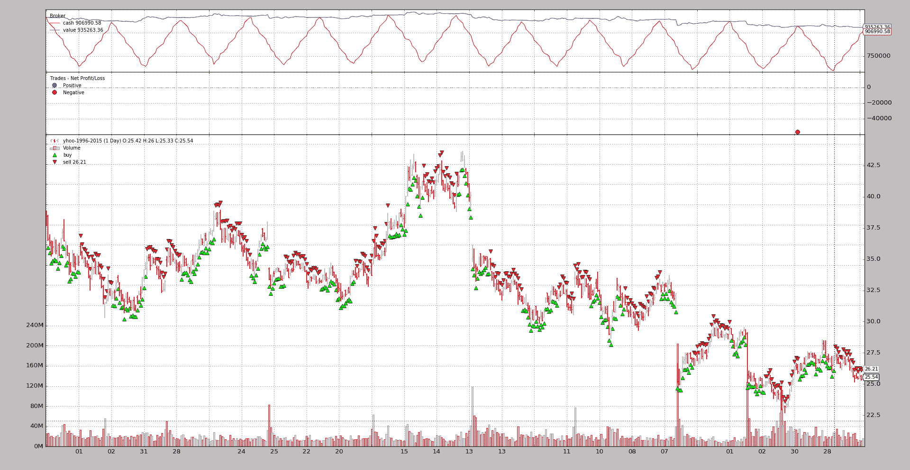

# 目标订单

> 原文：[`www.backtrader.com/blog/posts/2016-09-02-target-orders/target-orders/`](https://www.backtrader.com/blog/posts/2016-09-02-target-orders/target-orders/)

直到版本 1.8.10.96，通过*Strategy*方法：买入和卖出，在*backtrader*上实现了智能的投注。一切都是关于向方程中添加一个 Sizer，它负责赌注的大小。

*Sizer*无法决定操作是*买入*还是*卖出*。这意味着需要引入一个新概念，在其中添加一个小的智能层来做出这样的决定。

这就是`Strategy`中的`order_target_xxx`方法家族发挥作用的地方。受到`zipline`中的方法的启发，这些方法提供了简单指定最终*目标*的机会，目标可以是：

+   `size` -> 特定资产组合中的股票、合约数量

+   `value` -> 投资组合中资产的货币单位价值

+   `percent` -> 当前投资组合中资产的百分比价值

注意

方法的参考可以在策略参考中找到。简而言之，这些方法使用与`buy`和`sell`相同的*签名*，除了参数`size`被参数`target`替换。

在这种情况下，重点是指定最终*目标*，方法决定操作是*买入*还是*卖出*。相同的逻辑适用于这 3 种方法。让我们从`order_target_size`开始

+   如果*目标*大于仓位，则会发出*买入*指令，差额为`目标 - 仓位大小`

    示例：

    +   仓位：`0`，*目标*：`7` -> *买入(size=7 - 0)* -> *买入(size=7)*

    +   仓位：`3`，*目标*：`7` -> *买入(size=7 - 3)* -> *买入(size=4)*

    +   仓位：`-3`，*目标*：`7` -> *买入(size=7 - -3)* -> *买入(size=10)*

    +   仓位：`-3`，*目标*：`-2` -> *买入(size=-2 - -3)* -> *买入(size=1)*

+   如果*目标*小于仓位，则会发出*卖出*指令，差额为`仓位大小 - 目标`

    示例：

    +   仓位：`0`，*目标*：`-7` -> *卖出(size=0 - -7)* -> *卖出(size=7)*

    +   仓位：`3`，*目标*：`-7` -> *卖出(size=3 - -7)* -> *卖出(size=10)*

    +   仓位：`-3`，*目标*：`-7` -> *卖出(size=-3 - -7)* -> *卖出(size=4)*

    +   仓位：`3`，*目标*：`2` -> *卖出(size=3 - 2)* -> *卖出(size=1)*

当使用`order_target_value`来设置目标值时，投资组合中资产的当前价值和仓位大小都会被考虑在内，以决定最终的基础操作。推理如下：

+   如果*仓位大小*为负值（*空头*）且*目标价值*必须大于当前价值，则意味着：*卖出*更多

因此，逻辑如下：

+   如果`目标 > 值`且`size >=0` -> *买入*

+   如果`目标 > 值`且`size < 0` -> *卖出*

+   如果`目标 < 值`且`size >= 0` -> *卖出*

+   如果`目标 < 值`且`size\* < 0` -> *买入*

`order_target_percent`的逻辑与`order_target_value`相同。该方法简单地考虑了投资组合的当前总价值，以确定资产的*目标价值*。

## 示例

*backtrader*尝试为每个新功能提供一个示例，这不例外。没有花里胡哨，只是为了测试结果是否符合预期。这个示例位于 samples 中的`order_target`目录下。

示例中的逻辑相当愚蠢，只是用于测试：

+   在*奇数月*（一月，三月，...）中，使用*日*作为目标（对于`order_target_value`，将日乘以`1000`）

    这模拟了一个递增的*目标*。

+   在*偶数月*（二月，四月，...）中，使用`31 - 日`作为*目标*

    这模拟了一个递减的*目标*。

### order_target_size

让我们看看*一月*和*二月*发生了什么。

```py
`$ ./order_target.py --target-size -- plot
0001 - 2005-01-03 - Position Size:     00 - Value 1000000.00
0001 - 2005-01-03 - Order Target Size: 03
0002 - 2005-01-04 - Position Size:     03 - Value 999994.39
0002 - 2005-01-04 - Order Target Size: 04
0003 - 2005-01-05 - Position Size:     04 - Value 999992.48
0003 - 2005-01-05 - Order Target Size: 05
0004 - 2005-01-06 - Position Size:     05 - Value 999988.79
...
0020 - 2005-01-31 - Position Size:     28 - Value 999968.70
0020 - 2005-01-31 - Order Target Size: 31
0021 - 2005-02-01 - Position Size:     31 - Value 999954.68
0021 - 2005-02-01 - Order Target Size: 30
0022 - 2005-02-02 - Position Size:     30 - Value 999979.65
0022 - 2005-02-02 - Order Target Size: 29
0023 - 2005-02-03 - Position Size:     29 - Value 999966.33
0023 - 2005-02-03 - Order Target Size: 28
...` 
```

在*一月*，*目标*从年初的第 1 个交易日开始为`3`，并逐渐增加。*持仓*大小最初从`0`增加到`3`，然后以`1`的增量移动。

结束*一月*时，最后的*order_target*为`31`，当进入*二月*的第 1 天时报告了该*持仓大小*，当新的*目标大小*请求为`30`时，并随着持仓以`1`的递减变化。



### order_target_value

预计*目标值*会有类似的行为。

```py
`$ ./order_target.py --target-value --plot
0001 - 2005-01-03 - Position Size:     00 - Value 1000000.00
0001 - 2005-01-03 - data value 0.00
0001 - 2005-01-03 - Order Target Value: 3000.00
0002 - 2005-01-04 - Position Size:     78 - Value 999854.14
0002 - 2005-01-04 - data value 2853.24
0002 - 2005-01-04 - Order Target Value: 4000.00
0003 - 2005-01-05 - Position Size:     109 - Value 999801.68
0003 - 2005-01-05 - data value 3938.17
0003 - 2005-01-05 - Order Target Value: 5000.00
0004 - 2005-01-06 - Position Size:     138 - Value 999699.57
...
0020 - 2005-01-31 - Position Size:     808 - Value 999206.37
0020 - 2005-01-31 - data value 28449.68
0020 - 2005-01-31 - Order Target Value: 31000.00
0021 - 2005-02-01 - Position Size:     880 - Value 998807.33
0021 - 2005-02-01 - data value 30580.00
0021 - 2005-02-01 - Order Target Value: 30000.00
0022 - 2005-02-02 - Position Size:     864 - Value 999510.21
0022 - 2005-02-02 - data value 30706.56
0022 - 2005-02-02 - Order Target Value: 29000.00
0023 - 2005-02-03 - Position Size:     816 - Value 999130.05
0023 - 2005-02-03 - data value 28633.44
0023 - 2005-02-03 - Order Target Value: 28000.00
...` 
```

还有一行额外的信息，告诉实际的*数据值*（在投资组合中）是多少。这有助于确定是否已达到*目标值*。

初始目标为`3000.0`，报告的初始值为`2853.24`。这里的问题是这是否*足够接近*。答案是*是*

+   该示例在每日 K 线结束时使用`Market`订单和最后可用价格来计算*目标大小*，以满足*目标价值*。

+   执行然后使用下一天的`open`价格，这不太可能是前一天的`close`。

以任何其他方式进行将意味着在*欺骗*自己。

下一个*目标值*和*最终值*更接近：`4000`和`3938.17`。

当转变为*二月*时，*目标价值*开始从`31000`减少到`30000`和`29000`。*数据值*也随之从`30580.00`减少到`30706.56`，然后到`28633.44`。等待：

+   `30580` -> `30706.56`是一个正向变化。

    确实。在这种情况下，计算出的*目标值*的*大小*遇到了将值提升到`30706.56`的*开盘价*。

如何避免这种影响：

+   该示例使用`Market`类型执行订单，这种效果无法避免。

+   方法`order_target_xxx`允许指定*执行类型*和*价格*。

    可以指定`Limit`作为执行订单，并让价格为*close*价格（如果没有提供其他价格，则由方法选择），甚至提供特定定价。



### order_target_value

在这种情况下，它只是当前投资组合价值的一个百分比。

```py
`$ ./order_target.py --target-percent --plot
0001 - 2005-01-03 - Position Size:     00 - Value 1000000.00
0001 - 2005-01-03 - data percent 0.00
0001 - 2005-01-03 - Order Target Percent: 0.03
0002 - 2005-01-04 - Position Size:     785 - Value 998532.05
0002 - 2005-01-04 - data percent 0.03
0002 - 2005-01-04 - Order Target Percent: 0.04
0003 - 2005-01-05 - Position Size:     1091 - Value 998007.44
0003 - 2005-01-05 - data percent 0.04
0003 - 2005-01-05 - Order Target Percent: 0.05
0004 - 2005-01-06 - Position Size:     1381 - Value 996985.64
...
0020 - 2005-01-31 - Position Size:     7985 - Value 991966.28
0020 - 2005-01-31 - data percent 0.28
0020 - 2005-01-31 - Order Target Percent: 0.31
0021 - 2005-02-01 - Position Size:     8733 - Value 988008.94
0021 - 2005-02-01 - data percent 0.31
0021 - 2005-02-01 - Order Target Percent: 0.30
0022 - 2005-02-02 - Position Size:     8530 - Value 995005.45
0022 - 2005-02-02 - data percent 0.30
0022 - 2005-02-02 - Order Target Percent: 0.29
0023 - 2005-02-03 - Position Size:     8120 - Value 991240.75
0023 - 2005-02-03 - data percent 0.29
0023 - 2005-02-03 - Order Target Percent: 0.28
...` 
```

信息已更改，以查看投资组合中数据代表的`%`。



## 示例用法

```py
`$ ./order_target.py --help
usage: order_target.py [-h] [--data DATA] [--fromdate FROMDATE]
                       [--todate TODATE] [--cash CASH]
                       (--target-size | --target-value | --target-percent)
                       [--plot [kwargs]]

Sample for Order Target

optional arguments:
  -h, --help            show this help message and exit
  --data DATA           Specific data to be read in (default:
                        ../../datas/yhoo-1996-2015.txt)
  --fromdate FROMDATE   Starting date in YYYY-MM-DD format (default:
                        2005-01-01)
  --todate TODATE       Ending date in YYYY-MM-DD format (default: 2006-12-31)
  --cash CASH           Ending date in YYYY-MM-DD format (default: 1000000)
  --target-size         Use order_target_size (default: False)
  --target-value        Use order_target_value (default: False)
  --target-percent      Use order_target_percent (default: False)
  --plot [kwargs], -p [kwargs]
                        Plot the read data applying any kwargs passed For
                        example: --plot style="candle" (to plot candles)
                        (default: None)` 
```

## 示例代码

```py
`from __future__ import (absolute_import, division, print_function,
                        unicode_literals)

import argparse
from datetime import datetime

import backtrader as bt

class TheStrategy(bt.Strategy):
    '''
    This strategy is loosely based on some of the examples from the Van
    K. Tharp book: *Trade Your Way To Financial Freedom*. The logic:

      - Enter the market if:
        - The MACD.macd line crosses the MACD.signal line to the upside
        - The Simple Moving Average has a negative direction in the last x
          periods (actual value below value x periods ago)

     - Set a stop price x times the ATR value away from the close

     - If in the market:

       - Check if the current close has gone below the stop price. If yes,
         exit.
       - If not, update the stop price if the new stop price would be higher
         than the current
    '''

    params = (
        ('use_target_size', False),
        ('use_target_value', False),
        ('use_target_percent', False),
    )

    def notify_order(self, order):
        if order.status == order.Completed:
            pass

        if not order.alive():
            self.order = None  # indicate no order is pending

    def start(self):
        self.order = None  # sentinel to avoid operrations on pending order

    def next(self):
        dt = self.data.datetime.date()

        portfolio_value = self.broker.get_value()
        print('%04d - %s - Position Size:     %02d - Value %.2f' %
              (len(self), dt.isoformat(), self.position.size, portfolio_value))

        data_value = self.broker.get_value([self.data])

        if self.p.use_target_value:
            print('%04d - %s - data value %.2f' %
                  (len(self), dt.isoformat(), data_value))

        elif self.p.use_target_percent:
            port_perc = data_value / portfolio_value
            print('%04d - %s - data percent %.2f' %
                  (len(self), dt.isoformat(), port_perc))

        if self.order:
            return  # pending order execution

        size = dt.day
        if (dt.month % 2) == 0:
            size = 31 - size

        if self.p.use_target_size:
            target = size
            print('%04d - %s - Order Target Size: %02d' %
                  (len(self), dt.isoformat(), size))

            self.order = self.order_target_size(target=size)

        elif self.p.use_target_value:
            value = size * 1000

            print('%04d - %s - Order Target Value: %.2f' %
                  (len(self), dt.isoformat(), value))

            self.order = self.order_target_value(target=value)

        elif self.p.use_target_percent:
            percent = size / 100.0

            print('%04d - %s - Order Target Percent: %.2f' %
                  (len(self), dt.isoformat(), percent))

            self.order = self.order_target_percent(target=percent)

def runstrat(args=None):
    args = parse_args(args)

    cerebro = bt.Cerebro()
    cerebro.broker.setcash(args.cash)

    dkwargs = dict()
    if args.fromdate is not None:
        dkwargs['fromdate'] = datetime.strptime(args.fromdate, '%Y-%m-%d')
    if args.todate is not None:
        dkwargs['todate'] = datetime.strptime(args.todate, '%Y-%m-%d')

    # data
    data = bt.feeds.YahooFinanceCSVData(dataname=args.data, **dkwargs)
    cerebro.adddata(data)

    # strategy
    cerebro.addstrategy(TheStrategy,
                        use_target_size=args.target_size,
                        use_target_value=args.target_value,
                        use_target_percent=args.target_percent)

    cerebro.run()

    if args.plot:
        pkwargs = dict(style='bar')
        if args.plot is not True:  # evals to True but is not True
            npkwargs = eval('dict(' + args.plot + ')')  # args were passed
            pkwargs.update(npkwargs)

        cerebro.plot(**pkwargs)

def parse_args(pargs=None):

    parser = argparse.ArgumentParser(
        formatter_class=argparse.ArgumentDefaultsHelpFormatter,
        description='Sample for Order Target')

    parser.add_argument('--data', required=False,
                        default='../../datas/yhoo-1996-2015.txt',
                        help='Specific data to be read in')

    parser.add_argument('--fromdate', required=False,
                        default='2005-01-01',
                        help='Starting date in YYYY-MM-DD format')

    parser.add_argument('--todate', required=False,
                        default='2006-12-31',
                        help='Ending date in YYYY-MM-DD format')

    parser.add_argument('--cash', required=False, action='store',
                        type=float, default=1000000,
                        help='Ending date in YYYY-MM-DD format')

    pgroup = parser.add_mutually_exclusive_group(required=True)

    pgroup.add_argument('--target-size', required=False, action='store_true',
                        help=('Use order_target_size'))

    pgroup.add_argument('--target-value', required=False, action='store_true',
                        help=('Use order_target_value'))

    pgroup.add_argument('--target-percent', required=False,
                        action='store_true',
                        help=('Use order_target_percent'))

    # Plot options
    parser.add_argument('--plot', '-p', nargs='?', required=False,
                        metavar='kwargs', const=True,
                        help=('Plot the read data applying any kwargs passed\n'
                              '\n'
                              'For example:\n'
                              '\n'
                              '  --plot style="candle" (to plot candles)\n'))

    if pargs is not None:
        return parser.parse_args(pargs)

    return parser.parse_args()

if __name__ == '__main__':
    runstrat()` 
```
