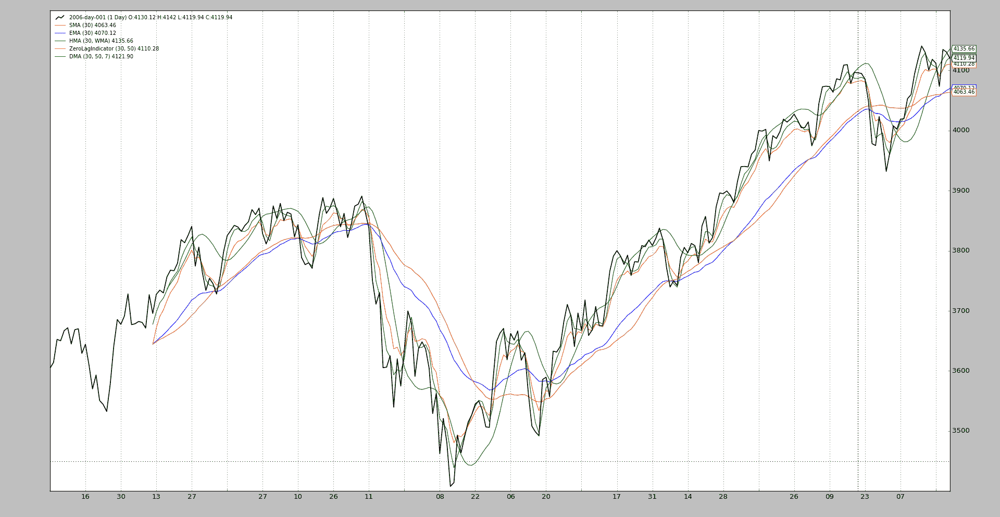
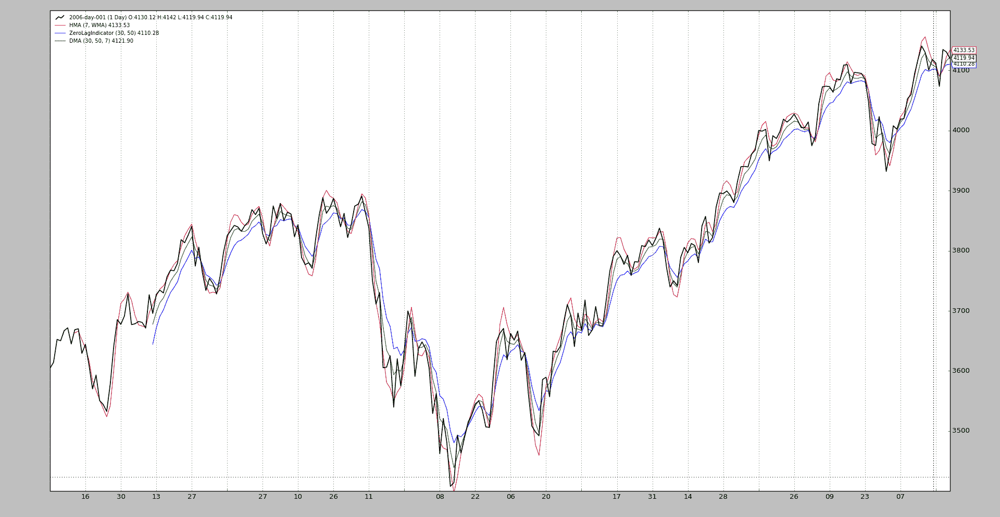

# 迪克森移动平均线

> 原文：[`www.backtrader.com/blog/posts/2016-08-18-dickson-moving-average/dickson-moving-average/`](https://www.backtrader.com/blog/posts/2016-08-18-dickson-moving-average/dickson-moving-average/)

下面的*reddit*帖子将这种平均线称为*迪克森移动平均线*，以其作者*内森·迪克森*（*reddit*用户名）的名字命名。

在定期访问[reddit Algotrading](https://www.reddit.com/r/algotrading/)时，我发现了一篇关于一种试图模拟 Jurik Moving Average（又称*JMA*）的移动平均线的帖子

+   [迪克森移动平均线](https://www.reddit.com/r/algotrading/comments/4xj3vh/dickson_moving_average/)

+   [Jurik Research 的 JMA](http://www.jurikres.com/catalog1/ms_ama.htm)

描述为*EasyLanguage*中的算法，我不得不询问种子值和`ec`的性质，最终导致了*Ehlers*和*零滞后指标*

+   [零滞后](http://www.mesasoftware.com/papers/ZeroLag.pdf)

为了将*迪克森移动平均线*实现到*backtrader*中，并且考虑到对*Ehlers*和*Hull 移动平均线*的依赖，这两者也被添加到了移动平均线的工具中。

总结一下，以下内容已添加到`Release 1.8.7.96`中：

+   `Hull 移动平均线`

+   `零滞后指标`

+   `迪克森移动平均线`

结果可以通过使用样本数据和`btrun`绘制图表来观察：

```py
$ btrun --nostdstats \
    --format btcsv \
    --data ../../../backtrader/datas/2006-day-001.txt \
    --indicator :SMA \
    --indicator :EMA \
    --indicator :HMA \
    --indicator :ZeroLagIndicator \
    --indicator :DMA \
    --plot style=\'line\'
```



现在的问题在于让*迪克森移动平均线*产生利润……就像任何其他指标一样。

注意

注意*Hull 移动平均线*（又名*HMA*）开始比其他几个值晚几个值产生。这是因为它使用了*移动平均*延迟了初始产生。

通过比较显示*DMA*如何处于*ZeroLagIndicator*和*HullMovingAverage*之间的中间位置。后者的`period=7`与*迪克森移动平均线*内部的默认值匹配：

```py
$ btrun --nostdstats \
    --format btcsv \
    --data ../../../backtrader/datas/2006-day-001.txt \
    --indicator :HMA:period=7 \
    --indicator :ZeroLagIndicator \
    --indicator :DMA \
    --plot style=\'line\'
```


