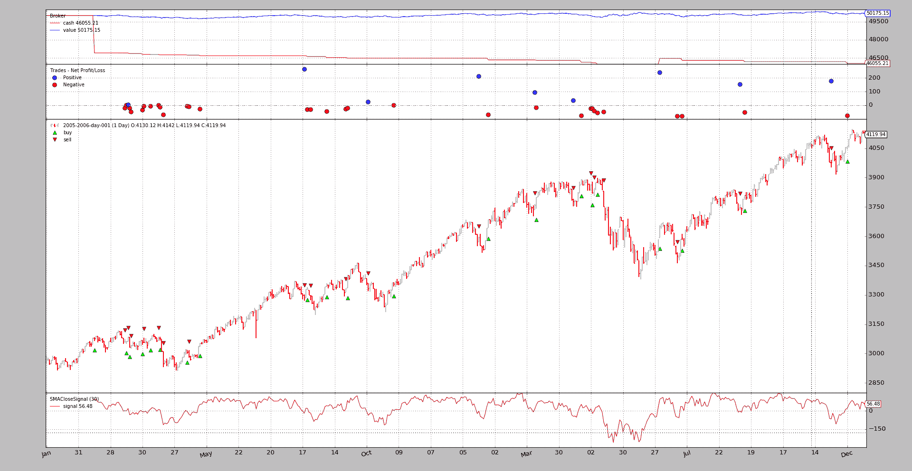
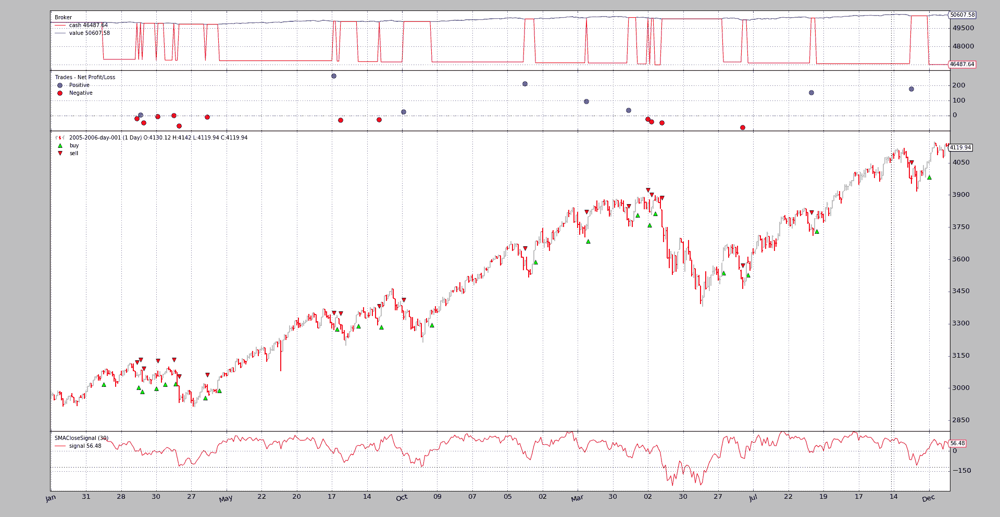
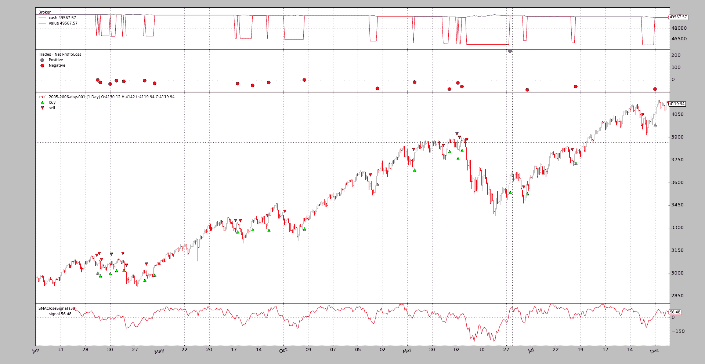
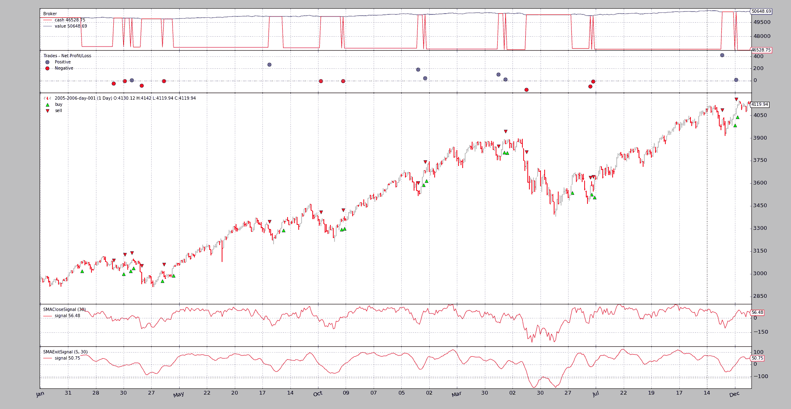

# 带有信号的策略

> 原文：[`www.backtrader.com/blog/posts/2016-08-01-signal-strategy/signal-strategy/`](https://www.backtrader.com/blog/posts/2016-08-01-signal-strategy/signal-strategy/)

也可以在不编写*策略*的情况下操作*backtrader*。尽管这是首选方式，由于构成机器的对象层次结构，使用*信号*也是可能的。

注意

从版本`1.8.0.x`起可用

快速总结：

+   不是编写一个*策略*类，实例化*指标*，编写*买入/卖出*逻辑…

+   最终用户添加*信号*（无论如何是指标），其余工作在后台完成

快速示例：

```py
import backtrader as bt

data = bt.feeds.OneOfTheFeeds(dataname='mydataname')
cerebro.adddata(data)

cerebro.add_signal(bt.SIGNAL_LONGSHORT, MySignal)
cerebro.run()
```

Et voilá!。

当然，*信号*本身是缺失的。让我们定义一个非常简单的*信号*，它产生：

+   如果`收盘`价格高于*简单移动平均线*，则为`买入`指示

+   如果`收盘`价格低于*简单移动平均线*，则为`卖出`指示

定义：

```py
class MySignal(bt.Indicator):
    lines = ('signal',)
    params = (('period', 30),)

    def __init__(self):
        self.lines.signal = self.data - bt.indicators.SMA(period=self.p.period)
```

现在真的完成了。当执行`run`时，*Cerebro*将负责实例化一个特殊的*策略*实例，该实例知道如何处理*信号*。

## 初始*常见问题*

+   *买入*/*卖出*操作的成交量如何确定？

    *cerebro*实例会自动向策略添加`FixedSize`调整器。最终用户可以通过`cerebro.addsizer`更改调整器以改变策略

+   订单如何执行？

    执行类型为`市价`，有效期为*直到取消*

## *信号*技术细节

从技术和理论角度来看可以描述为：

+   调用时返回另一个*对象*的可调用函数（仅一次）

    这在大多数情况下是一个类的实例化，但不一定是

+   支持`__getitem__`接口。唯一请求的*键*/*索引*将是`0`

从实际角度看，看上面的示例，*信号*是：

+   来自*backtrader*生态系统的*lines*对象，主要是*指标*

    当使用其他*指标*时，比如在示例中使用*简单移动平均线*时，这很有帮助。

## *信号*指示

当使用`signal[0]`查询*信号*时，会提供指示，含义是：

+   `> 0` -> `买入指示`

+   `´< 0` -> `卖出指示`

+   `´== 0` -> *无指示*

示例使用`self.data - SMA`进行简单算术运算，并且：

+   当`数据`高于`SMA`时发出`买入指示`

+   当`数据`低于`SMA`时发出`卖出指示`

注意

当未指定特定价格字段用于`数据`时，`收盘`价格是参考价格。

## *信号*类型

下面示例中指示的*常量*直接从主*backtrader*模块中获取，如：

```py
import backtrader as bt

bt.SIGNAL_LONG
```

有 5 种*信号*类型，分为 2 组。

**主要组**：

+   `LONGSHORT`：此信号的`买入`和`卖出`指示都被采纳

+   `LONG`：

    +   `买入`指示用于开多头头寸

    +   `卖出`指示用于*平仓*多头头寸。但是：

    +   如果系统中存在`LONGEXIT`（见下文）信号，将用于退出多头头寸

    +   如果有`SHORT`信号可用且没有`LONGEXIT`可用，则会用于在开空头之前关闭多头

+   `空头`：

    +   `空头`指示被用来做空

    +   `多头`指示被用来*关闭*空头头寸。但是：

    +   如果系统中存在`SHORTEXIT`信号，则将用于退出空头

    +   如果有`LONG`信号可用且没有`SHORTEXIT`可用，则会用于在开多头之前关闭空头

**退出组**：

这两个信号旨在覆盖其他信号，并提供退出`多头`/`空头`头寸的标准

+   `LONGEXIT`：`空头`指示被用来退出`多头`头寸

+   `SHORTEXIT`：`多头`指示被用来退出空头头寸

## 积累和订单并发

上面显示的*Signal*示例将不断发出*多头*和*空头*指示，因为它只是从`SMA`值中减去`close`价格，这将始终是`> 0`和`< 0`（有几次`== 0`）

这将导致持续生成*订单*，产生 2 种情况：

+   `积累`：即使已经在市场中，*信号*也会产生新订单，这将增加市场中的头寸

+   `并发`：新订单将被生成，而不必等待其他订单的执行

为了避免这种情况，默认行为是：

+   *不积累*

+   *不允许并发*

如果希望实现这两种行为中的任何一种，可以通过`cerebro`进行控制：

+   `cerebro.signal_accumulate(True)`（或`False`以重新禁用它）

+   `cerebro.signal_concurrency(True)`（或`False`以重新禁用它）

## 示例

*backtrader*源代码包含一个用于测试功能的示例。

要使用的主要信号。

```py
class SMACloseSignal(bt.Indicator):
    lines = ('signal',)
    params = (('period', 30),)

    def __init__(self):
        self.lines.signal = self.data - bt.indicators.SMA(period=self.p.period)
```

以及如果指定了选项，则*退出信号*。

```py
class SMAExitSignal(bt.Indicator):
    lines = ('signal',)
    params = (('p1', 5), ('p2', 30),)

    def __init__(self):
        sma1 = bt.indicators.SMA(period=self.p.p1)
        sma2 = bt.indicators.SMA(period=self.p.p2)
        self.lines.signal = sma1 - sma2
```

### 第一次运行：多头和空头

```py
$ ./signals-strategy.py --plot --signal longshort
```

输出



注意：

+   *Signal*被绘制。这是正常的，因为它只是一个指标，适用于它的绘图规则

+   策略实际上是`多头`和`空头`。这可以看出，因为*现金*水平从未回到*价值*水平

+   旁注：即使是一个愚蠢的想法…（并且没有佣金），策略也没有亏钱…

### 第二次运行：仅多头

```py
$ ./signals-strategy.py --plot --signal longonly
```

输出



注意：

+   这里每次*卖出*后现金水平都会回到*价值*水平，这意味着策略已经退出市场

+   旁注：再次没有损失金钱…

### 第三次运行：仅空头

```py
$ ./signals-strategy.py --plot --signal shortonly
```

输出



注意：

+   第 1 次操作是一个*卖出*，如预期的那样，比前面 2 个示例中的第 1 次操作晚发生。直到`close`低于`SMA`且简单的减法产生负数时才会发生

+   这里每次*买入*后现金水平都会回到*价值*水平，这意味着策略已经退出市场

+   旁注：最终系统会亏钱

### 第四次运行：多头 + 多头退出

```py
$ ./signals-strategy.py --plot --signal longonly --exitsignal longexit
```

输出



注意：

+   许多交易都是相同的，但有些会提前中断，因为快速移动平均线在*退出*信号中向下穿越慢速移动平均线。

+   系统展现了其*longonly*属性，现金在每笔交易结束时成为价值。

+   旁注：再次提到金钱……即使进行了一些修改的交易

### 用法

```py
$ ./signals-strategy.py --help
usage: signals-strategy.py [-h] [--data DATA] [--fromdate FROMDATE]
                           [--todate TODATE] [--cash CASH]
                           [--smaperiod SMAPERIOD] [--exitperiod EXITPERIOD]
                           [--signal {longshort,longonly,shortonly}]
                           [--exitsignal {longexit,shortexit}]
                           [--plot [kwargs]]

Sample for Signal concepts

optional arguments:
  -h, --help            show this help message and exit
  --data DATA           Specific data to be read in (default:
                        ../../datas/2005-2006-day-001.txt)
  --fromdate FROMDATE   Starting date in YYYY-MM-DD format (default: None)
  --todate TODATE       Ending date in YYYY-MM-DD format (default: None)
  --cash CASH           Cash to start with (default: 50000)
  --smaperiod SMAPERIOD
                        Period for the moving average (default: 30)
  --exitperiod EXITPERIOD
                        Period for the exit control SMA (default: 5)
  --signal {longshort,longonly,shortonly}
                        Signal type to use for the main signal (default:
                        longshort)
  --exitsignal {longexit,shortexit}
                        Signal type to use for the exit signal (default: None)
  --plot [kwargs], -p [kwargs]
                        Plot the read data applying any kwargs passed For
                        example: --plot style="candle" (to plot candles)
                        (default: None)
```

### 代码

```py
from __future__ import (absolute_import, division, print_function,
                        unicode_literals)

import argparse
import collections
import datetime

import backtrader as bt

MAINSIGNALS = collections.OrderedDict(
    (('longshort', bt.SIGNAL_LONGSHORT),
     ('longonly', bt.SIGNAL_LONG),
     ('shortonly', bt.SIGNAL_SHORT),)
)

EXITSIGNALS = {
    'longexit': bt.SIGNAL_LONGEXIT,
    'shortexit': bt.SIGNAL_LONGEXIT,
}

class SMACloseSignal(bt.Indicator):
    lines = ('signal',)
    params = (('period', 30),)

    def __init__(self):
        self.lines.signal = self.data - bt.indicators.SMA(period=self.p.period)

class SMAExitSignal(bt.Indicator):
    lines = ('signal',)
    params = (('p1', 5), ('p2', 30),)

    def __init__(self):
        sma1 = bt.indicators.SMA(period=self.p.p1)
        sma2 = bt.indicators.SMA(period=self.p.p2)
        self.lines.signal = sma1 - sma2

def runstrat(args=None):
    args = parse_args(args)

    cerebro = bt.Cerebro()
    cerebro.broker.set_cash(args.cash)

    dkwargs = dict()
    if args.fromdate is not None:
        fromdate = datetime.datetime.strptime(args.fromdate, '%Y-%m-%d')
        dkwargs['fromdate'] = fromdate

    if args.todate is not None:
        todate = datetime.datetime.strptime(args.todate, '%Y-%m-%d')
        dkwargs['todate'] = todate

    # if dataset is None, args.data has been given
    data = bt.feeds.BacktraderCSVData(dataname=args.data, **dkwargs)
    cerebro.adddata(data)

    cerebro.add_signal(MAINSIGNALS[args.signal],
                       SMACloseSignal, period=args.smaperiod)

    if args.exitsignal is not None:
        cerebro.add_signal(EXITSIGNALS[args.exitsignal],
                           SMAExitSignal,
                           p1=args.exitperiod,
                           p2=args.smaperiod)

    cerebro.run()
    if args.plot:
        pkwargs = dict(style='bar')
        if args.plot is not True:  # evals to True but is not True
            npkwargs = eval('dict(' + args.plot + ')')  # args were passed
            pkwargs.update(npkwargs)

        cerebro.plot(**pkwargs)

def parse_args(pargs=None):

    parser = argparse.ArgumentParser(
        formatter_class=argparse.ArgumentDefaultsHelpFormatter,
        description='Sample for Signal concepts')

    parser.add_argument('--data', required=False,
                        default='../../datas/2005-2006-day-001.txt',
                        help='Specific data to be read in')

    parser.add_argument('--fromdate', required=False, default=None,
                        help='Starting date in YYYY-MM-DD format')

    parser.add_argument('--todate', required=False, default=None,
                        help='Ending date in YYYY-MM-DD format')

    parser.add_argument('--cash', required=False, action='store',
                        type=float, default=50000,
                        help=('Cash to start with'))

    parser.add_argument('--smaperiod', required=False, action='store',
                        type=int, default=30,
                        help=('Period for the moving average'))

    parser.add_argument('--exitperiod', required=False, action='store',
                        type=int, default=5,
                        help=('Period for the exit control SMA'))

    parser.add_argument('--signal', required=False, action='store',
                        default=MAINSIGNALS.keys()[0], choices=MAINSIGNALS,
                        help=('Signal type to use for the main signal'))

    parser.add_argument('--exitsignal', required=False, action='store',
                        default=None, choices=EXITSIGNALS,
                        help=('Signal type to use for the exit signal'))

    # Plot options
    parser.add_argument('--plot', '-p', nargs='?', required=False,
                        metavar='kwargs', const=True,
                        help=('Plot the read data applying any kwargs passed\n'
                              '\n'
                              'For example:\n'
                              '\n'
                              '  --plot style="candle" (to plot candles)\n'))

    if pargs is not None:
        return parser.parse_args(pargs)

    return parser.parse_args()

if __name__ == '__main__':
    runstrat()
```
