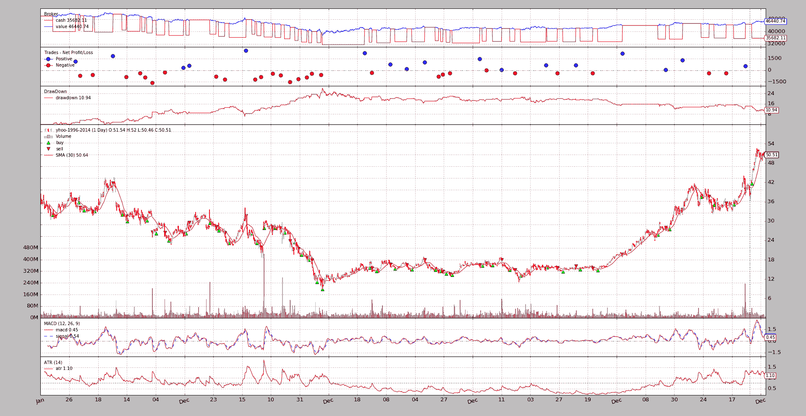
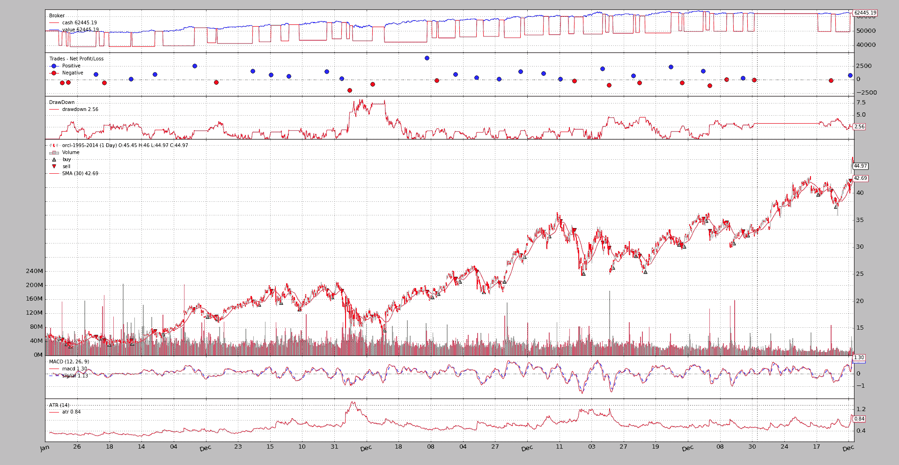
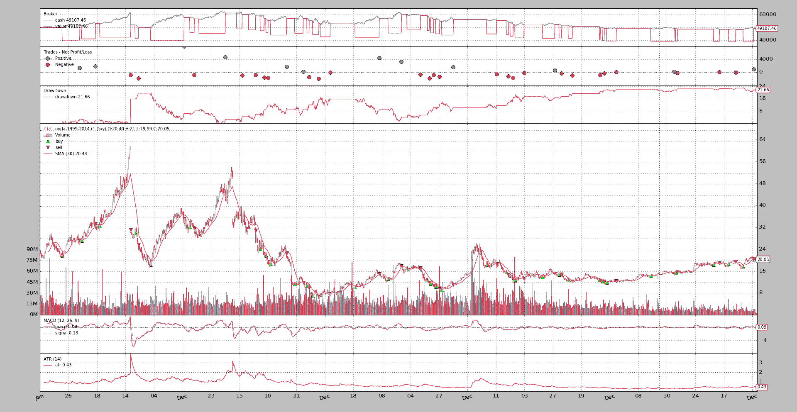
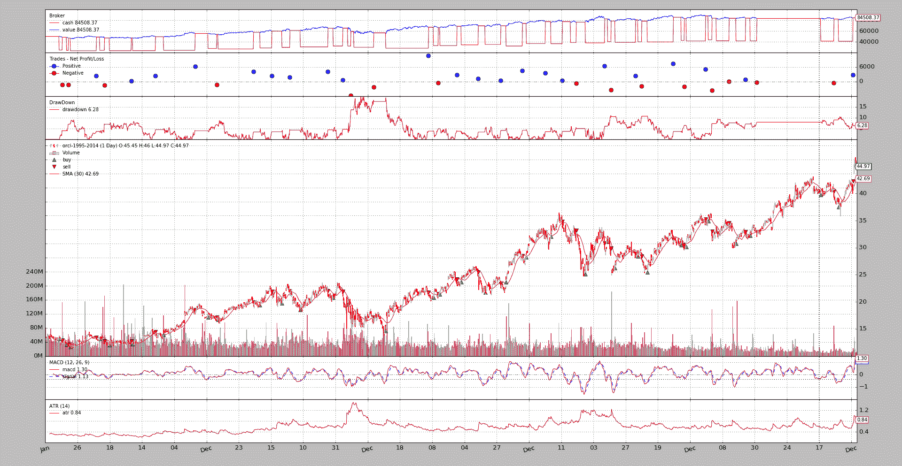
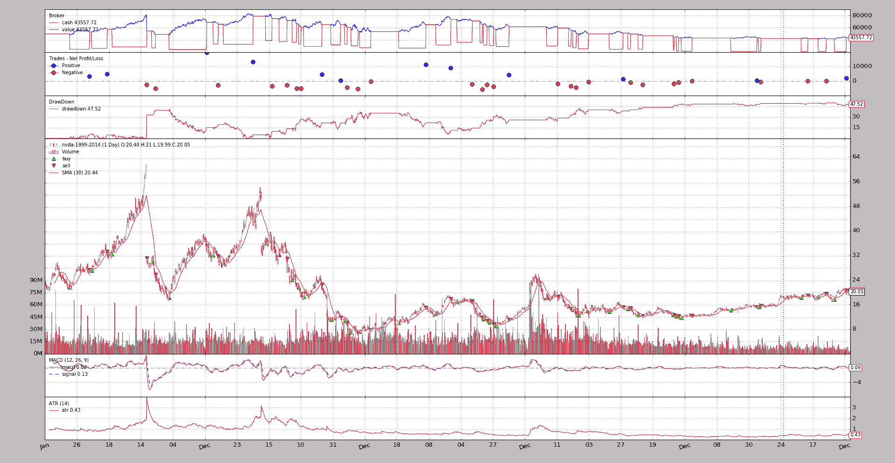
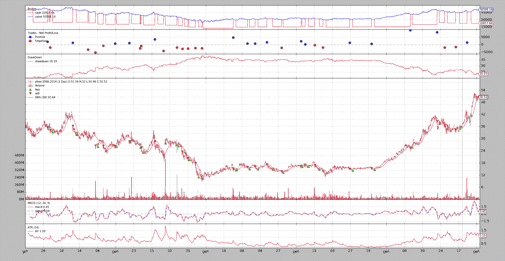
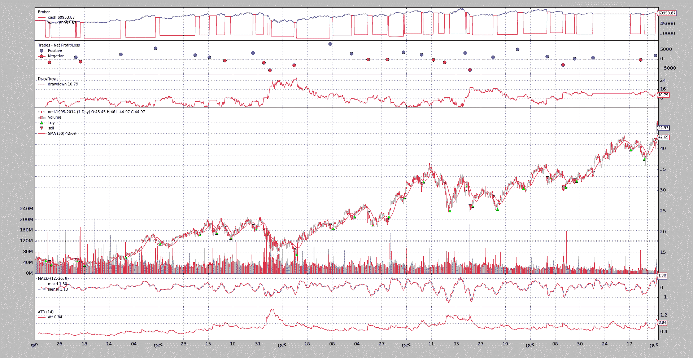
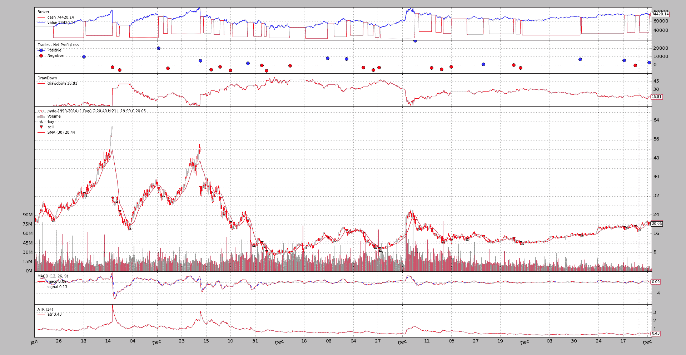

# MACD 设置

> 原文：[`www.backtrader.com/blog/posts/2016-07-30-macd-settings/macd-settings/`](https://www.backtrader.com/blog/posts/2016-07-30-macd-settings/macd-settings/)

在*Reddit*的*Algotrading*网站上发现了一个关于优化 MACD 设置的帖子。

+   [如何确定最佳 MACD 设置？](https://www.reddit.com/r/algotrading/comments/4s832w/how_to_determine_best_macd_settings/)

由于[《走向财务自由的交易》- 亚马逊链接](https://www.amazon.com/Trade-Your-Way-Financial-Freedom/dp/007147871X)，我开始了*backtrader*的探索，我别无选择，只能发布答案并制作一个示例。

该策略的方法在某种程度上基于该书中提出的一些观点。没有新鲜事。参数已经快速设置。没有过度拟合，没有优化，什么都没有。大致：

+   如果`macd`线向上穿过`signal`线，并且控制`Simple Moving Average`在最后的 x 个周期内具有净负方向（当前*SMA*值低于 x 个周期前的值），则进入市场

+   设置`stop`价格，即比`close`价格远`N x ATR`倍

+   如果`close`价格低于`stop`价格，则退出市场

+   如果仍然在市场上，则仅在`stop`价格高于实际价格时更新

下注由以下方式完成：

+   通过`Sizer`分配可用现金的*百分比*给操作。策略赢得越多，押注就越大... 而策略输得越多，押注就越小。

包含了*佣金*。因为测试将使用*股票*进行，所以选择了百分比佣金，其值为`0.0033`（即每往返交易的`0.33%`）。

为了付诸实施，将进行 3 次运行，每次运行 3 个数据（共 9 次运行）

1.  手动选择的标准参数

1.  将现金分配百分比从`0.20`增加到`0.50`

1.  将 ATR 距离从`3.0`增加到`4.0`，以尝试避免被鞭打

为策略手动选择的参数：

```py
`params = (
    # Standard MACD Parameters
    ('macd1', 12),
    ('macd2', 26),
    ('macdsig', 9),
    ('atrperiod', 14),  # ATR Period (standard)
    ('atrdist', 3.0),   # ATR distance for stop price
    ('smaperiod', 30),  # SMA Period (pretty standard)
    ('dirperiod', 10),  # Lookback period to consider SMA trend direction
)` 
```

并且系统范围内：

```py
`parser.add_argument('--cash', required=False, action='store',
                    type=float, default=50000,
                    help=('Cash to start with'))

parser.add_argument('--cashalloc', required=False, action='store',
                    type=float, default=0.20,
                    help=('Perc (abs) of cash to allocate for ops'))

parser.add_argument('--commperc', required=False, action='store',
                    type=float, default=0.0033,
                    help=('Perc (abs) commision in each operation. '
                          '0.001 -> 0.1%%, 0.01 -> 1%%'))` 
```

日期范围将从`2005-01-01`到`2014-12-31`，共 10 年。

## 分析器

为了获得一些*客观*数据，将向系统添加 3 个分析器：

+   两个用于整个时期的`TimeReturn`

    1.  对于策略本身

    1.  用作基准操作的数据

    将策略与资产进行有效的基准比较

+   一个用于测量*年度回报率*的`TimeReturn`

+   一个`SharpeRatio`用于查看策略相对于无风险资产的表现如何

    该值设置为`1%`，可通过示例选项更改

+   一个用于分析交易质量的`SQN`（*系统质量数*），使用 Van K. Tharp 定义的性能指标

此外，将添加一个`DrawDown`观察器到混合中。

## Run 1：标准参数

### YHOO

```py
`$ ./macdsystem.py --plot --dataset yhoo
===============================================================================
TimeReturn:
  - 9999-12-31 23:59:59.999999: -0.07118518868
===============================================================================
TimeReturn:
  - 9999-12-31 23:59:59.999999: 0.316736183525
===============================================================================
TimeReturn:
  - 2005-12-31: 0.02323119024
  - 2006-12-31: -0.0813678018166
  - 2007-12-31: -0.0144802141955
  - 2008-12-31: -0.142301023804
  - 2009-12-31: 0.0612152927491
  - 2010-12-31: 0.00898269987778
  - 2011-12-31: -0.00845048588578
  - 2012-12-31: 0.0541362123146
  - 2013-12-31: 0.0158705967774
  - 2014-12-31: 0.0281978956007
===============================================================================
SharpeRatio:
  - sharperatio: -0.261214264357
===============================================================================
SQN:
  - sqn: -0.784558216044
  - trades: 45` 
```



### ORCL

```py
`$ ./macdsystem.py --plot --dataset orcl
===============================================================================
TimeReturn:
  - 9999-12-31 23:59:59.999999: 0.24890384718
===============================================================================
TimeReturn:
  - 9999-12-31 23:59:59.999999: 2.23991354467
===============================================================================
TimeReturn:
  - 2005-12-31: -0.02372911952
  - 2006-12-31: 0.0692563226579
  - 2007-12-31: 0.0551086853554
  - 2008-12-31: -0.026707886256
  - 2009-12-31: 0.0786118091383
  - 2010-12-31: 0.037571919146
  - 2011-12-31: 0.00846519206845
  - 2012-12-31: 0.0402937469005
  - 2013-12-31: -0.0147124502187
  - 2014-12-31: 0.00710131291379
===============================================================================
SharpeRatio:
  - sharperatio: 0.359712552054
===============================================================================
SQN:
  - sqn: 1.76240859868
  - trades: 37` 
```



### NVDA

```py
`$ ./macdsystem.py --plot --dataset nvda
===============================================================================
TimeReturn:
  - 9999-12-31 23:59:59.999999: -0.0178507058999
===============================================================================
TimeReturn:
  - 9999-12-31 23:59:59.999999: -0.177604931253
===============================================================================
TimeReturn:
  - 2005-12-31: 0.0773031957141
  - 2006-12-31: 0.105007457325
  - 2007-12-31: 0.015286423657
  - 2008-12-31: -0.109130552525
  - 2009-12-31: 0.14716076542
  - 2010-12-31: -0.0891638005423
  - 2011-12-31: -0.0788216550171
  - 2012-12-31: -0.0498231953066
  - 2013-12-31: -0.0119166712361
  - 2014-12-31: 0.00940493597076
===============================================================================
SharpeRatio:
  - sharperatio: -0.102967601564
===============================================================================
SQN:
  - sqn: -0.0700412395071
  - trades: 38` 
```



### Run 1 的分析

+   *YHOO*

    第 1^(st)和第 2^(nd)个`TimeReturn`分析器（策略和资产本身）表明，策略损失了`7.11%`，而所涉及的资产则升值了`31.67%`。

    甚至都不值得去看其他的分析器

+   *ORCL*

    策略为 `24.89%`，但被资产本身的 `223.99%` 回报所淡化。

    *SharpeRatio* 为 `0.35`，仍然远离通常的最低目标`1`。

    *SQN* 返回了 `1.76`，至少在 *Van K. Tharp* 尺度上获得了评分：`1.6 - 1.9 低于平均水平`。

+   *NVDA*

    在这种情况下，策略为 `-1.78%`，资产为 `-17.76%`。 SharpeRatio 为 `-0.10`，表明即使策略表现优于资产，选择 `1%` 的银行账户也更好。

    *SQN* 显然甚至没有达到尺度的底部。

### 第 1 次运行的结论

+   *1 次巨大的损失，一次平局和一次表现不佳的胜利*。并不成功。

## 第 2 次运行：现金分配为 0.50

### YHOO

```py
`$ ./macdsystem.py --plot --dataset yhoo --cashalloc 0.50
===============================================================================
TimeReturn:
  - 9999-12-31 23:59:59.999999: -0.20560369198
===============================================================================
TimeReturn:
  - 9999-12-31 23:59:59.999999: 0.316736183525
===============================================================================
TimeReturn:
  - 2005-12-31: 0.05517338686
  - 2006-12-31: -0.195123836162
  - 2007-12-31: -0.0441556438731
  - 2008-12-31: -0.32426212721
  - 2009-12-31: 0.153876836394
  - 2010-12-31: 0.0167157437151
  - 2011-12-31: -0.0202891373759
  - 2012-12-31: 0.13289763017
  - 2013-12-31: 0.0408192946307
  - 2014-12-31: 0.0685527133815
===============================================================================
SharpeRatio:
  - sharperatio: -0.154427699146
===============================================================================
SQN:
  - sqn: -0.97846453428
  - trades: 45` 
```


### ORCL

```py
`$ ./macdsystem.py --plot --dataset orcl --cashalloc 0.50
===============================================================================
TimeReturn:
  - 9999-12-31 23:59:59.999999: 0.69016747856
===============================================================================
TimeReturn:
  - 9999-12-31 23:59:59.999999: 2.23991354467
===============================================================================
TimeReturn:
  - 2005-12-31: -0.0597533502
  - 2006-12-31: 0.176988400688
  - 2007-12-31: 0.140268851352
  - 2008-12-31: -0.0685193675128
  - 2009-12-31: 0.195760054561
  - 2010-12-31: 0.0956386594392
  - 2011-12-31: 0.018709882089
  - 2012-12-31: 0.100122407053
  - 2013-12-31: -0.0375741196261
  - 2014-12-31: 0.017570390931
===============================================================================
SharpeRatio:
  - sharperatio: 0.518921692742
===============================================================================
SQN:
  - sqn: 1.68844251174
  - trades: 37` 
```



### NVDA

```py
`$ ./macdsystem.py --plot --dataset nvda --cashalloc 0.50
===============================================================================
TimeReturn:
  - 9999-12-31 23:59:59.999999: -0.128845648113
===============================================================================
TimeReturn:
  - 9999-12-31 23:59:59.999999: -0.177604931253
===============================================================================
TimeReturn:
  - 2005-12-31: 0.200593209479
  - 2006-12-31: 0.219254906522
  - 2007-12-31: 0.0407793562989
  - 2008-12-31: -0.259567975403
  - 2009-12-31: 0.380971100974
  - 2010-12-31: -0.208860409742
  - 2011-12-31: -0.189068154062
  - 2012-12-31: -0.122095056225
  - 2013-12-31: -0.0296495770432
  - 2014-12-31: 0.0232050942344
===============================================================================
SharpeRatio:
  - sharperatio: -0.0222780544339
===============================================================================
SQN:
  - sqn: -0.190661428812
  - trades: 38` 
```



### 第 2 次运行的结论

+   将每次操作中现金分配的百分比从 `20%` 增加到 `50%`，已增加了先前结果的影响

    +   在 *YHOO* 和 *NVDA* 上的策略比以前损失更多

    +   而在 *ORCL* 上的策略赢得了比以前更多，但仍然不接近资产的超过 *220%*。

## 第 3 次运行：ATR 距离为 4.0

仍然保持先前将现金分配增加到 `50%`。 这个想法是避免过早离开市场。

### YHOO

```py
`$ ./macdsystem.py --plot --dataset yhoo --cashalloc 0.50 --atrdist 4.0
===============================================================================
TimeReturn:
  - 9999-12-31 23:59:59.999999: 0.01196310622
===============================================================================
TimeReturn:
  - 9999-12-31 23:59:59.999999: 0.316736183525
===============================================================================
TimeReturn:
  - 2005-12-31: 0.06476232676
  - 2006-12-31: -0.220219327475
  - 2007-12-31: -0.0525484648039
  - 2008-12-31: -0.314772526784
  - 2009-12-31: 0.179631995594
  - 2010-12-31: 0.0579495723922
  - 2011-12-31: -0.0248948026947
  - 2012-12-31: 0.10922621981
  - 2013-12-31: 0.406711050602
  - 2014-12-31: -0.0113108751022
===============================================================================
SharpeRatio:
  - sharperatio: 0.0495181271704
===============================================================================
SQN:
  - sqn: -0.211652416441
  - trades: 33` 
```



### ORCL

```py
`$ ./macdsystem.py --plot --dataset orcl --cashalloc 0.50 --atrdist 4.0
===============================================================================
TimeReturn:
  - 9999-12-31 23:59:59.999999: 0.21907748452
===============================================================================
TimeReturn:
  - 9999-12-31 23:59:59.999999: 2.23991354467
===============================================================================
TimeReturn:
  - 2005-12-31: -0.06660102614
  - 2006-12-31: 0.169334910265
  - 2007-12-31: 0.10620478758
  - 2008-12-31: -0.167615289704
  - 2009-12-31: 0.17616784045
  - 2010-12-31: 0.0591200431984
  - 2011-12-31: -0.100238247103
  - 2012-12-31: 0.135096589522
  - 2013-12-31: -0.0630483842399
  - 2014-12-31: 0.0175914485158
===============================================================================
SharpeRatio:
  - sharperatio: 0.144210776122
===============================================================================
SQN:
  - sqn: 0.646519270815
  - trades: 30` 
```



### NVDA

```py
`$ ./macdsystem.py --plot --dataset nvda --cashalloc 0.50 --atrdist 4.0
===============================================================================
TimeReturn:
  - 9999-12-31 23:59:59.999999: 0.48840287049
===============================================================================
TimeReturn:
  - 9999-12-31 23:59:59.999999: -0.177604931253
===============================================================================
TimeReturn:
  - 2005-12-31: 0.246510998277
  - 2006-12-31: 0.194958106054
  - 2007-12-31: -0.123140650516
  - 2008-12-31: -0.246174938322
  - 2009-12-31: 0.33121185861
  - 2010-12-31: -0.0442212647256
  - 2011-12-31: 0.0368388717861
  - 2012-12-31: -0.048473112136
  - 2013-12-31: 0.10657587649
  - 2014-12-31: 0.0883112536534
===============================================================================
SharpeRatio:
  - sharperatio: 0.264551262551
===============================================================================
SQN:
  - sqn: 0.564151633588
  - trades: 29` 
```



### 第 3 次运行的结论

+   **鸡，鸡，赢家的晚餐！！**

    该策略在这 3 个资产上赚了钱

    +   *YHOO*：`1.19%` 对比资产本身的`31.67%` 回报

    +   *ORCL*：`21.90%` 对比资产的`223.99%`

    在这种情况下，增加`ATRDist`参数已经降低了 *第 2 次运行* 的先前收益，即 `69.01%`

    +   *NVDA*：`48.84%` 对比资产的`-17.76%`。

    这里令人惊讶的是 *SharpeRatio* 和 *SQN* 表明

## 样本的使用

```py
`$ ./macdsystem.py --help
usage: macdsystem.py [-h] (--data DATA | --dataset {yhoo,orcl,nvda})
                     [--fromdate FROMDATE] [--todate TODATE] [--cash CASH]
                     [--cashalloc CASHALLOC] [--commperc COMMPERC]
                     [--macd1 MACD1] [--macd2 MACD2] [--macdsig MACDSIG]
                     [--atrperiod ATRPERIOD] [--atrdist ATRDIST]
                     [--smaperiod SMAPERIOD] [--dirperiod DIRPERIOD]
                     [--riskfreerate RISKFREERATE] [--plot [kwargs]]

Sample for Tharp example with MACD

optional arguments:
  -h, --help            show this help message and exit
  --data DATA           Specific data to be read in (default: None)
  --dataset {yhoo,orcl,nvda}
                        Choose one of the predefined data sets (default: None)
  --fromdate FROMDATE   Starting date in YYYY-MM-DD format (default:
                        2005-01-01)
  --todate TODATE       Ending date in YYYY-MM-DD format (default: None)
  --cash CASH           Cash to start with (default: 50000)
  --cashalloc CASHALLOC
                        Perc (abs) of cash to allocate for ops (default: 0.2)
  --commperc COMMPERC   Perc (abs) commision in each operation. 0.001 -> 0.1%,
                        0.01 -> 1% (default: 0.0033)
  --macd1 MACD1         MACD Period 1 value (default: 12)
  --macd2 MACD2         MACD Period 2 value (default: 26)
  --macdsig MACDSIG     MACD Signal Period value (default: 9)
  --atrperiod ATRPERIOD
                        ATR Period To Consider (default: 14)
  --atrdist ATRDIST     ATR Factor for stop price calculation (default: 3.0)
  --smaperiod SMAPERIOD
                        Period for the moving average (default: 30)
  --dirperiod DIRPERIOD
                        Period for SMA direction calculation (default: 10)
  --riskfreerate RISKFREERATE
                        Risk free rate in Perc (abs) of the asset for the
                        Sharpe Ratio (default: 0.01)
  --plot [kwargs], -p [kwargs]
                        Plot the read data applying any kwargs passed For
                        example: --plot style="candle" (to plot candles)
                        (default: None)` 
```

## 还有代码本身

```py
`from __future__ import (absolute_import, division, print_function,
                        unicode_literals)

import argparse
import datetime
import random

import backtrader as bt

BTVERSION = tuple(int(x) for x in bt.__version__.split('.'))

class FixedPerc(bt.Sizer):
    '''This sizer simply returns a fixed size for any operation

    Params:
      - ``perc`` (default: ``0.20``) Perc of cash to allocate for operation
    '''

    params = (
        ('perc', 0.20),  # perc of cash to use for operation
    )

    def _getsizing(self, comminfo, cash, data, isbuy):
        cashtouse = self.p.perc * cash
        if BTVERSION > (1, 7, 1, 93):
            size = comminfo.getsize(data.close[0], cashtouse)
        else:
            size = cashtouse // data.close[0]
        return size

class TheStrategy(bt.Strategy):
    '''
    This strategy is loosely based on some of the examples from the Van
    K. Tharp book: *Trade Your Way To Financial Freedom*. The logic:

      - Enter the market if:
        - The MACD.macd line crosses the MACD.signal line to the upside
        - The Simple Moving Average has a negative direction in the last x
          periods (actual value below value x periods ago)

     - Set a stop price x times the ATR value away from the close

     - If in the market:

       - Check if the current close has gone below the stop price. If yes,
         exit.
       - If not, update the stop price if the new stop price would be higher
         than the current
    '''

    params = (
        # Standard MACD Parameters
        ('macd1', 12),
        ('macd2', 26),
        ('macdsig', 9),
        ('atrperiod', 14),  # ATR Period (standard)
        ('atrdist', 3.0),   # ATR distance for stop price
        ('smaperiod', 30),  # SMA Period (pretty standard)
        ('dirperiod', 10),  # Lookback period to consider SMA trend direction
    )

    def notify_order(self, order):
        if order.status == order.Completed:
            pass

        if not order.alive():
            self.order = None  # indicate no order is pending

    def __init__(self):
        self.macd = bt.indicators.MACD(self.data,
                                       period_me1=self.p.macd1,
                                       period_me2=self.p.macd2,
                                       period_signal=self.p.macdsig)

        # Cross of macd.macd and macd.signal
        self.mcross = bt.indicators.CrossOver(self.macd.macd, self.macd.signal)

        # To set the stop price
        self.atr = bt.indicators.ATR(self.data, period=self.p.atrperiod)

        # Control market trend
        self.sma = bt.indicators.SMA(self.data, period=self.p.smaperiod)
        self.smadir = self.sma - self.sma(-self.p.dirperiod)

    def start(self):
        self.order = None  # sentinel to avoid operrations on pending order

    def next(self):
        if self.order:
            return  # pending order execution

        if not self.position:  # not in the market
            if self.mcross[0] > 0.0 and self.smadir < 0.0:
                self.order = self.buy()
                pdist = self.atr[0] * self.p.atrdist
                self.pstop = self.data.close[0] - pdist

        else:  # in the market
            pclose = self.data.close[0]
            pstop = self.pstop

            if pclose < pstop:
                self.close()  # stop met - get out
            else:
                pdist = self.atr[0] * self.p.atrdist
                # Update only if greater than
                self.pstop = max(pstop, pclose - pdist)

DATASETS = {
    'yhoo': '../../datas/yhoo-1996-2014.txt',
    'orcl': '../../datas/orcl-1995-2014.txt',
    'nvda': '../../datas/nvda-1999-2014.txt',
}

def runstrat(args=None):
    args = parse_args(args)

    cerebro = bt.Cerebro()
    cerebro.broker.set_cash(args.cash)
    comminfo = bt.commissions.CommInfo_Stocks_Perc(commission=args.commperc,
                                                   percabs=True)

    cerebro.broker.addcommissioninfo(comminfo)

    dkwargs = dict()
    if args.fromdate is not None:
        fromdate = datetime.datetime.strptime(args.fromdate, '%Y-%m-%d')
        dkwargs['fromdate'] = fromdate

    if args.todate is not None:
        todate = datetime.datetime.strptime(args.todate, '%Y-%m-%d')
        dkwargs['todate'] = todate

    # if dataset is None, args.data has been given
    dataname = DATASETS.get(args.dataset, args.data)
    data0 = bt.feeds.YahooFinanceCSVData(dataname=dataname, **dkwargs)
    cerebro.adddata(data0)

    cerebro.addstrategy(TheStrategy,
                        macd1=args.macd1, macd2=args.macd2,
                        macdsig=args.macdsig,
                        atrperiod=args.atrperiod,
                        atrdist=args.atrdist,
                        smaperiod=args.smaperiod,
                        dirperiod=args.dirperiod)

    cerebro.addsizer(FixedPerc, perc=args.cashalloc)

    # Add TimeReturn Analyzers for self and the benchmark data
    cerebro.addanalyzer(bt.analyzers.TimeReturn, _name='alltime_roi',
                        timeframe=bt.TimeFrame.NoTimeFrame)

    cerebro.addanalyzer(bt.analyzers.TimeReturn, data=data0, _name='benchmark',
                        timeframe=bt.TimeFrame.NoTimeFrame)

    # Add TimeReturn Analyzers fot the annuyl returns
    cerebro.addanalyzer(bt.analyzers.TimeReturn, timeframe=bt.TimeFrame.Years)
    # Add a SharpeRatio
    cerebro.addanalyzer(bt.analyzers.SharpeRatio, timeframe=bt.TimeFrame.Years,
                        riskfreerate=args.riskfreerate)

    # Add SQN to qualify the trades
    cerebro.addanalyzer(bt.analyzers.SQN)
    cerebro.addobserver(bt.observers.DrawDown)  # visualize the drawdown evol

    results = cerebro.run()
    st0 = results[0]

    for alyzer in st0.analyzers:
        alyzer.print()

    if args.plot:
        pkwargs = dict(style='bar')
        if args.plot is not True:  # evals to True but is not True
            npkwargs = eval('dict(' + args.plot + ')')  # args were passed
            pkwargs.update(npkwargs)

        cerebro.plot(**pkwargs)

def parse_args(pargs=None):

    parser = argparse.ArgumentParser(
        formatter_class=argparse.ArgumentDefaultsHelpFormatter,
        description='Sample for Tharp example with MACD')

    group1 = parser.add_mutually_exclusive_group(required=True)
    group1.add_argument('--data', required=False, default=None,
                        help='Specific data to be read in')

    group1.add_argument('--dataset', required=False, action='store',
                        default=None, choices=DATASETS.keys(),
                        help='Choose one of the predefined data sets')

    parser.add_argument('--fromdate', required=False,
                        default='2005-01-01',
                        help='Starting date in YYYY-MM-DD format')

    parser.add_argument('--todate', required=False,
                        default=None,
                        help='Ending date in YYYY-MM-DD format')

    parser.add_argument('--cash', required=False, action='store',
                        type=float, default=50000,
                        help=('Cash to start with'))

    parser.add_argument('--cashalloc', required=False, action='store',
                        type=float, default=0.20,
                        help=('Perc (abs) of cash to allocate for ops'))

    parser.add_argument('--commperc', required=False, action='store',
                        type=float, default=0.0033,
                        help=('Perc (abs) commision in each operation. '
                              '0.001 -> 0.1%%, 0.01 -> 1%%'))

    parser.add_argument('--macd1', required=False, action='store',
                        type=int, default=12,
                        help=('MACD Period 1 value'))

    parser.add_argument('--macd2', required=False, action='store',
                        type=int, default=26,
                        help=('MACD Period 2 value'))

    parser.add_argument('--macdsig', required=False, action='store',
                        type=int, default=9,
                        help=('MACD Signal Period value'))

    parser.add_argument('--atrperiod', required=False, action='store',
                        type=int, default=14,
                        help=('ATR Period To Consider'))

    parser.add_argument('--atrdist', required=False, action='store',
                        type=float, default=3.0,
                        help=('ATR Factor for stop price calculation'))

    parser.add_argument('--smaperiod', required=False, action='store',
                        type=int, default=30,
                        help=('Period for the moving average'))

    parser.add_argument('--dirperiod', required=False, action='store',
                        type=int, default=10,
                        help=('Period for SMA direction calculation'))

    parser.add_argument('--riskfreerate', required=False, action='store',
                        type=float, default=0.01,
                        help=('Risk free rate in Perc (abs) of the asset for '
                              'the Sharpe Ratio'))
    # Plot options
    parser.add_argument('--plot', '-p', nargs='?', required=False,
                        metavar='kwargs', const=True,
                        help=('Plot the read data applying any kwargs passed\n'
                              '\n'
                              'For example:\n'
                              '\n'
                              '  --plot style="candle" (to plot candles)\n'))

    if pargs is not None:
        return parser.parse_args(pargs)

    return parser.parse_args()

if __name__ == '__main__':
    runstrat()` 
```
