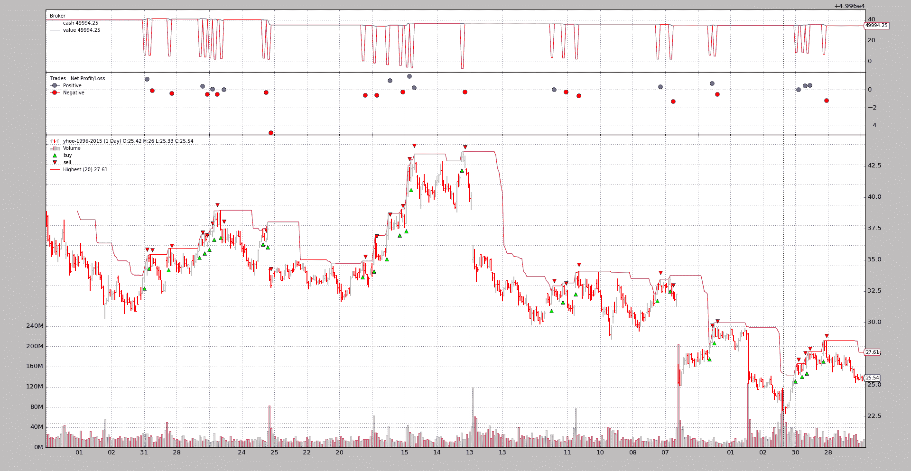

# Pinkfish 挑战

> 原文：[`www.backtrader.com/blog/posts/2016-07-29-pinkfish-challenge/pinkfish-challenge/`](https://www.backtrader.com/blog/posts/2016-07-29-pinkfish-challenge/pinkfish-challenge/)

（样本和更改添加到版本 1.7.1.93）

在发展过程中，*backtrader* 已经变得更加成熟，新增了功能，当然也变得更加复杂。许多新功能是在用户的请求、评论和问题之后引入的。一些小挑战证明了大多数设计决策至少不是那么错误，即使有些事情可能有很多其他方式来完成，有时可能更好。

因此，似乎这些小挑战是为了测试平台对新的未计划和意外情况的灵活性和适应性，*pinkfish*挑战是另一个例子。*pinkfish*是另一个 Python 回测框架（在`README`中列出），可以在以下网址找到：[pinkfish](http://fja05680.github.io/pinkfish/)。该网站包含了需要解决的挑战：

+   *‘买入收盘价’在‘新的 20 日高点设定’的当天是不允许的*

其中一个*特点*提供了平台如何为这样的壮举运作的提示：

+   *使用每日数据（而不是分钟或 tick 数据）进行日内交易*

作者对当时现有的回测库的复杂性感到*厌烦*。当时的情况是否适用于*backtrader*（当时还处于初期阶段）是由*pinkfish*的作者自己回答的问题。

## 无修改解决方案

*backtrader* 支持数据源的过滤器，其中一个允许

```py
`breaking a *daily bar* in 2 parts to let people buy after having seen only the
opening price. The 2nd part of the day (high, low, close) is evaluated in a
2nd tick. This effectively achieves the *uses daily data (vs minute or tick
data) for intraday trading*.` 
```

这个筛选器试图进行完整的*重播*操作，而不涉及内置的重播器。

这个筛选器的明显演变将每日柱破解为两根柱，第一根是（开盘价，最高价，最低价），然后是第二根完整的柱（开盘价，最高价，最低价，收盘价）。

*买入收盘价*是通过使用`backtrader.Order.Close`作为执行类型来实现的。

这在可用的样本中使用`-no-replay`。一个执行：

```py
`$ ./pinkfish-challenge.py --no-replay` 
```

输出的一部分：

```py
`...
0955,0478,0478,2006-11-22T00:00:00,27.51,28.56,27.29,28.49,16027900.00,0.00
High 28.56 > Highest 28.56
LAST 19 highs: array('d', [25.33, 25.6, 26.4, 26.7, 26.62, 26.6, 26.7, 26.7, 27.15, 27.25, 27.65, 27.5, 27.62,   27.5, 27.5, 27.33, 27.05, 27.04, 27.34])
-- BUY on date: 2006-11-22
-- BUY Completed on: 2006-11-22
-- BUY Price: 28.49
0956,0478,0478,2006-11-22T23:59:59.999989,27.51,28.56,27.29,28.49,32055800.00,0.00
...` 
```

它有效…

+   在看到当天第一部分（行：`0955`）之后

+   如果有一个新的 20 日高点，就会发出一个`Close`订单

+   订单是通过当天第二部分的*收盘*价格执行的（行：`0956`）

    收盘价为`28.49`，这是在策略中`notify_order`中看到的*买入价格*。

输出包含相当冗长的部分，仅用于识别最后的`20`个高点。样本也非常快速出售，以便多次测试行为。但持有期可以通过`--sellafter N`进行更改，其中`N`是取消之前持有的柱数（请参见末尾的*用法*）

### `no mod`解决方案的问题

这实际上不是一个**重播**解决方案，如果将订单的*执行类型*从`Close`更改为`Market`，就会看到这一点。一个新的执行：

```py
`$ ./pinkfish-challenge.py --no-replay --market` 
```

现在与上述相同期间的输出：

```py
`...
0955,0478,0478,2006-11-22T00:00:00,27.51,28.56,27.29,28.49,16027900.00,0.00
High 28.56 > Highest 28.56
LAST 19 highs: array('d', [25.33, 25.6, 26.4, 26.7, 26.62, 26.6, 26.7, 26.7, 27.15, 27.25, 27.65, 27.5, 27.62, 27.5, 27.5, 27.33, 27.05, 27.04, 27.34])
-- BUY on date: 2006-11-22
-- BUY Completed on: 2006-11-22
-- BUY Price: 27.51
0956,0478,0478,2006-11-22T23:59:59.999989,27.51,28.56,27.29,28.49,32055800.00,0.00
...` 
```

问题很容易被识别出来

+   订单执行时，与*收盘*价相反，因为*市价*订单取第二根柱中可用的第一价，即`27.51`，而这恰好是当天的*开盘*价，不再*可用*。

    这是因为过滤器实际上并非真正*回放*，而是将柱子分成两部分，并进行软性*回放*。

## 正确的“mod”解决方案

同样获取`Market`订单以选择*收盘*价。

这包括：

+   一个将柱子分成两部分的过滤器

+   并且与*backtrader*中可用的标准*回放*功能兼容

    在这种情况下，第二根柱仅由`close`价格组成，即使显示显示完整的柱，内部机制也只会将订单与*tick*匹配

*backtrader*中的链接过滤器已经是可能的，但这种用法尚未考虑：

+   将单个数据“心跳”拆分为 2 个数据“心跳”

    在此挑战之前，主要是将柱子合并为较大的柱子。

对核心机制加载柱进行了小扩展，允许过滤器将柱的第二部分添加到内部存储中以进行重新处理，然后再考虑新数据*心跳*。而且因为它是一个*扩展*而不是*修改*，所以没有影响。

此挑战还提供了机会：

+   再次查看*backtrader*最初编写的早期代码以获取`Close`订单。

    在这里，一些代码行和`if`条件已经重新设计，以使匹配`Close`订单更加合乎逻辑，并且如果可能的话，将其立即交付给系统（即使匹配到正确的柱上，交付也通常会延迟 1 根柱）

在这些变化之后的一个好处是：

+   过滤器中的逻辑更加简单，因为没有微妙的*回放*尝试。 回放由*回放*过滤器完成。

分解柱子第一部分的过滤器解剖：

1.  复制传入数据柱

1.  将其复制为*OHL*柱（无 Close）

1.  将时间更改为*日期* + *sessionstart*时间

1.  移除部分体积（由参数*closevol*指定给过滤器）

1.  使`OpenInterest`失效（在当天结束时可用）

1.  移除`close`价格并用*OHL*的平均值替换它

1.  将柱子添加到内部*栈*以供下一个过滤器或策略立即处理（*回放*过滤器将接管）

分解柱子第二部分的解剖：

1.  复制传入数据柱

1.  将 OHL 价格替换为`Close`价格

1.  将时间更改为*日期* + *sessionend*时间

1.  移除体积的其他部分（由参数*closevol*指定给过滤器）

1.  设置`OpenInterest`

1.  将柱子添加到内部*stash*以延迟处理为下一个数据心跳，而不是从数据中获取价格

代码：

```py
 `# Make a copy of current data for ohlbar
        ohlbar = [data.lines[i][0] for i in range(data.size())]
        closebar = ohlbar[:]  # Make a copy for the close

        # replace close price with o-h-l average
        ohlprice = ohlbar[data.Open] + ohlbar[data.High] + ohlbar[data.Low]
        ohlbar[data.Close] = ohlprice / 3.0

        vol = ohlbar[data.Volume]  # adjust volume
        ohlbar[data.Volume] = vohl = int(vol * (1.0 - self.p.closevol))

        oi = ohlbar[data.OpenInterest]  # adjust open interst
        ohlbar[data.OpenInterest] = 0

        # Adjust times
        dt = datetime.datetime.combine(datadt, data.p.sessionstart)
        ohlbar[data.DateTime] = data.date2num(dt)

        # Adjust closebar to generate a single tick -> close price
        closebar[data.Open] = cprice = closebar[data.Close]
        closebar[data.High] = cprice
        closebar[data.Low] = cprice
        closebar[data.Volume] = vol - vohl
        ohlbar[data.OpenInterest] = oi

        # Adjust times
        dt = datetime.datetime.combine(datadt, data.p.sessionend)
        closebar[data.DateTime] = data.date2num(dt)

        # Update stream
        data.backwards(force=True)  # remove the copied bar from stream
        data._add2stack(ohlbar)  # add ohlbar to stack
        # Add 2nd part to stash to delay processing to next round
        data._add2stack(closebar, stash=True)

        return False  # the length of the stream was not changed` 
```

在不禁用*回放*和`Close`的情况下执行（让我们添加绘图）：

```py
`$ ./pinkfish-challenge.py --plot` 
```

同一时期的输出：

```py
`...
0955,0478,0478,2006-11-22T00:00:00,27.51,28.56,27.29,27.79,16027900.00,0.00
High 28.56 > Highest 28.56
LAST 19 highs: array('d', [25.33, 25.6, 26.4, 26.7, 26.62, 26.6, 26.7, 26.7, 27.15, 27.25, 27.65, 27.5, 27.62, 27.5, 27.5, 27.33, 27.05, 27.04, 27.34])
-- BUY on date: 2006-11-22
-- BUY Completed on: 2006-11-22
-- BUY Price: 28.49
0956,0478,0478,2006-11-22T23:59:59.999989,27.51,28.56,27.29,28.49,32055800.00,0.00
...` 
```

一切正常，已记录*收盘*价为`28.49`。

以及图表。



最后但同样重要的是检查修改是否有意义：

```py
`$ ./pinkfish-challenge.py --market` 
```

相同时期的输出：

```py
`...
0955,0478,0478,2006-11-22T00:00:00,27.51,28.56,27.29,27.79,16027900.00,0.00
High 28.56 > Highest 28.56
LAST 19 highs: array('d', [25.33, 25.6, 26.4, 26.7, 26.62, 26.6, 26.7, 26.7, 27.15, 27.25, 27.65, 27.5, 27.62, 27.5, 27.5, 27.33, 27.05, 27.04, 27.34])
-- BUY on date: 2006-11-22
-- BUY Completed on: 2006-11-22
-- BUY Price: 28.49
0956,0478,0478,2006-11-22T23:59:59.999989,27.51,28.56,27.29,28.49,32055800.00,0.00
..` 
```

现在`Market`订单正在以与`Close`订单相同的价格`28.49`拾取，这在这个特定的用例中是预期的，因为*重播*正在发生，而破碎的日线的第二部分有一个单一的*标记*：`28.49`，这是*收盘*价

## 示例的用法

```py
`$ ./pinkfish-challenge.py --help
usage: pinkfish-challenge.py [-h] [--data DATA] [--fromdate FROMDATE]
                             [--todate TODATE] [--cash CASH]
                             [--sellafter SELLAFTER] [--highperiod HIGHPERIOD]
                             [--no-replay] [--market] [--oldbuysell]
                             [--plot [kwargs]]

Sample for pinkfish challenge

optional arguments:
  -h, --help            show this help message and exit
  --data DATA           Data to be read in (default:
                        ../../datas/yhoo-1996-2015.txt)
  --fromdate FROMDATE   Starting date in YYYY-MM-DD format (default:
                        2005-01-01)
  --todate TODATE       Ending date in YYYY-MM-DD format (default: 2006-12-31)
  --cash CASH           Cash to start with (default: 50000)
  --sellafter SELLAFTER
                        Sell after so many bars in market (default: 2)
  --highperiod HIGHPERIOD
                        Period to look for the highest (default: 20)
  --no-replay           Use Replay + replay filter (default: False)
  --market              Use Market exec instead of Close (default: False)
  --oldbuysell          Old buysell plot behavior - ON THE PRICE (default:
                        False)
  --plot [kwargs], -p [kwargs]
                        Plot the read data applying any kwargs passed For
                        example (escape the quotes if needed): --plot
                        style="candle" (to plot candles) (default: None)` 
```

## 并且代码本身

```py
`from __future__ import (absolute_import, division, print_function,
                        unicode_literals)

import argparse
import datetime

import backtrader as bt
import backtrader.indicators as btind

class DayStepsCloseFilter(bt.with_metaclass(bt.MetaParams, object)):
    '''
    Replays a bar in 2 steps:

      - In the 1st step the "Open-High-Low" could be evaluated to decide if to
        act on the close (the close is still there ... should not be evaluated)

      - If a "Close" order has been executed

        In this 1st fragment the "Close" is replaced through the "open" althoug
        other alternatives would be possible like high - low average, or an
        algorithm based on where the "close" ac

      and

      - Open-High-Low-Close
    '''
    params = (
        ('cvol', 0.5),  # 0 -> 1 amount of volume to keep for close
    )

    def __init__(self, data):
        self.pendingbar = None

    def __call__(self, data):
        # Make a copy of the new bar and remove it from stream
        closebar = [data.lines[i][0] for i in range(data.size())]
        datadt = data.datetime.date()  # keep the date

        ohlbar = closebar[:]  # Make an open-high-low bar

        # Adjust volume
        ohlbar[data.Volume] = int(closebar[data.Volume] * (1.0 - self.p.cvol))

        dt = datetime.datetime.combine(datadt, data.p.sessionstart)
        ohlbar[data.DateTime] = data.date2num(dt)

        dt = datetime.datetime.combine(datadt, data.p.sessionend)
        closebar[data.DateTime] = data.date2num(dt)

        # Update stream
        data.backwards()  # remove the copied bar from stream
        # Overwrite the new data bar with our pending data - except start point
        if self.pendingbar is not None:
            data._updatebar(self.pendingbar)

        self.pendingbar = closebar  # update the pending bar to the new bar
        data._add2stack(ohlbar)  # Add the openbar to the stack for processing

        return False  # the length of the stream was not changed

    def last(self, data):
        '''Called when the data is no longer producing bars
        Can be called multiple times. It has the chance to (for example)
        produce extra bars'''
        if self.pendingbar is not None:
            data.backwards()  # remove delivered open bar
            data._add2stack(self.pendingbar)  # add remaining
            self.pendingbar = None  # No further action
            return True  # something delivered

        return False  # nothing delivered here

class DayStepsReplayFilter(bt.with_metaclass(bt.MetaParams, object)):
    '''
    Replays a bar in 2 steps:

      - In the 1st step the "Open-High-Low" could be evaluated to decide if to
        act on the close (the close is still there ... should not be evaluated)

      - If a "Close" order has been executed

        In this 1st fragment the "Close" is replaced through the "open" althoug
        other alternatives would be possible like high - low average, or an
        algorithm based on where the "close" ac

      and

      - Open-High-Low-Close
    '''
    params = (
        ('closevol', 0.5),  # 0 -> 1 amount of volume to keep for close
    )

    # replaying = True

    def __init__(self, data):
        self.lastdt = None
        pass

    def __call__(self, data):
        # Make a copy of the new bar and remove it from stream
        datadt = data.datetime.date()  # keep the date

        if self.lastdt == datadt:
            return False  # skip bars that come again in the filter

        self.lastdt = datadt  # keep ref to last seen bar

        # Make a copy of current data for ohlbar
        ohlbar = [data.lines[i][0] for i in range(data.size())]
        closebar = ohlbar[:]  # Make a copy for the close

        # replace close price with o-h-l average
        ohlprice = ohlbar[data.Open] + ohlbar[data.High] + ohlbar[data.Low]
        ohlbar[data.Close] = ohlprice / 3.0

        vol = ohlbar[data.Volume]  # adjust volume
        ohlbar[data.Volume] = vohl = int(vol * (1.0 - self.p.closevol))

        oi = ohlbar[data.OpenInterest]  # adjust open interst
        ohlbar[data.OpenInterest] = 0

        # Adjust times
        dt = datetime.datetime.combine(datadt, data.p.sessionstart)
        ohlbar[data.DateTime] = data.date2num(dt)

        # Adjust closebar to generate a single tick -> close price
        closebar[data.Open] = cprice = closebar[data.Close]
        closebar[data.High] = cprice
        closebar[data.Low] = cprice
        closebar[data.Volume] = vol - vohl
        ohlbar[data.OpenInterest] = oi

        # Adjust times
        dt = datetime.datetime.combine(datadt, data.p.sessionend)
        closebar[data.DateTime] = data.date2num(dt)

        # Update stream
        data.backwards(force=True)  # remove the copied bar from stream
        data._add2stack(ohlbar)  # add ohlbar to stack
        # Add 2nd part to stash to delay processing to next round
        data._add2stack(closebar, stash=True)

        return False  # the length of the stream was not changed

class St(bt.Strategy):
    params = (
        ('highperiod', 20),
        ('sellafter', 2),
        ('market', False),
    )

    def __init__(self):
        pass

    def start(self):
        self.callcounter = 0
        txtfields = list()
        txtfields.append('Calls')
        txtfields.append('Len Strat')
        txtfields.append('Len Data')
        txtfields.append('Datetime')
        txtfields.append('Open')
        txtfields.append('High')
        txtfields.append('Low')
        txtfields.append('Close')
        txtfields.append('Volume')
        txtfields.append('OpenInterest')
        print(','.join(txtfields))

        self.lcontrol = 0  # control if 1st or 2nd call
        self.inmarket = 0

        # Get the highest but delayed 1 ... to avoid "today"
        self.highest = btind.Highest(self.data.high,
                                     period=self.p.highperiod,
                                     subplot=False)

    def notify_order(self, order):
        if order.isbuy() and order.status == order.Completed:
            print('-- BUY Completed on:',
                  self.data.num2date(order.executed.dt).strftime('%Y-%m-%d'))
            print('-- BUY Price:', order.executed.price)

    def next(self):
        self.callcounter += 1

        txtfields = list()
        txtfields.append('%04d' % self.callcounter)
        txtfields.append('%04d' % len(self))
        txtfields.append('%04d' % len(self.data0))
        txtfields.append(self.data.datetime.datetime(0).isoformat())
        txtfields.append('%.2f' % self.data0.open[0])
        txtfields.append('%.2f' % self.data0.high[0])
        txtfields.append('%.2f' % self.data0.low[0])
        txtfields.append('%.2f' % self.data0.close[0])
        txtfields.append('%.2f' % self.data0.volume[0])
        txtfields.append('%.2f' % self.data0.openinterest[0])
        print(','.join(txtfields))

        if not self.position:
            if len(self.data) > self.lcontrol:
                if self.data.high == self.highest:  # today is highest!!!
                    print('High %.2f > Highest %.2f' %
                          (self.data.high[0], self.highest[0]))
                    print('LAST 19 highs:',
                          self.data.high.get(size=19, ago=-1))
                    print('-- BUY on date:',
                          self.data.datetime.date().strftime('%Y-%m-%d'))
                    ex = bt.Order.Market if self.p.market else bt.Order.Close
                    self.buy(exectype=ex)
                    self.inmarket = len(self)  # reset period in market

        else:  # in the market
            if (len(self) - self.inmarket) >= self.p.sellafter:
                self.sell()

        self.lcontrol = len(self.data)

def runstrat():
    args = parse_args()

    cerebro = bt.Cerebro()
    cerebro.broker.set_cash(args.cash)
    cerebro.broker.set_eosbar(True)

    dkwargs = dict()
    if args.fromdate:
        fromdate = datetime.datetime.strptime(args.fromdate, '%Y-%m-%d')
        dkwargs['fromdate'] = fromdate

    if args.todate:
        todate = datetime.datetime.strptime(args.todate, '%Y-%m-%d')
        dkwargs['todate'] = todate

    if args.no_replay:
        data = bt.feeds.YahooFinanceCSVData(dataname=args.data,
                                            timeframe=bt.TimeFrame.Days,
                                            compression=1,
                                            **dkwargs)
        data.addfilter(DayStepsCloseFilter)
        cerebro.adddata(data)
    else:
        data = bt.feeds.YahooFinanceCSVData(dataname=args.data,
                                            timeframe=bt.TimeFrame.Minutes,
                                            compression=1,
                                            **dkwargs)
        data.addfilter(DayStepsReplayFilter)
        cerebro.replaydata(data, timeframe=bt.TimeFrame.Days, compression=1)

    cerebro.addstrategy(St,
                        sellafter=args.sellafter,
                        highperiod=args.highperiod,
                        market=args.market)

    cerebro.run(runonce=False, preload=False, oldbuysell=args.oldbuysell)
    if args.plot:
        pkwargs = dict(style='bar')
        if args.plot is not True:  # evals to True but is not True
            npkwargs = eval('dict(' + args.plot + ')')  # args were passed
            pkwargs.update(npkwargs)

        cerebro.plot(**pkwargs)

def parse_args(pargs=None):

    parser = argparse.ArgumentParser(
        formatter_class=argparse.ArgumentDefaultsHelpFormatter,
        description='Sample for pinkfish challenge')

    parser.add_argument('--data', required=False,
                        default='../../datas/yhoo-1996-2015.txt',
                        help='Data to be read in')

    parser.add_argument('--fromdate', required=False,
                        default='2005-01-01',
                        help='Starting date in YYYY-MM-DD format')

    parser.add_argument('--todate', required=False,
                        default='2006-12-31',
                        help='Ending date in YYYY-MM-DD format')

    parser.add_argument('--cash', required=False, action='store',
                        type=float, default=50000,
                        help=('Cash to start with'))

    parser.add_argument('--sellafter', required=False, action='store',
                        type=int, default=2,
                        help=('Sell after so many bars in market'))

    parser.add_argument('--highperiod', required=False, action='store',
                        type=int, default=20,
                        help=('Period to look for the highest'))

    parser.add_argument('--no-replay', required=False, action='store_true',
                        help=('Use Replay + replay filter'))

    parser.add_argument('--market', required=False, action='store_true',
                        help=('Use Market exec instead of Close'))

    parser.add_argument('--oldbuysell', required=False, action='store_true',
                        help=('Old buysell plot behavior - ON THE PRICE'))

    # Plot options
    parser.add_argument('--plot', '-p', nargs='?', required=False,
                        metavar='kwargs', const=True,
                        help=('Plot the read data applying any kwargs passed\n'
                              '\n'
                              'For example (escape the quotes if needed):\n'
                              '\n'
                              '  --plot style="candle" (to plot candles)\n'))

    if pargs is not None:
        return parser.parse_args(pargs)

    return parser.parse_args()

if __name__ == '__main__':
    runstrat()` 
```
