# TA-Lib

> 原文：[`www.backtrader.com/blog/posts/2016-07-26-talib-integration/talib-integration/`](https://www.backtrader.com/blog/posts/2016-07-26-talib-integration/talib-integration/)

即使*backtrader*提供了大量内置指标，并且开发指标主要是定义输入、输出并以自然方式编写公式，一些人还是想使用*TA-LIB*。一些原因：

+   指标*X*在库中而不在*backtrader*中（作者将很乐意接受请求）

+   *TA-LIB*的行为是众所周知的，人们信任老牌东西

为了满足每个口味，*TA-LIB*集成是提供的。

## 要求

+   [TA-Lib 的 Python 包装器](https://github.com/mrjbq7/ta-lib)

+   它需要的任何依赖项（例如*numpy*）

安装详情在*GitHub*存储库中

## 使用*ta-lib*

就像使用*backtrader*中已经内置的任何指标一样容易。简单移动平均的示例。首先是*backtrader*的：

```py
import backtrader as bt

class MyStrategy(bt.Strategy):
    params = (('period', 20),)

    def __init__(self):
        self.sma = bt.indicators.SMA(self.data, period=self.p.period)
        ...

...
```

现在是*ta-lib*的示例：

```py
import backtrader as bt

class MyStrategy(bt.Strategy):
    params = (('period', 20),)

    def __init__(self):
        self.sma = bt.talib.SMA(self.data, timeperiod=self.p.period)
        ...

...
```

哦，就这样！当然，*ta-lib*指标的*params*由库本身定义，而不是由*backtrader*定义。在这种情况下，*ta-lib*中的*SMA*需要一个名为`timeperiod`的参数来定义操作窗口的大小。

对于需要多个输入的指标，例如*随机指标*：

```py
import backtrader as bt

class MyStrategy(bt.Strategy):
    params = (('period', 20),)

    def __init__(self):
        self.stoc = bt.talib.STOCH(self.data.high, self.data.low, self.data.close,
                                   fastk_period=14, slowk_period=3, slowd_period=3)

        ...

...
```

注意`high`、`low`和`close`已经被单独传递。人们总是可以传递`open`而不是`low`（或任何其他数据系列）进行实验。

*ta-lib*指标文档会自动解析并添加到*backtrader*文档中。您还可以查看*ta-lib*源代码/文档。或者额外执行：

```py
print(bt.talib.SMA.__doc__)
```

在这种情况下输出：

```py
SMA([input_arrays], [timeperiod=30])

Simple Moving Average (Overlap Studies)

Inputs:
    price: (any ndarray)
Parameters:
    timeperiod: 30
Outputs:
    real
```

提供一些信息：

+   应该期望哪个*输入*（*DISREGARD ``ndarray`` 评论*，因为 backtrader 在后台管理转换）

+   哪些*参数*和默认值

+   哪个*线*提供了指标的输出

### 移动平均线和 MA_Type

对于像`bt.talib.STOCH`这样的指标选择特定的*移动平均线*，标准*ta-lib* `MA_Type` 可以通过`bactrader.talib.MA_Type`来访问。例如：

```py
import backtrader as bt
print('SMA:', bt.talib.MA_Type.SMA)
print('T3:', bt.talib.MA_Type.T3)
```

## 绘制 ta-lib 指标

就像常规使用一样，对于绘制*ta-lib*指标没有什么特别的要做。

注意

输出*CANDLE*的指标（所有寻找蜡烛图形式的指标）提供二进制输出：要么是 0，要么是 100。为了避免将`subplot`添加到图表中，有一个自动绘图转换来在识别模式的时间点上在*data*上绘制它们。

## 示例和比较

以下是一些*ta-lib*指标输出与*backtrader*中等效内置指标输出的图表比较。要考虑的事项：

+   *ta-lib*指标在图表上加了一个`TA_`前缀。这是为了帮助用户区分哪个是哪个

+   *移动平均线*（如果两者产生相同的结果）将绘制在其他现有*移动平均线*的顶部。这两个指标不能分开看，如果是这样，测试就通过了。

+   所有示例都包括`CDLDOJI`指标作为参考

### KAMA（Kaufman 移动平均）

这是第 1 个示例，因为它是唯一一个（与示例直接进行比较的所有指标中）有差异的示例：

+   样本的初始值不相同

+   在某个时间点，值会收敛，两个*KAMA*实现都会有相同的行为。

分析了*ta-lib*源代码之后：

+   *ta-lib*中的实现对*KAMA*的第 1 个值做出了非行业标准的选择。

    选择可以从源代码中看到（引用源代码）：*这里使用昨天的价格作为前一天的 KAMA。*

*backtrader* 做了与*Stockcharts*相同的常规选择：

+   [StockCharts 上的 KAMA](http://stockcharts.com/school/doku.php?id=chart_school:technical_indicators:kaufman_s_adaptive_moving_average)

    *由于我们需要一个初始值来开始计算，第一个 KAMA 只是一个简单的移动平均线*

因此有所不同。此外：

+   *ta-lib*的`KAMA`实现不允许指定`快速`和`慢速`周期来调整*Kaufman*定义的*可缩放常数*。

示例执行：

```py
$ ./talibtest.py --plot --ind kama
```

输出


### SMA

```py
$ ./talibtest.py --plot --ind sma
```

输出


### EMA

```py
$ ./talibtest.py --plot --ind ema
```

输出

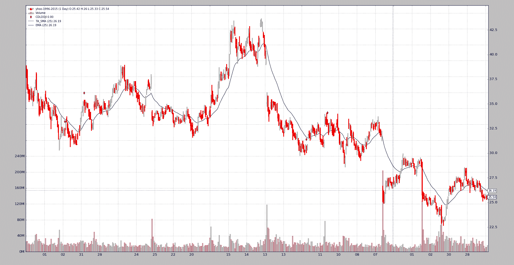

### 随机指标

```py
$ ./talibtest.py --plot --ind stoc
```

输出

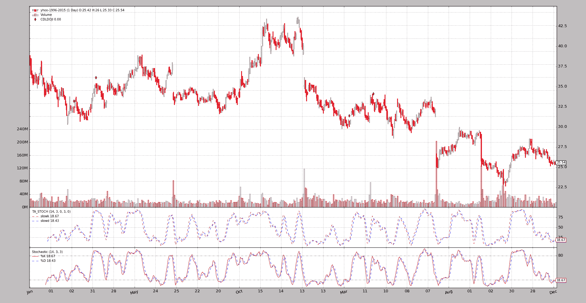

### RSI

```py
$ ./talibtest.py --plot --ind rsi
```

输出


### MACD

```py
$ ./talibtest.py --plot --ind macd
```

输出

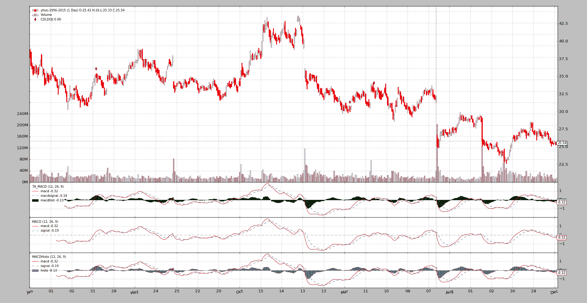

### 布林带

```py
$ ./talibtest.py --plot --ind bollinger
```

输出

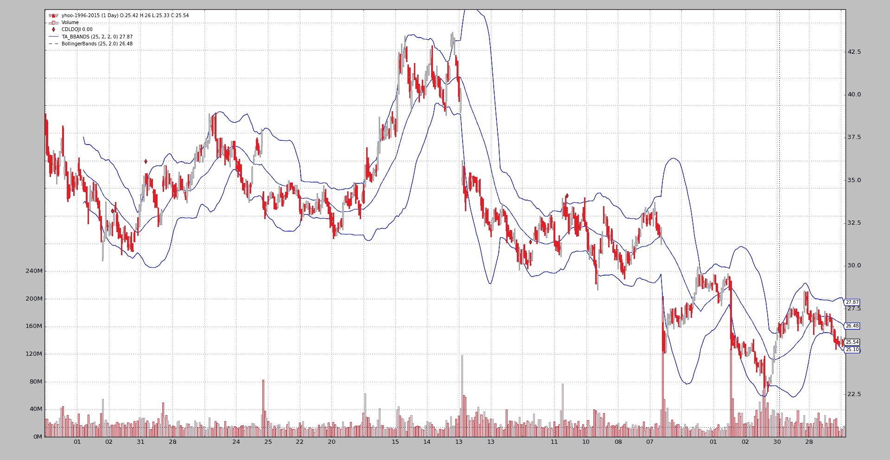

### AROON

请注意，*ta-lib*选择将*下行*线放在前面，当与*backtrader*内置指标进行比较时，颜色会反转。

```py
$ ./talibtest.py --plot --ind aroon
```

输出

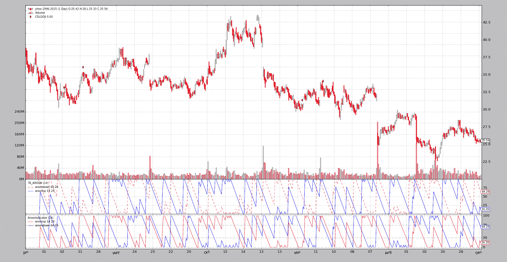

### 终极波动率

```py
$ ./talibtest.py --plot --ind ultimate
```

输出

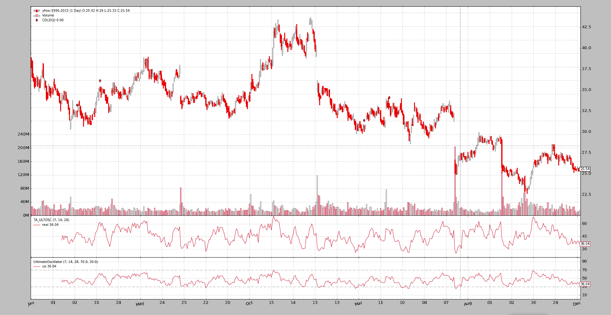

### Trix

```py
$ ./talibtest.py --plot --ind trix
```

输出

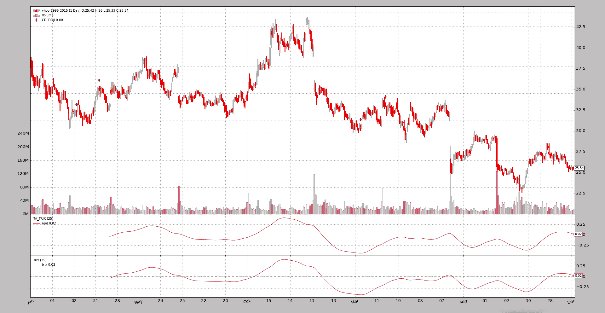

### ADXR

在这里，*backtrader* 提供了`ADX`和`ADXR`线。

```py
$ ./talibtest.py --plot --ind adxr
```

输出

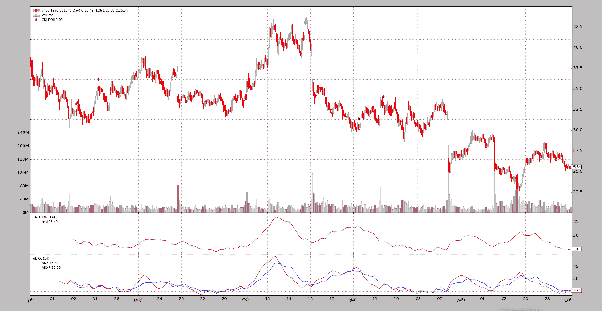

### DEMA

```py
$ ./talibtest.py --plot --ind dema
```

输出

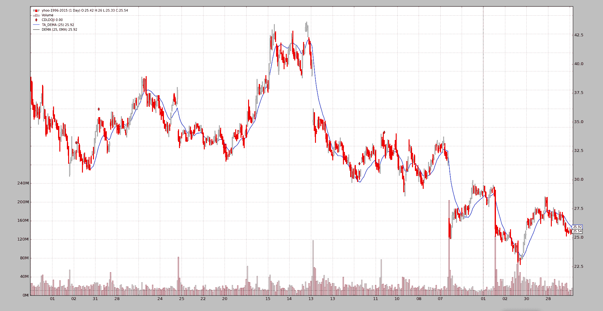

### TEMA

```py
$ ./talibtest.py --plot --ind tema
```

输出

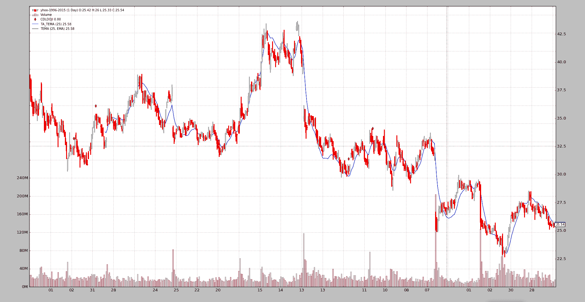

### PPO

在这里，*backtrader*不仅提供了`ppo`线，还提供了更传统的`macd`方法。

```py
$ ./talibtest.py --plot --ind ppo
```

输出

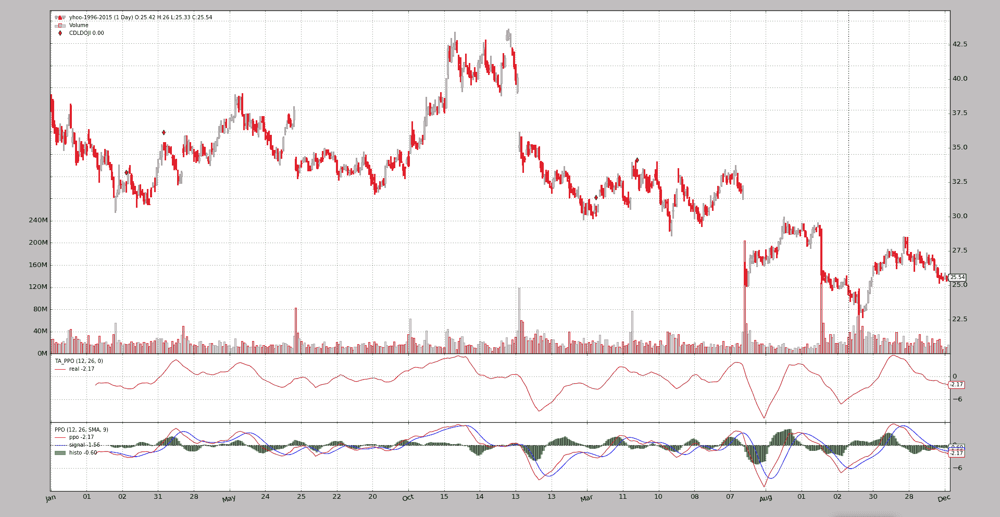

### WilliamsR

```py
$ ./talibtest.py --plot --ind williamsr
```

输出

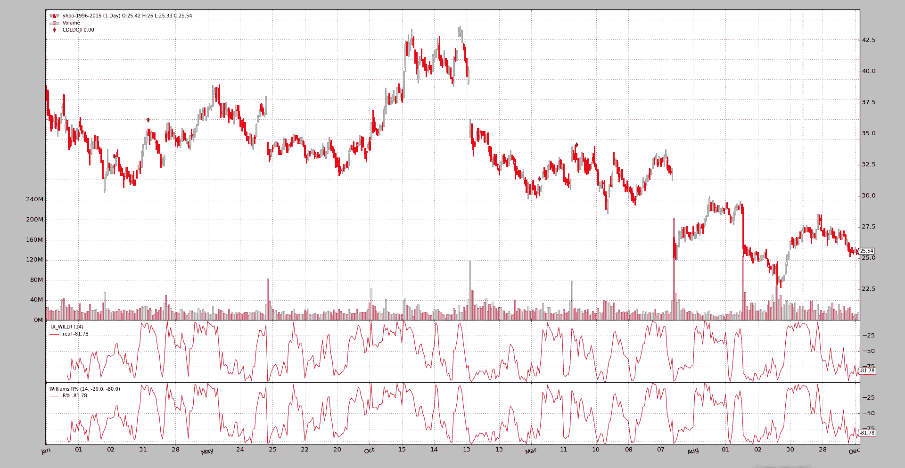

### ROC

所有指标都具有完全相同的形状，但如何跟踪*动量*或*变化率*有几种定义。

```py
$ ./talibtest.py --plot --ind roc
```

输出

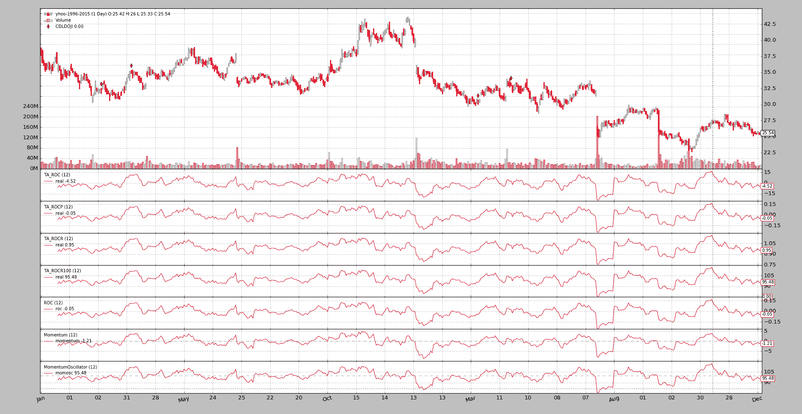

## 示例用法

```py
$ ./talibtest.py --help
usage: talibtest.py [-h] [--data0 DATA0] [--fromdate FROMDATE]
                    [--todate TODATE]
                    [--ind {sma,ema,stoc,rsi,macd,bollinger,aroon,ultimate,trix,kama,adxr,dema,tema,ppo,williamsr,roc}]
                    [--no-doji] [--use-next] [--plot [kwargs]]

Sample for sizer

optional arguments:
  -h, --help            show this help message and exit
  --data0 DATA0         Data to be read in (default:
                        ../../datas/yhoo-1996-2015.txt)
  --fromdate FROMDATE   Starting date in YYYY-MM-DD format (default:
                        2005-01-01)
  --todate TODATE       Ending date in YYYY-MM-DD format (default: 2006-12-31)
  --ind {sma,ema,stoc,rsi,macd,bollinger,aroon,ultimate,trix,kama,adxr,dema,tema,ppo,williamsr,roc}
                        Which indicator pair to show together (default: sma)
  --no-doji             Remove Doji CandleStick pattern checker (default:
                        False)
  --use-next            Use next (step by step) instead of once (batch)
                        (default: False)
  --plot [kwargs], -p [kwargs]
                        Plot the read data applying any kwargs passed For
                        example (escape the quotes if needed): --plot
                        style="candle" (to plot candles) (default: None)
```

## 示例代码

```py
from __future__ import (absolute_import, division, print_function,
                        unicode_literals)

import argparse
import datetime

import backtrader as bt

class TALibStrategy(bt.Strategy):
    params = (('ind', 'sma'), ('doji', True),)

    INDS = ['sma', 'ema', 'stoc', 'rsi', 'macd', 'bollinger', 'aroon',
            'ultimate', 'trix', 'kama', 'adxr', 'dema', 'ppo', 'tema',
            'roc', 'williamsr']

    def __init__(self):
        if self.p.doji:
            bt.talib.CDLDOJI(self.data.open, self.data.high,
                             self.data.low, self.data.close)

        if self.p.ind == 'sma':
            bt.talib.SMA(self.data.close, timeperiod=25, plotname='TA_SMA')
            bt.indicators.SMA(self.data, period=25)
        elif self.p.ind == 'ema':
            bt.talib.EMA(timeperiod=25, plotname='TA_SMA')
            bt.indicators.EMA(period=25)
        elif self.p.ind == 'stoc':
            bt.talib.STOCH(self.data.high, self.data.low, self.data.close,
                           fastk_period=14, slowk_period=3, slowd_period=3,
                           plotname='TA_STOCH')

            bt.indicators.Stochastic(self.data)

        elif self.p.ind == 'macd':
            bt.talib.MACD(self.data, plotname='TA_MACD')
            bt.indicators.MACD(self.data)
            bt.indicators.MACDHisto(self.data)
        elif self.p.ind == 'bollinger':
            bt.talib.BBANDS(self.data, timeperiod=25,
                            plotname='TA_BBANDS')
            bt.indicators.BollingerBands(self.data, period=25)

        elif self.p.ind == 'rsi':
            bt.talib.RSI(self.data, plotname='TA_RSI')
            bt.indicators.RSI(self.data)

        elif self.p.ind == 'aroon':
            bt.talib.AROON(self.data.high, self.data.low, plotname='TA_AROON')
            bt.indicators.AroonIndicator(self.data)

        elif self.p.ind == 'ultimate':
            bt.talib.ULTOSC(self.data.high, self.data.low, self.data.close,
                            plotname='TA_ULTOSC')
            bt.indicators.UltimateOscillator(self.data)

        elif self.p.ind == 'trix':
            bt.talib.TRIX(self.data, timeperiod=25,  plotname='TA_TRIX')
            bt.indicators.Trix(self.data, period=25)

        elif self.p.ind == 'adxr':
            bt.talib.ADXR(self.data.high, self.data.low, self.data.close,
                          plotname='TA_ADXR')
            bt.indicators.ADXR(self.data)

        elif self.p.ind == 'kama':
            bt.talib.KAMA(self.data, timeperiod=25, plotname='TA_KAMA')
            bt.indicators.KAMA(self.data, period=25)

        elif self.p.ind == 'dema':
            bt.talib.DEMA(self.data, timeperiod=25, plotname='TA_DEMA')
            bt.indicators.DEMA(self.data, period=25)

        elif self.p.ind == 'ppo':
            bt.talib.PPO(self.data, plotname='TA_PPO')
            bt.indicators.PPO(self.data, _movav=bt.indicators.SMA)

        elif self.p.ind == 'tema':
            bt.talib.TEMA(self.data, timeperiod=25, plotname='TA_TEMA')
            bt.indicators.TEMA(self.data, period=25)

        elif self.p.ind == 'roc':
            bt.talib.ROC(self.data, timeperiod=12, plotname='TA_ROC')
            bt.talib.ROCP(self.data, timeperiod=12, plotname='TA_ROCP')
            bt.talib.ROCR(self.data, timeperiod=12, plotname='TA_ROCR')
            bt.talib.ROCR100(self.data, timeperiod=12, plotname='TA_ROCR100')
            bt.indicators.ROC(self.data, period=12)
            bt.indicators.Momentum(self.data, period=12)
            bt.indicators.MomentumOscillator(self.data, period=12)

        elif self.p.ind == 'williamsr':
            bt.talib.WILLR(self.data.high, self.data.low, self.data.close,
                           plotname='TA_WILLR')
            bt.indicators.WilliamsR(self.data)

def runstrat(args=None):
    args = parse_args(args)

    cerebro = bt.Cerebro()

    dkwargs = dict()
    if args.fromdate:
        fromdate = datetime.datetime.strptime(args.fromdate, '%Y-%m-%d')
        dkwargs['fromdate'] = fromdate

    if args.todate:
        todate = datetime.datetime.strptime(args.todate, '%Y-%m-%d')
        dkwargs['todate'] = todate

    data0 = bt.feeds.YahooFinanceCSVData(dataname=args.data0, **dkwargs)
    cerebro.adddata(data0)

    cerebro.addstrategy(TALibStrategy, ind=args.ind, doji=not args.no_doji)

    cerebro.run(runcone=not args.use_next, stdstats=False)
    if args.plot:
        pkwargs = dict(style='candle')
        if args.plot is not True:  # evals to True but is not True
            npkwargs = eval('dict(' + args.plot + ')')  # args were passed
            pkwargs.update(npkwargs)

        cerebro.plot(**pkwargs)

def parse_args(pargs=None):

    parser = argparse.ArgumentParser(
        formatter_class=argparse.ArgumentDefaultsHelpFormatter,
        description='Sample for sizer')

    parser.add_argument('--data0', required=False,
                        default='../../datas/yhoo-1996-2015.txt',
                        help='Data to be read in')

    parser.add_argument('--fromdate', required=False,
                        default='2005-01-01',
                        help='Starting date in YYYY-MM-DD format')

    parser.add_argument('--todate', required=False,
                        default='2006-12-31',
                        help='Ending date in YYYY-MM-DD format')

    parser.add_argument('--ind', required=False, action='store',
                        default=TALibStrategy.INDS[0],
                        choices=TALibStrategy.INDS,
                        help=('Which indicator pair to show together'))

    parser.add_argument('--no-doji', required=False, action='store_true',
                        help=('Remove Doji CandleStick pattern checker'))

    parser.add_argument('--use-next', required=False, action='store_true',
                        help=('Use next (step by step) '
                              'instead of once (batch)'))

    # Plot options
    parser.add_argument('--plot', '-p', nargs='?', required=False,
                        metavar='kwargs', const=True,
                        help=('Plot the read data applying any kwargs passed\n'
                              '\n'
                              'For example (escape the quotes if needed):\n'
                              '\n'
                              '  --plot style="candle" (to plot candles)\n'))

    if pargs is not None:
        return parser.parse_args(pargs)

    return parser.parse_args()

if __name__ == '__main__':
    runstrat()
```
