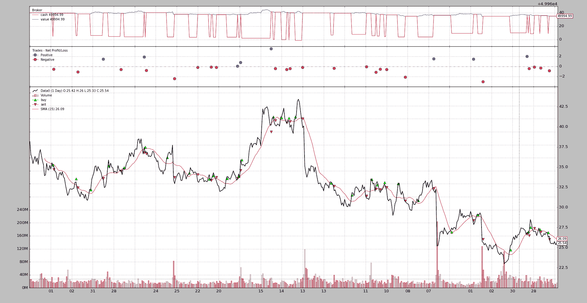
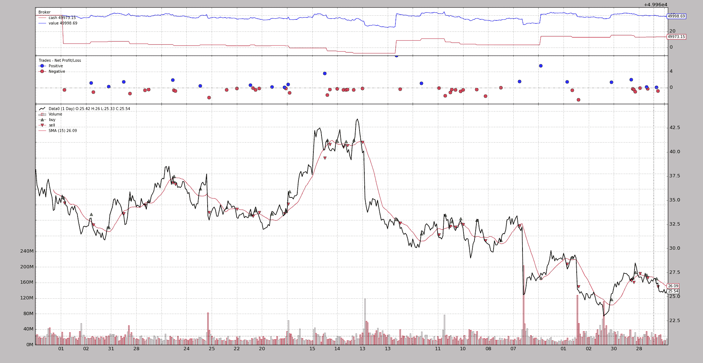

# Sizers 智能定额

> 原文：[`www.backtrader.com/blog/posts/2016-07-23-sizers-smart-staking/sizers-smart-staking/`](https://www.backtrader.com/blog/posts/2016-07-23-sizers-smart-staking/sizers-smart-staking/)

发行版 1.6.4.93 标志着 *backtrader* 的一个重要里程碑，即使版本编号的更改只是一个小改变。

*Position Sizing* 是阅读 *Van K. Tharp* 的 [Trade Your Way To Financial Freedom](https://www.amazon.com/Trade-Your-Way-Financial-Freedom/dp/007147871X) 后，实际上为这个项目奠定了基础的事情之一。

这不是 *Van K. Tharp* 详细介绍 *Position Sizing* 方法的书，但该主题在书中被介绍和讨论。关于这一点的一个例子有这样的设置。

+   如果市场上没有，抛硬币决定是否进入

+   如果已经在市场上，则通过一个 2 倍的 ATR 控制仓位，并且如果价格有利于持有的仓位，则更新该止损

关于此的重要部分：

+   进入市场是随机的

+   这种方法经过不同的 *Sizing* 方案测试，并且有一个动态止损，这使得系统具有盈利能力。

并遵循设置自己的“系统”（无论是手动/自动化/计算机化，技术/基本，...）的原则，*backtrader* 有一天将测试这种情景。

这可以通过任何现有的平台进行测试，但沿途不会有乐趣，也不会解决许多挑战，这些挑战在启动 *backtrader* 时甚至没有考虑过。

*Sizers* 从一开始就在平台上，但被隐藏了，因为许多其他事情，包括 *实时交易* 开始阻碍。但这现在已经结束，*Van K. Tharp* 的情景将被测试。比以往更早。

同时进行了一些 *Sizers* 的样本测试。

## *Sizers* 控制定位

该样本显示了一种潜在的用例，其中 *Sizers* 通过控制 *sizing* 来改变策略的行为。查看 *backtrader.readthedocs.io* 上的文档以了解 *sizing interface*。

这两个 *Sizers*：

+   `LongOnly`：如果当前位置为 0，则返回固定大小的仓位，并且如果已经在市场上，则返回相同的固定大小以关闭它。

    ```py
    class LongOnly(bt.Sizer):
        params = (('stake', 1),)

        def _getsizing(self, comminfo, cash, data, isbuy):
            if isbuy:
                return self.p.stake

            # Sell situation
            position = self.strategy.getposition(data)
            if not position.size:
                return 0  # do not sell if nothing is open

            return self.p.stake` 
    ```

+   `FixedReverser`：如果市场上没有，将返回固定大小的赌注，如果已经在市场上，则将返回加倍的固定大小的赌注，以便进行逆转

    ```py
    class FixedReverser(bt.Sizer):
        params = (('stake', 1),)

        def _getsizing(self, comminfo, cash, data, isbuy):
            position = self.broker.getposition(data)
            size = self.p.stake * (1 + (position.size != 0))
            return size` 
    ```

这两个 *Sizers* 将与一个非常简单的策略结合在一起。

```py
class CloseSMA(bt.Strategy):
    params = (('period', 15),)

    def __init__(self):
        sma = bt.indicators.SMA(self.data, period=self.p.period)
        self.crossover = bt.indicators.CrossOver(self.data, sma)

    def next(self):
        if self.crossover > 0:
            self.buy()

        elif self.crossover < 0:
            self.sell()
```

注意策略如何使用 *Close-SMA* 交叉信号发出 *buy* 和 *sell* 命令，并考虑到一个重要的事情：

+   在 *strategy* 中不进行定位的检查

与下面的执行中看到的相同策略通过在样本中使用此代码（通过开关 `--longonly` 控制）仅通过更改 *sizer* 的行为从 *long-only* 变为 *long-short*。

```py
 if args.longonly:
        cerebro.addsizer(LongOnly, stake=args.stake)
    else:
        cerebro.addsizer(FixedReverser, stake=args.stake)
```

## 仅限多头执行

用命令完成：

```py
$ ./sizertest.py --longonly --plot
```

这个输出。



## 多空头执行

用命令完成：

```py
$ ./sizertest.py --plot
```

并输出如下结果。



立即显示：

+   交易次数翻了一番

+   现金（除了一开始）永远不等于*价值*，因为策略始终在市场上

## 使用示例

```py
$ ./sizertest.py --help
usage: sizertest.py [-h] [--data0 DATA0] [--fromdate FROMDATE]
                    [--todate TODATE] [--cash CASH] [--longonly]
                    [--stake STAKE] [--period PERIOD] [--plot [kwargs]]

Sample for sizer

optional arguments:
  -h, --help            show this help message and exit
  --data0 DATA0         Data to be read in (default:
                        ../../datas/yhoo-1996-2015.txt)
  --fromdate FROMDATE   Starting date in YYYY-MM-DD format (default:
                        2005-01-01)
  --todate TODATE       Ending date in YYYY-MM-DD format (default: 2006-12-31)
  --cash CASH           Cash to start with (default: 50000)
  --longonly            Use the LongOnly sizer (default: False)
  --stake STAKE         Stake to pass to the sizers (default: 1)
  --period PERIOD       Period for the Simple Moving Average (default: 15)
  --plot [kwargs], -p [kwargs]
                        Plot the read data applying any kwargs passed For
                        example: --plot style="candle" (to plot candles)
                        (default: None)
```

### 完整代码

```py
from __future__ import (absolute_import, division, print_function,
                        unicode_literals)

import argparse
import datetime
import random

import backtrader as bt

class CloseSMA(bt.Strategy):
    params = (('period', 15),)

    def __init__(self):
        sma = bt.indicators.SMA(self.data, period=self.p.period)
        self.crossover = bt.indicators.CrossOver(self.data, sma)

    def next(self):
        if self.crossover > 0:
            self.buy()

        elif self.crossover < 0:
            self.sell()

class LongOnly(bt.Sizer):
    params = (('stake', 1),)

    def _getsizing(self, comminfo, cash, data, isbuy):
        if isbuy:
            return self.p.stake

        # Sell situation
        position = self.strategy.getposition(data)
        if not position.size:
            return 0  # do not sell if nothing is open

        return self.p.stake

class FixedReverser(bt.Sizer):
    params = (('stake', 1),)

    def _getsizing(self, comminfo, cash, data, isbuy):
        position = self.broker.getposition(data)
        size = self.p.stake * (1 + (position.size != 0))
        return size

def runstrat(args=None):
    args = parse_args(args)

    cerebro = bt.Cerebro()
    cerebro.broker.set_cash(args.cash)

    dkwargs = dict()
    if args.fromdate:
        fromdate = datetime.datetime.strptime(args.fromdate, '%Y-%m-%d')
        dkwargs['fromdate'] = fromdate

    if args.todate:
        todate = datetime.datetime.strptime(args.todate, '%Y-%m-%d')
        dkwargs['todate'] = todate

    data0 = bt.feeds.YahooFinanceCSVData(dataname=args.data0, **dkwargs)
    cerebro.adddata(data0, name='Data0')

    cerebro.addstrategy(CloseSMA, period=args.period)

    if args.longonly:
        cerebro.addsizer(LongOnly, stake=args.stake)
    else:
        cerebro.addsizer(FixedReverser, stake=args.stake)

    cerebro.run()
    if args.plot:
        pkwargs = dict()
        if args.plot is not True:  # evals to True but is not True
            pkwargs = eval('dict(' + args.plot + ')')  # args were passed

        cerebro.plot(**pkwargs)

def parse_args(pargs=None):

    parser = argparse.ArgumentParser(
        formatter_class=argparse.ArgumentDefaultsHelpFormatter,
        description='Sample for sizer')

    parser.add_argument('--data0', required=False,
                        default='../../datas/yhoo-1996-2015.txt',
                        help='Data to be read in')

    parser.add_argument('--fromdate', required=False,
                        default='2005-01-01',
                        help='Starting date in YYYY-MM-DD format')

    parser.add_argument('--todate', required=False,
                        default='2006-12-31',
                        help='Ending date in YYYY-MM-DD format')

    parser.add_argument('--cash', required=False, action='store',
                        type=float, default=50000,
                        help=('Cash to start with'))

    parser.add_argument('--longonly', required=False, action='store_true',
                        help=('Use the LongOnly sizer'))

    parser.add_argument('--stake', required=False, action='store',
                        type=int, default=1,
                        help=('Stake to pass to the sizers'))

    parser.add_argument('--period', required=False, action='store',
                        type=int, default=15,
                        help=('Period for the Simple Moving Average'))

    # Plot options
    parser.add_argument('--plot', '-p', nargs='?', required=False,
                        metavar='kwargs', const=True,
                        help=('Plot the read data applying any kwargs passed\n'
                              '\n'
                              'For example:\n'
                              '\n'
                              '  --plot style="candle" (to plot candles)\n'))

    if pargs is not None:
        return parser.parse_args(pargs)

    return parser.parse_args()

if __name__ == '__main__':
    runstrat()
```
